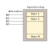
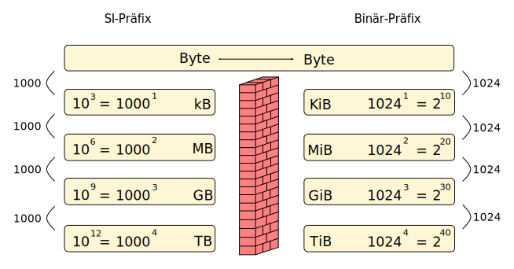

<!--
author:   Günter Dannoritzer
email:    g.dannoritzer@wvs-ffm.de
version:  1.0.0
date:     26.09.2024
language: de
narrator: Deutsch Female

comment:  Binärpräfix, SI-Präfix, Umrechnung zwischen Binär- und SI-Präfix

icon:    https://raw.githubusercontent.com/dsp77/wvs-liascript/0938e2e0ce751e270e3e36b8ecfeb09044a41aa0/wvs-logo.png
logo:     02_img/logo-si-prefix.png

tags:     LiaScript

link:     https://cdn.jsdelivr.net/chartist.js/latest/chartist.min.css

script:   https://cdn.jsdelivr.net/chartist.js/latest/chartist.min.js

attribute: Lizenz: [CC BY-SA](https://creativecommons.org/licenses/by-sa/4.0/)
-->

# Motivation für Binär-Präfixe

Ein Speicherchip hat einen Adressbus, der 4-Bit breit ist. Wie viele Adressen können damit gebildet und wie viele Byte an Speicherzellen können damit adressiert werden?

Mit 4-Bit können $2^4 = 16$ Zahlen für Adressen gebildet werden. In dem Speicherchip können also 16 Speicherzellen mit je einem Byte oder 16 Byte adressiert werden.

Jetzt sollen noch zwei Situationen betrachtet werden. Einmal, wie viele Speicherzellen mit 9-Bit und dann, wie viele mit 10-Bit adressiert werden können:

 * $2^9 = 512$
 * $2^{10} = 1024$

Mit 9-Bit können also 512 Byte und mit 10-Bit 1024 Byte adressiert werden.

Mit der binären Adressierung von Speicherzellen ist es nur möglich, einen Speicherchip mit einer Vielzahl von Speicherzellen zur Potenz mit der Basis 2 zu adressieren. Aus dieser Besonderheit wurde die Bezeichnung der Binär-Präfixe erstellt.

# Einführung

Binärpräfixe (auch IEC-Präfixe oder IEC-Vorsätze) sind Vorsätze für Maßeinheiten (Einheitenvorsätze), die Vielfache bestimmter Zweierpotenzen bezeichnen. Sie werden vorwiegend mit Einheiten wie Bit (Symbol „bit“, selten „b“) oder Byte (Symbol „B“) verwendet, um Datenmengen zu bemessen, da hier aus technischen Gründen häufig Zweierpotenzen auftreten. Im Unterschied dazu sind Dezimalpräfixe Einheitenvorsätze, die Vielfache bestimmter Zehnerpotenzen bezeichnen.
SI-Präfixe sind Dezimalpräfixe für die Benutzung im SI-Einheitensystem; IEC-Binärpräfixe sind Binärpräfixe, gedacht für die Verwendung bei Datenmengen. Als Einheitenvorsatz wird sowohl der Name als auch das zugehörige Symbol bezeichnet.

Die Binärpräfixe sind gemäß der folgenden Tabelle nach IEC 60027-2 definiert:

|Name | Symbol  | Wert |
|---- | ------- | ----------------------------------------------------------|
|kibi | Ki      | $2^{10} = 1024^1 = 1.024$ |
|mebi | Mi      | $2^{20} = 1024^2 = 1.048.576$ |
|gibi | Gi      | $2^{30} = 1024^3 = 1.073.741.824$ |
|tebi | Ti      | $2^{40} = 1024^4 = 1.099.511.627.776$ |
|pebi | Pi      | $2^{50} = 1024^5 = 1.125.899.906.842.624$ |
|exbi | Ei      | $2^{60} = 1024^6 = 1.152.921.504.606.846.976$ |
|zebi | Zi      | $2^{70} = 1024^7 = 1.180.591.620.717.411.303.424$ |
|yobi | Yi      | $2^{80} = 1024^8 = 1.208.925.819.614.629.174.706.176$ |

# Norme

Um Mehrdeutigkeiten zu vermeiden, schlug die Internationale elektrotechnische Kommission (IEC) im Juni 1996 einen neuen Normentwurf für Binärpräfixe vor, die nur in der binären Bedeutung verwendet werden sollten. Dieser Entwurf wurde im Dezember 1998 als Norm beschlossen und im Januar 1999 als Ergänzung zu **IEC 60027-2** veröffentlicht. Er führte die Präfixe **kibi, mebi, gibi, tebi, pebi und exbi** für binäre Vielfache von Einheiten ein. In diesen Bezeichnungen wurden die ersten zwei Buchstaben der bereits genormten SI-Präfixe um „bi“ für „binär“ ergänzt. Für die Symbole der Binärpräfixe wurden die Symbole der SI-Präfixe verwendet und an diese der Kleinbuchstabe „i“ angehängt, wobei für das kibi im Gegensatz zum
„kilo“ der Großbuchstabe „K“ verwendet wurde. In der Norm wurde außerdem darauf hingewiesen, dass die SI-Präfixe nur für auf Zehnerpotenzen basierende Vielfache verwendet werden sollten. Diese Ergänzungen wurden in der im November 2000 veröffentlichten zweiten Auflage der Norm IEC 60027-2 integriert. In der im August 2005 veröffentlichten dritten Ausgabe der Norm IEC 60027-2 wurden auch die Binärpräfixe **zebi und yobi** aufgenommen. In der **Europäischen Union** ist die Benutzung der Binärpräfixe **seit 2007** durch das
Harmonisierungsdokument HD 60027-2:2003-03 der European Committee for Electrotechnical Standardization vorgeschrieben, welches in Deutschland in den Standard **DIN EN 60027-2:2007-11** eingeht.

# Umrechnung

Der Übergang von Binärpräfix auf SI-Präfix muss immer über die Grundeinheit Byte stattfinden. Die folgende Abbildung zeigt, wie auf der linken Seite die SI-Präfixe sich in 1000er-Schritte $(10^3)$ verändern. Auf der rechten Seite verändern sich die Binärpräfixe in 1024er-Schritte $(1024^1 = 2^{10})$. 

Anmerkung:

 * $1024 = 2^{10}$
 * $1024^2 = 2^{20}$
 * $1024^3 = 2^{30}$
 * $1024^4 = 2^{40}$

Beispiel:

 * $1 TiB = 1024 GiB$
 * $1 TiB = 1024^4 Byte = 1.099.511.627.776 Byte$

## Von TiB zu TB

 * $1 TiB = 1 \cdot 1024^4 Byte = 1 \cdot \frac{1024^4}{10^{12}} TB = 1,1 TB$

## Von TB zu TiB

 * $2 TB = 2 \cdot 10^{12} Byte = 2 \cdot \frac{10^{12}}{1024^4} TiB$

# Was muss ich mir merken?

 * Eigentlich nur die Stufen in der Reihenfolge Byte, kB, MB, GB, TB, PB
 * Daraus lassen sich die Stufen Byte, KiB, MiB, GiB, TiB, PiB herleiten.
 * Für jeden Sprung zwischen Stufen auf der SI-Präfix-Seite verändert sich der Wert um 1000

    * In Richtung Byte wird der Wert größer, also jeweils mit 1000 multipliziert.
  * In die andere Richtung wird der Wert kleiner, also jeweils durch 1000 dividiert.

 * Für jeden Sprung auf der Binär-Präfix-Seite verändert sich der Wert um 1024

   * In Richtung Byte wird der Wert größer, also jeweils mit 1024 multipliziert.
  * In die andere Richtung wird der Wert kleiner, also jeweils durch 1024 dividiert.

