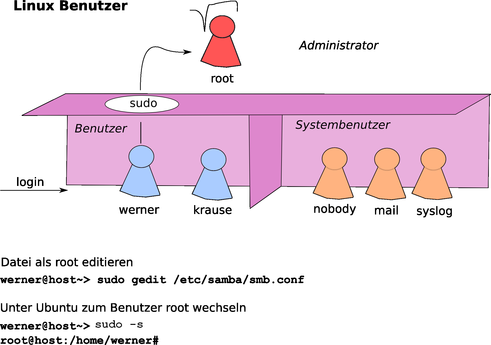
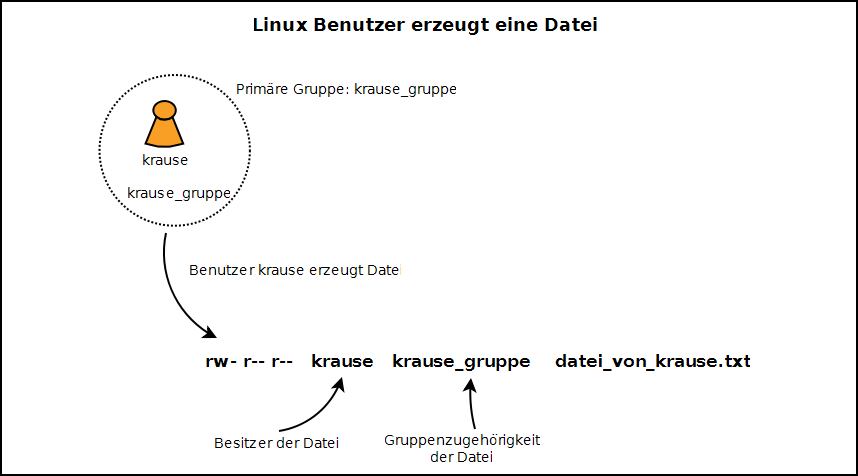
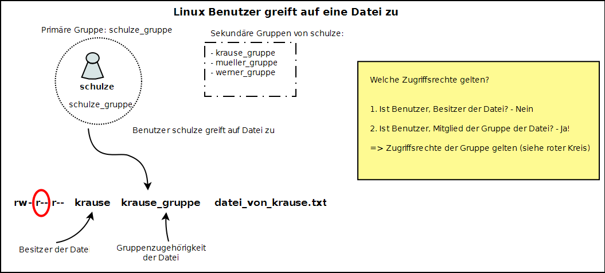
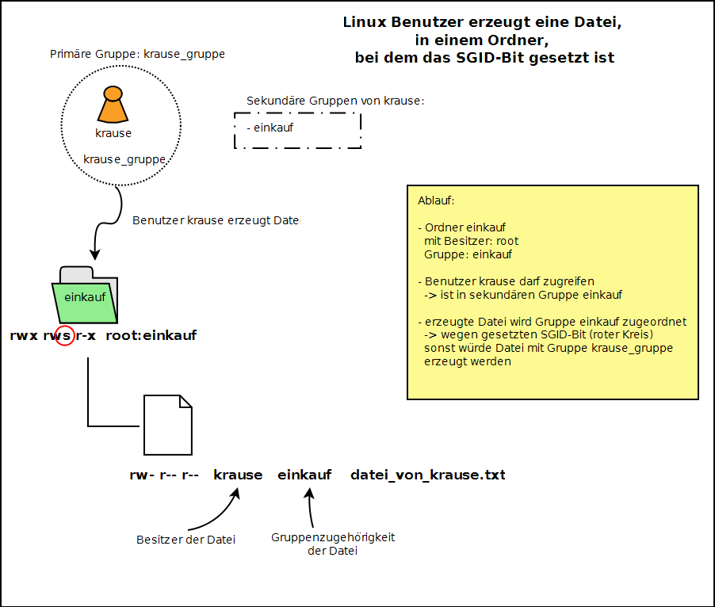

<!--
author:   Günter Dannoritzer
email:    g.dannoritzer@wvs-ffm.de
version:  0.1.1
date:     19.04.2024
language: de
narrator: Deutsch Female

comment:  Dateisytem, Linux, Dateirechte

icon:    https://github.com/dsp77/wvs-liascript/blob/main/wvs-logo.png
logo:     02_img/logo-dateirechte-linux.png

tags:     LiaScript, Lernfeld_2, Fachinformatiker, Dateisystem

link:     https://cdn.jsdelivr.net/chartist.js/latest/chartist.min.css

script:   https://cdn.jsdelivr.net/chartist.js/latest/chartist.min.js

attribute: Lizenz: [CC BY-SA](https://creativecommons.org/licenses/by-sa/4.0/)
-->

# Linux Benutzer und Gruppen

Bei Linux handelt es sich um ein Multiuser-System. Das bedeutet, dass sich mehrere Benutzer gleichzeitig anmelden und an dem System arbeiten können. Damit sich die angemeldeten Benutzer beim Arbeiten nicht in die Quere kommen, muss das System wissen, wer was machen darf. Dafür gibt es die Benutzer und die Gruppen.
 
##  Benutzer

Bei den Benutzern unterscheidet man zwischen den „normalen Benutzern“ und den sogenannten „Systembenutzern“. Die folgende Abbildung gibt dazu einen Überblick. 

Bei dem normalen Benutzer handelt es sich um das Benutzerkonto, das Sie benötigen, um sich an einem Computer mit Ihrem Benutzernamen und Passwort anzumelden. Die Systembenutzer werden vom System erzeugt. Diese dienen als Benutzer für Systemdienste und es ist nicht möglich, sich über den Benutzernamen eines Systembenutzers am System anzumelden. Unter Linux gibt es einen Benutzer, der alles darf (unter Windows der Administrator), den „root“. Allgemein gilt, dass auf einem System nur mit „root“-Rechten gearbeitet wird, wenn es wirklich nötig ist. Ansonsten wird mit dem normalen Benutzer gearbeitet. In der Abbildung gezeigt, der Benutzer werner darf über das sudo-Kommando Administrationsrechte erreichen. Dem Benutzer krause ist das verwehrt.

 * Informationen über konfigurierte Benutzer finden Sie in der Datei `/etc/passwd`
 * Eine Beschreibung über den Inhalt der Datei erhalten Sie auf der Konsole über den Befehl `man 5 passwd`.
 * Konfiguration wer `sudo` verwenden darf über `/etc/sudoers`. Unter Ubuntu wird Verwendung über Gruppenzugehörigkeit in der Gruppe sudo erreicht.

##  Gruppen

Benutzer werden in Gruppen zusammengefasst. Dabei hat ein Benutzer eine Hauptgruppe (Primärgruppe) und kann noch weiteren Gruppen (Sekundärgruppen) zugeordnet werden.
Die Gruppenzugehörigkeit hat u.a. einen Einfluss auf den Dateizugriff. Eine Datei, die von einem Benutzer erzeugt wird, erhält als Besitzer den Benutzernamen und normalerweise als Gruppe die primäre Gruppe des Benutzers. Den Zugriff auf eine Datei über die Gruppenrechte erhält ein Benutzer basierend auf seiner primären und sekundären Gruppenzugehörigkeit. Dazu aber mehr im Expertenblatt für Dateirechte.

 * Informationen über die primäre Gruppe eines Benutzers finden Sie in der Datei `/etc/passwd`.
 * Informationen über die sekundären Gruppen finden Sie in der Datei `/etc/group`.
 * Eine Beschreibung über den Inhalt der Datei `/etc/group` erhalten Sie auf der Konsole über den Befehl `man 5 group`.
 * Gruppenzugehörigkeit kann auch mit dem Befehl `id` abgefragt werden.

# Linux Dateirechte

## Dateieigenschaften im VFS

UNIX-Systeme wie Linux verwalten ihre Dateien in einem virtuellen Dateisystem (VFS, Virtual File System). Dieses ordnet jeder Datei u.a. folgende Eigenschaften zu, unabhängig davon, ob diese vom zugrunde liegenden realen Dateisystem tatsächlich unterstützt werden oder nicht:

 * Dateityp
 * Besitzer
 * Gruppe
 * Zugriffsrechte

Quasi jedes unter Linux gängige Dateisystem (z.B. ext2/3/4, ReiserFS, xfs usw.) unterstützt diese Rechte. Gar nicht oder nicht vollständig umgesetzt werden die Rechte jedoch auf Nicht-Linux-Dateisystemen, also z.B. FAT oder NTFS aus der Windows-Welt.

 
## Rechte

Unter Linux sind jeder Datei und jedem Ordner drei Rechteebenen zugeordnet. Sie gelten für:

 * Eigentümer
 * Gruppe
 * Alle anderen

Jeder dieser Ebenen lassen sich gesonderte Rechte zuordnen. Diese Rechte sind:

 * `r` wie „read“ für das Leserecht
 * `w` wie „write“ für das Schreibrecht
 * `x` wie „execute“ für das Recht, eine Datei auszuführen (bei Verzeichnissen bedeutet das `x`, dass das Verzeichnis geöffnet werden darf).

Wer mit dem Befehl `ls -l` den Inhalt eines Linux-Verzeichnisses anzeigen lässt, sieht links die Dateirechte, beispielsweise `-rwxrw-r--`. Diese Rechte gelten von links nach rechts gelesen für den 

 1. Eigentümer einer Datei `rwx`, 
 2. für die Gruppe `rw-` 
 3. und für die anderen Benutzer `r--`.

Falls an erster Stelle ein `d` steht, handelt es sich um ein Verzeichnis.
 
## Welche Zugriffsrechte gelten?

Welche von den drei Zugriffsrechten gelten, werden in genau der Reihenfolge getestet, wie sie vorher aufgezählt wurden. Will ein Benutzer auf eine Datei zugreifen, wird zuerst getestet ob der Benutzer auch Besitzer der Datei ist. Ist das der Fall, werden die entsprechenden Zugriffsrechte genommen. Eine weitere Überprüfung findet nicht statt! Ist der Benutzer nicht Besitzer, wird überprüft ob der Benutzer Mitglied in der Gruppe ist, die der Datei zugeordnet ist. Dabei werden primäre und auch sekundäre Gruppen beachtet. Findet hier eine Übereinstimmung statt, werden die Zugriffsrechte für die Gruppe genommen. Ist der Benutzer auch nicht Mitglied in der Gruppe, werden die Zugriffsrechte für „alle anderen Benutzer“ genommen.
 
## SetGID

Unter dem Abschnitt „2.2 Rechte“ wurden die drei Zugriffsrechte lesen (r), schreiben (w) und ausführbar (x) beschrieben. Im Zusammenhang mit den Gruppenzugriffsrechten gibt es noch das sogenannte SGID-Bit. Wenn es gesetzt wird, wird das x durch ein s ersetzt. Die Zugriffsrechte für die Gruppe sehen dann z.B. so aus: rws. Für einen Ordner gesetzt, hat das SGID-Bit folgende Bedeutung. Der Ordner hat einen Besitzer und ist einer Gruppe zugeordnet. Wird eine Datei oder ein Ordner in dem Ordner erzeugt, dann werden diesen auch der Gruppe des Ordners zugeordnet. Bei einem erzeugten Ordner wird wiederum das SGID-Bit gesetzt, so dass die Funktion auch in dem erzeugten Unterordner angewendet wird.
 
## Standard-Einstellung und Maskierung

In jedem Linux-System gibt es Standardwerte für die Zugriffsrechte bei neu erstellten Ordnern und Dateien. Diese können in einem Terminal mit dem Befehl umask abgefragt werden.
Die Standardrechte für Ordner und Dateien sind:

 * Ordner: `rwx r-x r-x`
 * Datei: `rw- r-- r--`

Der Standardwert von `umask` ist dauerhaft systemweit durch einen entsprechenden Eintrag in der Datei `/etc/profile` festgelegt. Für einzelne Benutzer lässt sich ein dauerhafter persönlicher Standardwert in der Datei `~/.profile` festlegen, der für alle Ordner und Dateien, die von diesem Benutzer neu angelegt werden, den allgemeinen Standardwert überschreibt. Änderungen werden jeweils erst nach einem Neustart bzw. einer Neuanmeldung wirksam.

# Linux Dateien erzeugen

Wenn eine Datei erzeugt wird, stellt sich die Frage wie die Zugriffsrechte gesetzt werden und wer Besitzer der Datei wird, sowie, welcher Gruppe die Datei zugeordnet wird. Die folgende Zeichnung verdeutlicht das am Beispiel des Benutzers `krause`, dem als primäre Gruppe die Gruppe `krause_gruppe` zugeordnet ist. Wenn von ihm eine Datei erzeugt wird, dann wird `krause` auch Besitzer der Datei.

Als **Gruppe** wird der Datei die **primäre Gruppe von krause** zugeordnet. Zugriffsrechte ergeben sich entsprechend der **Standardmaske**, gesetzt für den Benutzer krause. Wurde keine Änderung durchgeführt, entspricht das für Dateien `rw-`, für die Gruppe `r--`, und für alle anderen ebenfalls `r--`.

In gleicher Weise wird ein Ordner erzeugt. Einziger Unterschied ist hier, dass die Standardmaske für das Erzeugen eines Ordners für alle drei Bereiche auch noch das x-Bit gesetzt hat, also `rwx r-x r-x` entspricht. Zur Erinnerung, die Standardmaske wird durch den Befehl `umask` angezeigt bzw. geändert.
 
# Zugriff auf eine Datei

Nachdem eine Datei erzeugt wurde, ist die interessante Frage, wer alles auf die Datei mit welchen Rechten zugreifen darf. In der folgenden Zeichnung wurde die im vorherigen Kapitel erzeugte Datei genommen und der Benutzer schulze möchte jetzt darauf zugreifen. Als primäre Gruppe ist schulze der Gruppe `schulze_gruppe` zugeordnet. Was noch hinzukommt, ist, dass er auch weiteren Gruppen als sekundäre Gruppe zugeordnet ist. Ganz speziell der Gruppe `krause_gruppe`, der die Datei zugeordnet ist.

Wie ergeben sich jetzt die Zugriffsregeln in dem Beispiel?

 * Als Erstes wird getestet ob der Benutzer `schulze` Besitzer der Datei ist, was in dem Fall nicht zutrifft.
 * Der nächste Test ist, ob `schulze` der Gruppe angehört, die der Datei zugeordnet ist. Dazu werden sowohl die primäre Gruppe als auch alle sekundären Gruppen in Betracht gezogen. In dem Fall gehört `schulze` der Gruppe `krause_gruppe` an und für den Zugriff werden die Gruppenzugriffsrechte verwendet, die in der Zeichnung mit dem roten Kreis gekennzeichnet sind.

# Datei erzeugen mit gesetztem SGID-Bit

Im nächsten Beispiel wird noch mal das erzeugen einer Datei beschrieben, mit dem Unterschied, dass bei dem Ordner in dem die Datei erzeugt wird, dass sogenannte **SGID-Bit** gesetzt ist. In dem Beispiel in der folgenden Zeichnung gibt es den Ordner `einkauf`, bei dem das SGID-Bit gesetzt ist. Das ist gekennzeichnet durch den roten Kreis. Alle Dateien, die jetzt erzeugt werden, werden der Gruppe des Ordners zugeordnet. In diesem Fall ist der Ordner der Gruppe `einkauf` zugeordnet.

Der Benutzer `krause` erzeugt wieder eine Datei. In diesem Fall ist er neben der primären Gruppe `krause_gruppe` auch der sekundären Gruppe `einkauf` zugeordnet. Durch die Zuordnung zu `einkauf` darf er auf den Ordner `einkauf` über die Gruppenzugriffsrechte zugreifen. Die erlauben ihm in den Ordner zu schreiben (`w`-Bit links vom roten Kreis). Damit darf er Dateien in dem Ordner erzeugen.

Da das SGID-Bit gesetzt ist, wird die erzeugte Datei auch der Gruppe einkauf zugeordnet. Wäre es nicht gesetzt, würde die Datei der Gruppe `krause_gruppe` zugeordnet werden.

# Übung Linux Projektordner

Mit dieser Übung wird eine Ordnerstruktur unter Linux erzeugt, auf die verschiedene Benutzer unterschiedlichen Zugriff haben. Die Übung ist eine Vorbereitung für eine spätere Übung mit der Samba-Software, mit deren Hilfe die hier erstellte Ordnerstruktur Grundlage eines Dateiservers wird, der im Netzwerk zur Verfügung steht.
Grundlage für die Ordnerstruktur ist folgendes Nutzerszenario. Die drei Abteilungen Einkauf, Vertrieb und Finanzbuchhaltung nutzen die Struktur, um Daten darin abzulegen. In der folgenden Tabelle finden Sie eine Liste von Benutzer, die Zugriff auf die genannten Ordner haben. Entsprechend soll kein Zugriff auf die anderen Ordner vorhanden sein.

| Benutzer | login | Zugriff auf Gruppenordner |
|----------|-------|---------------------------|
| Fr. Bauer | `bauer` | `Einkauf` |
| Hr. Müller | `mueller` | `Vertrieb` |
| Hr. Bach | `bach` | `Finanzbuchhaltung` |
| Fr. Krause | `krause` | `Einkauf` und `Finanzbuchhaltung` |
| Fr. Seitz | `seitz` | `Einkauf` |

## Zugriffsrechte konfigurieren

Exemplarisch, werden die Schritte für die Konfiguration des Ordners Einkauf, mit Zugriffsrechte für die Benutzer bauer, krause und bach im Detail durchgeführt. Die vollständige Konfiguration können Sie dann basierend auf dem Beispiel selbstständig erweitern.

## Benutzer, Gruppe, Ordner anlegen und Zugriff konfigurieren

Konkret sollen in der folgenden Konfiguration die Benutzer bauer und krause vollen Zugriff auf den Ordner Einkauf erhalten, wie in der seitlichen Abbildung gezeigt. Der Benutzer bach soll keinen, nicht einmal lesenden Zugriff erhalten. Es ist sinnvoll, die folgenden Konfigurationsschritte unter dem Benutzer root durchzuführen.

 1. Mit `sudo -s` zum Benutzer `root` wechseln
 2. per `adduser` die Benutzer `bauer`, `krause` und `bach` anlegen. Vergeben Sie ein Passwort an das sie sich erinnern oder notieren Sie es.
 3. Den Ordner `Einkauf` im Pfad `/srv/samba` anlegen mit: `mkdir -p /srv/samba/Einkauf` Achten Sie auf Groß- und Kleinschreibung, die in Linux unterschieden wird. Die Option `-p` wird auch den Ordner `samba` anlegen, der noch nicht vorhanden ist.
 4. Da `root` Ordner und Dateien mit der `umask u=rwx,g=rx,o=rx` erzeugt, muss noch der Gruppe das Schreibrecht gesetzt werden: `chmod g+w /srv/samba/Einkauf`
 5. Der gemeinsame Zugriff von `bauer` und `krause` soll über eine gemeinsame Gruppe erfolgen. Dazu legen wir die Gruppe `GruppeEinkauf` an und fügen `bauer` und `krause` dieser zu:

   1. `groupadd GruppeEinkauf`
   2. `usermod -aG GruppeEinkauf bauer`
   3. `usermod -aG GruppeEinkauf krause`

  6. Jetzt noch auf den Ordner Gruppenmitglieder den Gruppe Zugriff erlauben (1) und allen anderen die Leserechte wegnehmen (2):

   1. `chgrp GruppeEinkauf /srv/samba/Einkauf`
   2. `chmod o-rx /srv/samba/Einkauf`

## Zugriff überprüfen

Sie haben jetzt folgende Situation geschaffen, die Benutzer bauer und krause haben sowohl lesenden als auch schreibenden Zugriff auf den Ordner Einkauf. Der Benutzer bach hat keinen Zugriff. Um das zu überprüfen, erzeugen Sie jetzt eine Datei in dem Ordner, setzen die Zugriffsrechte der Datei entsprechend und prüfen dann mit allen drei Benutzern den Zugriff auf die Datei.

 1. Als Benutzer root erzeugen sie eine Datei: `touch /srv/samba/Einkauf/Testdatei.txt`
 2. Da hier erneut die Schreibrechte für die Gruppe nicht gesetzt sind, wird dies jetzt
nachgeholt: `chmod g+w /srv/samba/Einkauf/Testdatei.txt`
 3. Ändern Sie die Gruppenzugehörigkeit: `chgrp GruppeEinkauf /srv/samba/Einkauf/Testdatei.txt`
 4. Im Ordner `/srv/samba/Einkauf` zum Benutzer bauer wechseln (1), den Inhalt der
Datei anzeigen lassen (2) und was neues reinschreiben (3):

    1. `su bauer`
    2. `cat Testdatei.txt`
    3. `echo „Hallo von bauer“ >> Testdatei.txt`

Alle Schritte sollten ohne Fehlermeldung durchlaufen werden. Überprüfen Sie ob der Text
„Hallo von bauer“ in der Datei steht.

 4. Wiederholen Sie die Schritte für den Benutzer `krause`, die auch ohne Fehlermeldung erfolgen sollten.
 5. Schließlich wiederholen Sie die Schritte für den Benutzer `bach`, der keinen Zugriff erhalten sollte.

## Konfiguration vervollständigen

Vervollständigen Sie jetzt selbstständig die Konfiguration gemäß den Vorgaben in der Tabelle.

 * Legen sie die entsprechenden Ordner auf gleicher Ebene neben dem Ordner Einkauf an.
 * Vermeiden Sie Umlaute im Benutzernamen

# Rechte der erzeugten Dateien richtig setzen

Im vorherigen Abschnitt haben Sie die Zugriffsrechte überprüft und dazu mit dem Benutzer `root` eine Datei erzeugt und die Gruppenzugehörigkeit sowie Zugriffsrechte von Hand richtig gesetzt (siehe 2.2. Schritt 2). Im Betriebsablauf wäre es aber nicht praktisch, wenn für jede erzeugte Datei der Administrator erst die Zugriffsrechte richtig setzen muss, damit alle Mitarbeiter der Abteilung darauf zugreifen können. Daher erweitern wir jetzt die Konfiguration dahin, dass die manuell gemachten Schritte automatisch beim Erzeugen der Datei erfolgen.

## Gruppenzugehörigkeit für Erzeugte Dateien und Ordner setzen

Dateien und Ordner, die im Ordner Einkauf erzeugt werden, sollen alle mit der Gruppe
GruppeEinkauf erzeugt werden (vergleiche 2.2 Schritt 2). Um das zu erreichen, wird bei dem Ordner Einkauf das S-GID-Bit gesetzt:

 1. `chmod g+s /srv/samba/Einkauf`

Durch den Schritt wird jetzt die Gruppenzugehörigkeit des Ordners Einkauf an alle zukünftig darin erzeugten Dateien und Ordner weitergegeben und nicht wie bisher, durch die primäre Gruppe des erzeugenden Benutzers bestimmt.

## Erstellen von Dateien überprüfen

Überprüfen Sie jetzt, ob von bauer erstellte Dateien mit richtigen Zugriffsrechten angelegt werden, damit z.B. `krause` darauf zugreifen kann:

 1. `cd /srv/samba/Einkauf`
 2. `su bauer`
 3. `touch bauer.txt`
 4. `echo „Text von bauer“ >> bauer.txt`
 5. `exit`
 6. `su krause`
 7. `echo „Text von krause“ >> bauer.txt`
 8. `cat bauer.txt`
 9. `touch krause.txt`
 10. `echo „Text von krause“ >> krause.txt`
 11. `exit`
 12. `su bauer`
 13. `echo „Text von bauer“ >> krause.txt`
 14. `cat krause.txt`
 15. `exit`
 16. `su bach`
 17. `cat bauer.txt`
 18. `cat krause.txt`

Bis Punkt 16 sollten alle Schritte ohne Fehlermeldung durchlaufen. Die Textausgabe von `bach` in den Schritte 17 und 18 sollte mit einer Fehlermeldung abgewiesen werden.
Geben Sie schließlich mit `ls -l` den Inhalt des Ordners `Einkauf` aus.

 * notieren Sie Zugriffsrechte, Besitz und Gruppenzugehörigkeit von `bauer.txt` und
`krause.txt`
 * was fällt auf im Bezug auf den Besitz der Datei?
 * unter welchen Zugriffsrechten (Besitzer, Gruppe, Andere) greift `bauer` auf die Dateien `bauer.txt` und `krause.txt` zu?

## Konfiguration vervollständigen

Vervollständigen Sie jetzt selbstständig die Konfiguration gemäß den Vorgaben in der Tabelle.
 * Setzen Sie das S-GID-Bit für die anderen Ordner
