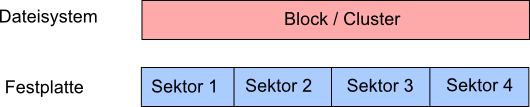
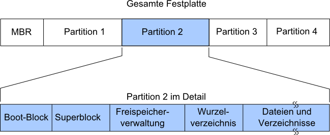
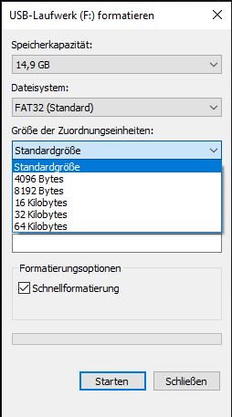
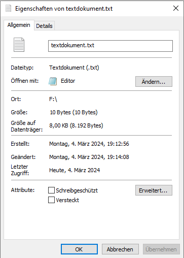
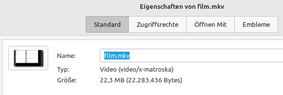
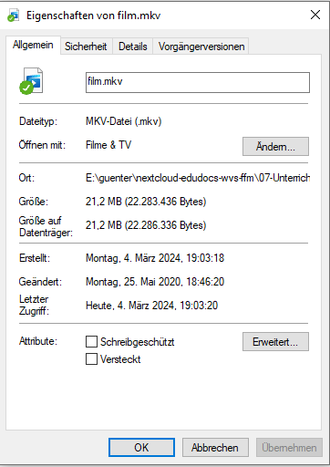
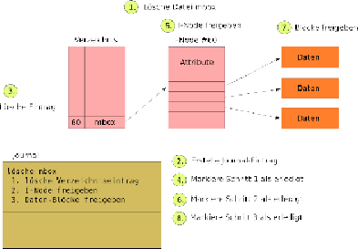

<!--
author:   Günter Dannoritzer
email:    g.dannoritzer@wvs-ffm.de
version:  1.0.0
date:     05.03.2024
language: de
narrator: Deutsch Female

comment:  Dateisytem, Journaling, NTFS, Linux

logo:     02_img/logo-dateisystem.png

tags:     LiaScript, Lernfeld_2, Fachinformatiker, Dateisystem

link:     https://cdn.jsdelivr.net/chartist.js/latest/chartist.min.css

script:   https://cdn.jsdelivr.net/chartist.js/latest/chartist.min.js

-->

# Dateisystem

Ein Dateisystem stellt eine Struktur für die Ablage von Daten zur Verfügung. Die Funktion des Dateisystems ist die Verwaltung des zur Verfügung stehenden Speicherbereiches, das Wiederfinden abgelegter Daten und die Speicherung von Zusatzinformation zu den abgelegten Daten.

Der folgende Text beschreibt grundlegende Funktionsblöcke eines Dateisystems.

# Allgemein

Die dauerhafte Abspeicherung von Daten erfolgt üblicherweise in Dateien. Eine Datei ist ein abstrakter Mechanismus zur Speicherung und zum Finden von Informationen. Der Teil des Betriebssystems, der sich mit Dateien und deren Organisation befasst, wird als Dateiverwaltung bezeichnet. Die Dateiverwaltung liegt im Betriebssystem über der Schicht der Geräteverwaltung und nutzt die Dienste der Geräteverwaltung zum Zugriff auf die Hardware.

Zu jeder Datei sind bestimmte Informationen notwendig, die in speziellen Datenstrukturen verwaltet werden. Die Verwaltung der Dateien erfolgt durch ein Dateisystem. Übliche Dateisysteme organisieren die Daten in einer hierarchischen Struktur. Dateien werden durch ein Dateiverzeichnis gruppiert, mehrere davon können wiederum durch ein übergeordnetes Verzeichnis zusammengefasst werden. Durch die hierarchische Anordnung entsteht ein (umgedrehter) Baum. Jedes Verzeichnis kann wieder beliebig viele Unterverzeichnisse oder als Endknoten die Dateien selbst enthalten.

Unix basierte Betriebssysteme verfügen z.B. über eine systemweite Verzeichnisstruktur, während Microsoftbasierte ein unabhängiges Verzeichnis für jede Speicherpartition verwalten.

# Block, Cluster, Sektor

Die kleinste Einheit, mit der durch eine Lese- oder Schreiboperation auf Daten einer Festplatte zugegriffen werden kann, ist ein Sektor. Die Sektorgröße wird durch den Festplattenhersteller vorgegeben und kann nachträglich nicht verändert werden. Ein Dateisystem legt eine gewisse Blockgröße fest. Der Block ist die kleinste Einheit, mit der das Betriebssystem Datenzugriffe auf das Dateisystem durchführt. Die Blockgröße ist in der Regel 1 – 64 Sektoren und wird festgelegt, wenn die Partition mit dem Dateisystem formatiert wird. Die folgende Zeichnung zeigt an einem Beispiel den Zusammenhang zwischen Sektoren und Blöcken. Die Microsoftbezeichnung für einen Block ist der Cluster.

# Dateisystem Funktionsblöcke

Die folgende Zeichnung zeigt typische Funktionsblöcke, die jedes Dateisystem hat.

 * Boot-Block - enthält den Bootloader für das Betriebssystem
 * Superblock - enthält Schlüsselparameter für das Dateisystem, wie z.B.:
   * Typ des Dateisystems
   * Blockgröße
 * Freispeicherverwaltung – kann z.B. eine Bitmap sein, mit der gespeichert wird, welche Blöcke des Dateisystems noch frei zur Verfügung stehen
 * Wurzelverzeichnis – enthält die Verzeichniseinträge der obersten Verzeichnisebene
 * Dateien und Verzeichnisbereich – hier werden die eigentlichen Daten gespeichert. Unterverzeichnisse werden auch in dem Bereich gespeichert.

# Dateiattribute (Metadaten)

Metadaten sind zusätzliche Informationen, die mit den eigentlichen Daten der Datei abgelegt werden. Metadaten sind z.B:

 * Dateiname
 * Datum, Zeitpunkt der letzten Änderung
 * Zugriffsrechte
 * Besitzer der Datei

Dem Besitzer einer Datei kommt eine besondere Bedeutung für Betriebssysteme zu, die mehreren Benutzern eine abgegrenzte Arbeitsumgebung zur Verfügung stellen. Dadurch wird es möglich, unterschiedliche Zugriffsrechte basierend auf Benutzer oder Gruppen festzulegen. Alle neueren Dateisysteme unterstützen diese Funktion. Das FAT-Dateisystem ist ein Beispiel für ein älteres Dateisystem, das aber immer noch benutzt wird und das diese Funktion nicht unterstützt.

## Zuordnungseinheiten, Blockgröße

Bei der Formatierung eines Datenträgers kann unter Windows die Zuordnungseinheit ausgewählt werden. Microsoft hat diesen Wert auch Cluster genannt, allgemein wird die Einheit Blockgröße genannt. Hier soll untersucht werden, was die Blockgröße für eine Auswirkung hat.

Auf den formatierten Datenträger wird eine Textdatei angelegt und die Zahlen `0123456789` in eine Zeile geschrieben, ohne die Eingabetaste zu drücken, bedeutet, der Cursor steht nach der Zahl 9.

Öffnet man jetzt die Eigenschaften der Datei im Dateiexplorer, sieht man folgenden Daten:

 * Größe: 10 Byte
 * Größe auf dem Datenträger: 8192 Byte

## Größenangaben, verwendete Präfixe

Hier soll jetzt untersucht werden, wie unter verschiedenen Betriebssystemen die Dateigröße angezeigt werden.

Folgende Dateigrößen werden für ein und der selben Datei angezeigt:

 * `22,3 MB (22.283.436 Bytes)` - Linux Mint
 * `21,2 MB (22.283.436 Bytes)` - Windows

Welche Aussagen zu den Daten sind richtig?

 * [[x]] Linux Mint zeigt die Dateigröße mit SI-Präfixe an
 * [[ ]] Windows zeigt die Dateigröße mit SI-Präfixe an
   [[?]] Vergleichen Sie, ob die Zahlen mit Präfix sich gegenüber den Byte-Wert ändern. Beispiel 22,3 MB -> 22.283.436 Bytes.
   [[?]] Wenn die Zahlen sich nicht ändern, wird einfach das Komma verschoben und es handelt ich um SI-Präfixe: 22.283.436 Bytes -> Komma um 6 Stellen ($10^6$ -> Mega) nach links verschoben.
   [[?]] Wenn die Zahlen sich verändern, verändert ich der Wert mit jeder Stufe von Byte -> KiB (:1024) -> MiB (:1024). 22.283.436 Bytes = 21761,16 KiB = 21,25 MiB. Beachten Sie, wie die höherwertigsten vier Ziffern (2228) sich mit jedem neuen Binärpräfix verändern.

# Journaling

Wenn auf einer Festplatte gespeicherte Daten einmal verloren gehen, dann kann das zwei Gründe haben. Zum einen können die eigentlichen Daten aus welchem Grund auch immer verloren gegangen sein. Zu anderen können die Informationen des Dateisystems inkonsistent sein, wo die Daten abgelegt sind. In beiden Fällen sind für den Benutzer die Daten verloren. Aus technischer Sicht kann im ersten Fall der Speicherbereich wieder zum Speichern neuer Daten verwendet werden. Im zweiten Fall jedoch besteht das Problem, dass bei inkonsistenter Dateistruktur Datenbereiche nicht mehr verwendet werden können.

Für den Verlust von Daten gibt es Backupstrategien oder RAID-Systeme. Um dem Fall eines inkonsistenten Dateisystems vorzubeugen, gibt es das Journaling. Es gibt zwei Arten von Journaling. Bei dem Metadaten-Journaling, wird die Konsistenz der Dateisystemstruktur aufrechterhalten. Beim Full-Journaling wird auch auf die Integrität der Daten geachtet. Häufig wird mit dem Begriff Journaling das Metadaten-Journaling gemeint, was in diesem Text genauer beschrieben wird.

# Metadaten-Journaling

Das Journaling soll hier anhand eines Beispieles erklärt werden. Dazu sollen die Schritte zum Löschen einer Datei verwendet werden. Die nötigen Schritte unter einem Linux-Dateisystem sind dazu folgend:

 * Verzeichniseintrag löschen
 * Freigeben des I-Node, der die Metadaten für die Datei speichert
 * Verwendete Speicherblöcke als frei markieren

Angenommen zwischen einem der drei Schritte fällt der Strom aus oder es kommt auf einer anderen Art und Weise zu einem Absturz, so würde das Dateisystem inkonsistent werden.
Ein Journal ist jetzt eine Erweiterung zum Dateisystem. Anstatt die nötigen Schritte zum Löschen der Datei sofort durchzuführen, werden die einzelnen Schritte in das Journal geschrieben. Nachdem sie geschrieben wurden, wird der Eintrag noch mal zurück gelesen und überprüft, ob die Schritte richtig im Journal stehen. Erst dann werden die einzelnen Schritte am Dateisystem wirklich durchgeführt. Jeder Schritt, der erfolgreich durchgeführt wurde, wird danach im Journal als durchgeführt vermerkt.

Die folgende Abbildung beschreibt diesen Vorgang. Die Schritte sind:

 1. Operation „lösche die Datei mbox“ durchführen.
 2. Die Einträge für jeden dieser Schritte werden in das Journal geschrieben und wieder zurück gelesen, um den korrekten Eintrag zu überprüfen.
 3. Im ersten Schritt wird der Verzeichniseintrag gelöscht.
 4. Der entsprechende Journaleintrag wird abgehakt.
 5. Der verwendete I-node wird als unbenutzt markiert.
 6. Der entsprechende Journaleintrag wird abgehakt.
 7. Die Datenblöcke werden als unbenutzt markiert.
 8. Der entsprechende Journaleintrag wird abgehakt.

Wenn jetzt zwischen einem der durchgeführten Schritte z.B. ein Stromausfall auftritt, wird das System nach dem erneuten Starten das Journal überprüfen und feststellen, dass es noch unbearbeitete Schritte gibt. Die noch offenen Schritte würden durchgeführt werden und die Integrität des Dateisystems ist wieder hergestellt.

# Copy on Write

# Daten-Deduplikation

# Dateirechte NTFS

# Dateirechte Linux
