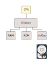
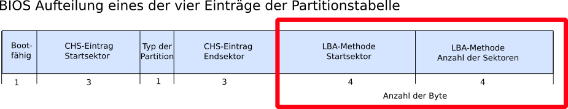
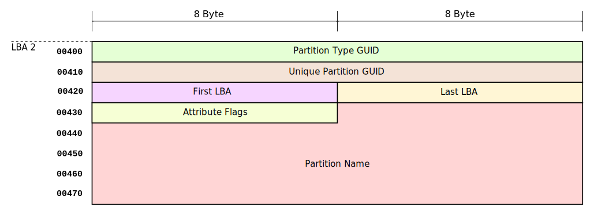
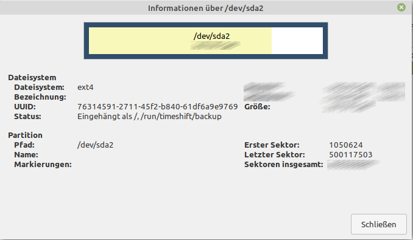
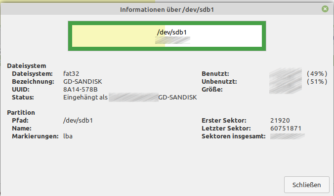
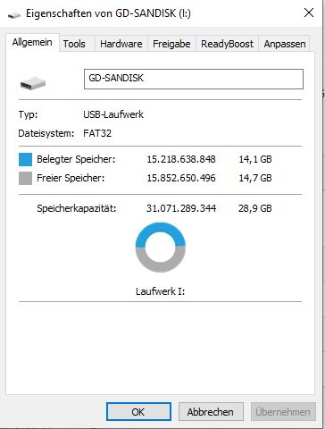

<!--
author:   Günter Dannoritzer
email:    g.dannoritzer@wvs-ffm.de
version:  1.0.1
date:     14.03.2024
language: de
narrator: Deutsch Female

comment:  PC-Boot-Prozess, UEFI, GPT, GUID-Partition Table, Secure Boot, Betriebssystem

logo:     02_img/logo-uefi.png

tags:     LiaScript, Lernfeld_2, Fachinformatiker, UEFI, GPT, Secure_Boot

link:     https://cdn.jsdelivr.net/chartist.js/latest/chartist.min.css

script:   https://cdn.jsdelivr.net/chartist.js/latest/chartist.min.js

-->

# PC-Boot-Prozess

## Einschalten des Computers

Wird ein Computer eingeschaltet, erhalten alle Komponenten ihre Betriebsspannung. Die Zentraleinheit (CPU) beginnt nach Anlegen der Spannung mit dem Befehlszyklus, der sich mit den Begriffen:

 * Fetch (laden)
 * Decode (decodieren)
 * Execute (ausführen)

beschreiben lässt.

In der Fetch-Phase wird eine Adresse an den Adressbus gelegt und über
den Datenbus Daten gelesen. Die erste Adresse, die nach Anlegen der Spannung ausgegeben wird, ist fest in der CPU hinterlegt.

In der Decode-Phase werden die gelesenen Daten decodiert, d.h. es wird
ein Maschinenbefehl erwartet, den die CPU ausführen kann.

In der Execute-Phase wird schließlich der Maschinenbefehl ausgeführt und das Ergebnis abgelegt. Dieser letzte Schritt wird in einem anderen Befehlszyklen-Modell auch als extra Schritt bezeichnet.

## Der Weg zum Betriebssystem

Um jetzt den Weg zu verstehen, wie aus diesem einfachen Befehlszyklus das Betriebssystem gestartet wird, ist es hilfreich, sich die Architektur auf dem Motherboard anzuschauen.

Die CPU ist über das Chipset mit dem Arbeitsspeicher (RAM) verbunden. Der Arbeitsspeicher verliert nach Abschalten der Betriebsspannung seinen ganzen Inhalt, kann also nach erneutem Einschalten des Computers keinen ausführbaren Maschinencode enthalten.

Die Festplatte ist über entsprechende I/O-Bausteine wie z.B. einen SATA-Controller mit der CPU verbunden. Um Daten von der Festplatte zu lesen, sind komplexere Leseoperationen nötig, die von der CPU nicht durch den Befehlszyklus durchgeführt werden können. Vielmehr muss ein
kleines Programm, das im Rahmen des Befehlszyklus abgearbeitet wird, diese Leseoperationen durchführen.

Dieses Programm kann nur in einem nicht flüchtigen Speicher abgelegt sein, der direkt wie der RAM von der CPU adressierbar ist. Dazu gibt es den Nur-Lese-Speicher (ROM), der im Adressbereich genau dort liegt, wo die CPU ihre erste Speicheradresse an den Adressbus legt, nachdem die Betriebsspannung eingeschaltet wird.

## BIOS und UEFI

In diesem nicht flüchtigen Speicher liegt als Firmware in Computern der x86-Prozessorfamilie anfangs das sogenannte **Basic Input Output System (BIOS)**. Mittlerweile wird die Firmware durch das **Unified Extensible Firmware Interface (UEFI)** ersetzt.

# 2 TiB Grenze der alten Partitionstabelle

Mit dem BIOS wurde der erste 512-Byte große Sektor eines Speichermediums mit dem **Master Boot Record (MBR)** beschrieben, in dem u.a. die **Partitionstabelle** enthalten ist. Hier wird erklärt, warum die Partitionsgröße mit MBR-basierten Partitionstabellen nur 2 TiB betragen kann und wie groß eine Partition mit der durch das UEFI eingeführten **GUID-Partitionstabelle (GPT)** in der aktuellen Version sein kann. Partitionsgrößen werden mit dem sogenannten **Logical Block Adressing (LBA)** adressiert. Ein LBA ist 512 Byte groß.

Welche maximale Zahl kann mit einer Anzahl von N-Bit dargestellt werden?

Beispiel:

Mit N = 4 Bit ist es möglich $2^4=16$ Werte darzustellen, mit den Zahlen von 0-15. Die maximale Zahl ist also $2^N−1$.

Die Partitionstabelle im MBR stellt 4 Byte zur Verfügung, um die Größe einer Partition in LBA zu bestimmen.

Daraus ergibt sich eine maximale Zahl von:

$24 \cdot 8−1 = 2^{32}−1 = 4.294.967.295 \quad \text{LBA}$

wird der Wert mit den 512 Byte/LBA multipliziert, ergibt das eine Partitionsgröße von:

$4.294.967.295 \quad \text{LBA} \cdot 512 \frac{Byte}{LBA} = 2.199.023.255 \text{Byte} ÷1024^4 = 2 \quad \text{TiB}$

## Aufgabe: Maximale Partitionsgröße berechnen

Berechnen Sie die maximal mögliche Partitionsgröße, wenn für die Adressierung des Start- und End-LBAs Zahlen nutzbar sind, die in einem 8 Byte großen Feld gespeichert werden.

## GUID-Partionstabelle (GPT)

Mit dem UEFI wurde eine neue Partitionstabelle eingeführt, die GUID-Partitionstabelle oder abgekürzt GPT bezeichnet wird. Sie ist ganze 34 LBAs groß.

Ein Vorteil ist, dass die Felder für die Dokumentation der Partitionsgröße jetzt auf 8 Byte vergrößert wurden.

Wie Sie in der vorigen Übung berechnet haben, kann jetzt eine Partition 8 ZiB groß sein. Zum Rechenweg:

$$28 \cdot 8−1 = 264 − 1 \cdot 512 \quad \text{Byte/LBA} = 9.444.732.965.739.290.426.880 \quad \text{Byte}$$

Anhand der Größe kann die Zahl durch $1024^7$ geteilt werden. Daraus ergibt sich ein Wert von 8 Zebibyte (ZiB).

Aber die neue Tabelle hat noch einen Vorteil. Sollten Sie innerhalb Ihrer beruflichen Karriere erleben, dass diese Partitionsgröße nicht mehr ausreicht, kann über ein Feld im Header der Partitionstabelle die Größe des Parameters verändert werden. Anstelle von 8 Byte könnte man dann z.B. die Feldgröße auf 16 Byte vergrößern, ohne eine neue Partitionstabelle erfinden zu müssen.

# Partitionsgröße berechnen

Um eine Partitionsgröße zu berechnen, soll als Grundlage ein Partitionseintrag der GPT dienen. Die nebenstehende Abbildung beschreibt die Struktur. Eine Zeile in der Darstellung entspricht 16 Byte an Daten.

 1. Partitionstyp (z.B. NTFS)
 2. Eindeutige Identifikation der Partition durch eine GUID
 3. Start- und End-LBA

Der Start- und End-LBA beschreibt die Position und Größe der Partion. In dieser Lektion soll die Partitionsgrößenberechnung erklärt werden.

Um die Rechnung zu verdeutlichen, sollen die folgenden zwei einfachen Beispiele dienen. Im **Beispiel 1** ist die Partition beschrieben durch die LBAs:

 * Start-LBA: 10
 * End-LBA: 14

Im ersten Schritt wird ausgerechnet, wie viele LBAs die Partition beinhaltet. Dazu subtrahiert man die beiden Werte. Was jetzt auffällt, dass ein LBA zu wenig ist. Daher wird der Wert um eins angepasst. Die Gesamtzahl der LBAs ist also 5 LBAs. Jeder LBA enthält 512 Byte. Daher wird der Wert noch mit 512 Byte/LBA multipliziert.

$$\begin{aligned}
14 - 10 = 4 + 1 = 5 ~\text{LBAs}\\
5 ~\text{LBAs} \cdot 512 ~\text{Byte/LBA} = 2560 ~\text{Byte}\\
\frac{2560 ~\text{Byte}}{1024} = 2,5 ~\text{KiB}
\end{aligned}$$

Als **Beispiel 2** noch ein anderes Wertepaar, das keine Null in der Einerstelle hat.

 * Start-LBA: 21
 * End-LBA: 24

$$\begin{aligned}
24 - 21 = 3 + 1 = 4 ~\text{LBAs}\\
4 ~\text{LBAs} \cdot 512 ~\text{Byte/LBA} = 2048 ~\text{Byte}\\
\frac{2048 ~\text{Byte}}{1024} = 2 ~\text{KiB}
\end{aligned}$$

# Beispiel 1: gparted

Mit der Partitionierungssoftware **GParted** wurde eine Partition ausgelesen. Einige Werte sind in der Abbildung nicht lesbar und sie sollen berechnet werden.

Anmerkung: Die Bezeichnung der Software nutzt den Begriff Sektor und beschreibt damit die logische Adressierung mit LBAs.

 * Start-LBA: 1.050.624
 * End-LBA: 500.117.503

Anzahl der Sektoren: $$500.117.503 - 1.050.624 = 499.066.879 + 1 = 499.066.880$$

Partitionsgröße:

$$\begin{aligned}
499.066.880 ~\text{LBAs} \cdot 512 ~\text{Byte/LBA} &= 255.522.242.560 ~\text{Byte}\\
\frac{255.522.242.560 ~\text{Byte}}{1024} &= 249.533.440~\text{KiB}\\
\frac{249.533.440~\text{KiB}}{1024} &= 243685~\text{MiB} \\
\frac{243685~\text{MiB}}{1024}  &= 237,97 ~\text{GiB} 
\end{aligned}$$

# Beispiel 2: USB-Stick gparted

Partitionsgröße:

$$\begin{aligned}
60.751.871 - 21.920 = 60.729.951 + 1 &= 60.729.952 ~\text{LBAs}\\
60.729.952 ~\text{LBAs} \cdot 512 ~\text{Byte/LBA} &= 31.093.735.424 ~\text{Byte}\\
\frac{31.093.735.424 ~\text{Byte}}{1024} &= 30.364.976 ~\text{KiB}\\
\frac{30.364.976 ~\text{KiB}}{1024} &= 29653,30 ~\text{MiB}\\
\frac{29653,30 ~\text{MiB}}{1024} &= 28,96~\text{GiB}
\end{aligned}$$

# Bootprozess mit UEFI

Die folgende Abbildung zeigt die Partitionierung eines Computers, der mit UEFI startet.

Die ersten 34 Sektoren sind mit der **GUID-Partitionstabelle** belegt. Zur Sicherheit werden in den letzten 34 Sektoren des Speichermediums eine Kopie der GPT abgelegt.

Es folgt dann ein 128 MiB großer Bereich, der freigehalten wird.

Dann kommt die **EFI Systempartition**. Es ist eine mit dem FAT-Dateisystem formatierte Partition, auf der die betriebssystemspezifischen Bootloader abgelegt werden. Die Systempartition ist mit Partitionierungstools sichtbar, aber mit einem gestarteten Windows z.B. nicht sichtbar.

Danach folgen die betriebssystemspezifischen Partitionen.

Der Bootprozess läuft jetzt folgendermaßen ab:

 * Im nichtflüchtigen Speicher wird ein Link auf das zu starten Betriebssystem gesetzt. Dieser Link zeigt auf den Bootloader in der EFI-Systempartition.
 * Der Bootloader in der EFI-Systempartition startet das Betriebssystem von der betriebssystemspezifischen Partition.

## Compatibility Support Modul (CSM)

Für die Kompatibilität zu älteren Betriebssystemen enthält das UEFI das sogenannte **Compatibility Support Modul (CSM)**. Es erlaubt, den Computer wie mit dem BIOS und dem Master Boot Record zu starten.

Die Abbildung zeigt, wie mit eingeschaltetem CSM der Sprung zum MBR stattfindet und darüber das Betriebssystem gestartet wird.

