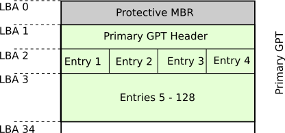

<!--
author:   Günter Dannoritzer
email:    g.dannoritzer@wvs-ffm.de
version:  2.3.0
date:     27.03.2024
language: de
narrator: Deutsch Female

comment:  PC-Boot-Prozess, UEFI, GPT, GUID-Partition Table, Secure Boot, Betriebssystem, EFI-Systempartition

logo:     02_img/logo-uefi.png

tags:     LiaScript, Lernfeld_2, Fachinformatiker, UEFI, GPT, Secure_Boot

link:     https://cdn.jsdelivr.net/chartist.js/latest/chartist.min.css

script:   https://cdn.jsdelivr.net/chartist.js/latest/chartist.min.js

-->

# PC-Boot-Prozess

Beim Systemstart ist die Firmware die erste Software, die auf der CPU zur Ausführung kommt. Gespeichert in einem nichtflüchtigen Speicher, der fest auf dem Motherboard verbaut ist, initialisiert sie sämtliche Systemkomponenten, die zum Booten des PCs nötig sind. Für Intel-basierte Computer war das BIOS der Firmwarestandard, der diese Funktion übernahm. Die Entwicklung des BIOS startet ca. 1975 und so mussten über die Jahre Neuerungen in der Hardwareentwicklung mit in das BIOS aufgenommen werden, ohne die Kompatibilität zu vorherigen Versionen aufzugeben. BIOS-Hersteller wie z.B. AMI, Insyde oder Phoenix (Award) betrieben diese Weiterentwicklung ohne Absprache untereinander nach eigenen Ideen. Unterstützung von z.B. neuen SATA-, USB- oder Ethernet-Bausteinen musste für jede BIOS-Variante angepasst werden. Hinzu kam, dass das Schema des mit dem BIOS verbundenen Master-Boot-Records, erste Grenzen aufzeigte.


## Einschalten des Computers

Wird ein Computer eingeschaltet, erhalten alle Komponenten ihre Betriebsspannung. Die Zentraleinheit (CPU) beginnt nach Anlegen der Spannung mit dem Befehlszyklus, der sich mit den Begriffen:

 * Fetch (laden)
 * Decode (decodieren)
 * Execute (ausführen)

beschreiben lässt.

In der Fetch-Phase wird eine Adresse an den Adressbus gelegt und über
den Datenbus Daten gelesen. Die erste Adresse, die nach Anlegen der Spannung ausgegeben wird, ist fest in der CPU hinterlegt.

In der Decode-Phase werden die gelesenen Daten decodiert, d.h. es wird
ein Maschinenbefehl erwartet, den die CPU ausführen kann.

In der Execute-Phase wird schließlich der Maschinenbefehl ausgeführt und das Ergebnis abgelegt. Dieser letzte Schritt wird in einem anderen Befehlszyklen-Modell auch als extra Schritt bezeichnet.


## Der Weg zum Betriebssystem


Um jetzt den Weg zu verstehen, wie aus diesem einfachen Befehlszyklus das Betriebssystem gestartet wird, ist es hilfreich, sich die Architektur auf dem Motherboard anzuschauen.

Die CPU ist über das Chipset mit dem Arbeitsspeicher (RAM) verbunden. Der Arbeitsspeicher verliert nach Abschalten der Betriebsspannung seinen ganzen Inhalt, kann also nach erneutem Einschalten des Computers keinen ausführbaren Maschinencode enthalten.

Die Festplatte ist über entsprechende I/O-Bausteine wie z.B. einen SATA-Controller mit der CPU verbunden. Um Daten von der Festplatte zu lesen, sind komplexere Leseoperationen nötig, die von der CPU nicht durch den Befehlszyklus durchgeführt werden können. Vielmehr muss ein
kleines Programm, das im Rahmen des Befehlszyklus abgearbeitet wird, diese Leseoperationen durchführen.

Dieses Programm kann nur in einem nicht flüchtigen Speicher abgelegt sein, der direkt wie der RAM von der CPU adressierbar ist. Dazu gibt es den Nur-Lese-Speicher (ROM), der im Adressbereich genau dort liegt, wo die CPU ihre erste Speicheradresse an den Adressbus legt, nachdem die Betriebsspannung eingeschaltet wird.


## BIOS und UEFI

In diesem nicht flüchtigen Speicher liegt als Firmware in Computern der x86-Prozessorfamilie anfangs das sogenannte **Basic Input Output System (BIOS)**. Mittlerweile wird die Firmware durch das **Unified Extensible Firmware Interface (UEFI)** ersetzt.

# 2 TiB Grenze der alten Partitionstabelle

Mit dem BIOS wurde der erste 512-Byte große Sektor eines Speichermediums mit dem **Master Boot Record (MBR)** beschrieben, in dem u.a. die **Partitionstabelle** enthalten ist. Hier wird erklärt, warum die Partitionsgröße mit MBR-basierten Partitionstabellen nur 2 TiB betragen kann und wie groß eine Partition mit der durch das UEFI eingeführten **GUID-Partitionstabelle (GPT)** in der aktuellen Version sein kann. Partitionsgrößen werden mit dem sogenannten **Logical Block Adressing (LBA)** adressiert. Ein LBA ist 512 Byte groß.

Welche maximale Zahl kann mit einer Anzahl von N-Bit dargestellt werden?

Beispiel:

Mit N = 4 Bit ist es möglich $2^4=16$ Werte darzustellen, mit den Zahlen von 0-15. Die maximale Zahl ist also $2^N−1$.


Die Partitionstabelle im MBR stellt 4 Byte zur Verfügung, um die Größe einer Partition in LBA zu bestimmen.

Daraus ergibt sich eine maximale Zahl von:

$24 \cdot 8−1 = 2^{32}−1 = 4.294.967.295 \quad \text{LBA}$

wird der Wert mit den 512 Byte/LBA multipliziert, ergibt das eine Partitionsgröße von:

$4.294.967.295 \quad \text{LBA} \cdot 512 \frac{Byte}{LBA} = 2.199.023.255 \text{Byte} ÷1024^4 = 2 \quad \text{TiB}$


# GUID-Partitionstabelle (GPT)

Mit dem UEFI wurde eine neue Partitionstabelle eingeführt, die **GUID-Partitionstabelle**, abgekürzt als **GPT**, bezeichnet wird. Sie ist ganze 34 LBAs groß.



Die GPT enthält als ersten LBA den Master Boot Record, um kompatibel zu älteren Systemen zu sein, die auf den Datenträger zugreifen und nicht die Struktur der GPT kennen.

Es folgt dann der LBA 1, der den primären GPT-Header enthält. Danach folgen mit LBA 2 bis 33 die eigentlichen Partitionseinträge, je vier Einträge pro LBA. Insgesamt können in der aktuellen Version 128 Partitionseinträge gespeichert werden.

## Aufgabe: Maximale Partitionsgröße der GPT berechnen

Berechnen Sie die maximal mögliche Partitionsgröße, wenn für die Adressierung des Start- und End-LBAs Zahlen nutzbar sind, die in einem 8 Byte großen Feld gespeichert werden.

Ein Vorteil ist, dass die Felder für die Dokumentation der Partitionsgröße jetzt auf 8 Byte vergrößert wurden.

Wie Sie in der vorigen Übung berechnet haben, kann jetzt eine Partition 8 ZiB groß sein. Zum Rechenweg:

$$28 \cdot 8−1 = 264 − 1 \cdot 512 \quad \text{Byte/LBA} = 9.444.732.965.739.290.426.880 \quad \text{Byte}$$

Das Ergebnis hat 7 Punkte als Tauserndertrenner. Anhand dieser kann die Zahl durch $1024^7$ geteilt werden. Daraus ergibt sich ein Wert von 8 Zebibyte (ZiB).

Aber die neue Tabelle hat noch einen Vorteil. Sollten Sie innerhalb Ihrer beruflichen Karriere erleben, dass diese Partitionsgröße nicht mehr ausreicht, kann über ein Feld im Header der Partitionstabelle die Größe des Parameters verändert werden. Anstelle von 8 Byte könnte man dann z.B. die Feldgröße auf 16 Byte vergrößern, ohne eine neue Partitionstabelle erfinden zu müssen.


# Partitionsgröße berechnen


Um eine Partitionsgröße zu berechnen, soll als Grundlage ein Partitionseintrag der GPT dienen. Die nebenstehende Abbildung beschreibt die Struktur. Eine Zeile in der Darstellung entspricht 16 Byte an Daten.

 1. Partitionstyp (z.B. NTFS)
 2. Eindeutige Identifikation der Partition durch eine GUID
 3. Start- und End-LBA

Der Start- und End-LBA beschreibt die Position und Größe der Partion. In dieser Lektion soll die Partitionsgrößenberechnung erklärt werden.


Um die Rechnung zu verdeutlichen, sollen die folgenden zwei einfachen Beispiele dienen. Im **Beispiel 1** ist die Partition beschrieben durch die LBAs:

 * Start-LBA: 10
 * End-LBA: 14

Im ersten Schritt wird ausgerechnet, wie viele LBAs die Partition beinhaltet. Dazu subtrahiert man die beiden Werte. Was jetzt auffällt, dass ein LBA zu wenig ist. Daher wird der Wert um eins angepasst. Die Gesamtzahl der LBAs ist also 5 LBAs. Jeder LBA enthält 512 Byte. Daher wird der Wert noch mit 512 Byte/LBA multipliziert.


$$\begin{aligned}
14 - 10 = 4 + 1 = 5 ~\text{LBAs}\\
5 ~\text{LBAs} \cdot 512 ~\text{Byte/LBA} = 2560 ~\text{Byte}\\
\frac{2560 ~\text{Byte}}{1024} = 2,5 ~\text{KiB}
\end{aligned}$$

Als **Beispiel 2** noch ein anderes Wertepaar, das keine Null in der Einerstelle hat.

 * Start-LBA: 21
 * End-LBA: 24


$$\begin{aligned}
24 - 21 = 3 + 1 = 4 ~\text{LBAs}\\
4 ~\text{LBAs} \cdot 512 ~\text{Byte/LBA} = 2048 ~\text{Byte}\\
\frac{2048 ~\text{Byte}}{1024} = 2 ~\text{KiB}
\end{aligned}$$

# Beispiel 1: gparted


Mit der Partitionierungssoftware **GParted** wurde eine Partition ausgelesen. Einige Werte sind in der Abbildung nicht lesbar und sie sollen berechnet werden.

Anmerkung: Die Bezeichnung der Software nutzt den Begriff Sektor und beschreibt damit die logische Adressierung mit LBAs.

 * Start-LBA: 1.050.624
 * End-LBA: 500.117.503

Anzahl der Sektoren: $$500.117.503 - 1.050.624 = 499.066.879 + 1 = 499.066.880$$

Partitionsgröße:

$$\begin{aligned}
499.066.880 ~\text{LBAs} \cdot 512 ~\text{Byte/LBA} &= 255.522.242.560 ~\text{Byte}\\
\frac{255.522.242.560 ~\text{Byte}}{1024} &= 249.533.440~\text{KiB}\\
\frac{249.533.440~\text{KiB}}{1024} &= 243685~\text{MiB} \\
\frac{243685~\text{MiB}}{1024}  &= 237,97 ~\text{GiB} 
\end{aligned}$$

# Beispiel 2: USB-Stick gparted


Partitionsgröße:

$$\begin{aligned}
60.751.871 - 21.920 = 60.729.951 + 1 &= 60.729.952 ~\text{LBAs}\\
60.729.952 ~\text{LBAs} \cdot 512 ~\text{Byte/LBA} &= 31.093.735.424 ~\text{Byte}\\
\frac{31.093.735.424 ~\text{Byte}}{1024} &= 30.364.976 ~\text{KiB}\\
\frac{30.364.976 ~\text{KiB}}{1024} &= 29653,30 ~\text{MiB}\\
\frac{29653,30 ~\text{MiB}}{1024} &= 28,96~\text{GiB}
\end{aligned}$$


# Bootprozess mit UEFI

Die folgende Abbildung zeigt die Partitionierung eines Computers, der mit UEFI startet.


Die ersten 34 Sektoren sind mit der **GUID-Partitionstabelle** belegt. Zur Sicherheit werden in den letzten 34 Sektoren des Speichermediums eine Kopie der GPT abgelegt.

Es folgt dann ein 128 MiB großer Bereich, der freigehalten wird.

Dann kommt die **EFI Systempartition**. Es ist eine mit dem FAT-Dateisystem formatierte Partition, auf der die betriebssystemspezifischen Bootloader abgelegt werden. Die Systempartition ist mit Partitionierungstools sichtbar, aber mit einem gestarteten Windows z.B. nicht sichtbar.

Danach folgen die betriebssystemspezifischen Partitionen.

Der Bootprozess läuft jetzt folgendermaßen ab:

 * Im nichtflüchtigen Speicher wird ein Link auf das zu starten Betriebssystem gesetzt. Dieser Link zeigt auf den Bootloader in der EFI-Systempartition.
 * Der Bootloader in der EFI-Systempartition startet das Betriebssystem von der betriebssystemspezifischen Partition.

## Ausführungsmaschine für EFI-Bytecode

Um den Bootprozess flexibel für zukünftige Hardwarekomponenten zu machen und die Bootloaderentwicklung CPU-Plattformunabhängig, gibt es die sogenannte **EFI Bytecode Virtual Machine**. Der Bootloader und nötige Hardwaretreiber werden als sogenannter EFI Bytecode entwickelt, der vergleichbar mit Java Bytecode ist. Auf der jeweiligen CPU-Plattform gibt es eine angepasste Virtual Machine, auf der der Bytecode ausgeführt wird.


## Compatibility Support Modul (CSM)

Für die Kompatibilität zu älteren Betriebssystemen enthält das UEFI das sogenannte **Compatibility Support Modul (CSM)**. Es erlaubt, den Computer wie mit dem BIOS und dem Master Boot Record zu starten.


Die Abbildung zeigt, wie mit eingeschaltetem CSM der Sprung zum MBR stattfindet und darüber das Betriebssystem gestartet wird.

## Secure Boot

Vor der Ausführung des Betriebssystems, mit seinen Schutzmechanismen gegenüber Schadsoftware, wird beim UEFI-Start der Bootloader aufgerufen. Um sicherzustellen, dass in dieser Phase keine Schadsoftware eingebracht wird, sind die Softwarekomponenten mithilfe digitaler Signatur vor Veränderung geschützt. Der Bootprozess mit eingeschaltetem **Secure Boot** überprüft die digitale Signatur der Komponenten und startet das Betriebssystem nur, wenn keine Veränderung der Komponenten stattfand.

### Entwicklung des Bootloaders für Secure Boot

Um den Bootprozess zu verstehen, wird zuerst die Absicherung des Bootloaders beschrieben. Die folgende Abbildung zeigt den Entwicklungsprozess am Beispiel von Microsoft Windows.


 1. Im ersten Schritt wird das Betriebssystem entwickelt.
 2. Für den Bootprozess wird ein Bootloader im EFI-Byte-Code entwickelt.
 3. Für die Signierung des Bootloaders wird ein Schlüsselpaar mit **öffentlichen und privaten Schlüsseln** erzeugt.
 4. Für den Bootloader wird ein **Hashwert** berechnet, der dann mit dem **privaten Schlüssel** verschlüsselt und als **Signatur** dem Bootloader angehängt wird.
 5. Ausgeliefert wird:

    * Das Betriebssystem
    * Der signierte Bootloader
    * Der öffentliche Schlüssel zur Überprüfung der Signatur des Bootloaders.

### Bootprozess mit Secure Boot

Auf dem eingesetzten Computer ist der Ablauf des Bootprozesses mit Secure Boot jetzt in der folgenden Abbildung beschrieben.


 1. Im nichtflüchtigen Speicher (NVRAM) ist eingestellt, dass der **Windows Bootloader.efi** von der **EFI-Systempartition** gestartet werden soll.
 2. Mit eingeschaltetem **Secure-Boot** wird der **signierte Bootloader** von der EFI-Systempartition geladen. Das **Secure-Boot-Modul** hat den **öffentlichen Schlüssel** für den Bootloader hinterlegt und damit kann die Signatur überprüft werden.
 3. Nach der Überprüfung der Signatur und damit, dass der Bootloader nach der Auslieferung von Microsoft nicht verändert wurde, wird er mithilfe der **EFI-Byte-Code-VM** gestartet.
 4. Der **Windows Bootloader** startet dann das Betriebssystem von der Windows-Partition.


### Weiter Informationen

 * [The state of Secure Boot, Linux Magazin, 164/2014](http://www.linux-magazine.com/Issues/2014/164/The-State-of-Secure-Boot)
 * [UEFI 2.10 Spezifikation](https://uefi.org/specs/UEFI/2.10/index.html)


# Praktische Übung EFI-Systempartition

Der weiter oben beschriebenen Bootvorgang mit UEFI soll hier mit praktischen Schritten an einer Windowsinstallation untersucht werden:

 * EFI-Systempartition analysieren
 * UEFI-Variable auslesen und Booteinstellung anzeigen

## EFI-Systempartition analysieren

Auf der EFI-Systempartition sind die Bootloader des Betriebssystems abgelegt. Sie ist in der Regel versteckt und nicht sichtbar. Über die Windows-`cmd` kann mithilfe des Kommandos `mountvol` die Systempartition gemounted werden.

Mit dem Befehl `mountvol --help` erhalten Sie die Hilfe zu dem Befehl. Eine `cmd` mit **Administrationsrechten** erlaubt darüber das Mounten der EFI-Systempartition und Erkundung.

**WARNUNG!** verändern Sie nichts an den Einträgen, nutzen Sie nur die gezeigten Kommandos, um sich Informationen anzeigen zu lassen. Unbeabsichtigte Veränderungen können den korrekten Bootvorgang des Systems zukünftig verhindern.

````cmd -mountvol P: /S
C:\>mountvol P: /S
P:
P:\>tree /f
Auflistung der Ordnerpfade für Volume SYSTEM
Volumeseriennummer : E704-9EF62
P:.
└───EFI
    ├───Microsoft
    │   ├───Boot
    │   │   │   kd_02_10df.dll
    │   │   │   bootmgfw.efi
    │   │   │   kd_02_10ec.dll
    │   │   │   kd_02_1137.dll
    │   │   │   kd_02_14e4.dll
    │   │   │   kd_02_15b3.dll
    │   │   │   kd_02_1969.dll
    │   │   │   kd_02_19a2.dll
    │   │   │   kd_02_1af4.dll
    │   │   │   kd_02_8086.dll
    │   │   │   kd_07_1415.dll
    │   │   │   kd_0C_8086.dll
    │   │   │   bootmgr.efi
    │   │   │   memtest.efi
    │   │   │   winsipolicy.p7b
    │   │   │   boot.stl
    │   │   │   kdstub.dll
    │   │   │   BCD
    │   │   │   kdnet_uart16550.dll
    │   │   │
    ...
    │   │   │
    │   │   ├───de-DE
    │   │   │       bootmgfw.efi.mui
    │   │   │       bootmgr.efi.mui
    │   │   │       memtest.efi.mui
    │   │   │
    │   │   │       meiryon_boot.ttf
    ...
    │   │   │
    │   │   └───Resources
    │   │       │   bootres.dll
    │   │       │
    │   │       ├───de-DE
    │   │       │       bootres.dll.mui
    │   │       │
    │   │       └───en-US
    │   │               bootres.dll.mui
    │   │
    │   └───Recovery
    │           BCD
    │
    └───Boot
            bootx64.efi

mountvol P: /d
````

Zur Erklärung. Mit dem Befehl `mountvol P: /S` wird die Systempartition auf dem Laufwerk `P:` gemounted. Da die `cmd` mit Administrationsrechten geöffnet ist, sehen Sie das Laufwerk nicht in Ihrem Dateiexplorer. Alle weiteren Aktionen mit dem Laufwerk `P:` müssen in der Kommandozeile ausgeführt werden. Sollte das Laufwerk belegt sein, wählen Sie einen anderen freien Buchstaben aus.

Nach dem Mounten kann mit der Eingabe von `P: <Eingabetaste>` auf das Laufwerk gewechselt werden. Sie sind jetzt auf der Systempartition und hier noch mal die Warnung, nichts zu verändern, da sonst der Bootvorgang zukünftig gestört sein kann.

Mit dem Kommando `tree /f` lassen wir alle Ordner und Dateien (`/f`-Option) anzeigen. Auf dem System ist nur ein Windows-Betriebssytem installiert und so findet sich dort nur ein Unterordner Microsoft.

Die Ausgabe ist hier gekürzt dargestellt, was mit den drei Punkten `...` gekennzeichnet ist. Es wiederholen sich Unterordner für alle Sprachen, in die Windows booten kann. Exemplarisch ist in der gezeigten Ausgabe nur der Ordner für die Deutsche Sprache angezeigt.

Im Pfad `Microsoft\Boot` liegt die Datei `bootmgfw.efi`, die den Bootloader im EFI-Bytecode enthält.

Mit dem Befehl `mountvol P: /d` wird schließlich die Systempartition wieder unmounted.

## UEFI-Variablen auslesen

https://oofhours.com/2022/06/29/geeking-out-with-the-uefi-boot-manager/


````ps -Get-UEFIVariable
Get-UEFIVariable -All

PS C:\WINDOWS\system32> Get-UEFIBootEntry

ID       Description            Hidden
--       -----------            ------
Boot0001 PLDS DVD-RW DH16ACSH    False
Boot0002 KINGSTON SA400S37240G   False
Boot0003 WDC WD5000AAKX-07U6BA0  False
Boot0004 IBA GE Slot 00C8 v1555  False
Boot0000 Windows Boot Manager    False

PS C:\WINDOWS\system32> Get-UEFIVariable -VariableName Boot0000 | Format-Hex


           00 01 02 03 04 05 06 07 08 09 0A 0B 0C 0D 0E 0F

00000000   01 00 00 00 74 00 57 00 69 00 6E 00 64 00 6F 00  ....t.W.i.n.d.o.
00000010   77 00 73 00 20 00 42 00 6F 00 6F 00 74 00 20 00  w.s. .B.o.o.t. .
00000020   4D 00 61 00 6E 00 61 00 67 00 65 00 72 00 00 00  M.a.n.a.g.e.r...
00000030   04 01 2A 00 01 00 00 00 00 08 00 00 00 00 00 00  ..*.............
00000040   00 20 03 00 00 00 00 00 16 76 3F 3F 54 55 3F 40  . .......v??TU?@
00000050   3F 3F 37 39 3F 15 71 3F 02 02 04 04 46 00 5C 00  ??79?.q?....F.\.
00000060   45 00 46 00 49 00 5C 00 4D 00 69 00 63 00 72 00  E.F.I.\.M.i.c.r.
00000070   6F 00 73 00 6F 00 66 00 74 00 5C 00 42 00 6F 00  o.s.o.f.t.\.B.o.
00000080   6F 00 74 00 5C 00 62 00 6F 00 6F 00 74 00 6D 00  o.t.\.b.o.o.t.m.
00000090   67 00 66 00 77 00 2E 00 65 00 66 00 69 00 00 00  g.f.w...e.f.i...
000000A0   7F 3F 04 00 57 49 4E 44 4F 57 53 00 01 00 00 00  ⌂?..WINDOWS.....
000000B0   3F 00 00 00 78 00 00 00 42 00 43 00 44 00 4F 00  ?...x...B.C.D.O.
000000C0   42 00 4A 00 45 00 43 00 54 00 3D 00 7B 00 39 00  B.J.E.C.T.=.{.9.
000000D0   64 00 65 00 61 00 38 00 36 00 32 00 63 00 2D 00  d.e.a.8.6.2.c.-.
000000E0   35 00 63 00 64 00 64 00 2D 00 34 00 65 00 37 00  5.c.d.d.-.4.e.7.
000000F0   30 00 2D 00 61 00 63 00 63 00 31 00 2D 00 66 00  0.-.a.c.c.1.-.f.
00000100   33 00 32 00 62 00 33 00 34 00 34 00 64 00 34 00  3.2.b.3.4.4d.4.
00000110   37 00 39 00 35 00 7D 00 00 00 00 00 01 00 00 00  7.9.5.}.........
00000120   10 00 00 00 04 00 00 00 7F 3F 04 00              ........⌂?..
````

Ab der Adresse `0000 0060` steht der Text: `E.F.I.\.M.i.c.r.o.s.o.f.t.\.B.o.o.t.\.b.o.o.t.m.g.f.w...e.f.i`


# Angriffe auf Secure Boot

Auf der Webseite Security Insider wurde 2023 der Artikel ["BlackLotus-Bootkig umgeht UEFI Secure Boot von Windows"](https://www.security-insider.de/blacklotus-bootkit-umgeht-uefi-secure-boot-von-windows-a-6c2da6cc87284740e4fff9d33e3909dc/), in dem berichtet wird, dass Forscher ein Bootkit identifiziert haben, mit dem eine Sicherheitslücke ([CVE-2022-21894](https://cve.mitre.org/cgi-bin/cvename.cgi?name=CVE-2022-21894)) bei Microsoft Windows ausgenutzt werden kann, um Secure Boot zu umgehen.

Es gab dazu bereits im Januar 2022 ein Update, mit dem die Lücke behoben wurde, jedoch ist ein Missbrauch damit immer noch möglich.


 * DB - Datenbank mit erlaubten Hashwerten und Zertifikaten
 * DBX - Datenbank mit Hashwerten und Zertifikaten (öffentliche Schlüssel) mit nicht erlaubten Bootloader

 Im Jahr 2024 aktualisiert Microsoft mit Updates die DBX-Datenbank um ältere Bootloader nicht mehr zu starten. Siehe dazu:

Schiffbruch mit Ansage
Massenhaft Startverbote für Linux- und Windows-Bootloader spätestens ab Oktober

Secure Boot soll eigentlich dafür sorgen, dass auf einem PC nur vertrauenswürdige Bootloader starten, enthält aber Konstruktionsfehler. Microsofts Versuche, deren Folgen auszugleichen, funktionieren auch nicht korrekt, werden aber dennoch bald auch auf Ihrem PC dafür sorgen, dass vieles nicht mehr bootet – ob Sie wollen oder nicht.
Von Axel Vahldiek , heise c't 7/2024

 # Weiterentwicklung

 ## Windows Code Integrity Boot Policy

Microsoft führt mit der "Code Integrity Boot Policy" ein zusätzlichen Mechanismus ein, der die im Secure Boot enthaltene DBX-Datenbank erweitert. 

 * Microsoft führt ein eigenes System ein, das sich über den Mechanismus des Secure Boot legt.
 * Mithilfe einer Boot-Policy-Datei wird überpürft, ober der Bootloader verwendet werden darf.
 * Boot Policy liegt auf der EFI-Systempartition; in der Datei steht, welche Bootloader booten dürfen und welche nicht.
 * Um ein löschen oder Manipulieren der Datei zu verhindern, wird eine UEFI-Variable verwendet.
 * UEFI-Variable, die signiert und geschützt im Flash gespeichert ist. In ihr wird der Name der Policy-Datei und deren Zeitstempel gespeichert. Wurde die Datei manipuliert und diese Manipulation wird durch Überprüfung mithilfe der UEFI-Variablen herausgefunden, bricht der Bootvorgang ab.
 * Wird nur beim Windows-Bootvorgang verwendet; beeinflusst also den Linux-Bootvorgang nicht

 ## Linux

 * SHIM-Bootloader
 * Redhat, Gremimun
 * Secure Boot Advanced Targeting (SBAT)
 * Nutzt auch eine UEFI-Variable zur Absicherung

 ## Apple

 * Sicherheitscontroller, ist in der Hardware integriert
 * Microsoft Blueton, eigener Sicherheitscontroller, um den Bootvorgang abzusichern
 * Bei den Controllern geht es auch um die sichere Anbindung der Softwarerepositories und der Cloud

