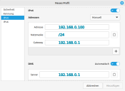
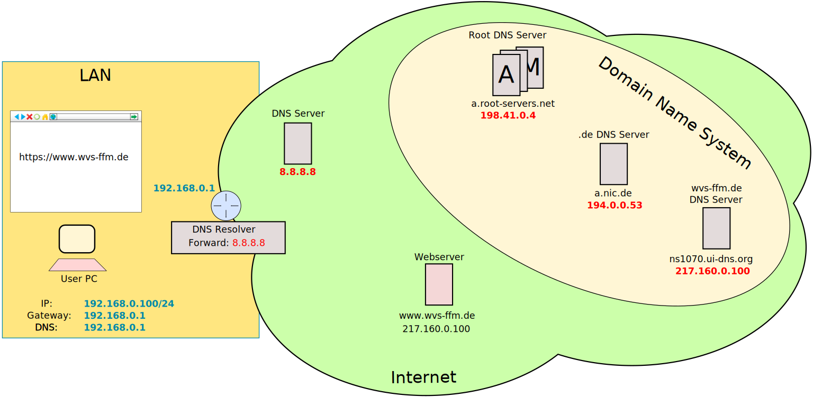
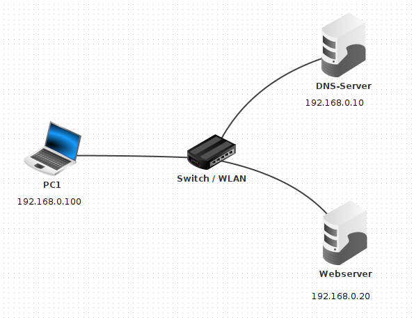
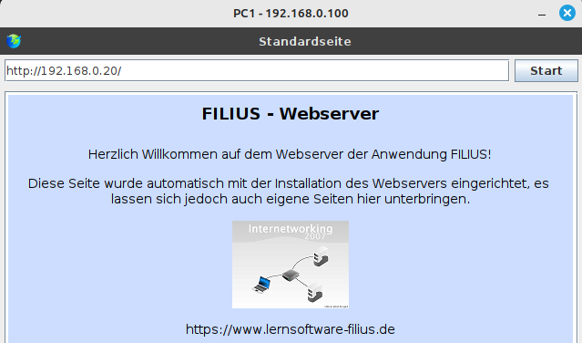
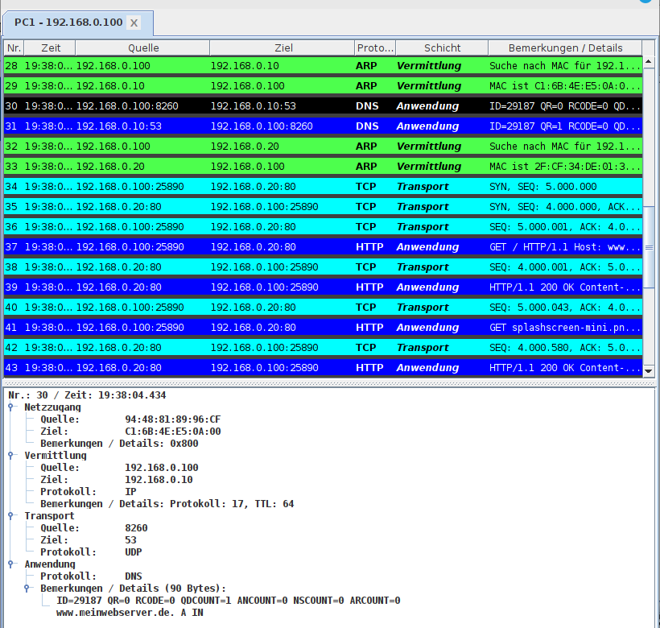

<!--
author:   Günter Dannoritzer
email:    g.dannoritzer@wvs-ffm.de
version:  0.6.1
date:     03.06.2024
language: de
narrator: Deutsch Female

comment:  Domain Name System (DNS)

icon:    https://raw.githubusercontent.com/dsp77/wvs-liascript/0938e2e0ce751e270e3e36b8ecfeb09044a41aa0/wvs-logo.png
logo:     02_img/logo-dns.png

tags:     LiaScript, DNS, FQDN, Domain Name System, DNS-Root-Server

link:     https://cdn.jsdelivr.net/chartist.js/latest/chartist.min.css

script:   https://cdn.jsdelivr.net/chartist.js/latest/chartist.min.js

attribute: Lizenz: [CC BY-SA](https://creativecommons.org/licenses/by-sa/4.0/)
-->

# Domain Name System (DNS)

Bei dem Aufruf einer Webseite im Browser wird in der Adressleiste des Browsers ein Name der Webseite eingegeben und nicht die IP-Adresse des Servers. Die Verbindung über das Internetprotokoll wird aber mit IP-Adressen adressiert. Das Domain-Name-System (DNS) hilft hier, für den Domain-Namen des Servers die zugehörige IP-Adresse zu ermitteln. Das System ist als Client-Server-Model umgesetzt. In diesem Text werden Funktionen und Abläufe des Domain-Namen-Systems erklärt.

## Fully Qualified Domain Name (FQDN)

Server werden im Internet mit dem **Fully Qualified Domain Name (FQDN)** angesprochen. Beispiel für einen FQDN ist: `www.bank.de`.

Die Adresse wird als Hierarchie abgebildet:

````
 de        ---> Top-Level-Domain
   bank    ---> First-Level-Label
      www  ---> Servername
````

Die Umsetzung der Server, die Auskunft über einen FQDN geben, sind auch in einer Hierarchie angeordnet. Die Webseite [https://root-servers.org/](https://root-servers.org/) gibt Informationen über die DNS-Root-Server, die in der Abfrage immer als Erstes angefragt werden.  Root-Server verweisen dann an autoritative DNS-Server der Top-Level-Domain.

Für die Top-Level-Domain **.de.** verwaltet die [DENIC](https://www.denic.de/) die Vergabe der FQDNs und betreibt entsprechend die autoritativen DNS-Server für diese Top-Level-Domain.

Neben den autoritativen DNS-Servern, die Auskunft geben, gibt es abfragende DNS-Server, die Anfragen von Clients durchführen.

## Abgrenzung FQDN-URL

Ein **FQDN** ist ein Domain-Name im Domain Name System. Ihm wird eine IP-Adresse zugeordnet.

Ein **URL (Uniform Resource Locator)** ist die Vollständige Adresse für eine Ressource im Internet. Sie setzt sich zusammen aus den Informationen:

 * Protokoll
 * FQDN
 * Pfad

Aufgebaut ist sie nach dem Schema: `<Protokoll>://<FQDN>/<Pfad>`.

Beispiel: `https://bank.de/index.html`

 * Protokoll: `https`
 * FQDN: `bank.de`
 * Pfad: `index.html`

## Anfragende DNS-Server

Anfragende DNS-Server führen die Abfrage von DNS-Clients im Domain-Name-System aus. Sie werden z.B. von Internetservice-Providern angeboten oder von anderen Anbietern. Ein bekannter DNS-Server zur Abfrage ist der von Google, der unter IP-Adresse `8.8.8.8` erreichbar ist.

Internetzugangsrouter erhalten die Information der verwendbaren DNS-Server des Internetanbieters, in der Regel mit dem Zugang zum Internet. Der Router leitet dann die an ihn gerichteten DNS-Anfragen an den DNS-Server des Anbieters weiter. Der Prozess wird als **Forwarder** bezeichnet.


## Forward Look-up

Bei einem **Forward Look-up** stellt der Computer eine Anfrage an das Domain Name System, um für einen **Fully Qualified Domain Name** die zugehörige IP-Adresse abzufragen. Um diese Abfrage durchzuführen, muss ein DNS-Server im Computer konfiguriert sein, an den die Anfrage gestellt wird.

### Konfiguration des Computers

Neben der IP-Adresse mit Subnetzmaske und Gateway-Adresse gehört der DNS-Server zur Grundkonfiguration eines Endgerätes.



Zur Absicherung kann ein weiterer DNS-Server konfiguriert werden, der bei Nichterreichbarkeit des Ersten verwendet wird.

Bei automatischer IP-Konfiguration mithilfe von DHCP kann der DNS-Server mit konfiguriert werden. Häufig enthält der Internetzugangsrouter einen DNS-Server, der die Anfragen an den DNS-Server des Internetproviders weiterleitet.

Manchmal soll ein anderer DNS-Server für Abfragen verwendet werden. Ein Bekannter ist der von Google, der unter der IP-Adresse `8.8.8.8` erreichbar ist.


### Ablauf des Forward Look-up



Ein Forward Look-up läuft folgendermaßen ab.

 1. Ein Benutzer ruft z.B. im Browser eine Webseite auf und tippt den FQDN in das Adressfeld des Browsers.
 2. Der Browser leitet die Anfrage an den DNS-Resolver des Betriebssystems.
 3. Der DNS-Resolver des Betriebssystems fragt den konfigurierten DNS-Server nach der IP-Adresse zu dem gefragten FQDN. In der Abbildung ist der DNS-Resolver des Internetrouters, der die Anfragen an den DNS-Server 8.8.8.8 weiterleitet.
 4. Der DNS-Server führt die Abfrage im Domain Name System ab, sofern die Adresse nicht schon in seinem Cache steht.
 5. Der DNS-Server liefert die abgefragte IP-Adresse an den Resolver zurück.
 6. Der Webbrowser stellt eine Verbindung zur erhaltenen IP-Adresse her und fragt den aufgerufenen Webserver nach der Webseite ab.


## Reverse Look-up

Der **Reverse Look-up** ist die umgekehrte Anfrage. Hier hat ein Computer eine IP-Adresse und fragt nach dem zugehörigen FQDN.

# Absicherung einer DNS-Abfrage

Die Verbindung vom DNS-Client zum abfragenden DNS-Server ist unverschlüsselt und kann von jedem, der auf dem Weg Zugriff auf das Netzwerk hat, mitgelesen werden, welche Namensanfragen gestellt werden. Um diese Anfrage abzusichern, werden die beiden Techniken **DNS over TLS** und **DNS over HTTPS** verwendet.

Um sicherzustellen, dass Abfragen wirklich von autoritativen DNS-Servern kommen und nicht gespooft sind, implementieren die autoritativen DNS-Server eine digitale Signierung der Antworten, was unter dem Begriff **DNSSEC** standardisiert ist.

## DoT

**DNS over TLS (DOT)** nutzt die **Transport Layer Security (TLS)** über Port 853, um die DNS-Anfrage über eine verschlüsselte Verbindung an den DNS-Server zu senden. Damit kann die Abfrage im Netzwerk nicht mitgelesen werden. Die Abfrage wird immer noch von dem DNS-Resolver des Betriebssystems durchgeführt.

## DoH

**DNS over HTTPS (DOH)** nutzt eine HTTPS-Verbindung über Port 443, um die DNS-Anfrage über eine verschlüsselte Verbindung zu versenden. Mit DoH kann der Browser den DNS-Resolver des Betriebssystems umgehen und die Anfrage direkt zu einem DoH-unterstützenden Server senden.


# DNS-Übung mit Filius

Mit der Filus-Übung sollen Sie ein Netzwerk aufbauen in dem ein Rechner, ein Webserver und ein DNS-Server über einen Switch miteinander verbunden sind. Die folgende Abbildung zeigt den Netzwerkplan.



Die Netzwerkkonfiguration aller Geräte wird manuell durchgeführt. In dem Netzwerk gibt es keinen Router, daher ist keine Gatewayadresse zu konfigurieren.

Damit im PC1 eine Namensauflösung durchgeführt werden kann, muss die IP-Adresse des DNS-Servers konfiguriert werden. Welche Adresse müssen Sie konfigurieren?

DNS-Adresse: [[192.168.0.10]]

Konfigurieren Sie bei PC1 die IP-Adresse in dem Feld **Domain Namen Server**.

## Webserverkonfiguration

Als nächster Schritt wird der Webserver und im PC1 der Webbrowser konfiguriert.

  * Starten Sie die Simulation mit dem **grünen Pfeilknopf**
  * Mit Doppelklick auf den Webserver können Sie die Software **Webserver** hinzufügen und starten.
  * Führen Sie die gleichen Schritte mit dem PC1 durch und fügen hier den **Webbrowser** hinzu und starten die Software.

Öffnen Sie den Webbrowser und geben Sie die IP-Adresse des **Webservers** in das Browserfenster ein und starten Sie den Verbindungsaufgaufbau. Sie sollten das folgende Fenster sehen:



## DNS-Server konfigurieren

Um die Webseite mit einem DNS-Namen aufzurufen, muss im DNS-Server der gewünschte DNS-Name mit der IP-Adresse des Webserver hinterlegt werden. Der Browser fragt dann erst die zugehörige IP-Adresse zu dem DNS-Namen und baut dann die Verbindung per IP zu dem Webserver auf.

Als Fully Quallified Domain Namen (FQDN) nutzen wir `www.meinwebserver.de`.

  * Installieren Sie auf dem DNS-Server die DNS-Software und starten diese.
  * Fügen Sie als **A-Record** über den entsprechenden Tab hinzu:
     * Host-/Domainname: `www.meinwebserver.de`
     * IP-Adresse: `192.168.0.20`
  * Starten Sie den DNS-Server


## Aufruf der Webseite mit Domainnamen

Rufen Sie im Webbrowser von PC1 jetzt den Domainnamen `www.meinwebserver.de` auf. Öffnen Sie den Protokollmitschnitt am PC1.

Anmerkung, Sie müssen ggf. nach unten Scrollen, um den Protokollmitschnitt mit der DNS-Abfrage zu finden. Die folgende Abbildung zeigt den Mitschnitt.



In dem Mitschnitt sind zwei ARP-Anfragen zu sehen. Nach welcher IP-Adresse fragt der **erste ARP-Request** und woher bekommt der PC1 diese Adresse?

  * IP-Adresse: [[192.168.0.10]]

Wählen Sie aus, welche Antwort richtig sind:

<!-- data-randomize -->
  * [(x)] Die Adresse habe ich vorher unter dem Feld **Domain Name Server** im PC1 selber konfiguriert.
  * [( )] Die Adresse fragt der PC1 vom Domain Namen System ab.
  * [( )] Der DNS-Server sendet seine Adresse ins Netzwerk und der PC1 kennt sie daher.

Nach der DNS-Abfrage erfolgt ein **zweiter ARP-Request**. Um welche IP-Adresse handelt es sich hier?

  * IP-Adresse: [[192.168.0.20]]

Woher hat der PC1 diese IP-Adresse erhalten?

<!-- data-randomize -->
  * [(x)] Die IP-Adresse kam als Antwort der DNS-Anfrage (Forward Lookup).
  * [( )] Die IP-Adresse ist im PC1 konfiguriert.
  * [( )] Die IP-Adresse wurde in der Adressleiste des Browsers eingegeben.

## IP-Vergabe mit DHCP durchführen

Fügen Sie einen weiteren Rechner zu dem Netzwerk mit der IP-Adresse 192.168.0.15 und richten Sie auf dem Server die DHCP-Server-Funktion ein.

Ändern Sie die Konfiguration von PC1, damit die Netzwerkkonfiguration per DHCP zur Verfügung gestellt wird.

Überprüfen Sie den korrekten Aufruf der Webseite von PC1.

