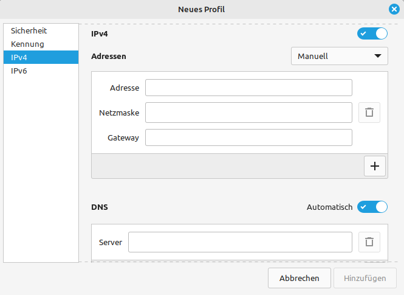

<!--
author:   Günter Dannoritzer
email:    g.dannoritzer@wvs-ffm.de
version:  0.3.1
date:     12.05.2024
language: de
narrator: Deutsch Female

comment:  Domain Name System (DNS)

logo:     02_img/logo-dns.png

tags:     LiaScript, DNS, FQDN

link:     https://cdn.jsdelivr.net/chartist.js/latest/chartist.min.css

script:   https://cdn.jsdelivr.net/chartist.js/latest/chartist.min.js

-->

# Domain Name System (DNS)

Bei dem Aufruf einer Webseite im Browser wird in der Adressleiste des Browsers ein Name der Webseite eingegeben und nicht die IP-Adresse des Servers. Die Verbindung über das Internetprotokoll wird aber mit IP-Adressen adressiert. Das Domain-Name-System (DNS) hilft hier, für den Domain-Namen des Servers die zugehörige IP-Adresse zu ermitteln. In diesem Text werden Funktionen und Abläufe des Domain-Namen-Systems erklärt.

## Fully Qualified Domain Name (FQDN)

Server werden im Internet mit dem **Fully Qualified Domain Name (FQDN)** angesprochen. Beispiel für einen FQDN ist: `www.bank.de`.

Die Adresse wird als Hierarchie abgebildet:

````
 de        ---> Top-Level-Domain
   bank    ---> First-Level-Label
      www  ---> Servername
````

## Forward Look-up

Bei einem **Forward Look-up** stellt der Computer eine Anfrage an das Domain Name System, um für einen **Fully Qualified Domain Name** die zugehörige IP-Adresse abzufragen. Um diese Abfrage durchzuführen, muss ein DNS-Server im Computer konfiguriert sein, an den die Anfrage gestellt wird.

### Konfiguration des Computers

Neben der IP-Adresse mit Subnetzmaske und Gateway-Adresse gehört der DNS-Server zur Grundkonfiguration eines Endgerätes.



Zur Absicherung kann ein weiterer DNS-Server konfiguriert werden, der bei Nichterreichbarkeit des Ersten verwendet wird.

Bei automatischer IP-Konfiguration mithilfe von DHCP kann der DNS-Server mit konfiguriert werden. Häufig enthält der Internetzugangsrouter einen DNS-Server, der die Anfragen an den DNS-Server des Internetproviders weiterleitet.

Manchmal soll ein anderer DNS-Server für Abfragen verwendet werden. Ein Bekannter ist der von Google, der unter der IP-Adresse `8.8.8.8` erreichbar ist.


### Ablauf des Forward Look-up

Ein Forward Look-up läuft folgendermaßen ab.

 1. Ein Benutzer ruft z.B. im Browser eine Webseite auf und tippt den FQDN in das Adressfeld des Browsers.
 2. Der Browser leitet die Anfrage an den DNS-Resolver des Betriebssystems.
 3. Der DNS-Resolver des Betriebssystems fragt den konfigurierten DNS-Server nach der IP-Adresse zu dem gefragten FQDN.
 4. Der DNS-Server führt die Abfrage im Domain Name System ab, sofern die Adresse nicht schon in seinem Cache steht.
 5. Der DNS-Server liefert die abgefragte IP-Adresse an den Resolver zurück.
 6. Der Webbrowser stellt eine Verbindung zur erhaltenen IP-Adresse her und fragt den aufgerufenen Webserver nach der Webseite ab.


## Reverse Look-up

Der **Reverse Look-up** ist die umgekehrte Anfrage. Hier hat ein Computer eine IP-Adresse und fragt nach dem zugehörigen FQDN.

# Absicherung einer DNS-Abfrage

 * DoT
 * DoH
 * DNSSEC

## DoT

**DNS over TLS (DOT)** nutzt die **Transport Layer Security (TLS)** über Port 853, um die DNS-Anfrage über eine verschlüsselte Verbindung an den DNS-Server zu senden. Damit kann die Abfrage im Netzwerk nicht mitgelesen werden. Die Abfrage wird immer noch von dem DNS-Resolver des Betriebssystems durchgeführt.

## DoH

**DNS over HTTPS (DOH)** nutzt eine HTTPS-Verbindung über Port 443, um die DNS-Anfrage über eine verschlüsselte Verbindung zu versenden. Mit DoH kann der Browser den DNS-Resolver des Betriebssystems umgehen und die Anfrage direkt zu einem DoH-unterstützenden Server senden.

## DNSSEC

# DNS-Hierarchie

# DNS-Übung mit Filius

