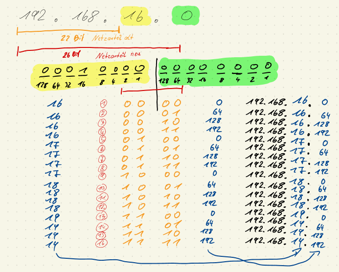

<!--
author:   Günter Dannoritzer
email:    g.dannoritzer@wvs-ffm.de
version:  1.1.2
date:     18.02.2024
language: de
narrator: Deutsch Female

comment:  Internetprotokoll Version 4 (IPv4); Aufbau der Adresse, Subnetzwerkmaske, 
            Gateway, Berechnung von Netzwerkgrößen; OSI-Schicht 3

logo:     02_img/logo-ipv4.png

tags:     LiaScript

link:     https://cdn.jsdelivr.net/chartist.js/latest/chartist.min.css

script:   https://cdn.jsdelivr.net/chartist.js/latest/chartist.min.js

-->

# Internetprotokoll Version 4 (IPv4)

Auf der OSI-Schicht 3, der Vermittlungsschicht (Network Layer), wird das Internetprotokoll verwendet. Die weltweite Verbreitung fand unter der Version 4 (IPv4) statt. Mittlerweile findet eine Umstellung auf die Protokollvariante 6 (IPv6) statt. In diesem Dokument wird die Version 4 beschrieben.

Die IPv4-Adresse ist 32-Bit groß und wird in der sogenannten dezimal-gepunkteten Notation (engl. Decimal-Dotted-Notation - DDN) dargestellt. Ein Beispiel einer Adresse ist **`192.168.16.109`**. Jeweils 8-Bit (Oktett) werden Punkte-getrennt als Dezimalwert dargestellt.

Die Konfiguration eines Netzwerkknotens enthält mindestens die Parameter:

 * IP-Adresse, z.B. `192.168.16.109`
 * Subnetzmaske, z.B. `255.255.255.0`

Die **Subnetzmaske** bestimmt, wie groß ein Netzwerk ist, was bedeutet, welche IP-Adressen zu einem Netzwerk gehören. Sie wird auch in der dezimal-gepunkteten Notation geschrieben und beschreibt über gesetzte Bits, welche Bits der IP-Adresse zur Netzwerkadresse gehören. Als alternative Schreibweise wird die Anzahl der gesetzten Bits in einer Suffix-Schreibweise an die IP-Adresse gehängt.

Beispiel, die Subnetzmaske `255.255.255.0`, umgerechnet in eine binäre Form ist:

 `1111 1111 . 1111 1111 . 1111 1111 . 0000 0000`

Von links gezählt sind es 24-Bits, die auf eins gesetzt sind. Damit ist die alternative Schreibweise der IP-Adresse mit Suffix-Schreibweise der Subnetzmaske:

  * `192.168.16.109/24`

Ein Netzwerk setzt sich zusammen aus:

 * Netzwerkadresse; die erste Adresse im Adressbereich des Netzwerks
 * Hostadressen; die Adressen für die Netzwerkknoten in dem Netzwerk
 * Broadcastadresse; die letzte Adresse in dem Netzwerk

## Berechnung eines Netzwerks

Die Vorgehensweise, ein Netzwerk zu berechnen, ist:

 1. Netzanteil bestimmen
     --> Größe der Subnetzmaske (Suffix z.B. /24)
 2. Netzadresse bestimmen
     --> alle Hostbits auf 0 setzen
 3. Broadcastadresse bestimmen
     --> alle Hostbits auf 1 setzen
 4. Anzahl der Hostadressen bestimmen
     --> $2^ {Hostbits}-2$
     --> Hostbits = 32 - Subnetzgröße


Beispiel, für die IP-Adresse `192.168.16.109/24` soll das Netzwerk berechnet werden.

### 1. Netzanteil bestimmen

Für die IP-Adresse `192.168.16.109/24` soll der Netzanteil bestimmt werden. Dazu werden von links 24-Bit markiert. Rechnerisch wird die IP-Adresse mit der Subnetzmaske binär UND-verknüpft.

```
192.168.16.109
|---------|
  24-Bit
```

### 2. Netzadresse bestimmen


### 3. Broadcastadresse bestimmen


### 4. Anzahl der Hostadressen bestimmen


### Zusammenfassung

 * IP-Adresse: `192.168.16.109/24`
 * Netzadresse: `192.168.16.0`

   * Hostadresse 1: `192.168.16.1`
   * ...
   * Hostadresse 254: `192.168.16.254`

 * Broadcastadresse: `192.168.16.255`

# Übung Netzwerk berechnen

Berechnen Sie:

 * Netzwerkadresse
 * Anzahl der Hostadressen
 * Broadcastadresse

für folgende IP-Adressen:

 1. `192.168.16.109/24`
 2. `192.168.16.109/22`
 3. `192.168.16.109/26`

## Lösung zu 1.

 * Netzwerkadresse: 192.168.16.0
 * Anzahl der Hostadressen: $2^{(32-24)=8} = 256 - 2 = 254$
 * Broadcastadresse: 192.168.16.255

## Lösung zu 2.

 * Netzwerkadresse: 192.168.16.0
 * Anzahl der Hostadressen: $2^{(32-22)=10} = 1024 - 2 = 1022$
 * Broadcastadresse: 192.168.19.255

## Lösung zu 3.

 * Netzwerkadresse: 192.168.16.64
 * Anzahl der Hostadressen: $2^{(32-26)=6} = 64 - 2 = 62$
 * Broadcastadresse: 192.168.16.127

# Netzwerk aufteilen in N-Subnetze

Hier wird beschrieben, wie ein gegebenes IP-Netzwerk in N-Subnetzwerke aufgeteilt wird, wobei N = 2, 4, 8, 16, etc. ist.

Aufgabe: Das Netzwerk `192.168.16.0/24` soll in N=8 Subnetzwerke aufgeteilt werden.

Vorgehen:

 * Neue Netzwerkmaske bestimmen
 * Die Netzgröße bestimmen
 * Mit der neuen Netzwerkmaske die N=8 Netzwerkadressen bestimmen.
 

 ## Neue Netzwerkmaske für N=8 Subnetzwerke berechnen

Die neue Subnetzmaske muss vergrößert werden. Der Wert x berechnet sich basierend auf dem Wert N. Es gilt:

$$2^x = N$$

Stellt man die Formel um, erhält man die Berechnung:

$$ x = \text{log}_2(N)$$

$\text{log}_2$ ist der Binärlogarithmus oder der Logarithmus zur Basis 2. Wenn der Taschenrechner diesen nicht berechnen kann, ist es auch möglich, eine andere Logarithmusfunktion zu verwenden. Als Beispiel ist der natürliche Logarithmus zur Basis mit der Zahl e `ln` in der Regel bei allen Taschenrechnern verfügbar. Die Berechnung ändert sich dann zu:

$$x = \frac{\text{ln}(N)}{\text{ln}(2)}$$

Für die Aufteilung in N=8 Subnetzwerke ergibt die Berechnung:

$$x = \text{log}_2(8) = 3$$

Die ursprüngliche Subnetzmaske wird also um 3-Bit vergrößert.

Die neue Subnetzmaske: 24 + **3** = 27

## Die Netzgröße bestimmen

Mit der neuen Subnetzmaske 27-Bit ergibt sich die Anzahl der Hostbits:

32 - 27 = 5-Bit

Anzahl der Hostadressen:

$$2^5 = 32 - 2 = 30$$

## Die neuen Netzwerkadressen bestimmen

Das Netzwerk wird in 8 Subnetzwerke unterteilt und damit gibt es 8 Netzwerkadresse. Diese 8 Adressen ergeben sich aus den 3 neuen Bits von der Vergrößerung der Subnetzmaske von 24 auf 27 Bits. Diese Vergrößerung findet im letzten Oktett der Adresse statt.


Für die Netzwerkadresse werden die Hostbits (0-4) auf null gesetzt. Die 8 Werte des letzten Oktetts werden also durch die Bits 5 bis 7 bestimmt, die die Werte 32, 64 und 128 haben. Daraus ergeben sich die 8 Werte für das letzte Oktett von 0, 32, 64, 96, 128, 160, 192, 224.

Beachtenswert ist der Sprung der Werte, der immer 32 entspricht, siehe grüne Markierung. Das ist der Wert des niederwertigsten Bits (Bit 5) der Netzwerkadresse.

# Netzwerk aufteilen in N-Subnetzwerke über Oktetstellen

Bei der Unterteilung des Netzwerks `192.168.16.0/24` in 8 Subnetzwerke begrenzte sich die Veränderung des Netzwerks auf das letzte Oktett.

Hier soll eine Unterteilung durchgeführt werden, die sich über zwei Oktetts erstreckt.

Das Netzwerk `192.168.16.0/22` soll in 16 Subnetzwerke aufgeteilt werden.

## Neue Netzwerkmaske für N=16 Subnetzwerke berechnen

$$x = \text{log}_2(16) = 4$$

Die ursprüngliche Subnetzmaske `/22` liegt im dritten Oktett. Mit der Vergrößerung der Maske $22 + 4 = 26$ Bit vergrößert sich die Netzadresse bis ins vierte Oktett.

## Die Netzgröße bestimmen

Die Anzahl der Hostadressen berechnet sich aus:

$$2^6 = 64 - 2 = 62$$

## Die neuen Netzwerkadressen bestimmen

In der Abbildung ist die alte Subnetzmaske orange eingezeichnet. Sie erstreckt sich bis zum zweiten Bit im dritten Oktett, hier gelb hinterlegt. Die niederwertigsten zwei Bits im dritten Oktett gehören nach der alten Subnetzmaske noch zum Hostanteil.

Die neue Subnetzmaske ist rot eingezeichnet. Durch die Zunahme um vier Bits verschiebt sich die Subnetzmaske vom dritten Oktett in das vierte Oktett der IP-Adresse, hier grün hinterlegt.



Für die 16 Subnetze berechnen sich die 16 Netzadresse durch Variation der vier Bits. In der Abbildung sind die 16 Netzadressen durch die roten Zahlen (1) bis (16) dargestellt.

Im dritten Oktett ergeben sich für die Netzadressen:

 * (1) bis (4) der Wert 16
 * (5) bis (9) der Wert 17
 * (10) bis (12) der Wert 18
 * (13) bis (16) der Wert 19

Im vierten Oktett ergeben sich die Werte:

 * (1) = 0
 * (2) = 64
 * (3) = 128
 * (4) = 192

Das Muster wiederholt sich für (5) bis (9), (10) bis (12) und (13) bis (16). Bemerkenswert, wie im vorherigen Abschnitt, ist die Differenz zwischen den Werten wieder der Wert des niederwertigsten Bits, hier 64.

# Quellen

IPv4-Logo: https://en.wikipedia.org/wiki/IP_address