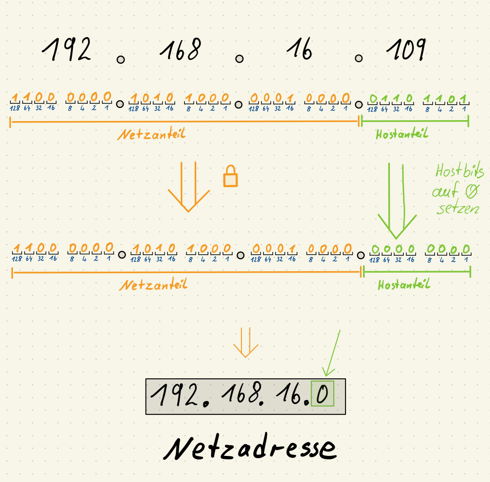
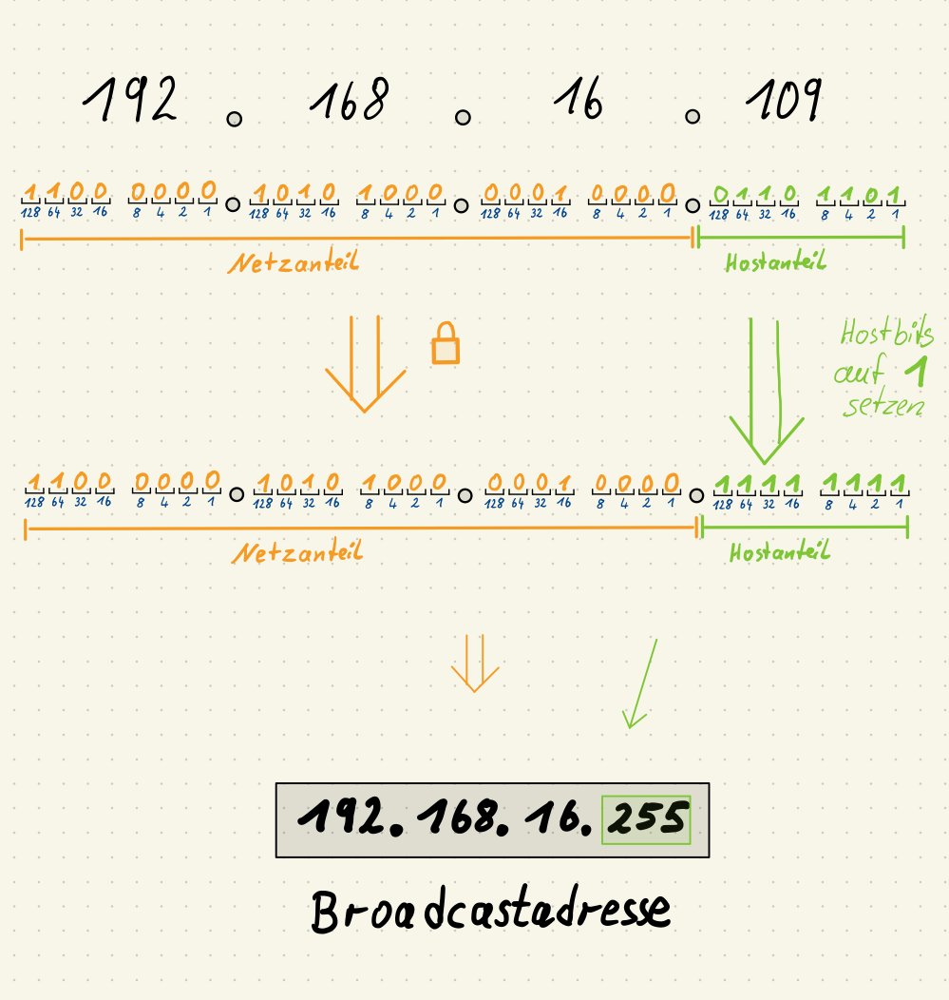
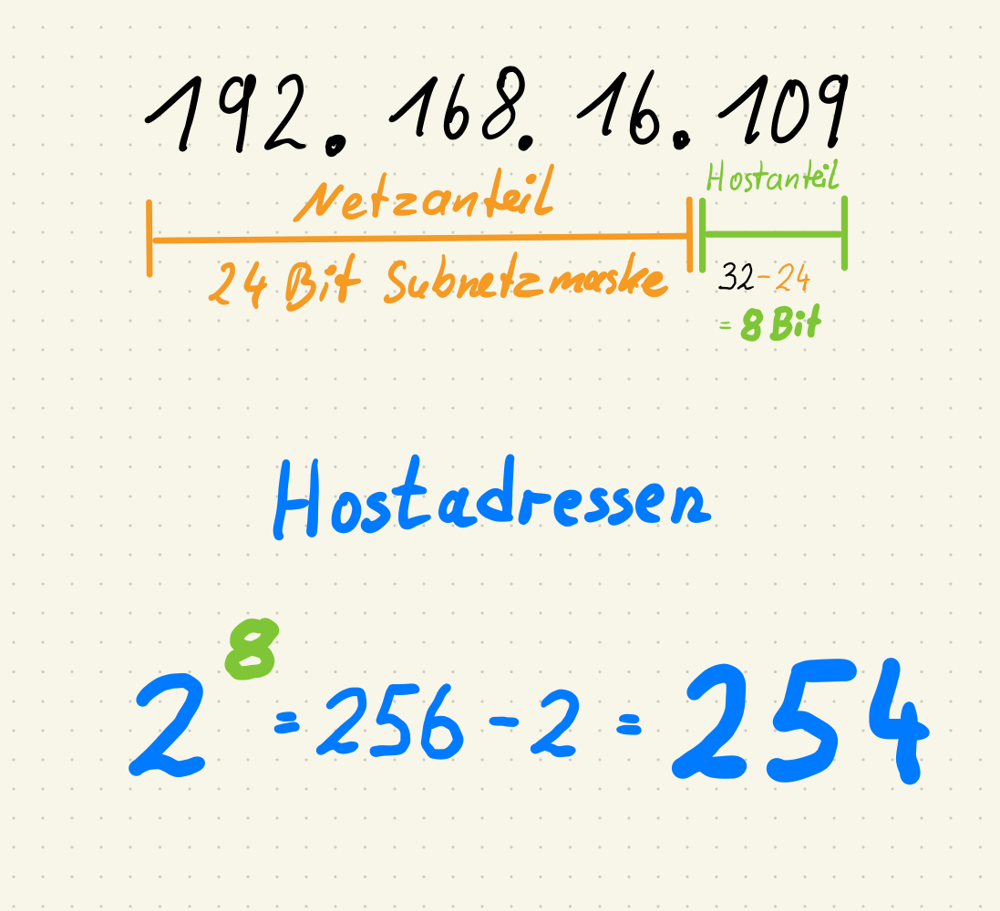
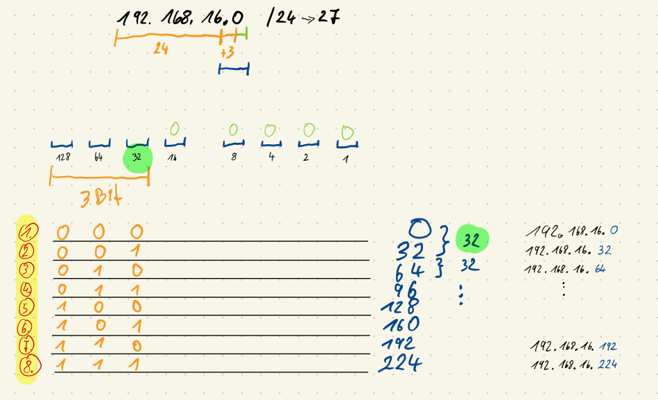
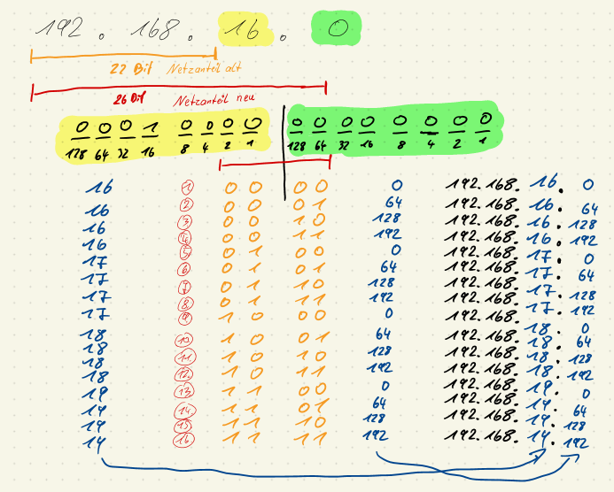

<!--
author:   Günter Dannoritzer
email:    g.dannoritzer@wvs-ffm.de
version:  1.4.2
date:     10.05.2024
language: de
narrator: Deutsch Female

comment:  Internetprotokoll Version 4 (IPv4); Aufbau der Adresse, Subnetzwerkmaske, 
            Gateway, Berechnung von Netzwerkgrößen; OSI-Schicht 3

logo:     02_img/logo-ipv4.png

tags:     LiaScript, IPv4, Gateway, IP-Header, ICMP, Trace Route

link:     https://cdn.jsdelivr.net/chartist.js/latest/chartist.min.css

script:   https://cdn.jsdelivr.net/chartist.js/latest/chartist.min.js

-->

# Internetprotokoll Version 4 (IPv4)

Auf der OSI-Schicht 3, der Vermittlungsschicht (Network Layer), wird das Internetprotokoll verwendet. Die weltweite Verbreitung fand unter der Version 4 (IPv4) statt. Mittlerweile findet eine Umstellung auf die Protokollvariante 6 (IPv6) statt. In diesem Dokument wird die Version 4 beschrieben.

Die IPv4-Adresse ist 32-Bit groß und wird in der sogenannten dezimal-gepunkteten Notation (engl. Decimal-Dotted-Notation - DDN) dargestellt. Ein Beispiel einer Adresse ist **`192.168.16.109`**. Jeweils 8-Bit (Oktett) werden Punkte-getrennt als Dezimalwert dargestellt.

Die Konfiguration eines Netzwerkknotens enthält mindestens die Parameter:

 * IP-Adresse, z.B. `192.168.16.109`
 * Subnetzmaske, z.B. `255.255.255.0`

Die **Subnetzmaske** bestimmt, wie groß ein Netzwerk ist, was bedeutet, welche IP-Adressen zu einem Netzwerk gehören. Sie wird auch in der dezimal-gepunkteten Notation geschrieben und beschreibt über gesetzte Bits, welche Bits der IP-Adresse zur Netzwerkadresse gehören. Als alternative Schreibweise wird die Anzahl der gesetzten Bits in einer Suffix-Schreibweise an die IP-Adresse gehängt.

Beispiel, die Subnetzmaske `255.255.255.0`, umgerechnet in eine binäre Form ist:

 `1111 1111 . 1111 1111 . 1111 1111 . 0000 0000`

Von links gezählt sind es 24-Bits, die auf eins gesetzt sind. Damit ist die alternative Schreibweise der IP-Adresse mit Suffix-Schreibweise der Subnetzmaske:

  * `192.168.16.109/24`

Ein Netzwerk setzt sich zusammen aus:

 * Netzwerkadresse; die erste Adresse im Adressbereich des Netzwerks
 * Hostadressen; die Adressen für die Netzwerkknoten in dem Netzwerk
 * Broadcastadresse; die letzte Adresse in dem Netzwerk

## Berechnung eines Netzwerks

Die Vorgehensweise, ein Netzwerk zu berechnen, ist:

 1. Netzanteil bestimmen
     --> Größe der Subnetzmaske (Suffix z.B. /24)
 2. Netzadresse bestimmen
     --> alle Hostbits auf 0 setzen
 3. Broadcastadresse bestimmen
     --> alle Hostbits auf 1 setzen
 4. Anzahl der Hostadressen bestimmen
     --> $2^ {Hostbits}-2$
     --> Hostbits = 32 - Subnetzgröße


Beispiel, für die IP-Adresse `192.168.16.109/24` soll das Netzwerk berechnet werden.

### 1. Netzanteil bestimmen

Für die IP-Adresse `192.168.16.109/24` soll der Netzanteil bestimmt werden. Dazu werden von links 24-Bit markiert. Rechnerisch wird die IP-Adresse mit der Subnetzmaske binär UND-verknüpft.

```
192.168.16.109
|---------|
  24-Bit
```

### 2. Netzadresse bestimmen




### 3. Broadcastadresse bestimmen



### 4. Anzahl der Hostadressen bestimmen



### Zusammenfassung

 * IP-Adresse: `192.168.16.109/24`
 * Netzadresse: `192.168.16.0`

   * Hostadresse 1: `192.168.16.1`
   * ...
   * Hostadresse 254: `192.168.16.254`

 * Broadcastadresse: `192.168.16.255`

# Übung Netzwerk berechnen

Berechnen Sie:

 * Netzwerkadresse
 * Anzahl der Hostadressen
 * Broadcastadresse

für folgende IP-Adressen:

 1. `192.168.16.109/24`
 2. `192.168.16.109/22`
 3. `192.168.16.109/26`

## Lösung zu 1.

 * Netzwerkadresse: 192.168.16.0
 * Anzahl der Hostadressen: $2^{(32-24)=8} = 256 - 2 = 254$
 * Broadcastadresse: 192.168.16.255

## Lösung zu 2.

 * Netzwerkadresse: 192.168.16.0
 * Anzahl der Hostadressen: $2^{(32-22)=10} = 1024 - 2 = 1022$
 * Broadcastadresse: 192.168.19.255

## Lösung zu 3.

 * Netzwerkadresse: 192.168.16.64
 * Anzahl der Hostadressen: $2^{(32-26)=6} = 64 - 2 = 62$
 * Broadcastadresse: 192.168.16.127

# Netzwerk aufteilen in N-Subnetze

Hier wird beschrieben, wie ein gegebenes IP-Netzwerk in N-Subnetzwerke aufgeteilt wird, wobei N = 2, 4, 8, 16, etc. ist.

Aufgabe: Das Netzwerk `192.168.16.0/24` soll in N=8 Subnetzwerke aufgeteilt werden.

Vorgehen:

 * Neue Netzwerkmaske bestimmen
 * Die Netzgröße bestimmen
 * Mit der neuen Netzwerkmaske die N=8 Netzwerkadressen bestimmen.
 

 ## Neue Netzwerkmaske für N=8 Subnetzwerke berechnen

Die neue Subnetzmaske muss vergrößert werden. Der Wert x berechnet sich basierend auf dem Wert N. Es gilt:

$$2^x = N$$

Stellt man die Formel um, erhält man die Berechnung:

$$ x = \text{log}_2(N)$$

$\text{log}_2$ ist der Binärlogarithmus oder der Logarithmus zur Basis 2. Wenn der Taschenrechner diesen nicht berechnen kann, ist es auch möglich, eine andere Logarithmusfunktion zu verwenden. Als Beispiel ist der natürliche Logarithmus zur Basis mit der Zahl e `ln` in der Regel bei allen Taschenrechnern verfügbar. Die Berechnung ändert sich dann zu:

$$x = \frac{\text{ln}(N)}{\text{ln}(2)}$$

Für die Aufteilung in N=8 Subnetzwerke ergibt die Berechnung:

$$x = \text{log}_2(8) = 3$$

Die ursprüngliche Subnetzmaske wird also um 3-Bit vergrößert.

Die neue Subnetzmaske: 24 + **3** = 27

## Die Netzgröße bestimmen

Mit der neuen Subnetzmaske 27-Bit ergibt sich die Anzahl der Hostbits:

32 - 27 = 5-Bit

Anzahl der Hostadressen:

$$2^5 = 32 - 2 = 30$$

## Die neuen Netzwerkadressen bestimmen

Das Netzwerk wird in 8 Subnetzwerke unterteilt und damit gibt es 8 Netzwerkadresse. Diese 8 Adressen ergeben sich aus den 3 neuen Bits von der Vergrößerung der Subnetzmaske von 24 auf 27 Bits. Diese Vergrößerung findet im letzten Oktett der Adresse statt.



Für die Netzwerkadresse werden die Hostbits (0-4) auf null gesetzt. Die 8 Werte des letzten Oktetts werden also durch die Bits 5 bis 7 bestimmt, die die Werte 32, 64 und 128 haben. Daraus ergeben sich die 8 Werte für das letzte Oktett von 0, 32, 64, 96, 128, 160, 192, 224.

Beachtenswert ist der Sprung der Werte, der immer 32 entspricht, siehe grüne Markierung. Das ist der Wert des niederwertigsten Bits (Bit 5) der Netzwerkadresse.

# Netzwerk aufteilen in N-Subnetzwerke über Oktettgrenzen

Bei der Unterteilung des Netzwerks `192.168.16.0/24` in 8 Subnetzwerke begrenzte sich die Veränderung des Netzwerks auf das letzte Oktett.

Hier soll eine Unterteilung durchgeführt werden, die sich über zwei Oktetts erstreckt.

Das Netzwerk `192.168.16.0/22` soll in 16 Subnetzwerke aufgeteilt werden.

## Neue Netzwerkmaske für N=16 Subnetzwerke berechnen

$$x = \text{log}_2(16) = 4$$

Die ursprüngliche Subnetzmaske `/22` liegt im dritten Oktett. Mit der Vergrößerung der Maske $22 + 4 = 26$ Bit vergrößert sich die Netzadresse bis ins vierte Oktett.

## Die Netzgröße bestimmen

Die Anzahl der Hostadressen berechnet sich aus:

$$2^6 = 64 - 2 = 62$$

## Die neuen Netzwerkadressen bestimmen

In der Abbildung ist die alte Subnetzmaske orange eingezeichnet. Sie erstreckt sich bis zum zweiten Bit im dritten Oktett, hier gelb hinterlegt. Die niederwertigsten zwei Bits im dritten Oktett gehören nach der alten Subnetzmaske noch zum Hostanteil.

Die neue Subnetzmaske ist rot eingezeichnet. Durch die Zunahme um vier Bits verschiebt sich die Subnetzmaske vom dritten Oktett in das vierte Oktett der IP-Adresse, hier grün hinterlegt.



Für die 16 Subnetze berechnen sich die 16 Netzadresse durch Variation der vier Bits. In der Abbildung sind die 16 Netzadressen durch die roten Zahlen (1) bis (16) dargestellt.

Im dritten Oktett ergeben sich für die Netzadressen:

 * (1) bis (4) der Wert 16
 * (5) bis (9) der Wert 17
 * (10) bis (12) der Wert 18
 * (13) bis (16) der Wert 19

Im vierten Oktett ergeben sich die Werte:

 * (1) = 0
 * (2) = 64
 * (3) = 128
 * (4) = 192

Das Muster wiederholt sich für (5) bis (9), (10) bis (12) und (13) bis (16). Bemerkenswert, wie im vorherigen Abschnitt, ist die Differenz zwischen den Werten wieder der Wert des niederwertigsten Bits, hier 64.


# Internet Header Format

Das IP-Protokoll hat wie schon der Ethernet-Rahmen eine feste Struktur der Datenelemente. Im Gegensatz zum Ethernet wird von Paketen und nicht von Rahmen gesprochen. Das folgende Diagramm zeigt die Paketstruktur eines IP-Paketes, die im RFC791 festgelegt wird.

````
     +-----------+---------------------+
     | IP Header |   User data         |
     +-----------+---------------------+
````

Im IP-Header werden die nötigen Informationen gespeichert, um das Paket zu versenden.


# IP Header

Gemäß RFC791 ist der IP-Header wie folgt aufgebaut:

````
    0                   1                   2                   3
    0 1 2 3 4 5 6 7 8 9 0 1 2 3 4 5 6 7 8 9 0 1 2 3 4 5 6 7 8 9 0 1
   +-+-+-+-+-+-+-+-+-+-+-+-+-+-+-+-+-+-+-+-+-+-+-+-+-+-+-+-+-+-+-+-+
   |Version|  IHL  |Type of Service|          Total Length         |
   +-+-+-+-+-+-+-+-+-+-+-+-+-+-+-+-+-+-+-+-+-+-+-+-+-+-+-+-+-+-+-+-+
   |         Identification        |Flags|      Fragment Offset    |
   +-+-+-+-+-+-+-+-+-+-+-+-+-+-+-+-+-+-+-+-+-+-+-+-+-+-+-+-+-+-+-+-+
   |  Time to Live |    Protocol   |         Header Checksum       |
   +-+-+-+-+-+-+-+-+-+-+-+-+-+-+-+-+-+-+-+-+-+-+-+-+-+-+-+-+-+-+-+-+
   |                       Source Address                          |
   +-+-+-+-+-+-+-+-+-+-+-+-+-+-+-+-+-+-+-+-+-+-+-+-+-+-+-+-+-+-+-+-+
   |                    Destination Address                        |
   +-+-+-+-+-+-+-+-+-+-+-+-+-+-+-+-+-+-+-+-+-+-+-+-+-+-+-+-+-+-+-+-+
   |                    Options                    |    Padding    |
   +-+-+-+-+-+-+-+-+-+-+-+-+-+-+-+-+-+-+-+-+-+-+-+-+-+-+-+-+-+-+-+-+

                    Example Internet Datagram Header
````

Die Zahlen in der oberen Reihe beschreiben die Anzahl der Bits; ganz links startet Bit 0 und ganz rechts Bit 31. In der ersten Zeile wird z.B. das **Versionsfeld** beschrieben, dessen Größe 4 Bit ist, von Bit 0 bis Bit 3.

Die folgende Tabelle beschreibt die Felder des Headers und deren Bedeutung.


| Feld | Beschreibung | Größe |
|------|--------------|-----------|
| Version: | Version des IP-Protokolls (v4 oder v6) | 4 Bit |
| IHL: | IP Header Length; Länge des Headers | 4 Bit |
| Type of Service (ToS):| Wird u.a. für Quality of Service (Priorisierung) verwendet | 8 Bit |
| Total Length: | Länge des gesamten Pakets (Header + Daten) | 16 Bit |
| Identification: | Zur Identifikation des Fragements | 16 Bit |
| DF: | Don't Fragment Flag; Paket soll nicht geteilt werden | 1 Bit |
| MF: | More Fragments; es folgen weitere Fragmente | 1 Bit |
| Fragment Offset: | Markiert die Stelle des Fragments | 13 Bit |
| Time to Live: | Zeit, die ein Paket existieren darf; max 255s | 8 Bit |
| Protocol: | Kennung des Transport-Protokolls (Schicht 4, z.B. TCP o. UDP) | 8 Bit |
| Header Checksum: | Sicherung des Headers | 16 Bit |
| Source Address: | IP-Adresse des Absenders | 32 Bit |
| Destination Address: | IP-Adresse des Empfängers | 32 Bit |
| Options: | Möglichkeit zur Erweiterung; kann, muss aber nicht unterstützt werden. z.B. Option „Security“ kann theoretisch zur Kennzeichnung geheimer Infos verwendet werden | Variabel;vgl. IHL |


Im Folgenden sollen ausgewählte Felder und deren Funktion genauer besprochen werden.


## Quell- und Zieladresse (Source/Destination Address)

Grundlegende Funktion, um das IP-Paket an sein Ziel zu bringen, ist die Adressierung. Die Quell- und die Zieladresse sind die wichtigsten Parameter dafür. Auf der Reise durch das Internet verändern sich die beiden Parameter in der Regel nicht.

Bemerkenswert ist, dass eine Subnetzmaske nicht mit dem IP-Paket gesendet wird. Sie ist ein Parameter, der nur innerhalb der Netzwerkknoten konfiguriert ist.

## Time to Live (TTL)

Netzwerkschleifen können zu kreisenden Paketen führen, die zu Problemen im Netzwerk führen. Daher ist es nötig, einen Mechanismus zu haben, mithilfe dessen kreisende Pakete aus dem Netzwerk entfernt werden. Im Internet wird dazu der **Time to Live**-Wert (TTL) verwendet.
Jedes Mal, wenn ein IP-Paket einen Netzknoten passiert, wird der TTL-Wert um eins erniedrigt. Ist der Wert auf null reduziert, wird das Paket verworfen.

## Fragmentierung (DF, MF, Fragment Offset)

IP-Pakete sind in der Regel auf ein Transportnetzwerk angewiesen. Im LAN-Bereich ist das in der Regel das Ethernet. Ethernetrahmen können nur eine bestimmte Größe an Nutzdaten transportieren. Standardmäßig sind 1500 Byte eine Grenze. IP-Pakete können jedoch viel größer werden. Der Wert **Total-Length** beschreibt die Größe des gesamten IP-Pakets und der maximale Wert kann $2^{16} = 65.535$ Bytes (Oktett) groß sein.

Um so ein großes Paket mit Ethernet zu übertragen, muss das IP-Paket aufgeteilt werden. Der Fachbegriff dazu ist **Fragmentierung**. Der **Fragment Offset** beschreibt dabei die Position (Versatz vom Anfang) eines IP-Pakets. Zusätzlich gibt es die Flags:

 * DF - Don't Fragment - dieses Paket darf nicht aufgeteilt werden
 * MF - More Fragments - es folgen noch weitere Fragmente, die zu einem Gesamtpaket zusammengesetzt werden müssen

# Übung Ping und Traceroute

Mit dem Tool `ping` und `traceroute` soll die Laufzeit eines IP-Pakets über eine längere Strecke und die Zwischenstationen ermittelt werden.

Als Ziel soll die Webseite der Regierung von Tonga dienen, die unter dem Domänennamen [www.gov.to](www.gov.to) erreichbar ist. Auf Google-Maps ist [Tonga findbar](https://www.google.de/maps/place/Tonga/@-21.1716063,163.7017822,4z/data=!4m15!1m8!3m7!1s0x7193b644bb9fd01d:0xf36dcccac55ee2a9!2sTonga!3b1!8m2!3d-21.178986!4d-175.198242!16zL20vMDdmYjY!3m5!1s0x7193b644bb9fd01d:0xf36dcccac55ee2a9!8m2!3d-21.178986!4d-175.198242!16zL20vMDdmYjY?entry=ttu).

```
ping www.gov.to
PING www.gov.to (175.176.147.36) 56(84) bytes of data.
64 bytes from 175.176.147.36 (175.176.147.36): icmp_seq=1 ttl=50 time=414 ms
64 bytes from 175.176.147.36 (175.176.147.36): icmp_seq=2 ttl=50 time=410 ms
64 bytes from 175.176.147.36 (175.176.147.36): icmp_seq=3 ttl=50 time=431 ms
```

Aus Europa gestartet, beträgt die Laufzeit ca 400 ms.

Die ursprüngliche Definition von Time To Live ist, dass der Wert einmal pro Sekunde reduziert werden muss oder wenn ein Router passiert wird, was als Hop bezeichnet wird. Mit der Strecke von Europa nach Tonga ist die Paketlaufzeit gerade mal 400 ms. Daher ist die Funktion hauptsächlich ein Hop-Count.

Um die Strecke der verwendeten Router zu ermittlen, wird ein Ping mit steigenden TTL-Werten verwendet. Der erste Router wird ermittelt, indem der TTL-Wert auf 1 gesetzt wird. Der erste Router (Hop) reduziert den TTL-Wert zu null, muss damit das Paket verwerfen und meldet den Verwurf an die Quelladresse. Damit erlangt das Ping-Kommando die Information des ersten Routers.

```
ping -t 1 www.gov.to
PING www.gov.to (175.176.147.36) 56(84) bytes of data.
From fritz.box (192.168.178.1) icmp_seq=1 Time to live exceeded


ping -t 2 www.gov.to
PING www.gov.to (175.176.147.36) 56(84) bytes of data.
From p12345678.dip0.t-ipconnect.de (62.155.246.196) icmp_seq=1 Time to live exceeded
```

Um das ganze abzukürzen, gibt es das Kommando `traceroute`, das genau die Schritte wiederholt, bis das Ziel erreicht ist:

```
traceroute --resolve-hostname www.gov.to
traceroute to www.gov.to (175.176.147.36), 64 hops max
  1   192.168.178.1 (fritz.box)  2,287ms  1,556ms  2,309ms 
  2   62.155.246.196 (p12345678.dip0.t-ipconnect.de)  9,754ms  5,843ms  5,138ms 
  3   217.5.67.154 (f-ed12-i.F.DE.NET.DTAG.DE)  8,820ms  8,784ms  8,569ms 
  4   80.150.170.131 (80.150.170.131)  22,768ms  21,243ms  21,552ms 
  5   130.117.1.118 (be3187.ccr42.fra03.atlas.cogentco.com)  17,543ms  16,385ms  16,732ms 
  6   130.117.3.66 (be5160.ccr41.ams03.atlas.cogentco.com)  22,800ms  21,528ms  21,826ms 
  7   154.54.56.93 (154.54.56.93)  111,801ms  110,097ms  108,202ms 
  8   154.54.60.14 (be3488.ccr52.lhr01.atlas.cogentco.com)  198,984ms  112,938ms  112,507ms 
  9   154.54.47.145 (be4283.ccr32.bos01.atlas.cogentco.com)  106,568ms  106,823ms  160,212ms 
 10   66.28.4.237 (66.28.4.237)  204,988ms  130,440ms  112,120ms 
 11   154.54.6.221 (be2717.ccr41.ord01.atlas.cogentco.com)  196,007ms  183,672ms  204,909ms 
 12   154.54.6.221 (be2717.ccr41.ord01.atlas.cogentco.com)  114,156ms  193,046ms  113,431ms 
 13   154.54.31.89 (be3036.ccr22.den01.atlas.cogentco.com)  193,182ms  262,304ms  206,145ms 
 14   154.54.42.97 (be3038.ccr32.slc01.atlas.cogentco.com)  189,847ms  192,075ms  204,903ms 
 15   154.54.2.197 (be2085.ccr21.sea02.atlas.cogentco.com)  204,116ms  204,902ms  204,964ms 
 16   154.54.86.110 (be2029.ccr22.sea02.atlas.cogentco.com)  208,729ms  186,208ms  203,955ms 
 17   154.54.31.158 (be2216.ccr51.pdx02.atlas.cogentco.com)  176,891ms  244,746ms  204,845ms 
 18   154.54.31.158 (be2216.ccr51.pdx02.atlas.cogentco.com)  210,188ms  198,906ms  204,966ms 
 19   154.54.47.229 (be3588.ccr71.syd01.atlas.cogentco.com)  409,341ms  401,072ms  404,847ms 
 20   154.18.98.18 (tongacable.demarc.cogentco.com)  409,263ms  389,952ms  352,661ms 
 21   *  *  * 
 22   *  *  * 
 23   103.245.162.6 (103.245.162.6)  378,883ms  409,624ms  408,577ms 
 24   *  *  * 
 25   *  *  * 

```
Auf der Webseite https://stefansundin.github.io/traceroute-mapper/ kann die Ausgabe von traceroute auf einer Weltkarte dargestellt werden.

# Hex-Dump-Analyse

Die Hex-Dump-Analyse eines Netzwerkverkehrs wird z.B. von Administratoren dazu genutzt, um Fehler im Netzwerk zu analysieren. Ein beispielhaftes Problem ist, dass die Namensauflösung im Netzwerk nicht funktioniert oder eine einfache IP-Verbindung nicht zustande kommt. Für Anwendungsentwickler ist beispielhaft das Reverse-Engineering von Protokollen oder auch die Implementierung von Protokollen basierend auf Standards in Bibliotheken ein Anwendungsgebiet.

Hier soll beispielhaft die manuelle Decodierung eines IP-Pakets beschrieben werden.

Aufgabe:

 * Bestimmen Sie die **Quell-** und **Zieladresse** aus dem Netzwerkmitschnitt eines IP-Pakets.


````
Bytes  Nachrichteninhalt
0000   45 00 00 5e 9a e5 40 00  40 06 1d 89 c0 a8 00 c8
0010   c0 a8 00 13 a8 6a 01 bd  6d 1c b9 ef ba 93 f0 93
0020   80 18 01 5a b3 4e 00 00  01 01 08 0a 00 44 e5 00
0030   05 d1 69 09
````

## Hex-Dump erklärt

Der Name **Hex-Dump** stammt aus der Darstellung von Zahlen in **hexadezimaler Schreibweise**. Für jede Stelle einer hexadezimalen Zahl können die 16 Ziffern 0-9 und a-f verwendet werden. Bei einem Hex-Dump werden die Zahlen in der Regel in Byte-Größe, also 8-Bit, angegeben. Dazu werden zwei hexadezimale Ziffern verwendet.

Die erste Zeile des Hex-Dumps im Detail:

````
0000   45 00 00 5e 9a e5 40 00  40 06 1d 89 c0 a8 00 c8
````

In der linken Spalte wird die Bytenummer der ersten Zahl beschrieben, auch hexadezimal. Die erste Zahl ist **45** und das ist das nullte Byte. Daneben steht das Byte Nummer 0001, die Bytenummer wird aber nicht mehr mit angegeben. In der Zeile sind 16 Datenbytes; das letzte Datenbyte mit dem Wert **c8** hat also die Bytenummer **000f**.

In der zweiten Zeile hat das erste Datenbyte **c0** also die Bytenummer **000f + 1 = 0010**.


## Das Schema der Daten

Um jetzt zu verstehen, was die Datenbytes alles bedeuten, muss das Schema bekannt sein. Hier ist es ein IPv4-Paket und oben im Dokument wurde das im RFC791 veröffentlichte Schema gezeigt. In dem Schema werden immer 32-Bit pro Zeile dokumentiert, das entspricht 4 Byte.
Verknüpft man das Schema mit den Daten, kann man sagen, aus der ersten Zeile des Hex-Dumps werden in den ersten 4 Bytes die Felder des Schemas dargestellt.


````
0000   45 00 00 5e ... 
    0                   1                   2                   3
    0 1 2 3 4 5 6 7 8 9 0 1 2 3 4 5 6 7 8 9 0 1 2 3 4 5 6 7 8 9 0 1
   +-+-+-+-+-+-+-+-+-+-+-+-+-+-+-+-+-+-+-+-+-+-+-+-+-+-+-+-+-+-+-+-+
   |Version|  IHL  |Type of Service|          Total Length         |
   +-+-+-+-+-+-+-+-+-+-+-+-+-+-+-+-+-+-+-+-+-+-+-+-+-+-+-+-+-+-+-+-+
````

Die nächsten vier Bytes werden in der zweiten Zeile des Schemas
dargestellt    

````
0000   .. .. .. .. 9a e5 40 00  .. .. .. .. .. .. .. ..

    0                   1                   2                   3
    0 1 2 3 4 5 6 7 8 9 0 1 2 3 4 5 6 7 8 9 0 1 2 3 4 5 6 7 8 9 0 1
   +-+-+-+-+-+-+-+-+-+-+-+-+-+-+-+-+-+-+-+-+-+-+-+-+-+-+-+-+-+-+-+-+
   |         Identification        |Flags|      Fragment Offset    |
   +-+-+-+-+-+-+-+-+-+-+-+-+-+-+-+-+-+-+-+-+-+-+-+-+-+-+-+-+-+-+-+-+
````

Die dritte Zeile des Schemas entspricht wie folgt.

````
0000   .. .. .. .. .. .. .. ..  40 06 1d 89 .. .. .. ..

    0                   1                   2                   3
    0 1 2 3 4 5 6 7 8 9 0 1 2 3 4 5 6 7 8 9 0 1 2 3 4 5 6 7 8 9 0 1
   +-+-+-+-+-+-+-+-+-+-+-+-+-+-+-+-+-+-+-+-+-+-+-+-+-+-+-+-+-+-+-+-+
   |  Time to Live |    Protocol   |         Header Checksum       |
   +-+-+-+-+-+-+-+-+-+-+-+-+-+-+-+-+-+-+-+-+-+-+-+-+-+-+-+-+-+-+-+-+
````
  
Schließlich werden die Quell- und Zieladresse hier dargestellt.

 
````
0000   .. .. .. .. .. .. .. ..  .. .. .. .. c0 a8 00 c8
0010   c0 a8 00 13 .. .. .. ..  .. .. .. .. .. .. .. ..

   +-+-+-+-+-+-+-+-+-+-+-+-+-+-+-+-+-+-+-+-+-+-+-+-+-+-+-+-+-+-+-+-+
   |                       Source Address                          |
   +-+-+-+-+-+-+-+-+-+-+-+-+-+-+-+-+-+-+-+-+-+-+-+-+-+-+-+-+-+-+-+-+
   |                    Destination Address                        |
   +-+-+-+-+-+-+-+-+-+-+-+-+-+-+-+-+-+-+-+-+-+-+-+-+-+-+-+-+-+-+-+-+
````

## Quell- und Zieladresse extrahieren

Vom vorherigen Beispiel ist zu sehen, dass:

 * Source Address: `c0 a8 00 c8`
 * Destination Address: `c0 a8 00 13`

Jetzt werden aber IPv4-Adressen in dezimaler Form aufgeschrieben. Die Umrechnung sieht dann folgendermaßen aus.

### Quelladresse berechnet

Die hexadezimale Form der Quelladresse ist `c0.a8.00.c8`. Die einzelnen hexadezimalen Zahlen ins Dezimale umgerechnet ergibt:


 * `c0` = 12 (c) * 16 + 0 = 192
 * `a8` = 10 (a) * 16 + 8 = 168
 * `00` = 0
 * `c8` = 12 (c) * 16 + 8 = 200

Die IP-Adresse lautet also `192.168.0.200`

### Zieladresse berechnet

Entsprechend lautet die Zieladresse `c0.a8.00.13`:

 
 * `c0` = 12 (c) * 16 + 0 = 192
 * `a8` = 10 (a) * 16 + 8 = 168
 * `00` = 0
 * `13` = 1 * 16 + 3 = 19 

Die IP-Adresse lautet also `192.168.0.19`

# Aufgabe

 1. Bestimmen Sie den Versionswert des Paketes.
 2. Bestimmen Sie, über wie viele Netzwerkknoten das Paket auf seinem Weg zum Ziel noch gesendet werden kann, bevor es verworfen wird (Time to Live).


# Quellen

IPv4-Logo: https://en.wikipedia.org/wiki/IP_address