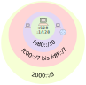

<!--
author:   Günter Dannoritzer
email:    g.dannoritzer@wvs-ffm.de
version:  1.4.1
date:     28.04.2024
language: de
narrator: Deutsch Female

comment:  Internetprotokoll Version 6 (IPv4); Aufbau der Adresse; OSI-Schicht 3

logo:     02_img/logo-ipv6.jpg

tags:     LiaScript

link:     https://cdn.jsdelivr.net/chartist.js/latest/chartist.min.css

script:   https://cdn.jsdelivr.net/chartist.js/latest/chartist.min.js

-->

# Internetprotokoll Version 6 (IPv6)

Das massive Wachstum des Internets und die dadurch entstandenen Probleme in den 1990er-Jahren haben die Entwicklung eines neuen Internetprotokolls vorangetrieben. Insbesondere die begrenzte Anzahl an IP-Adressen mit der Version 4 des Internetprotokolls hat zu einer schrittweisen Einführung des neuen Protokolls geführt.

Da die Versionsnummer 5 schon für eine Streamingvariante des Protokolls verwendet wurde, kamen die neuen Funktionen als Version 6 daher.

In Stichworten sind die wichtigsten Verbesserungen von IPv6 im Vergleich zu IPv4:

 * Vergrößerung und hierarchische Strukturierung des IP-Adressraums
   (128-Bit vs. 32 Bit für die Adresse)
 * Verbesserung der Header-Struktur
 * Gültigkeitsbereich von IP6-Adressen
 * Autokonfiguration
 * Verbesserung der Sicherheit
 * Default Minimum-MTU-Größe von 1280 Byte (vs. 576 Byte bei IP4)


# Darstellung von IPv6 Adressen

Da eine IPv6-Adresse im Gegensatz zu IPv4-Adressen 128 Bit lang ist, würde eine dezimale Schreibweise zu sehr langen Adressinformationen führen. Man hat sich daher für eine hexadezimale Schreibweise entschieden. Bei IPv6-Adressen werden jeweils 4 Hexadezimalzahlen zu einem Block zusammengefasst. Eine Hexadezimalziffer entspricht 4 Bit. Demnach stellt ein Block 16 Bit bzw. 2 Byte dar. Da insgesamt 16 Byte darzustellen sind, werden 8 Blöcke benötigt. Zur besseren Lesbarkeit werden die Blöcke mit einem Doppelpunkt voneinander getrennt. Im Folgenden werden weitere Regeln und einige Beispiele von IPv6-Adressen vorgestellt.

Beispiel einer IPv6-Adresse:

`adcf:0005:0000:0000:0000:0000:0600:fedc`

## Verbindliche Notationsregeln nach RFC 5952

Bei der maschinenbezogenen Nutzung und Darstellung wird von der sogenannten *kompaktifizierten IPv6-Adresse* Gebrauch gemacht. Ziel ist es, die lange Schreibweise abzukürzen. Die Regeln, nach denen diese Schreibweise gebildet wird, sind wie folgt:

 1. Alle alphabetischen Zeichen (Buchstaben a, b, c, d, e, f) werden grundsätzlich kleingeschrieben.
 2. Alle führenden Nullen eines Blocks werden grundsätzlich weggelassen.

    * `0000` -> `0`; `0005` -> `5`; `0600` -> `600`
    * `adcf:0005:0000:0000:0000:0000:0600:fedc` --> `adcf:5:0:0:0:0:600:fedc`

 3. Einer oder mehrere aufeinanderfolgende 4er-Nullerblöcke werden durch zwei Doppelpunkte ("::") gekürzt.

    * `adcf:5:0:0:0:0:600:fedc` --> `adcf:5::600:fedc`

 4. Die Kürzung zu zwei Doppelpunkten ("::") darf nur einmal durchgeführt werden und muss die längste Anzahl an 4er-Blöcken mit Nullen kürzen. Sollten zwei 4er-Blöcke mit gleicher Anzahl von Nullen vorhanden sein, wird die linke Gruppe gekürzt.

    * `2001:0:0:1:0:0:0:2` --> `2001:0:0:1::2`
    * `127f:5:0:0:127:0:0:fedc` --> `127f:5::127:0:0:fedc`


## Übung: IPv6-Adressen nach RFC 5952 kürzen

 * `2001:0db8:3c4d:0016:0000:0000:2a3f:2a4d` -> [[2001:db8:3c4d:16::2a3f:2a4d]]
 * `2001:0000:0000:0000:0002:0000:0000:0001` -> [[2001::2:0:0:1]]
 * `2001:0db8:0000:0000:f065:00ff:0000:04ec` -> [[2001:db8::f065:ff:0:4ec]]
 * `1080:0000:0000:0000:0007:0700:0004:316b` -> [[1080::7:700:4:316b]]
 * `2001:0db8:0000:0000:08d3:0000:0000:0000` -> [[2001:db8:0:0:8d3::]]
 

## Übung: Gekürzte IPv6-Adressen erweitern

 * `ff02::1` -> [[ff02:0000:0000:0000:0000:0000:0000:0001]]
 * `2001:0:0:3f::` -> [[2001:0000:0000:003f:0000:0000:0000:0000]]
 * `ff06:0:1::c3` -> [[ff06:0000:0001:0000:0000:0000:0000:00c3]]
 * `fc08::2:0:3` -> [[fc08:0000:0000:0000:0000:0002:0000:0003]]
 * `2022::fc:2` -> [[2022:0000:0000:0000:0000:0000:00fc:0002]]

# Vorstellung vom Umfang der verfügbaren Adressen

Das *Réseaux IP Européens Network Coordination Centre* (RIPE NCC) ist u.a. für die Vergabe von IP-Adressen in Europa zuständig[^RIPE]. Es hat im November 2019 bekannt gegeben, dass die letzten IPv4-Adressen vergeben wurden.

[^RIPE]: https://www.ripe.net/manage-ips-and-asns/ipv4/ipv4-run-out/

Eine Motivation für die Entwicklung von IPv6 war es, dass die Adressen nicht so schnell ausgehen. Um eine Vorstellung von dem Umfang der Adressen zu erhalten, kann der Film von *Sunny Classroom* einen Eindruck geben.

!?[Sunny Classroom: Kürzen von IPv6-Adressen; Umfang des Adressbereichs](https://youtu.be/O4LrtBS3laQ)

In dem Film wird auf eine [Google-Webseite](https://www.google.de/intl/en/ipv6/statistics.html) verwiesen, auf der Google eine Statistik veröffentlicht, wie viele Nutzer die Google-Webseite mit IPv6 aufrufen. Im Jahr 2024 waren weltweit 45 % der Aufrufe mit IPv6.

# IPv6-Adresspräfix

Das von IPv4 bekannte Adressschema `\<IP-Adresse\>/\<Länge der Subnetzmaske\>`, als Beispiel, `192.168.16.109/24` wird mit IPv6 erweitert. Die Schreibweise heißt `\<IP-Adresse\>/\<Präfixlänge\>`, als Beispiel `2003::/16`. Der IPv4-Begriff *Subnetzmaske* wird bei IPv6 durch *Präfixlänge* ersetzt und beschreibt den festen Teil der Adresse.

Die folgenden drei Adresspräfixe mit `/4`, `/8` und `/16`-Bit zeigen, wie der zugehörige Adressbereich aussieht. Das `x` zeigt die flexible Stelle des Adressbereichs.

 * `2004::/4` -> `2xxx:xxxx:xxxx:xxxx:xxxx:xxxx:xxxx:xxxx`
 * `2004::/8` -> `20xx:xxxx:xxxx:xxxx:xxxx:xxxx:xxxx:xxxx`
 * `2004::/16` -> `2004:xxxx:xxxx:xxxx:xxxx:xxxx:xxxx:xxxx`

Die von IPv4 bekannten Begriffe von *Netzwerkadresse* und *Broadcastadresse* gibt es bei IPv6 nicht mehr. Anstelle der Netzwerkadresse gibt es jetzt das **Adresspräfix**. Der Broadcast wird bei IPv6 mithilfe von Multicastadressen realisiert.

# Gültigkeitsbereich der Adressen (Scope)

Der enorme Adressraum wird unterteilt in Bereiche (Scopes) mit unterschiedlicher Gültigkeit.

 * Host-Scope
 * Link-Local-Scope
 * Unique-Local-Scope
 * Global-Scope
 * Multicast-Scope

Die Abbildung verdeutlicht den Scope vom Rechner ausgehend, der schalenförmig sich ausbreitet.



Die wichtigsten Gültigkeitsbereiche sind:

 * **Host-Scope**: Diese Adressen sind nur auf dem lokalen Host gültig und können nicht von anderen Hosts im Netzwerk verwendet werden. Die IPv6-Loopback-Adresse `::1/128` oder die unspezifische Adresse `::/128` gehört zu dem Bereich, der nur auf einem Host genutzt werden kann.
 * `fe80::/10` - **Link-Local-Scope**: Diese Adressen sind nur im lokalen Netzwerk (z.B. einem WLAN) gültig und dürfen nicht geroutet werden.
 * `fc00::/7` bis `fdff::/7` - **Unique-Local-Scope**: Diese Adressen sind global eindeutig, aber nicht im öffentlichen Internet geroutet. Sie können für private Netzwerke verwendet werden. Adressen mit dem Präfix `fc` werden vom Provider vergeben, die mit dem Präfix `fd` können im eigenen Netzwerk verwendet werden.
 * **Global-Scope**: Diese Adressen sind im öffentlichen Internet geroutet und können weltweit verwendet werden.
 * `ff::/8` - **Multicast-Scope**: Diese Adressen werden für die Kommunikation mit einer Gruppe von Empfängern verwendet. Sie ersetzen u.a. die von IPv4 bekannten Broadcastadressen.


# IPv6-Header

Ein IP-Paket ist aufgebaut nach dem allgemeinen Schema:

````
+-----------+-------------+
| IP-Header |  Data field |
+-----------+-------------+
````

Der [RFC8200](https://datatracker.ietf.org/doc/html/rfc8200) beschreibt den Aufbau des IPv6-Headers. Durch die 128 Bit IPv6-Adresse, die als Quell- und Zieladresse in einem IP-Paket zweimal vorhanden sein muss, übertrifft die Größe des Headers schon alleine durch die Adressen den 20 Byte großen IPv4-Header. Um eine effiziente Übertragung zu erhalten, wurde der Header modularisiert. Das bedeutet, dass es einen Header mit den minimalen Information gibt, die für die Übertragung nötig sind. Um weitere Informationen, wenn nötig mit aufnehmen zu können, wird ein Erweitungsheader (**Extension Header**) hinzugefügt.

````
   +-+-+-+-+-+-+-+-+-+-+-+-+-+-+-+-+-+-+-+-+-+-+-+-+-+-+-+-+-+-+-+-+
   |Version| Traffic Class |           Flow Label                  |
   +-+-+-+-+-+-+-+-+-+-+-+-+-+-+-+-+-+-+-+-+-+-+-+-+-+-+-+-+-+-+-+-+
   |         Payload Length        |  Next Header  |   Hop Limit   |
   +-+-+-+-+-+-+-+-+-+-+-+-+-+-+-+-+-+-+-+-+-+-+-+-+-+-+-+-+-+-+-+-+
   |                                                               |
   +                                                               +
   |                                                               |
   +                         Source Address                        +
   |                                                               |
   +                                                               +
   |                                                               |
   +-+-+-+-+-+-+-+-+-+-+-+-+-+-+-+-+-+-+-+-+-+-+-+-+-+-+-+-+-+-+-+-+
   |                                                               |
   +                                                               +
   |                                                               |
   +                      Destination Address                      +
   |                                                               |
   +                                                               +
   |                                                               |
   +-+-+-+-+-+-+-+-+-+-+-+-+-+-+-+-+-+-+-+-+-+-+-+-+-+-+-+-+-+-+-+-+
````

| Feld | Bedeutung |
|------|-----------|
| Version | 4 Bit, für IPv4 = 4 für IPv6 = 6|
| Traffic Class | 8 Bit Der [RFC2474 Differentiated Services Field (DS Field)](https://datatracker.ietf.org/doc/html/rfc2474) beschreibt Verkehrsklassen und wie diese bei der Überlastung von Verbindungen behandelt werden sollen. Zeitkritische Daten wie z.B. Telefonie werden verworfen, zeitunkritische Daten werden zwischengespeichert und später weitergeleitet.  |
| Flow Label  | 20 Bit großes Label, mit dem eine Reihe von Paketen gemäß [RFC6437](https://datatracker.ietf.org/doc/html/rfc6437) zu einem Flow zusammengefasst werden können. |
| Payload Length  | 16 Bit -> maximal 65536 Oktetts kann das dem Header folgende Datenfeld groß sein. |
| **Next Header** | 8 Bit legen fest, welcher Header in dem Datenfeld folgt. Die [Protokollnummern werden von der IANA festgelegt](https://www.iana.org/assignments/protocol-numbers/protocol-numbers.xhtml). |
| **Hop Limit** | 8 Bit Wert, der beim Übergang über einen Router verringert wird. |
| Source Address | 128 Bit Quelladresse, von der das Paket losgesendet wurde. |
| Destination Address | 128 Bit Zieladresse, an die das Paket gesendet werden soll. |

Das **Hop Limit** wurde von dem *Time-To-Live (TTL)*-Wert von IPv4 abgeleitet und reduziert sich jetzt nur noch auf die Anzahl der Router. Bei jedem Routerübergang wird der Wert um eins verringert. Ein Router, der den Wert auf null setzt, verwirft das Paket und sendete ein ICMP-Paket mit der Meldung *Time Exceeded* an die Quelladresse des verworfenen Pakets zurück.

## Extension Header (Next Header)

Um den Header so klein wie nötig zu halten, wurden Parameter, die nicht für jedes Paket nötig sind, in sogenannte Erweiterungs-Header (Extension Header) ausgelagert. Der RFC8200 spezifiziert die sechs Extension Headers:

 * Hop-by-Hop Options
 * Fragment
 * Destination Options
 * Routing
 * Authentication
 * Encapsulating Security Payload

Das **Next Header**-Feld kann jetzt einen der sechs Erweiterungsheaders oder ein anderes Protokoll, wie unter ["Protokollnummern der IANA"](https://www.iana.org/assignments/protocol-numbers/protocol-numbers.xhtml) festgelegt verwendet werden.

Beispiel für Protokollnummern sind:

| Protokollnummer | Bezeichnung |
|-----------------|-----------------------------|
| 6 |  TCP |
| 17 | UDP |
| 0 | IPv6 Hop-by-Hop Options |
| 44 | IPV6 Fragment |
| 60 | IPv6 Destination Options |
| 43 | IPv6 Routing |
| 51 | IPv6 Authentication |
| 50 | IPv6 Encapsulating Security Payload |
| 58 | IPv6-ICMP |

Die folgende Abbildung kommt aus dem RFC8200 und zeigt drei mögliche Verkettungen von Header:

 1. IPv6 Header -> TCP
 2. IPv6 Header -> Routing ->  TCP
 1. IPv6 Header -> Routing -> Fragment -> TCP

````
   +---------------+------------------------
   |  IPv6 header  | TCP header + data
   |               |
   | Next Header = |
   |      TCP      |
   +---------------+------------------------

   +---------------+----------------+------------------------
   |  IPv6 header  | Routing header | TCP header + data
   |               |                |
   | Next Header = |  Next Header = |
   |    Routing    |      TCP       |
   +---------------+----------------+------------------------

   +---------------+----------------+-----------------+-----------------
   |  IPv6 header  | Routing header | Fragment header | fragment of TCP
   |               |                |                 |  header + data
   | Next Header = |  Next Header = |  Next Header =  |
   |    Routing    |    Fragment    |       TCP       |
   +---------------+----------------+-----------------+-----------------
````

# Neighbour Discovery Protocol (NDP)

Das **Neighbour Discovery Protocol** nutzt ICMPv6-Nachrichten, um im Link-Lokalen-Bereich Nachrichten zu versenden. Damit werden u.a. die im IPv4-Ablauf verwendete ARP-Funktion ersetzt. Beschrieben im [RFC 4861](https://datatracker.ietf.org/doc/html/rfc4861) stellt das Protokoll folgende Funktionen zur Verfügung:


 * Router Discovery: How hosts locate routers that reside on an
                attached link.
 * Prefix Discovery: How hosts discover the set of address prefixes
                that define which destinations are on-link for an
                attached link.  (Nodes use prefixes to distinguish
                destinations that reside on-link from those only
                reachable through a router.)
 * Parameter Discovery: How a node learns link parameters (such as the
                link MTU) or Internet parameters (such as the hop limit
                value) to place in outgoing packets.
 * Address Autoconfiguration: Introduces the mechanisms needed in
                order to allow nodes to configure an address for an
                interface in a stateless manner.
 * Address resolution: How nodes determine the link-layer address of
                an on-link destination (e.g., a neighbor) given only the
                destination's IP address.
 * Next-hop determination: The algorithm for mapping an IP destination
                address into the IP address of the neighbor to which
                traffic for the destination should be sent.  The next-
                hop can be a router or the destination itself.
 * Neighbor Unreachability Detection: How nodes determine that a
                neighbor is no longer reachable.  For neighbors used as
                routers, alternate default routers can be tried.  For
                both routers and hosts, address resolution can be
                performed again.
 * Duplicate Address Detection: How a node determines whether or not
                an address it wishes to use is already in use by another
                node.
 * Redirect:  Ein Router informiert einen Host über einen besseren First-Hop-Knoten.

Dazu werden fünf ICMPv6-Typen spezifiziert:

 1. Router Solicitation: When an interface becomes enabled, hosts may
                send out Router Solicitations that request routers to
                generate Router Advertisements immediately rather than
                at their next scheduled time.

 2. Router Advertisement: Routers advertise their presence together
                with various link and Internet parameters either
                periodically, or in response to a Router Solicitation
                message.  Router Advertisements contain prefixes that
                are used for determining whether another address shares
                the same link (on-link determination) and/or address
                configuration, a suggested hop limit value, etc.

 3. Neighbor Solicitation: Sent by a node to determine the link-layer
                address of a neighbor, or to verify that a neighbor is
                still reachable via a cached link-layer address.
                Neighbor Solicitations are also used for Duplicate
                Address Detection.

 4. Neighbor Advertisement: A response to a Neighbor Solicitation
                message.  A node may also send unsolicited Neighbor
                Advertisements to announce a link-layer address change.

 5. Redirect:  Used by routers to inform hosts of a better first hop
                for a destination.


