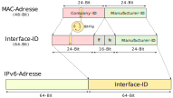

<!--
author:   Günter Dannoritzer
email:    g.dannoritzer@wvs-ffm.de
version:  0.2.0
date:     22.03.2024
language: de
narrator: Deutsch Female

comment:  Internetprotokoll Version 6 (IPv4); Aufbau der Adresse; OSI-Schicht 3

logo:     02_img/logo-ipv6.jpg

tags:     LiaScript

link:     https://cdn.jsdelivr.net/chartist.js/latest/chartist.min.css

script:   https://cdn.jsdelivr.net/chartist.js/latest/chartist.min.js

-->

# Internetprotokoll Version 6 (IPv6)

Das massive Wachstum des Internets und die dadurch entstandenen Probleme in den 90er-Jahren des letzten Jahrhunderts haben die Entwicklung eines neuen Internetprotokolls vorangetrieben. Insbesondere die begrenzte Anzahl an IP-Adressen mit der Version 4 des Internetprotokolls hat zu einer schrittweisen Einführung des neuen Protokolls geführt.

Da die Versionsnummer 5 schon für eine Streamingvariante des Protokolls verwendet wurde, kamen die neuen Funktionen als Version 6 daher.

In Stichworten sind die wichtigsten Verbesserungen von IPv6 im Vergleich zu IPv4:

 * Vergrößerung und hierarchische Strukturierung des IP-Adressraums
   (128-Bit vs. 32 Bit für die Adresse)
 * Verbesserung der Header-Struktur
 * Gültigkeitsbereich von IP6-Adressen
 * Autokonfiguration
 * Verbesserung der Sicherheit
 * Default Minimum-MTU-Größe von 1280 Byte (vs. 576 Byte bei IP4)

# Darstellung von IPv6 Adressen

Da eine IPv6-Adresse im Gegensatz zu IPv4-Adressen 128 Bit lang ist, würde eine dezimale Schreibweise zu sehr langen Adressinformationen führen. Man hat sich daher für eine hexadezimale Schreibweise entschieden. Bei IPv6-Adressen werden jeweils 4 Hexadezimalzahlen zu einem Block zusammengefasst. Eine Hexadezimalziffer entspricht 4 Bit. Demnach stellt ein Block 16 Bit bzw. 2 Byte dar. Da insgesamt 16 Byte darzustellen sind, werden 8 Blöcke benötigt. Zur besseren Lesbarkeit werden die Blöcke mit einem Doppelpunkt voneinander getrennt. Im Folgenden werden weitere Regeln und einige Beispiele von IPv6-Adressen vorgestellt.

Beispiel einer IPv6-Adresse:

`adcf:0005:0000:0000:0000:0000:0600:fedc`

## Verbindliche Notationsregeln nach RFC 5952

Bei der maschinenbezogenen Nutzung und Darstellung wird von der sogenannten *kompaktifizierten IPv6-Adresse* Gebrauch gemacht. Ziel ist es, die lange Schreibweise abzukürzen. Die Regeln, nach denen diese Schreibweise gebildet wird, sind wie folgt:

 1. Alle alphabetischen Zeichen (Buchstaben a, b, c, d, e, f) werden grundsätzlich kleingeschrieben.
 2. Alle führenden Nullen eines Blocks werden grundsätzlich weggelassen.
     * 0000 -> 0; 0005 -> 5; 0600 -> 600
     * `adcf:0005:0000:0000:0000:0000:0600:fedc`
       * `adcf:5:0:0:0:0:600:fedc`
 3. Einer oder mehrere aufeinanderfolgende 4er-Nullerblöcke werden durch zwei Doppelpunkte ("::") gekürzt.
     * `adcf:5:0:0:0:0:600:fedc`
       * `adcf:5::600:fedc`
 4. Die Kürzung zu zwei Doppelpunkten ("::") darf nur einmal von links beginnend durchgeführt werden.
     * `127f:5:0:0:127:0:0:fedc`
       * `127f:5::127:0:0:fedc`

# Vorstellung vom Umfang der verfügbaren Adressen

Das *Réseaux IP Européens Network Coordination Centre* (RIPE NCC) ist u.a. für die Vergabe von IP-Adressen in Europa zuständig[^RIPE]. Es hat im November 2019 bekannt gegeben, dass die letzten IPv4-Adressen vergeben wurden.

[^RIPE]: https://www.ripe.net/manage-ips-and-asns/ipv4/ipv4-run-out/

Eine Motivation für die Entwicklung von IPv6 war es, dass die Adressen nicht so schnell ausgehen. Um eine Vorstellung von dem Umfang der Adressen zu erhalten, kann der Film von *Sunny Classroom* einen Eindruck geben.

!?[Sunny Classroom: Kürzen von IPv6-Adressen; Umfang des Adressbereichs](https://youtu.be/O4LrtBS3laQ)

# IPv6-Adresspräfix

Das von IPv4 bekannte Adressschema `\<IP-Adresse\>/\<Länge der Subnetzmaske\>`, als Beispiel, `192.168.16.109/24` wird mit IPv6 erweitert. Die Schreibweise heißt `\<IP-Adresse\>/\<Präfixlänge\>`, als Beispiel `2003::/16`. Der IPv4-Begriff *Subnetzmaske* wird bei IPv6 durch *Präfixlänge* ersetzt und beschreibt den festen Teil der Adresse.

Die folgenden drei Adresspräfixe mit `/4`, `/8` und `/16`-Bit zeigen, wie der zugehörige Adressbereich aussieht. Das `x` zeigt die flexible Stelle des Adressbereichs.

 * `2004::/4` -> `2xxx:xxxx:xxxx:xxxx:xxxx:xxxx:xxxx:xxxx`
 * `2004::/8` -> `20xx:xxxx:xxxx:xxxx:xxxx:xxxx:xxxx:xxxx`
 * `2004::/16` -> `2000:xxxx:xxxx:xxxx:xxxx:xxxx:xxxx:xxxx`

Die von IPv4 bekannten Begriffe von *Netzwerkadresse* und *Broadcastadresse* gibt es bei IPv6 nicht mehr. Anstelle der Netzwerkadresse gibt es jetzt das **Adresspräfix**. Der Broadcast wird bei IPv6 mithilfe von Multicastadressen realisiert.

# Gültigkeitsbereich der Adressen (Scope)

Der enorme Adressraum wird unterteilt in Bereiche (Scopes) mit unterschiedlicher Gültigkeit.

 * Host-Scope
 * Link-Local-Scope
 * Unique-Local-Scope
 * Global-Scope
 * Multicast-Scope

Die wichtigsten Gültigkeitsbereiche:

 * **Host-Scope**: Diese Adressen sind nur auf dem lokalen Host gültig und können nicht von anderen Hosts im Netzwerk verwendet werden. Die IPv6-Loopback-Adresse `::1/128` oder die unspezifische Adresse `::/128` gehört zu dem Bereich, der nur auf einem Host genutzt werden kann.
 * `fe80::/10` - **Link-Local-Scope**: Diese Adressen sind nur im lokalen Netzwerk (z.B. einem WLAN) gültig und dürfen nicht geroutet werden.
 * `fc00::/7` bis `fdff::/7` - **Unique-Local-Scope**: Diese Adressen sind global eindeutig, aber nicht im öffentlichen Internet geroutet. Sie können für private Netzwerke verwendet werden. Adressen mit dem Präfix `fc` werden vom Provider vergeben, die mit dem Präfix `fd` können im eigenen Netzwerk verwendet werden.
 * **Global-Scope**: Diese Adressen sind im öffentlichen Internet geroutet und können weltweit verwendet werden.
 * `ff::/8` - **Multicast-Scope**: Diese Adressen werden für die Kommunikation mit einer Gruppe von Empfängern verwendet. Sie ersetzen u.a. die von IPv4 bekannten Broadcastadressen.

# Interface-ID in IPv6-Adressen

Um ein IP-Paket über das LAN zu versenden, muss das Paket in einen Ethernetrahmen gepackt werden. Um bei IPv4 die zur Ziel-IP-Adresse gehörige MAC-Adresse zu ermitteln, wird das Address Resolution Protocol (ARP) verwendet. Mithilfe einer festen Zuordnung von IP-Adresse zur MAC-Adresse kann auf die ARP-Funktion verzichtet werden. Mithilfe der **Interface-ID** wird eine IPv6-Adresse basierend auf der zugehörigen MAC-Adresse des Interfaces gebildet.

# Aufgabe

Sie analysieren die IPv6-Adresse `fe80::521a:c5ff:fef2:38b7`.

Nennen Sie die folgenden zugehörigen Werte:

 * Länge der IPv6-Adresse in Bits: [[128]]
 * Ungekürzte Darstellung der IPv6-Adresse in Hexadezimalschreibweise: [[fe80:0000:0000:0000:521a:c5ff:fef2:38b7]]
 * Präfixlänge: [[64]] Bits.
 * Interface-Identifier: [[521a:c5ff:fef2:38b7]]

 (IT-Berufe, IHK-Abschlussprüfung Teil 1 Frühjahr 2024)

 # IPv6-Header