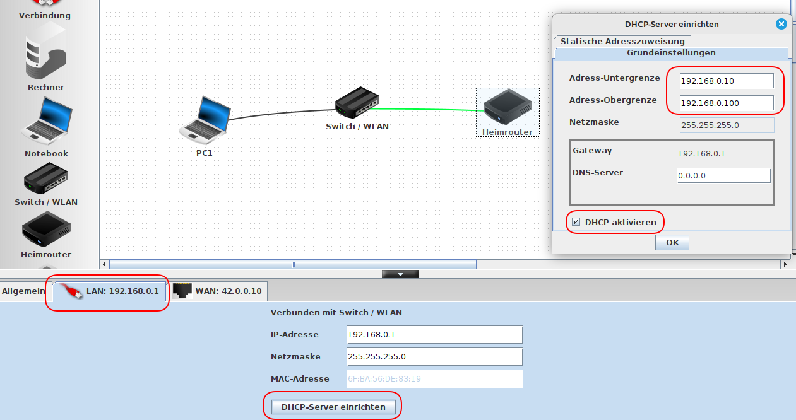
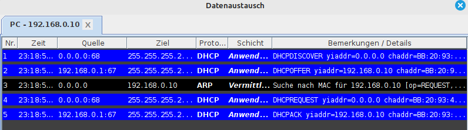
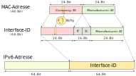
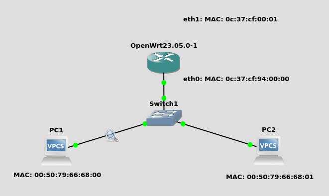

<!--
author:   Günter Dannoritzer
email:    g.dannoritzer@wvs-ffm.de
version:  1.8.3
date:     11.11.2024
language: de
narrator: Deutsch Female

comment:  IP Adresskonfiguration; DHCP, SLAAC; OSI-Schicht 3; Multicast

icon:    https://raw.githubusercontent.com/dsp77/wvs-liascript/0938e2e0ce751e270e3e36b8ecfeb09044a41aa0/wvs-logo.png
logo:     02_img/logo-dhcp-slaac.jpg

tags:     LiaScript

link:     https://cdn.jsdelivr.net/chartist.js/latest/chartist.min.css

script:   https://cdn26sdelivr.net/chartist.js/latest/chartist.min.js

attribute: Lizenz: [CC BY-SA](https://creativecommons.org/licenses/by-sa/4.0/)
-->

# IP Adresskonfiguration

Jeder Netzwerkknoten benötigt eine IP-Konfiguration. Die Adresse kann manuell konfiguriert oder automatisch zugeordnet werden. Um ein Netzwerk mit vielen Netzwerkknoten zu konfigurieren, wird häufig eine automatische Konfiguration durchgeführt. Für IPv4 gibt es das **Dynamic Host Configuration Protocol (DHCP)**, das auch für IPv6 spezifiziert wurde. Für IPv6 gibt es zusätzlich das **Stateless Address Autoconfiguration (SLAAC)**.

# Dynamic Host Configuration Protocol (DHCP)

Das **Dynamic Host Configuration Protocol (DHCP)** wird verwendet, um in einem IP-basierten Netzwerk die Konfiguration von Netzwerkteilnehmern durchzuführen. Neben der **IP-Adresse** kann u.a. auch die **Netzwerkmaske**, der **DNS-Server**, der **Zeitserver** oder das **Gateway** konfiguriert werden.

Das Protokoll basiert auf dem Client-/Server-Modell und der Protokollablauf wird in einem 4-Schritt-Verfahren durchgeführt, das mit dem Wort "DORA" beschrieben werden kann. Dabei steht jeder Buchstabe von "DORA" für einen Protokollschritt.

Die folgende Abbildung beschreibt den Protokollablauf.


Der Client beginnt mit dem **Discover**, um eine IP-Konfiguration zu erhalten. Wenn ein Server im Netzwerk verfügbar ist und eine Konfiguration anbieten kann, wird dieser mit einem **Offer** eine Konfiguration anbieten. Wenn der Client die Konfiguration akzeptiert, wird er mit einem **Request** dies bestätigen. Dabei sendet er auch wieder die angebotene Konfiguration mit. Sollten weitere DHCP-Server ein Offer abgegeben haben, werden sie das mit dem Request wieder freigeben für einen anderen Client. Der ausgewählte DHCP-Server wird schließlich mit einem **Acknowledge** bestätigen, dass die Konfiguration jetzt für den Client reserviert ist.

Auf der Serverseite besteht die Möglichkeit, das Vergabeverfahren der Konfiguration mit den folgenden drei Einstellungen zu konfigurieren.

 * Manuelle Zuordnung
 * Automatische Zuordnung
 * Dynamische Zuordnung


## Manuelle Zuordnung (Static Allocation)

Bei der manuellen Zuordnung wird im Server eine Zuordnungsliste von IP-zu-MAC-Adressen konfiguriert. Konfigurierte MAC-Adressen erhalten bei der Anfrage die fest zugeordnete IP-Adresse zugewiesen.

Vorteil: Die Computer erhalten immer die gleiche IP-Adresse und nur bekannte MAC-Adressen erhalten IP-Adressen.

Nachteil: Jeder neue Computer, der eine IP-Adresse erhalten soll, muss erst manuell im DHCP-Server konfiguriert werden.


## Automatische Zuordnung (Automatic Allocation)

Für die automatische Zuordnung wird im DHCP-Server ein IP-Adressbereich konfiguriert, der den Clients zugewiesen wird. Der Server merkt sich bei der Vergabe der IP-Adressen die zugehörige MAC-Adresse und reserviert die IP-Adresse nach der ersten Vergabe bis auf Weiteres für diese MAC-Adresse.

Vorteil: Auch hier erhalten Computer immer die gleiche IP-Adresse. Es muss keine manuelle Konfiguration neuer Computer durchgeführt werden.

Nachteil: Durch die feste Vergabe kann der Adressbereich vergeben sein und neue Computer erhalten dann keine Adresse mehr. 

## Dynamische Zuordnung (Dynamic Allocation)

Bei der dynamischen Zuordnung wird wie bei der automatischen ein IP-Adressbereich konfiguriert. Hier wird jedoch bei der Vergabe nicht die MAC-Adresse fest zugeordnet. Stattdessen wird eine sogenannte **Lease-Time** festgelegt, nach der die Vergabe der Konfiguration ausläuft. Mit dem **Acknowledge** teilt der Server dem Client mit, nach welcher Zeit seine Konfiguration die Gültigkeit verliert. Zusätzlich erhält er eine **Renewal-Time** und eine **Rebind-Time**.


 * Renewal-Time = $\frac{1}{2}$ (Lease-Time)
 * Rebind-Time = $\frac{7}{8}$ (Lease-Time)

Nach der **Renewal-Time** beginnt der Client, mit einem **Request** direkt (Unicast) an den Server gerichtet nachzufragen, ob er die Konfiguration verlängern kann. Der Server kann das mit einem **Acknowledge** bestätigen und damit wird die Lease-Time erneuert.

Wurde der Server z.B. abgeschaltet und antwortet nicht, beginnt der Client nach der **Rebind-Time** mit einem Broadcast einen **Request** in das Netz zusenden, um von einem anderen Server die Konfiguration bestätigt und verlängert zu bekommen. Findet das nicht statt, wird er
nach der **Lease-Time** seine Konfiguration verwerfen und beginnt, mit einem **Discover** wieder nach einer neuen Konfiguration zu fragen.


## DHCP-Relay

Um über Routergrenzen hinweg die Konfiguration mithilfe von DHCP zu nutzen, benötigen die Router einen sogenannten **DHCP-Relay-Agent**, um die DHCP-Pakete weiterzuleiten.

## Ausfallsicherheit

Ausfallsicherheit kann z.B. durch zwei DHCP-Server erreicht werden. Dazu muss der zu vergebende Adressbereich auf die beiden Server aufgeteilt werden. Bei konkurrierendem **Offer** der beiden Server wird der Client, dass ihm schneller erreichende **Offer** akzeptieren.

## DHCP Parameter

Die [Internet Assigned Numbers Authority (IANA)](www.iana.org) dokumentiert in dem Dokument ["Dynamic Host Configuration Protocol (DHCP) and Bootstrap Protocol (BOOTP) Parameters"](https://www.iana.org/assignments/bootp-dhcp-parameters/bootp-dhcp-parameters.xhtml) mögliche Parameter, die mit DHCP konfiguriert werden können.

Hierbei handelt es sich um konfigurierbare Parameter, die ein DHCP-Server an DHCP-Clients im Netzwerk weitergeben kann. Diese Optionen liefern zusätzliche Informationen und Konfigurationseinstellungen, die für den Client-Betrieb notwendig sind, jenseits der einfachen IP-Adresszuweisung.

Allgemeine Informationen:

Zweck: DHCP-Optionen ermöglichen die Anpassung der Netzwerkkonfiguration für verschiedene Client-Typen und Umgebungen.
Funktionsweise: Optionen werden als Code-Wert-Paare definiert und in DHCP-Nachrichten zwischen Server und Client übertragen.
Standardisierung: Die Definition und Zuweisung von DHCP-Optionen wird durch RFCs (Request for Comments) geregelt.

Beispiele für gängige DHCP-Optionen:

 * Option 1: Subnetzmaske
 * Option 3: Router-Adresse
 * Option 6: DNS-Server-Adresse
 * Option 42: NTP-Server-Adresse
 * Option 150: TFTP-Server-Adresse
 * Option 153: Domain-Name-Server (DNS) Suchdomain

Detaillierte Beschreibungen der Optionen 1, 3, 6 und 42:

### Option 1: Subnetzmaske

Zweck: Definition der Subnetzmaske für das IP-Netzwerk, dem der Client angehört.
Wert: 32-Bit-Binärzahl, die die Subnetzmaske des Netzwerks repräsentiert.

### Option 3: Router-Adresse

Zweck: Angabe der IP-Adresse des Standard-Gateways für den Client.
Wert: Einzelne IP-Adresse des Routers, der den Datenverkehr zwischen dem Client und anderen Netzen weiterleitet.

### Option 6: DNS-Server-Adresse

Zweck: Bereitstellung der IP-Adressen von DNS-Servern, die der Client zur Namensauflösung verwenden kann.
Wert: Liste von IP-Adressen von DNS-Servern, getrennt durch Leerzeichen.

### Option 42: NTP-Server

Zweck: Bereitstellung der IP-Adressen von NTP-Servern (Network Time Protocol) zur Zeitsynchronisation des Clients.
Wert: Liste von IP-Adressen von NTP-Servern, getrennt durch Leerzeichen, in bevorzugter Reihenfolge.
DHCP-Optionen für PXE-Boot

### PXE (Preboot Execution Environment) 

PXE nutzt DHCP-Optionen, um Informationen an Client-Geräte bereitzustellen, die von einem PXE-Server booten möchten. Diese Optionen enthalten Konfigurationsdetails für den Boot-Prozess und steuern den Ablauf des Netzwerkstarts.

Übermittelte Optionen sind z.B. der TFTP-Server, von dem ein Betriebssystem-Image geladen werden soll, und der Pfad und Name des zu ladenden Images.

Weitere Informationen liefert z.B. der Wikipediaartikel zu [Preboot Execution Environment](https://de.wikipedia.org/wiki/Preboot_Execution_Environment)

## DHCPv6

Für die IP-Adressvergabe hat IPv6 einen eigenen Mechanismus, jedoch sind die konfigurierbaren Parameter nicht so umfangreich, wie es mit DHCP möglich ist. Daher gibt es seit 2003 den [**RFC 8415**](https://www.rfc-editor.org/rfc/rfc8415.html), in dem beschrieben ist, wie die Konfiguration von DHCP auch über IPv6 möglich ist.

# Übung zu DHCP mit Filius

Mit der [Netzwerksimulationssoftware Filius](https://www.lernsoftware-filius.de) soll eine Netzwerksimulation zur Konfiguration eines PCs mithilfe von DHCP erfolgen. Die folgende Abbildung zeigt die Konfiguration.



Für den PC muss die Konfiguration auf:

 * [x] DHCP zur Konfiguration verwenden

 gesetzt werden. Als DHCP-Server wird der Heimrouter verwendet. Auf der LAN-Schnittstelle, rot hinterlegt, wird der DHCP-Server eingerichtet. Als IP-Adressbereich wird eingestellt:

  * Address-Untergrenze: `192.168.0.10`
  * Address-Obergrenze: `192.168.0.100`

Als Gateway ist die IP-Adresse des LAN-Interfaces des Heimrouters automatisch eingetragen. Der DNS-Server wird erst mal leer gelassen.



Über den Netzwerkmitschnitt des PC1 kann der Datenaustausch mit dem `Discover`, `Offer`, `Request`und `Acknowledge` zu sehen.


# Stateless Address Autoconfiguration (SLAAC)

Der DHCP-Server speichert den Status, welcher Host welche IP-Adresse erhält. Daher wird der Ablauf auch als Stateful Address Autoconfiguration bezeichnet.

Für IPv6 beschreibt der [RFC 4862](https://www.rfc-editor.org/rfc/rfc4862) das **Statless Address Autoconfiguration (SLAAC)**, das ohne Server auskommt, um eine Autokonfiguration durchzuführen.


# Interface-ID für Link-Local-Adressen

Um ein IP-Paket über das LAN zu versenden, muss das Paket in einen Ethernetrahmen gepackt werden. Um bei IPv4 die zur Ziel-IP-Adresse gehörige MAC-Adresse zu ermitteln, wird das Address Resolution Protocol (ARP) verwendet. Mithilfe einer festen Zuordnung von IP-Adresse zur MAC-Adresse kann auf die ARP-Funktion verzichtet werden. Es werden folgende drei Methoden dazu verwendet:

 * IEEE Extended Unique Identifier (EUI-64)
 * mit einem zufälligen Bitmuster
 * mithilfe manueller Konfiguration

## IEEE Extended Unique Identifier

Mithilfe der **Interface-ID** wird eine IPv6-Adresse basierend auf der zugehörigen MAC-Adresse des Interfaces gebildet.

Die folgende Abbildung zeigt die Schritte, um von einer dem Interface zugehörigen 48-Bit großen MAC-Adresse die 64-Bit große Interface-ID und daraus die IPv6-Adresse zu bilden.



Zu bemerken ist das Bit 41 der MAC-Adresse, das sich im ersten Oktett der MAC-Adresse befindet. Es bestimmt, ob es sich um eine weltweit eindeutige oder eine im lokalen Netzwerk lokal vergebene MAC-Adresse handelt. Dieses Bit wird für die Bildung der Interface-ID umgedreht (flipped). Ein gesetztes Bit wird gelöscht oder ein gelöschtes Bit wird gesetzt. Bei einer eindeutigen MAC-Adresse entsprechen die ersten 24 Bits der sogenannten Company-ID, die der Herstellerfirma vom IEEE zugewiesen wird. Die MAC-Adresse wird an der Grenze aufgesplittet und die 16-Bit `ff fe` werden eingefügt. So werden aus den 48 Bit der MAC-Adresse die 64 Bit der Interface-ID.

Das folgende Beispiel zeigt die Schritte anhand des Adresspräfixes `fe80:0000:0000:0000::/32`.

````
Adresspräfix: fe80:0000:0000:0000::/32
Interface MAC-Adresse: 01:02:03:04:05:06

Bit-41: 01 -> 0000 0001
                     ^
Bit-41 invertiert: 0000 0011 -> 03

MAC-Adresse mit Bit-41-Flip: 03:02:03:04:05:06

Interface-ID: 03:02:03:ff:fe:04:05:06

IP-Adresse: fe80:0000:0000:0000:0302:03ff:fe04:0506
````

# Aufgabe

Sie analysieren die IPv6-Adresse `fe80::521a:c5ff:fef2:38b7`.

Nennen Sie die folgenden zugehörigen Werte:

 * Länge der IPv6-Adresse in Bits: [[128]]
 * Ungekürzte Darstellung der IPv6-Adresse in Hexadezimalschreibweise: [[fe80:0000:0000:0000:521a:c5ff:fef2:38b7]]
 * Präfixlänge: [[64]] Bits.
 * Interface-Identifier: [[521a:c5ff:fef2:38b7]]

 (IT-Berufe, IHK-Abschlussprüfung Teil 1 Frühjahr 2024)

# IP-Multicast

Multicastadressen haben den Präfix `ff::/8`. Analog zu dem Scope von IPv6-Adressen sind auch Multicastadressen in Scopes aufgeteilt:

 * `ff01::/16` gilt nur im lokalen Interface
 * `ff02::/16` gilt nur im Link-Local-Scope

Über vorbestimmte Multicastgruppen können bestimmte Ziele erreicht werden:

 * `ff0X::1` : hierüber sind alle Netzknoten erreichbar
 * `ff0X::2` : hierüber sind alle Rouer erreichbar

Um z.B. alle Computer im lokalen Netzwerk zu erreichen kann unter Linux folgender Ping ausgeführt werden:

````
ping6 -c 5 ff02::1 -I eth0
ping6: Warning: source address might be selected on device other than: eth0
PING ff02::1(ff02::1) from :: eth0: 56 data bytes
64 bytes from fe80::2c7a:1f59:905:c65%eth0: icmp_seq=1 ttl=64 time=0.038 ms
64 bytes from fe80::464e:6dff:fe20:892b%eth0: icmp_seq=1 ttl=64 time=3.21 ms
64 bytes from fe80::18a7:aea4:7e63:8251%eth0: icmp_seq=1 ttl=64 time=3.21 ms
...
````

Unter Windows geht das mit `ping -6 ff02::1`.

Weitere IPv6-Mulicastgruppen legt die IANA unter [IPv6 Multicast Address Space Registry](https://www.iana.org/assignments/ipv6-multicast-addresses/ipv6-multicast-addresses.xhtml) fest.


````
netsh interface ipv6 show joins
````


````
ip -6 maddr show
````


# Duplicate Address Detection (DAD)

Nach Bildung der Link-Local-Adresse muss überprüft werden, ob diese Adresse nicht doppelt vergeben wurde. Das findet mit dem **Duplicate Address Detection (DAD)** statt. Dazu bindet sich das Interface an eine Multicast Adresse, die von der erstellten Link-Local-Adresse abgeleitet wird. Die Multicast-Gruppe basiert auf der Adresse `ff02::1:ffcc:cccc` wobei die Stellen `cc:cccc` mit den 24 Bit der Link-Local-Adresse ersetzt werden.

Beispiel, bei der Link-Local-Adresse: `fe80:0000:0000:0000:0302:03ff:fe04:0506` sind die unteren 24 Bit (6-Hexadezimalstellen) `04:0506`. Daraus folgt die Multicast-Adresse:

 * `ff02::1:ff04:0506`

Jeder Knoten, der in dem Netzwerk die gleiche Link-Local-Adresse gebildet hat, würde der gleichen Multicast-Adresse beitreten.

Der Knoten sendet dann eine **ICMPv6 (Neighbor Solicitation)-Nachricht** mit den Adressen:

 * Quelladresse `::`
 * Zieladresse `ff02::1:ff04:0506`

Wenn kein anderer Knoten die gleiche IP-Adresse hat, wird die Nachricht nicht beantwortet und der Knoten hat damit die Bestätigung, dass seine Adresse in dem Netzwerk eindeutig ist.

# Global Unicast Address Assignment

 * Router Solicitation (RS)
 * Router Advertisement (RA)

# GNS3-Übung SLAAC

<!-- https://scholz.ruhr/blog/ipv6-dynamix-prefixes-and-mikrotik-the-proper-way/ -->

Die folgende Abbildung zeigt einen Netzwerkaufbau mit GNS3.



Ein [Wireshark-Mitschnitt `lf03-ipv6-slaac.pcapng`](lf03-ipv6-slaac.pcapng) zwischen PC1 und dem Switch wurde erstellt.

Der [OpenWRT-Router hat folgende Konfiguration](https://openwrt.org/docs/guide-user/network/ipv6/configuration):

````
# cat /etc/config/network
config interface wan
        option device   eth1
        option proto    static
        option ip6addr  2001:db80::2/64   # Own address
        option ip6gw    2001:db80::1      # Gateway address
        option ip6prefix 2001:db80:1::/48 # Prefix addresses for distribution to downstream interfaces
        option dns      2001:db80::1      # DNS server
 
config interface lan
        option proto    static
        option ip6assign 60
````

Analysieren Sie den Mitschnitt und orientieren Sie sich anhand der MAC-Adressen.