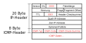

<!--
author:   Günter Dannoritzer
email:    g.dannoritzer@wvs-ffm.de
version:  1.0.0
date:     19.03.2024
language: de
narrator: Deutsch Female

comment:  IP-Übertragung

logo:     02_img/logo-ip-transmission.png

tags:     LiaScript, IP-Übertragung, Gateway, Router, ARP, Address_Resolution_Protocol

link:     https://cdn.jsdelivr.net/chartist.js/latest/chartist.min.css

script:   https://cdn.jsdelivr.net/chartist.js/latest/chartist.min.js

-->

# IP-Übertragung

## Address Resolution Protocol (ARP)

## Begriffe

Netzwerkadresse
    Die Netzwerkadresse ist die erste Adresse in einem Hostbereich eines Netzes. Beispiel: Die IP-Adresse 192.168.1.1/24 hat die Netz-ID 192.168.1 und die Host-IDs 0-255. Die erste Adresse des Hostbereichs ist die 192.168.1.0, die als Netzadresse bezeichnet wird. Über die Netzadresse wird das Netz identifiziert. 
Broadcastadresse
    Die Broadcastadresse ist die letzte Adresse in einem Hostbereich eines Netzes. Beispiel: Die IP-Adresse 192.168.1.1/24 hat die Netz-ID 192.168.1 und die Host-IDs 0-255. Die letzte Adresse des Hostbereichs ist die 192.168.1.255, die als Broadcastadresse bezeichnet wird. Über die Broadcastadresse können Nachrichten an all Hosts des Hostbereiches gesendet werden. 
Gateway
    Ein Gateway im Zusammenhang mit der IP-Ebene (Schicht 3) ist eine IP-Adresse, über die andere IP-Netze erreicht werden. Die Gateway-Adresse entspricht einem Routerport und der Router leitet die Pakete entsprechend der Zieladresse in das richtige Netz weiter. Jeder Host (Computer, Endgeräte, etc.) in einem IP-Netz wird konfiguriert mit einer IP-Adresse, einer Subnetzmaske und einem Gateway. 
Router
    Ein Router ist ein Netzelement der OSI-Schicht 3 und verbindet Netzwerke auf IP-Ebene. Der Router leitet die ankommenden IP-Pakete basierend auf der Zieladresse in das richtige Netzwerk weiter. 

Die folgende Abbildung zeigt zwei IP-Netze, die mit einem Router verbunden sind. In dem jeweiligen IP-Netzen sind die beiden Computer PC1 und PC2 sowie PC3 und PC4 jeweils über einen Switch mit dem Router verbunden.

In dem Netzwerk sollen jetzt zwei Übertragungen stattfinden, die detailliert erklärt werden:

 * PC1 zu PC2, innerhalb des gleichen Netzes (gleiche Netz-ID)
 * PC1 zu PC3, über den Router in das andere Netz (unterschiedliche Netz-ID)

## PC1 zu PC2, im gleichen Netz

  * PC1 möchte ein IP-Paket an die IP-Adresse 192.168.1.20 senden
  * PC1 bildet über die Subnetzmaske (24-Bit) die Netzwerkadresse des Zielnetzes. Diese ist 192.168.1.0 und entspricht der gleichen Netzwerkadresse des eigenen Netzes. Daraus ergibt sich, dass PC1 das Paket ins gleiche Netzwerk sendet und das Gateway nicht benutzt wird.
  * PC1 sendet einen ARP-Request in das Netzwerk und ermittelt die MAC-Adresse für die Ziel-IP-Adresse
  * PC1 sendet nach dem ARP-Reply das IP-Paket mithilfe eines Ethernet-Paketes an die ermittelte MAC-Adresse a:b:c:d:e:2

## PC1 zu PC3, ins andere Netz

 * PC1 möchte ein IP-Paket an die IP-Adresse 192.168.2.20 senden
 * PC1 bildet über die Subnetzmaske (24-Bit) die Netzwerkadresse des Zielnetzes. Diese ist 192.168.2.0 und entspricht nicht der eigenen Netzwerkadresse, welche 192.168.1.0 ist. Daraus ergibt sich, dass PC1 das Paket an die Gateway-Adresse senden muss.
 * PC1 sendet einen ARP-Request in das Netzwerk und ermittelt die MAC-Adresse für die Gateway-IP-Adresse
 * PC1 sendet nach dem ARP-Reply das IP-Paket mithilfe eines Ethernet-Paketes an die ermittelte MAC-Adresse a:b:c:d:e:5. Der Router muss sich dann um die Weiterleitung kümmern.
 * Der Router erkennt, dass die Zieladresse des Pakets an seinem anderen Port angeschlossen ist.
 * Der Router ermittelt mithilfe eines ARP-Requests die MAC-Adresse der Ziel-IP-Adresse.
 * Nach dem ARP-Reply sendet er das IP-Paket mithilfe eines Ethernet-Paketes an die durch den ARP-Reply ermittelte MAC-Adresse: a:b:c:d:e:3

# Aufgabe

 * PC4 sendet ein IP-Paket an PC3
 * PC4 sendet ein IP-Paket an PC1

Beschreiben Sie den Ablauf der Übertragung im Detail. Gehen Sie von leeren ARP-Caches aus.

# Diagnose von Verbindungen

## Internet Control Message Protocol (ICMP)

 * Laufzeit
 * Datengröße
 * Fragmentierung, Don't Fragment Flag
 * Time To Live (TTL)

### Time To Live (TTL)

Um die Verweildauer eines Pakets zu begrenzen, wird der Time-To-Live-Werte jede Sekunde oder aber mindestens beim Übergang über einen Router reduziert. Da Netzwerklaufzeiten heute selbst über weltweite Strecken so schnell sind, hat sich die Funktion dazu reduziert, bei einem Übergang eines IP-Pakets über einen Router reduziert zu werden. Reduziert sich der Wert auf null, wird das Paket verworfen. Ziel dieser Prozedur ist es, Pakete zu verwerfen, die nicht innerhalb einer bestimmten Strecke, hier die Anzahl der Router, ihr Ziel erreicht haben. Dadurch sollen kreisende Pakete bzw. Pakete, die fehlgeleitet und ihr Ziel nicht erreichen können, verworfen werden.

Der verwerfende Router sendet ein **ICMP-Paket** zurück an die Quelladresse des verworfenen Pakets und meldet das mit einem Typ 11 `Time exceeded`[^ICMP TYP11].

[^ICMP TYP11]: [Internet Control Message Protocol (ICMP) Parameters](https://www.iana.org/assignments/icmp-parameters/icmp-parameters.xhtml)

## Trace Route

Mit der Funktion TODO: ...

Diese Funktion kann genutzt werden, um die Router einer Strecke bis zu einem bestimmten Ziel zu ermitteln.

