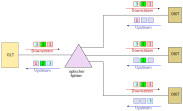

<!--
author:   Günter Dannoritzer
email:    g.dannoritzer@wvs-ffm.de
version:  0.1.0
date:     24.03.2024
language: de
narrator: Deutsch Female

comment:  Netzwerkverkabelung Lichtwellenleiter; OSI-Schicht 1

icon:    https://raw.githubusercontent.com/dsp77/wvs-liascript/0938e2e0ce751e270e3e36b8ecfeb09044a41aa0/wvs-logo.png
logo:     02_img/logo-lwl.jpg

tags:     LiaScript

link:     https://cdn.jsdelivr.net/chartist.js/latest/chartist.min.css

script:   https://cdn.jsdelivr.net/chartist.js/latest/chartist.min.js

attribute: Lizenz: [CC BY-SA](https://creativecommons.org/licenses/by-sa/4.0/)
-->
# Lichtwellenleiter

## Kategorien

 * Glasfaser
 * Polymerfaser

## Physikalische Prinzipien der Übertragung

 * Brechungsindex
 * Transmission
 * Reflexion
 * Totalreflexion

## Fasertypen

# Fiber-To-The-X (FTTx)

# GPON - Gigabit Passive Optical Network (ITU G.984)

 * https://www.elektronik-kompendium.de/sites/kom/1403181.htm
 * OLT, ONT, Optischer Splitter
 * TDM - Time-Division-Multiplexing
 * WDM - Wavelength-Division-Multiplexing
   * https://community.fs.com/de/article/an-overview-of-gpon-ftth-access-network.html

Die folgende Abbildung zeigt das Zeitschlitzverfahren, mit dem die Daten von der Optical Line Termination (OLT), in der Vermittlungsstelle zu den Optical Network Termination (ONT) beim Kunden gesendet wird.

Beim Zeitschlitzverfahren (**Time Division Multiplex - TDM**) sind der OLT und die angeschlossenen ONTs zeitsynchron miteinander verbunden. Jedem Kunden werden die Daten in einem zugeordneten Zeitschlitz gesendet. Da es sich um ein passives optisches Netzwerk handelt, kommen alle Zeitschlitze bei allen Kunden an. Jede ONT nimmt nur die Daten des Zeitschlitzes, die ihm zugeordnet sind. Um sicherzustellen, dass eine ONT nicht Zugriff auf die Daten eines anderen Zeitschlitzes zugreift, werden diese individuell für eine ONT mit AES verschlüsselt.

Im Upstream sendet jede ONT in ihrem jeweiligen Zeitschlitz; diese werden dann über den passiven Splitter zusammengeführt und zusammengesetzt, in der OLT empfangen.

Die Trennung der Daten zwischen Downstream und Upstream wird mithilfe des sogenannten **Wellenlängenmultiplex** (**Wavelength Division Multiplex - WDM**). Dabei werden die Daten im Downstream mit einer anderen Wellenlänge (Farbe des Lichtes) als im Upstream gesendet.

