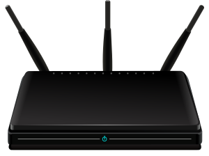
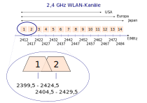

<!--
author:   Günter Dannoritzer
email:    g.dannoritzer@wvs-ffm.de
version:  0.3.0
date:     09.07.2024
language: de
narrator: Deutsch Female

comment:  Wireless Local Area Network (WLAN)

icon:    https://raw.githubusercontent.com/dsp77/wvs-liascript/0938e2e0ce751e270e3e36b8ecfeb09044a41aa0/wvs-logo.png
logo:     02_img/logo-wlan.png

tags:     LiaScript, WLAN, Wifi, CSMA/CA, Mesh, WPA, IEEE 802.11

link:     https://cdn.jsdelivr.net/chartist.js/latest/chartist.min.css

script:   https://cdn.jsdelivr.net/chartist.js/latest/chartist.min.js

attribute: Lizenz: [CC BY-SA](https://creativecommons.org/licenses/by-sa/4.0/)
-->

# Wireless Local Area Network (WLAN)

 * Standards
 * Frequenzen
 * Sendeleistung
 * Ausbreitung
 * Reichweite
 * Kanäle
 * SSID
 * Betriebsmoden
    * Ad-hoc
    * AP
 * Roaming vs Mesh
 * Sicherheit
    * WPA2, WPA3
    * WPA-Enterprise

# Standards

## Frequenzbereich 2,4 GHz:

 * **IEEE 802.11b**: Bietet bis zu **11 Mbit/s** Datentransferrate und ist der älteste und am weitesten verbreitete Standard. Er wird hauptsächlich für ältere Geräte und Low-Speed-Anwendungen verwendet.
 * **IEEE 802.11g**: Erweitert den Standard 802.11b auf bis zu **54 Mbit/s** und bietet gleichzeitig Abwärtskompatibilität. Er war der dominierende Standard für WLAN im Heim- und Bürobereich, bevor er von neueren Standards abgelöst wurde.
 * **IEEE 802.11n**: Bietet bis zu **300 Mbit/s** Datentransferrate durch die Verwendung von MIMO (Multiple Input, Multiple Output) Technologie und Kanalaggregation. Er war der erste Standard, der die Gigabit-Geschwindigkeit im WLAN ermöglichte.

## Frequenzbereich 5 GHz:

 * **IEEE 802.11a**: Bietet bis zu **54 Mbit/s** Datentransferrate und war der erste WLAN-Standard im 5-GHz-Band. Er hat sich in Deutschland jedoch aufgrund der begrenzten Kanalverfügbarkeit und der Konkurrenz durch neuere Standards nicht weit verbreitet.
 * **IEEE 802.11n**: Bietet im 5-GHz-Band die gleichen Vorteile wie im 2,4-GHz-Band (bis zu **300 Mbit/s**, MIMO, Kanalaggregation) und profitiert von weniger Interferenzen und mehr verfügbaren Kanälen.
 * **IEEE 802.11ac**: Erhöht die Datentransferrate auf bis zu **1,3 Gbit/s** durch die Nutzung von MU-MIMO (Multi-User MIMO) Technologie, die mehrere Geräte gleichzeitig bedienen kann.
 * **IEEE 802.11ax** (Wi-Fi 6): Bietet bis zu **2,4 Gbit/s** Datentransferrate, verbesserte Leistung in dichten Umgebungen und erweiterte Reichweite durch diverse Optimierungen.
 * **IEEE 802.11be** (Wi-Fi 7): Der neueste Standard, der noch in der Entwicklungsphase ist, soll Datentransferraten von bis zu **46 Gbit/s** ermöglichen und weitere Verbesserungen für dichte Umgebungen und Latenzzeiten bringen.

## Multiple Input / Multiple Output (MIMO)

**MIMO** steht für **Multiple-Input Multiple-Output** und ist eine Technologie, die in modernen WLAN-Routern und -Geräten verwendet wird, um die Leistung und Reichweite des drahtlosen Netzwerks zu verbessern.

Funktionsweise:

 * Mehrere Antennen: Sowohl der Router als auch das Gerät verwenden mehrere Antennen, um Daten zu senden und zu empfangen.
 * Gleichzeitige Datenströme: Über die zusätzlichen Antennen können gleichzeitig mehrere Datenströme übertragen werden, anstatt wie bei herkömmlichen WLAN-Systemen nur einen Datenstrom pro Sende- und Empfangszeitpunkt.
 * Erhöhte Datenrate: Durch die parallele Übertragung mehrerer Datenströme erhöht sich die gesamte Datenrate, was zu schnelleren Downloads, Uploads und Streaming führt.
 * Verbesserte Signalstärke: Die mehreren Antennen können das Signal in verschiedene Richtungen streuen und so die Abdeckung und Signalstärke in Bereichen mit Hindernissen oder mehreren Geräten verbessern.

Vorteile von MIMO:

 * Erhöhte Geschwindigkeit: Bis zu dreimal schnellere Datenraten im Vergleich zu Single-Input Single-Output (SISO) WLAN.
 * Größere Reichweite: Verbesserte Signalabdeckung und -stärke, insbesondere in großen Häusern oder Büros.
 * Geringere Latenz: Verringerte Verzögerungszeit für verzögerungsempfindliche Anwendungen wie Online-Spiele oder Videokonferenzen.
 * Mehrere Geräte gleichzeitig: Ermöglicht die gleichzeitige Nutzung von WLAN durch mehrere Geräte ohne Geschwindigkeitsbeeinträchtigung.

MIMO-Varianten:

 * MU-MIMO (Multi-User MIMO): Ermöglicht die gleichzeitige Übertragung mehrerer Datenströme an mehrere Geräte, was die Netzwerkkapazität und -leistung weiter verbessert.
 * SU-MIMO (Single-User MIMO): Sendet Datenströme nur an ein einzelnes Gerät gleichzeitig, ist aber immer noch schneller als SISO.

Um die Vorteile von MIMO zu nutzen, benötigen sowohl der Router als auch das Gerät MIMO-Unterstützung. Die Bezeichnung "MIMO" oder "MU-MIMO" beschreiben Geräte, die diese Technologie unterstützen.

## Frequenzen / Kanäle

## Carrier Sense Multipe Access / Collission Avoidance (CSMA/CA)

Bei einer kabelgebundenen Verbindung eines Gerätes mit einem Switch kann über das Netzwerkkabel gleichzeitig gesendet und empfangen werden. Durch ausreichende Adernpaare in dem Twisted-Pair-Kabel ist diese Übertragung möglich. Die Übertragung wird als **Vollduplexübertragung** bezeichnet.

Mit einer Funkverbindung kann nur eine Station in einem Funkkanal senden. Die anderen Stationen müssen die Sendung einstellen und können das gesendete Signal empfangen. Ist die Station mit der Übertragung fertig, kann eine andere Station den Funkkanal für eine Sendung nutzen. Die Übertragung wird als **Halbduplex** bezeichnet und erfordert bei automatischen Funkdiensten wie dem WLAN eine Zugangssteuerung, die als **Carrier Sense Multipe Access / Collision Avoidance** bezeichnet wird.

Im ersten Schritt vor einer Übertragung stellt eine Station in den Empfangsmodus und überwacht den Funkkanal, ob eine andere Station sendet. Solange eine andere Station sendet, wartet die Station.

Ist der Kanal frei, wird zur **Collision  Avoidance** ein **Random Backoff** verwendet. Dazu erzeugt die Station eine Zufallszahl, wartet diese zufällig, erstellt Wartezeit ab und beginnt dann mit der Sendung. Die Idee hinter dieser Methode ist, dass, wenn zwei Stationen senden wollen und beide gleichzeitig feststellen, dass der Funkkanal frei ist, diese durch gleichzeitig einsetzende Sendung eine Kollision erzeugen würden. Da beide eine zufällige Zeit warten, bevor sie senden, verringert sich die Wahrscheinlichkeit einer Kollision.
Der zufällige Wert für die Wartezeit wird aus einem sogenannten **Contention Window** heraus erstellt. Tritt eine Kollision auf, wird das Fenster vergrößert und dadurch der Bereich der Zufallszahlen größer.

# Ausbreitung

Die Signalausbreitung hängt von vielen Faktoren ab. Auf der Sendeseite ist es die Sendeleistung, die vom Sender auf die Antenne gegeben wird. Die Antenne hat eine bestimmte Abstrahlungscharakteristik, die bestimmt, in welche Richtung die Leistung abgestrahlt wird.

Der Übertragungsweg beeinflusst das Signal und so wird das Signal durch Wände, besonders mit elektrisch leitenden Materialien, wie Stahl oder Metall; aber auch Bewuchs, wie z.B. Bäume oder Sträucher, gestört. Durch Reflexionen des Signals kommt es zu Überlagerungen, die das Signal stören.

## Sendeleistung

Im Frequenzbereich 2,4 GHz (2.400 - 2.4835 GHz):

 * Sendeleistung: Maximal 20 dBm an der Antenne

Im Frequenzbereich 5 GHz (5.150 - 5.825 GHz):

 * Sendeleistung: Maximal 30 dBm an der Antenne

## Dezibel

**dBm** steht für Dezibel Milliwatt und ist eine Einheit zur Messung der Leistung von Funksignalen, insbesondere im Bereich der Telekommunikation. Es drückt die Leistung eines Signals in Bezug auf eine Bezugsgröße von 1 Milliwatt (mW) aus.

So funktioniert es:

 * Dezibel (dB): Dezibel ist eine logarithmische Einheit, die verwendet wird, um Verhältnisse zwischen zwei Werten auszudrücken. In der Funktechnik wird es häufig verwendet, um die Leistung eines Signals im Vergleich zu einem Referenzwert darzustellen.
 * Milliwatt (mW): Milliwatt ist eine Einheit der Leistung, die einem Tausendstel Watt (W) entspricht. In der Funktechnik wird es verwendet, um die absolute Leistung eines Signals zu messen.

Berechnung von dBm:

Die dBm-Werte eines Signals können mit folgender Formel berechnet werden:

$$dBm = 10 \cdot log_{10} \left( \frac{P}{0,001} \right)$$

Dabei ist:

 * dBm der dBm-Wert des Signals
 * P die Leistung des Signals in Watt (W)

Beispiele:

 * Ein Signal mit einer Leistung von 1 mW hat einen dBm-Wert von 0.
 * Ein Signal mit einer Leistung von 10 mW hat einen dBm-Wert von 10.
 * Ein Signal mit einer Leistung von 100 mW hat einen dBm-Wert von 20.
 * Ein Singal mit einer Leistung von 0,5 mW hat einen dBm-Wert von -23.
 * Ein Signal mit einer Leistung von 0,1 mW hat einen dBm-Wert von -30.

Das bedeutet, postive dBm-Werte beschreiben eine Sendeleistung von größer 1 mW. Negative Werte beschreiben eine Sendeleistung von kleiner 1 mW. Umso negativer der Wert, umso geringer ist die Sendeleistung.

Diese dBm-Werte werden auch für die Signalstärke eines empfangenen Access Point angegeben.

Beispiel für einen Netzwerkscan zeigt die folgende Tabelle:

| ESSID | Absolute Signalstärke | Kanal | Frequenz |
|--|--|--|--|
| GRANZ WLAN 5 | -82 dBm | 36 | 5180 MHz |
| WLANREPEATER | -83 dBm | 36 | 5180 MHz |
| WLANREPEATER | -75 dBm | 11 | 2462 MHz |
| GRANZ WLAN 2 | -77 dBm | 11 | 2462 MHz |
| UPC4950975   | -86 dBm | 11 | 2462 MHz |
| HZN248587077 | -85 dBm | 2  | 2417 MHz |

## Antenne

# Betriebsmodus (Adhoc vs Access Point)

WLAN Ad-Hoc und Access Point (AP) sind zwei verschiedene Lösungen für den Aufbau eines WLAN-Netzwerks. Die Wahl zwischen den beiden hängt von Ihren Bedürfnissen und der gewünschten Netzwerkstruktur ab.

Ad-Hoc-Netzwerke:

* Spontan und einfach: Ideal für temporäre Netzwerke in Cafés oder Parks, da keine Konfiguration eines APs erforderlich ist.
* Gleichberechtigte Geräte: Alle Geräte fungieren als gleichberechtigte Peers, ohne zentrale Steuerung.
* Eingeschränkte Reichweite und Sicherheit: Geringere Reichweite und Unterstützung für weniger Geräte, höheres Sicherheitsrisiko durch fehlende zentrale Authentifizierung.

Access Points:

 * Zentraler Knotenpunkt: Ein dedizierter AP verwaltet die Kommunikation im Netzwerk.
 * Größere Reichweite und Skalierbarkeit: Bietet größere Reichweite und kann mehr Geräte gleichzeitig unterstützen.
 * Verbesserte Sicherheit: Ermöglicht zentrale Authentifizierung und Verschlüsselung zum Schutz des Netzwerks.
 * Strukturiertes Netzwerk: Ermöglicht die Einrichtung von Subnetzen und die Zuweisung von IP-Adressen für eine bessere Netzwerkverwaltung.
 * Komplexere Einrichtung: Erfordert die Konfiguration des APs und die Einrichtung von Sicherheitseinstellungen.

Zusammenfassend kann man sagen, Ad-Hoc-Verbindungen erlauben eine schnelle und einfache Lösung für temporäre Netzwerke mit wenigen Geräten. Die Access Point-Lösung bietet stabile, skalierbare und sichere Lösung für dauerhafte Netzwerke mit mehreren Geräten.

# Roaming und Mesh

WLAN Roaming und WLAN Mesh sind zwei Technologien, die nahtlose Verbindungen in WLAN-Netzwerken ermöglichen. Sie unterscheiden sich jedoch in ihrer Funktionsweise und eignen sich daher für unterschiedliche Anwendungsfälle.

## WLAN Roaming

Geräte verbinden sich automatisch mit dem Access Point (AP) mit dem stärksten Signal, während sie sich im Netzwerk bewegen.

Funktionsweise:

 * Client-gesteuert: Das WLAN-Gerät entscheidet selbstständig, wann und zu welchem AP es wechselt.
 * Überlappende Netzwerke: Benötigt überlappende WLAN-Zellen von mehreren APs mit demselben SSID (Netzwerknamen) und Passwort.
 * Vorteile:

   * Einfach einzurichten: Funktioniert mit Standard-WLAN-Routern und -Geräten.
   * Kostengünstig: Keine zusätzliche Hardware erforderlich.

 * Nachteile:

   * Kurze Unterbrechungen: Beim Wechsel zwischen APs kann es zu kurzen Verbindungsunterbrechungen kommen.
   * Erfordert sorgfältige Planung: Die Platzierung der APs ist wichtig, um eine ausreichende Abdeckung und Signalstärke zu gewährleisten.
   * Eingeschränkte Skalierbarkeit: Funktioniert weniger gut in großen oder komplexen Netzwerken.

## WLAN Mesh

Ein Netzwerk aus miteinander verbundenen APs, die als Knoten fungieren und ein gemeinsames WLAN bilden.

Funktionsweise:

 * Netzwerkgesteuert: Die APs steuern gemeinsam die Netzwerkkonnektivität und den Datenverkehr.
 * Intelligente Weiterleitung: Geräte werden automatisch zum optimalen AP weitergeleitet, basierend auf Signalstärke und Netzwerklast.
 * Vorteile:

   * Nahtlose Verbindung: Keine Unterbrechungen beim Wechsel zwischen APs, da das Gerät immer mit dem Netzwerk verbunden bleibt.
   * Verbesserte Abdeckung: Eliminiert tote Zonen und gewährleistet eine gleichmäßige Abdeckung im gesamten Bereich.
   * Skalierbar: Einfaches Hinzufügen weiterer APs, um die Größe und Kapazität des Netzwerks zu erweitern.
   * Selbstheilend: Fällt ein AP aus, routen die anderen APs den Datenverkehr um, um die Netzwerkverfügbarkeit zu gewährleisten.

 * Nachteile:

   * Höhere Kosten: Erfordert den Kauf spezieller Mesh-APs.
   * Komplexere Einrichtung: Die Konfiguration und Verwaltung des Mesh-Netzwerks kann komplexer sein.

# Sicherheit (WPA WPA-Enterprise)

## Unterschiede zwischen WPA und WPA Enterprise

WPA (Wi-Fi Protected Access) und WPA Enterprise sind zwei Sicherheitsstandards für drahtlose Netzwerke (WLAN). Sie bieten beide Schutz vor unbefugtem Zugriff, unterscheiden sich jedoch in der Art und Weise, wie sie dies erreichen:

### WPA

   * Per-Shard-Key (PSK): Verwendet einen gemeinsam genutzten Pre-Shared Key (PSK) für alle Benutzer im Netzwerk.
   * Einfache Einrichtung: Geeignet für Heim- und kleine Büronetzwerke.
   * Schwachstellen: PSK kann durch Brute-Force-Angriffe oder Wörterbuchangriffe geknackt werden.
   * Keine zentrale Verwaltung: Bietet keine Optionen für erweiterte Authentifizierungsmethoden oder Benutzerverwaltung.

### WPA Enterprise:

   * **802.1X**-basierend: Verwendet einen Authentifizierungsserver (z. B. RADIUS) für die Benutzeranmeldung.
   * Erweiterte Sicherheit: Bietet starke Authentifizierungsmethoden wie EAP (Extensible Authentication Protocol) und unterstützt verschiedene Verschlüsselungsverfahren.
   * Zentrale Verwaltung: Ermöglicht die zentrale Verwaltung von Benutzern, Berechtigungen und Sicherheitsrichtlinien.
   * Komplexere Einrichtung: Erfordert die Konfiguration eines Authentifizierungsservers und die Integration mit dem WLAN-Netzwerk.
   * Geeignet für: Größere Unternehmensumgebungen, die erhöhte Sicherheit und detaillierte Benutzerkontrollen benötigen.

| Merkmal | WPA | WPA Enterprise |
|---------|-----|----------------|
| Authentifizierung | Pre-Shared Key (PSK) | 802.1X-basierend mit Authentifizierungsserver |
| Einrichtung |Einfach | Komplexer |
| Sicherheit | Schwachstellen durch PSK-Cracking möglich | Hohe Sicherheit durch starke Authentifizierung |
| Benutzerverwaltung | Keine zentrale Verwaltung | Zentrale Verwaltung von Benutzern und Berechtigungen |
| Geeignet für	| Heim- und kleine Büronetzwerke | Größere Unternehmensumgebungen |

## WPA, WPA2, WPA3

WPA, WPA2 und WPA3 sind jeweils Sicherheitsstandards für drahtlose Netzwerke (WLAN) und bieten Schutz vor unbefugtem Zugriff. Sie unterscheiden sich jedoch in ihren Funktionen und dem erreichten Sicherheitsniveau:

WPA (Wi-Fi Protected Access):

   * Einführung: 2003 eingeführt als Nachfolger von WEP (Wired Equivalent Privacy).
   * Verschlüsselung: Verwendet den TKIP (Temporal Key Integrity Protocol) Algorithmus, der als unsicher gilt.
   * Authentifizierung: Basiert auf einem Pre-Shared Key (PSK), der für alle Benutzer im Netzwerk gleich ist.
   * Schwachstellen: Anfällig für Brute-Force-Angriffe und WPA-Wörterbuchangriffe.
   * Geeignet für: Heimnetzwerke mit geringem Sicherheitsbedarf (veraltet).

WPA2 (Wi-Fi Protected Access 2):

   * Einführung: 2004 als Reaktion auf die Schwächen von WPA eingeführt.
   * Verschlüsselung: Verwendet den deutlich stärkeren AES (Advanced Encryption Standard) Algorithmus.
   * Authentifizierung: Unterstützt sowohl PSK als auch erweiterte Authentifizierungsmethoden wie 802.1X mit RADIUS-Server.
   * Verbesserte Sicherheit: Bietet deutlich besseren Schutz als WPA durch AES und optionale erweiterte Authentifizierung.
   * Aktueller Standard: Derzeit der am weitesten verbreitete und empfohlene WLAN-Sicherheitsstandard.

WPA3 (Wi-Fi Protected Access 3):

   * Einführung: 2019 als Reaktion auf zunehmende Bedrohungen in der IT-Sicherheit eingeführt.
   * Verbesserte Sicherheit: Bietet mehrere neue Funktionen zur Stärkung der WPA2-Sicherheitslücken:
      * SAE (Simultaneous Authentication of Equals): Erschwert Offline-Wörterbuchangriffe.
      * PSK-Verbesserungen: Erhöht die Widerstandsfähigkeit gegen PSK-Cracking.
      * Public Key Management: Ermöglicht eine einfachere Einrichtung und Geräteverbindung.

