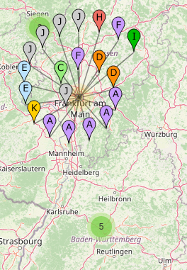
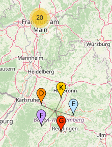
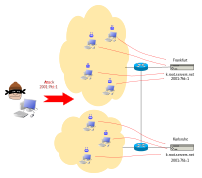

<!--
author:   Günter Dannoritzer
email:    g.dannoritzer@wvs-ffm.de
version:  0.1.1
date:     21.08.2025
language: de
narrator: Deutsch Female

comment:  Distributed Denial of Service Attack (DDOS)

icon:    https://raw.githubusercontent.com/dsp77/wvs-liascript/0938e2e0ce751e270e3e36b8ecfeb09044a41aa0/wvs-logo.png
logo:     02_img/logo-ddos.png

tags:     LiaScript

link:     https://cdn.jsdelivr.net/chartist.js/latest/chartist.min.css

script:   https://cdn.jsdelivr.net/chartist.js/latest/chartist.min.js

attribute: Lizenz: [CC BY-SA](https://creativecommons.org/licenses/by-sa/4.0/)
-->
# Distributed Denial of Service Attack

Content-Delivery-Netzwerk (CDN) wie Cloudflare oder Cloudanbieter wie Amazon bieten einen Schutz gegen DDOS-Attacken. Dabei splitten sie Dienste auf und routen weltweite Anfragen immer zu einem nächsten Knoten, der den Dienst lokal anbietet.

Verständlich erklärbar ist dieses Routing anhand der Funktion IP-Anycast im Zusammenhang mit den DNS-Root-Servern.

Auf der Webseite iana.org/domains/root/servers findet man eine Liste der 13 DNS-Root-Server und ihre IP-Adressen. Die 13 Server sind benannt mit den Buchstaben a-m. Als Beispiel soll der k-Server dienen:

    k.root-servers.net
        IPv4-Adresse: 193.0.14.129
        IPv6-Adresse: 2001:7fd::1

Im Internet müssen die IP-Adressen eindeutig sein. Schaut man auf der Karte der DNS-Root-Server, auf der Webseite https://root-servers.org/, findet man z.B. in Frankfurt einen K-Server.

Weiter südlich steht auch ein K-Server in Karlsruhe. Eigentlich muss eine IP-Adresse im Internet eindeutig sein. Mithilfe von IP-Anycast kann aber eine IP-Adresse an mehreren Stellen im Internet sein.

Hier zeigt die Abbildung, wie ein Botnet den K-Server mit der IP-Adresse 2001:7fd::1 angreift. Durch IP-Anycast werden die Anfragen aus dem Raum Frankfurt über den Router an den K-Server in Frankfurt und die Anfragen aus dem Raum Karlsruhe an den Server in Karlsruhe geleitet.

Die Summe der Botnet-Knoten kann also nicht auf ein Ziel konzentriert werden, sondern wird aufgeteilt auf verschiedene Server.

Das Open-Source-Projekt [Gatekeeper](https://github.com/AltraMayor/gatekeeper/wiki) nutzt die Funktion des IP-Anycast.