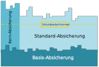

<!--
author:   Günter Dannoritzer
email:    g.dannoritzer@wvs-ffm.de
version:  0.6.0
date:     05.05.2024
language: de
narrator: Deutsch Female

comment:  Schutzbedarfsanalyse im eigenen Arbeitsbereich durchführen. Lernfeld 4 der Fachinformatiker Ausbildung.

icon:    https://raw.githubusercontent.com/dsp77/wvs-liascript/0938e2e0ce751e270e3e36b8ecfeb09044a41aa0/wvs-logo.png
logo:     02_img/logo-it-grundschutz.png

tags:     LiaScript

link:     https://cdn.jsdelivr.net/chartist.js/latest/chartist.min.css

script:   https://cdn.jsdelivr.net/chartist.js/latest/chartist.min.js

attribute: Lizenz: [CC BY-SA](https://creativecommons.org/licenses/by-sa/4.0/)
-->

# Leitfragen zum IT-Grundschutz des BSI

 * Für welche Unternehmen gilt die Anforderung eines Mindestniveaus an IT-Schutz?
 * Wie wird das Mindestniveau in IT-Sicherheit spezifiziziert?
 * Wozu dienen die Grundschutzkataloge des BSI-Standards 200?
 * Was ist die Alternative zum IT-Grundschutz für Unternehmen, die ein Mindestniveau an IT-Sicherheit benötigen?

# Was ist IT-Grundschutz?

* [It-Sicherheitsgesetz BSIG](https://www.gesetze-im-internet.de/bsig_2009/) schreibt vor:

   * Betreiber kritischer Infrastruktur müssen ein angemessenes IT-Schutzniveau aufweisen
   * Als kritische Infrastruktur gilt: Energie, IT, Telekommunikation, Transport und Verkehr, Gesundheit, Wasserversorgung, Ernährung, Finanz- und Versicherungswesen

* Informationssicherheits-Managementsystem (ISMS) nach ISO 27001

    * Nach Vorgaben der ISO 27001 werden Geschäftsprozesse beschrieben, deren Ziel die IT-Sicherheit ist.
    * Jede Mitarbeiterrin und jeder Mitarbeiter muss sich an die Prozesse halten.
    * Von externen Unternehmen werden die erstellten Prozesse und deren Umsetzung im Arbeitsalltag regelmäßig überprüft und eine **Zertifizierung nach ISO 27001** für das Unternehmen ausgesprochen.

* Der IT-Grundschutz ist eine Umsetzungsunterstützung für den Aufbau eines ISMS nach ISO 27001
* Ziel des Grundschutzes ist es, Unternehmen zu unterstützen, einen *angemessenes Schutzniveau* für IT-Systeme zu erreichen.
* Der Grundschutzkatalog des BSI bietet Sicherheitsmaßnahmen die organisisert sind in:

  * technische
  * infrastrukturelle
  * organisatorische
  * personelle

Die Vorgehensweise nach IT-Grundschutz hilft, systematisch für eine Institution ein angemessenes Sicherheitsniveau zu erreichen.

Eine traditionelle Risikoanalyse mit den Schritten: Ermittlung von Bedrohungen, Bewertung von Eintrittswhrscheinlichkeiten und Auswahl von Sichheitsmaßnahmen ist nicht mehr notwendig.

Der Begriff Risikonalyse bekommt im Zusammenhang mit dem IT-Grundschutz eine neue Bedeutung.

# Umsetzung des IT-Grundschutzes

## Sicherheitsleitlinie nach IT-Grundschutz

**Grundsatzdokument der Leitung**

Die Sicherheitsleitlinie ist ein zentrales Dokument der Unternehmensleitung, das den Stellenwert der Informationssicherheit in der Organisation definiert. Sie legt die verbindlichen Prinzipien und das anzustrebende Niveau der Informationssicherheit fest. 

**Bekanntgabe und Aktualisierung**

Die Leitlinie muss allen betroffenen Mitarbeitern bekannt gegeben und in regelmäßigen Abständen aktualisiert werden, um den aktuellen Gegebenheiten und Bedrohungen zu entsprechen.

**Inhalt der Sicherheitsleitlinie**

Die Sicherheitsleitlinie sollte folgende Punkte beinhalten:

* **Geltungsbereich:** Konkretisierung des Geltungsbereichs der Leitlinie, z. B. die gesamte Organisation oder bestimmte Bereiche.
* **Bedeutung der Informationssicherheit:** Hervorhebung der Bedeutung der Informationssicherheit für die Organisation, z. B. mögliche Schadensfälle bei einem Ausfall der IT oder einem Datenleck.
* **Verantwortung der Leitung:** Betonung der Verantwortung der Leitung für die Initiierung und kontinuierliche Verbesserung des Informationssicherheitsprozesses.
* **Gesetze und Auflagen:** Verweis auf einschlägige Gesetze und Regulierungsauflagen im Bereich der Informationssicherheit und Verpflichtung der Mitarbeiter zur Einhaltung.
* **Kritische Geschäftsprozesse:** Benennung besonders kritischer Geschäftsprozesse für die Informationssicherheit, z. B. Produktionsabläufe, Forschungsverfahren oder Personalbearbeitung, und Hervorhebung der strikten Einhaltung von Sicherheitsregeln in diesen Bereichen.
* **Organisationsstruktur:** Darstellung der Organisationsstruktur für Informationssicherheit und Festlegung der Aufgaben der verschiedenen Sicherheitsverantwortlichen.
* **Sicherheitsschulungen:** Hinweis auf die Bedeutung von Sicherheitsschulungen und Sensibilisierungsmaßnahmen für alle Mitarbeiter.

Die Sicherheitsleitlinie bildet die Grundlage für ein umfassendes Informationssicherheitsmanagement (ISMS) in der Organisation. Sie trägt dazu bei, die Vertraulichkeit, Integrität und Verfügbarkeit von Informationen zu schützen und das Unternehmen vor Cyberangriffen und anderen Sicherheitsrisiken zu bewahren.

Der BSI gibt ein [Beispiel für Sicherheitsleitlinie](https://www.bsi.bund.de/SharedDocs/Downloads/DE/BSI/Grundschutz/Hilfsmittel/Recplast/A01_Sicherheitsleitlinie.pdf?__blob=publicationFile&v=2
) als [Teil des Onlinekurses](https://www.bsi.bund.de/DE/Themen/Unternehmen-und-Organisationen/Standards-und-Zertifizierung/IT-Grundschutz/Zertifizierte-Informationssicherheit/IT-Grundschutzschulung/Online-Kurs-IT-Grundschutz/Lektion_2_Sicherheitsmanagement/Lektion_2_07/Lektion_2_07_node.html).

## Absicherungen nach IT-Grundschutz
 

 * Die **Basis-Absicherung** ist interessant für einen Einstieg in den IT-Grundschutz, um alle relevanten Geschäftsprozesse mit Basismaßnahmen abzusichern.
 * Die **Standard-Absicherung** entspricht der empfohlenen Vorgehensweise nach dem IT-Grundschutz und bietet einen umfassenden Schutz für alle Prozesse und Bereiche.
 * Die **Kern-Absicherung** fokusiert sich auf die sogenannten **Kronjuwelen** einer Institution. Damit sind die Systeme, Abläufe und Prozesse gemeint, die das Kerngeschäft der Institutition ausmachen.

## Vorgehen nach der Variante Standardabsicherung

Die folgende Abbildung zeigt den Ablauf der Standard-Absicherung nach BSI.

Nach Festlegung des Geltungsbereiches wird zuerst die Strukturanalyse erstellt.

Das Lernfeld 4 bezieht sich auf die Schutzbedarfsanalyse im eignenen Arbeitsbereich, was den Geltungsbereich entsprechend einschränkt.

Nach der Strukturanalyse folgt die eigentliche Schutzbedarfsfeststellung. Die Begriffe Schutzbedarfsanalyse und Schutzbedarfsfeststellung werden hier als Synonyme verwendet.

Es folgt dann die Modellierung der festgestellten Schutzbedarfe. Danach wird überprüft, was die Modellierung für Anforderungen ergeben hat und wie die bereits umgesetzt sind.

Eine Risikoanalyse erfolgt für die Schutzbedarfskategorien hoch. Nach der Konsolidierung folgt die Überprüfung Teil 2 und schließlich die Umsetzung.

### Strukturanalyse

Um die Strukturanalyse durchzuführen ist als Grundlage ein Netzwerkplan sinnvoll.

Basierend auf dem Netzwerkplan werden Tabellen für die Systeme erstellt.

| Nr | Beschreibung | Platform | Standort | Anzahl | Benutzer/Administrator |
|----|--------------|----------|----------|--------|-----------------------|
| C1 | Desktop Vertrieb | Windows 11 | Kundenbereich | 10 | Vertriebsmitarbeiter / IT-Administrator |
| C2 | Desktop Entwicklung | Windows 11 | R100 - 105 | 20 | Entwicklungsabteilung / IT-Administrator |
| S1 | Server des Virtualisierungs-Cluster | Windows Server 2020 | Server-Raum | 3 | IT-Administrator |
| V1 | Domain-Controler | Windows Server 2020 | Server-Raum | 1 | IT-Administrator |
| V2 | Datei-Server | Windows Server 2020 | Server-Raum | 1 | IT-Administrator |
| V3 | E-Mail-Server | Windows Server 2020 | Server-Raum | 1 | IT-Administrator |
| N1 | Netzwerk-Switch |||||
| N2 | Netzwerk-Router |||||
| N3 | Netzwerk-Firewall |||||

Über die Kreuztabelle werden die Systeme mit der Software verbunden.

| Nr | Anwendung | C1 | C2 |
|----|-----------|----|----|
| AC01 | Office |||
| AC02 | E-Mail, Kalender |||
| AC03 | Visual Studio |||
| AC04 | Git |||

Es kann sinnvoll sein, die Clients von den Servern zu trennen, da sonst die Tabelle unnötig groß wird.

| Nr | Anwendung | S1 | S2 | S3 |
|----|-----------|----|----|----|
| AS01 | VMWare ESXi |||

| Nr | Anwendung | V1 | V2 | V3 |
|----|-----------|----|----|----|
| AV01 | Windows Server 2020 |||
| AV02 |  |||
| AV03 |  |||

### Schutzbedarfsfeststellung

TODO: Müssen hier die Geschäftsprozesse mit rein? Siehe Online Kurs des BSI; dort machen sie Tabellen mit den Geschäftsprozessen

Der Grundschutz ist hier sehr umfangreich und beinhaltet die Schritte:

 * Geschäftsprozesse
 * IT-Systeme
 * Räume
 * Kommunikationsverbindungen

Bei dem Lernfeld geht es aber um den eigenen Arbeitsplatz, worauf eine Eingrenzung auf die **IT-Systeme** und die **Räumlichkeit** des Arbeitsplatzes beschränkt werden soll.

#### Schutzbedarfskategorien

Nach BSI-Standard 200-2 gibt es folgende **Schutzbedarfskategorien**.

| Kategorie | Beschreibung |
|-----------|--------------|
| Sehr hoch | Die Schadensauswirkungen können ein existenziell bedrohliches, katastrophales Ausmaß erreichen. |
| Hoch | Die Schadensauswirkungen können beträchtlich sein. |
| Normal | Die Schadensauswirkungen sind begrenzt und überschaubar. |

[BSI-Standard 200-2 Kapitel 8.2.1 Definition der Schutzbedarfskategorien (Seite 104 ff)](https://www.bsi.bund.de/SharedDocs/Downloads/DE/BSI/Grundschutz/BSI_Standards/standard_200_2.pdf?__blob=publicationFile&v=2)

Im Abschnitt "Absicherungen nach IT-Grundschutz" wurden die drei Absicherungen **Basis-, Standard- und Kernabsicherung** vorgestellt. Für die Schutzbedarfskategorie **Normal** ist die spätere Modellierung mit der Basis- und Standardabsicherung ausreichend.

#### Vererbung

Grundlage der Schutzbedarfsfeststellung sind die Geschäftsprozesse. Der festgestellte Schutzbedarf **vererbt** sich dann auf die beteiligten Räume, Geräte und IT-Systeme. Eine Geschäftsprozess mit der Vertraulichkeit sehr hoch vererbt diesen Schutzbedarf über die verwendeten IT-Geräte, wie genutzte Software, PC, Standort des PCs, Netzwerk, Server, Standort der Server, Speicherung der Daten auf dem Server, Sicherungskopie der Daten von dem Server, Ablageort der Sicherungskopie.

##### Maximalprinzip

Die Absicherung eines Systems oder Raums muss nach der höchsten Kategorie stattfinden. Wenn zum Beispiel für einen Server verschiedene Schutzbedarfskategorien zugeordnet werden, gilt für den Server die höchste Schutzbedarfskategorie.

##### Kumulation und Verteilung

Bei der Virtualisierung können Effekte auftreten, die bei der Schutzbedarfsfeststellung zu berücksichtgen sind. Diese werden mit den Begriffen **Kumulation** und **Verteilung** beschrieben.

Ein virtualisierter Server vererbt seine Schutzbedarfskategorie auf den Virtualisierungsserver. Enzeln betrachtet können mehrere virtualisierte Server z.B. die Schutzbedarfskategorie **normal** haben. In der Summe kann jedoch der Schaden beim Ausfall aller Server höher sein. Daher kann diese **Kumulation** zu einer höheren Schadenskategorie bei dem Virtualisierungsserver führen.

Durch Funktionen der Virtualisierungsumgebung wie z.B. eines Hochverfügbarkeits-Cluster können virtuelle Server nach Ausfall eines Virtualisierungsservers automatisch auf einem noch verfügbaren Server wieder gestartet werden. Diese Funktion nennt sich **Verteilung**.

Die Kombination aus **Kumulation** und **Verteilung** erlaubt die **Vererbung** von Schutzbedarfskategorien gleich zu halten.

Beispiel, durch die **Kumulation** mehrerer virtualisierter Server mit der Schutzbedarfskategorie **Normal** würde sich für den Virtualisierungsserver die Kategorie **Hoch** ergeben. Da der Virtualisierungsserver als Hochverfügbarkeits-Cluster ausgelegt ist, reduziert sich die Kategorie wieder auf **Normal**.

Siehe auch:

 * [BSI Onlinekurs zum IT-Grundschutz Lektion 4.03]( https://www.bsi.bund.de/DE/Themen/Unternehmen-und-Organisationen/Standards-und-Zertifizierung/IT-Grundschutz/Zertifizierte-Informationssicherheit/IT-Grundschutzschulung/Online-Kurs-IT-Grundschutz/Lektion_4_Schutzbedarfsfeststellung/Lektion_4_03/Lektion_4_03_node.html)
 * [BSI-Standard 200-2 Kapitel 8.2.4 Schutzbedarfsfeststellung für IT-Systeme (Seite 118 ff)](https://www.bsi.bund.de/SharedDocs/Downloads/DE/BSI/Grundschutz/BSI_Standards/standard_200_2.pdf?__blob=publicationFile&v=2)

#### Schutzbedarfsfeststellung anhand der vorherigen Strukturanalyse

| Nr | Beschreibung | Grundwert | Schutzbedarf | Begründung |
|----|--------------|----------|----------|------------|
| C1 | Desktop Vertrieb | Vertraulichkeit |  |  | 
|  |  | Integrität |  |  | 
|  |  | Verfügbarkeit |  |  | 
| C2 | Desktop Entwicklung | Vertraulichkeit | |  | 
|  |  | Integrität |  |  | 
|  |  | Verfügbarkeit |  |  | 
| S1 | Server des Virtualisierungs-Cluster | Vertraulichkeit | |  |
|  |  | Integrität |  |  | 
|  |  | Verfügbarkeit |  |  | 
| V1 | Domain-Controler | Vertraulichkeit | | |
|  |  | Integrität |  |  | 
|  |  | Verfügbarkeit |  |  | 
| V2 | Datei-Server | Vertraulichkeit |  |  |
|  |  | Integrität |  |  | 
|  |  | Verfügbarkeit |  |  |  
| V3 | E-Mail-Server | Vertraulichkeit |  |  |
|  |  | Integrität |  |  | 
|  |  | Verfügbarkeit |  |  | 

### Modellierung

### IT-Grundschutz-Check Teil 1

### Risikoanalyse

### Umsetzung planen

# Schutzbedarfsanalyse im eigenen Arbeitsbereich durchführen

 * TODO: Hier die Reduktion auf den eigenen Arbeitsplatz
 * bild mit rotem 
 * JIKU-Bild

# IHK-Abschlussprüfung für die Fachrichtung Systemintegration

Die Anforderungen für das Abschlussprojekt werden in der [Verordnung über die Berufsausbildung zum Fachinformatiker und zur Fachinformatikerin* (Fachinformatikerausbildungsverordnung - FIAusbV) vom 28.02.2020](https://www.gesetze-im-internet.de/fiausbv/FIAusbV.pdf) festgelegt. Für die Fachrichtung Systemintegration beschreibt der §20 "Prüfungsbereich Planen und Umsetzen eines Projektes der Systemintegration" folgende Anforderungen:

  (1) Im Prüfungsbereich Planen und Umsetzen eines Projektes der Systemintegration besteht die Prüfung aus zwei Teilen.

  (2) Im ersten Teil hat der Prüfling nachzuweisen, dass er in der Lage ist,

  1. auftragsbezogene Anforderungen zu analysieren,
  2. Lösungsalternativen unter Berücksichtigung technischer, wirtschaftlicher und qualitativer Aspekte vorzuschlagen,
  3. Systemänderungen und -erweiterungen durchzuführen und zu übergeben,
  4. IT-Systeme einzuführen und zu pflegen,
  5. Schwachstellen von IT-Systemen zu analysieren und Schutzmaßnahmen vorzuschlagen und umzusetzen sowie
  6. Projekte der Systemintegration anforderungsgerecht zu dokumentieren.

Der Prüfling hat eine betriebliche Projektarbeit durchzuführen und mit praxisbezogenen Unterlagen zu dokumentieren. Vor der Durchführung der Projektarbeit hat er dem Prüfungsausschuss eine Projektbeschreibung zur Genehmigung vorzulegen. In der Projektbeschreibung hat er die Ausgangssituation und das Projektziel zu beschreiben und eine Zeitplanung aufzustellen. Die Prüfungszeit beträgt für die betriebliche Projektarbeit und für die Dokumentation mit praxisbezogenen Unterlagen höchstens 40 Stunden.

Für das Projekt ist in Bezug auf das Lernfeld 4 der Punkt **5. Schwachstellen von IT-Systemen zu analysieren und Schutzmaßnahmen vorzuschlagen und umzusetzen** relevant.

Der [Bewertungsbogen zum Projekt der IHK-Frankfurt](https://www.frankfurt-main.ihk.de/blueprint/servlet/resource/blob/6089272/fa59060ce400e323fc1ffdb2192653e8/fisi-bewertung-betriebl-projektarbeit-dihk-10-2023-data.pdf) listet unter **2. Ressourcen-/Ablaufplan** die Punkte:

 * Analyse der Schwachstellen des IT-Systems und/oder Schutzbedarfsanalyse
 * Darstellung der vorgeschlagenen Schutzmaßnahmen

und unter **6. Kundendokumentation/Anhang**

 * Schutzbedarfsanalyse (Auszug)

Die Herausforderung ist also, unter der Restriktion das Projekt in 40 Stunden durchzuführen, dabei auch noch zu zeigen, dass Sie exemplarisch eine Schutzbedarfsanalyse durchführen, Schutzmaßnahmen vorschlagen und diese auszugsweise dokumentieren. Realistisch gesehen können hierzu aus den 40 Stunden nur 1-2 Stunden verwendet werden.

Es ist sinnvoll bei der Dokumenation eine Übersichtsgrafik zu erstellen, in der das Projekt und die angrenzenten Systeme dargestellt werden. Basierend auf dieser Übersichtszeichnung können die Schritte:

 * Strukturanalyse
 * Schutzbedarfsanalyse
 * Vorschlag für Schutzmaßnahmen

durchgeführt werden. Je nach komplexität des Projektes ist das nur exemplarisch durchzuführen.