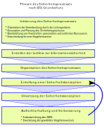

<!--
author:   Günter Dannoritzer
email:    g.dannoritzer@wvs-ffm.de
version:  0.3.0
date:     04.04.2024
language: de
narrator: Deutsch Female

comment:  Schutzbedarfsanalyse im eigenen Arbeitsbereich durchführen.

logo:     02_img/logo-it-grundschutz.jpg

tags:     LiaScript

link:     https://cdn.jsdelivr.net/chartist.js/latest/chartist.min.css

script:   https://cdn.jsdelivr.net/chartist.js/latest/chartist.min.js

-->

# Leitfragen zum IT-Grundschutz des BSI

 * Für welche Unternehmen gilt die Anforderung eines Mindestniveaus an IT-Schutz?
 * Wie wird das Mindestniveau in IT-Sicherheit spezifiziziert?
 * Wozu dienen die Grundschutzkataloge des BSI-Standards 200?
 * Was ist die Alternative zum IT-Grundschutz für Unternehmen, die ein Mindestniveau an IT-Sicherheit benötigen?

# Was ist IT-Grundschutz?

* [It-Sicherheitsgesetz BSIG](https://www.gesetze-im-internet.de/bsig_2009/) schreibt vor:

   * Betreiber kritischer Infrastruktur müssen ein angemessenes IT-Schutzniveau aufweisen
   * Als kritische Infrastruktur gilt: Energie, IT, Telekommunikation, Transport und Verkehr, Gesundheit, Wasserversorgung, Ernährung, Finanz- und Versicherungswesen

* Informationssicherheits-Managementsystem (ISMS) nach ISO 27001

    * Nach Vorgaben der ISO 27001 werden Geschäftsprozesse beschrieben, deren Ziel die IT-Sicherheit ist.
    * Jede Mitarbeiterrin und jeder Mitarbeiter muss sich an die Prozesse halten.
    * Von externen Unternehmen werden die erstellten Prozesse und deren Umsetzung im Arbeitsalltag regelmäßig überprüft und eine **Zertifizierung nach ISO 27001** für das Unternehmen ausgesprochen.

* Der IT-Grundschutz ist eine Umsetzungsunterstützung für den Aufbau eines ISMS nach ISO 27001
* Ziel des Grundschutzes ist es, Unternehmen zu unterstützen, einen *angemessenes Schutzniveau* für IT-Systeme zu erreichen.
* Der Grundschutzkatalog des BSI bietet Sicherheitsmaßnahmen die organisisert sind in:

  * technische
  * infrastrukturelle
  * organisatorische
  * personelle

# Umsetzung des IT-Grundschutzes

## Sicherheitsleitlinie

## Absicherungen nach IT-Grundschutz
 

 * Die **Basis-Absicherung** ist interessant für einen Einstieg in den IT-Grundschutz, um alle relevanten Geschäftsprozesse mit Basismaßnahmen abzusichern.
 * Die **Standard-Absicherung** entspricht der empfohlenen Vorgehensweise nach dem IT-Grundschutz und bietet einen umfassenden Schutz für alle Prozesse und Bereiche.
 * Die **Kern-Absicherung** fokusiert sich auf die sogenannten **Kronjuwelen** einer Institution. Damit sind die Systeme, Abläufe und Prozesse gemeint, die das Kerngeschäft der Institutition ausmachen.

## Vorgehen nach der Variante Standardabsicherung

 TODO: Vorgehensweise basierend auf dem Bild zeigen

### Strukturanalyse

### Schutzbedarfsanalyse

### Modellierung

### IT-Grundschutz-Check Teil 1

### Risikoanalyse

### Umsetzung planen

# Schutzbedarfsanalyse im eigenen Arbeitsbereich durchführen

 * bild mit rotem 
 * JIKU-Bild

# IHK-Abschlussprüfung für die Fachrichtung Systemintegration

Die Anforderungen für das Abschlussprojekt werden in der [Verordnung über die Berufsausbildung zum Fachinformatiker und zur Fachinformatikerin* (Fachinformatikerausbildungsverordnung - FIAusbV) vom 28.02.2020](https://www.gesetze-im-internet.de/fiausbv/FIAusbV.pdf) festgelegt. Für die Fachrichtung Systemintegration beschreibt der §20 "Prüfungsbereich Planen und Umsetzen eines Projektes der Systemintegration" folgende Anforderungen:

  (1) Im Prüfungsbereich Planen und Umsetzen eines Projektes der Systemintegration besteht die Prüfung aus zwei Teilen.

  (2) Im ersten Teil hat der Prüfling nachzuweisen, dass er in der Lage ist,

  1. auftragsbezogene Anforderungen zu analysieren,
  2. Lösungsalternativen unter Berücksichtigung technischer, wirtschaftlicher und qualitativer Aspekte vorzuschlagen,
  3. Systemänderungen und -erweiterungen durchzuführen und zu übergeben,
  4. IT-Systeme einzuführen und zu pflegen,
  5. Schwachstellen von IT-Systemen zu analysieren und Schutzmaßnahmen vorzuschlagen und umzusetzen sowie
  6. Projekte der Systemintegration anforderungsgerecht zu dokumentieren.

  Der Prüfling hat eine betriebliche Projektarbeit durchzuführen und mit praxisbezogenen Unterlagen zu dokumentieren. Vor der Durchführung der Projektarbeit hat er dem Prüfungsausschuss eine Projektbeschreibung zur Genehmigung vorzulegen. In der Projektbeschreibung hat er die Ausgangssituation und das Projektziel zu beschreiben und eine Zeitplanung aufzustellen. Die Prüfungszeit beträgt für die betriebliche Projektarbeit und für die Dokumentation mit praxisbezogenen Unterlagen höchstens 40 Stunden.

  Für das Projekt ist in Bezug auf das Lernfeld 4 der Punkt **5. Schwachstellen von IT-Systemen zu analysieren und Schutzmaßnahmen vorzuschlagen und umzusetzen** relevant.

Der [Bewertungsbogen zum Projekt der IHK-Frankfurt](https://www.frankfurt-main.ihk.de/blueprint/servlet/resource/blob/6089272/fa59060ce400e323fc1ffdb2192653e8/fisi-bewertung-betriebl-projektarbeit-dihk-10-2023-data.pdf) listet unter **2. Ressourcen-/Ablaufplan** die Punkte:

  * Analyse der Schwachstellen des IT-Systems und/ oder Schutzbedarfsanalyse
  * Darstellung der vorgeschlagenen Schutzmaßnahmen

und unter **6. Kundendokumentation/Anhang**
 
  * Schutzbedarfsanalyse (Auszug)

Die Herausforderung ist also, unter der Restriktion das Projekt in 40 Stunden durchzuführen, dabei auch noch zu zeigen, dass Sie exemplarisch eine Schutzbedarfsanalyse durchführen, Schutzmaßnahmen vorschlagen und diese auszugsweise dokumentieren. Realistisch gesehen können hierzu aus den 40 Stunden nur 1-2 Stunden verwendet werden.

Es ist sinnvoll bei der Dokumenation eine Übersichtsgrafik zu erstellen, in der das Projekt und die angrenzenten Systeme dargestellt werden. Basierend auf dieser Übersichtszeichnung können die Schritte:

 * Strukturanalyse
 * Schutzbedarfsanalyse
 * Vorschlag für Schutzmaßnahmen

durchgeführt werden. Je nach komplexität des Projektes ist das nur exemplarisch durchzuführen.