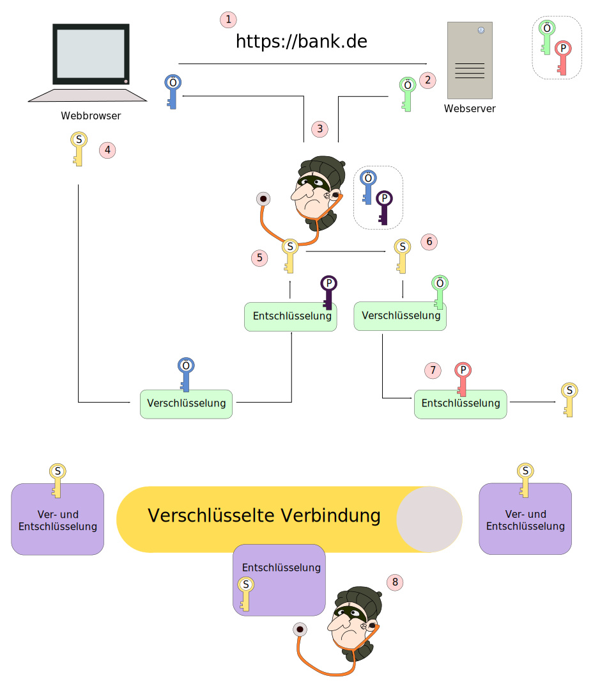
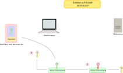

<!--
author:   Günter Dannoritzer
email:    g.dannoritzer@wvs-ffm.de
version:  2.1.2
date:     23.05.2024
language: de
narrator: Deutsch Female

comment:  Verschlüsselung; symmetrische und asymmetrische Verschlüsselung; 
            hybride Verschlüsselung; digitale Signatur; X.509 Zertifikate; openSSL

icon:    https://raw.githubusercontent.com/dsp77/wvs-liascript/0938e2e0ce751e270e3e36b8ecfeb09044a41aa0/wvs-logo.png
logo:    02_img/logo-encryption.jpg

tags:    LiaScript

link:    https://cdn.jsdelivr.net/chartist.js/latest/chartist.min.css

script:  https://cdn.jsdelivr.net/chartist.js/latest/chartist.min.js

attribute: Lizenz: [CC BY-SA](https://creativecommons.org/licenses/by-sa/4.0/)

translation: English translation/verschluesselung_en.md
-->

# Verschlüsselung - Übersicht

Verschlüsselung ist eine zentrale Technik, um das *Schutzziel* der **Vertraulichkeit** von Informationen zu gewährleisten. Grundlegende Komponenten der Verschlüsselung sind:

 * Algorithmus der Ver- und Entschlüsselung erlaubt
 * Ein Schlüssel oder Schlüsselpaar, durch das die Geheimhaltung erfolgt

Bereits 1883 wurde von Auguste Kerckhoffs ein Grundsatz der modernen Kryptographie aufgestellt. Dieser besagt, dass die Sicherheit eines Verschlüsselungsverfahrens auf der Geheimhaltung des Schlüssels und nicht des Algorithmus beruht.

In dieser Lektion werden die Konzepte von symmetrischer und asymmetrischer Verschlüsselung und deren Verbindung in der hybriden Verschlüsselung erklärt. Die Lösung des Authentizitätsproblems in der hybriden Verschlüsselung wird mithilfe von digitalen Zertifikaten nach X.509 beschrieben. Um die Handhabung der Zertifikate zu verstehen, ist die Anwendung der asymmetrischen Verschlüsselung in der digitalen Signatur nötig. Dazu sind Kenntnisse über Hashfunktionen nötig, die hier ebenfalls erklärt werden.

Der Inhalt ist geglieder int:

 * Symmetrische Verschlüsselung
 * Asymmetrische Verschlüsselung
 * Hybride Verschlüsselung
 * Authentizität bei hybrider Verschlüsselung
 * Hashfunktion
 * Digitale Signatur
 * Digitale Zertifikate nach X.509


# Symmetrische Verschlüsselung

Ablauf einer symmetrischen Verschlüsselung


  1. Der Sender erzeugt einen Schlüssel, der zur Ver- und Entschlüsselung (symmetrisch) verwendet wird. Der Schlüssel muss zum Empfänger übertragen werden.
  2. Der Sender verschlüsselt seine Nachricht mit dem erzeugten Schlüssel. Die verschlüsselte Nachricht wird als Chiffre bezeichnet.
  3. Anschließend überträgt er das Chiffre zum Empfänger.
  4. Der Empfänger entschlüsselt die Nachricht mit dem zuvor empfangenen Schlüssel.


Wichtige Eigenschaften:

 * Sender und Empfänger verwenden den gleichen Schlüssel.
 * Der Schlüsselaustausch stellt eine besondere Anforderung an die sichere Verwendung des Verfahrens.
 * Der Rechenaufwand für symmetrische Verschlüsselungsverfahren ist vergleichsweise gering. Daher werden sie z.B. für die Transportverschlüsselung über Netzwerke verwendet.

# Asymmetrische Verschlüsselung

Ablauf einer asymmetrischen Verschlüsselung


 1. Der Empfänger erzeugt ein Schlüsselpaar, mit privaten und öffentlichen Schlüssel.
 2. Den öffentlichen Schlüssel stellt der Empfänger öffentlich zur Verfügung.
 3. Der Sender verschlüsselt seine Nachricht mit dem öffentlichen Schlüssel des Empfängers.
 4. Das Chiffre wird vom Sender zum Empfänger übertragen.
 5. Der Empfänger entschlüsselt das Chiffre mit seinem privaten Schlüssel.

Wichtige Eigenschaften

 * Kein geheimer Schlüsselaustausch nötig, da öffentlicher Schlüssel keine Geheimhaltung erfordert.
 * Verfahren ist vergleichsweise langsam und eignet sich nur für die Verschlüsselung kleiner Datenmengen.

# Hybride Verschlüsselung

Dem offensichtlichen Vorteil der asymmetrischen Verschlüsselung steht der Nachteil entgegen, dass sie sehr rechenaufwendig und langsam ist. Symmetrische Verschlüsselungsverfahren sind im Vergleich um Größenordnungen schneller, erfordern aber einen sicheren Schlüsselaustausch.

In der Praxis nutzt mand ie Vorteile beider Verfahren, indem man sie zur hybriden Verschlüsselung kombiniert.

Ablauf einer hybriden Verschlüsselung beim Aufruf einer HTTPS-Seite über einen Webbrowser.


 1. Über den Webbrowser soll eine verschlüsselte Verbindung zum Webserver aufgebaut werden. Dazu ruft der Webbrowser die https-Seite auf.
 2. Der Webserver sendet seinen öffentlichen Schlüssel an den Webbrowser.
 3. Der Webbrowser erzeugt einen Session-Schlüssel, mit dem die Verbindung (symmetrisch) verschlüsselt werden soll. Um den Session-Schlüssel an den Webserver zu übertragen, verschlüsselt der Browser den Schlüssel mit dem öffentlichen Schlüssel des Webservers.
 4. Der verschlüsselte Session-Schlüssel wird vom Webserver mit seinem privaten Schlüssel entschlüsselt.
 5. Webbrowser und Webserver bauen mit dem Session-Schlüssel eine verschlüsselte Verbindung auf.


# Hybride Verschlüsselung mit Man-In-The-Middle (MITM)

Das folgende Beispiel beschreibt einen Man-in-the-Middle-Angriff auf eine hybridverschlüsselte Verbindung.




 1. Über den Webbrowser soll eine verschlüsselte Verbindung zum Webserver aufgebaut werden. Dazu ruft der Webbrowser die https-Seite auf.
 2. Der Webserver sendet seinen öffentlichen Schlüssel an den Webbrowser.
 3. Der Man-in-the-Middle fängt den öffentlichen Schlüssel ab und sendet seinen eigenen öffentlichen Schlüssel an den Webbrowser.
 4. Der Webbrowser erzeugt wieder den Session-Schlüssel und verschlüsselt ihn, jetzt aber mit dem öffentlichen Schlüssel des Man-in-the-Middle und sendet ihn zurück.
 5. Der Man-in-the-Middle fängt wieder den verschlüsselten Session-Schlüssel ab und entschlüsselt ihn mit seinem privaten Schlüssel.
 6. Der Man-in-the-Middle verschlüsselt jetzt den Session-Schlüssel mit dem abgefangenen öffentlichen Schlüssel des Webserver und leitet #ihn weiter an den Webserver.
 7. Der Webserver entschlüsselt jetzt den Session-Schlüssel und baut eine verschlüsselte Verbindung mit dem Webbrowser auf.
 8. Da der Man-in-the-Middle den Session-Schlüssel abfangen konnte, kann er die verschlüsselte Verbindung entschlüsseln und die übertragenen Daten mitlesen.

Um den Man-in-the-Middle auszusperren, muss der Webbrowser sicherstellen, dass der öffentliche Schlüssel wirklich vom Webserver kommt. Mit dem öffentlichen Schlüssel alleine wäre es nur möglich, wenn nach der Übermittlung des Schlüssels vom Server, der Browsernutzer den Schlüssel mit dem Serveradmin z.B. per Telefon vergleichen. Das ist praktisch aber nicht möglich. Eine Lösung liegt hier in digitalen Zertifikaten. **Mit einem Zertifikat wird dem öffentlichen Schlüssel zertifiziert, dass er zu dem festgelegten Domänennamen gehört.**


# Hashfunktion

Eine **Hashfunktion** bildet aus einer Nachricht beliebiger Länge einen Hashwert fester Größe. Dabei gibt es keine Umkehrfunktion, mit der die
ursprüngliche Nachricht von dem gegebenen Hashwert zurück gerechnet werden kann.

````
   .----------.
   |          |    .------------------
   | Das ist  |    | kryptografische   \    Hashwert
   | ein Text |    | Hashfunktion      /    (z.B. 0xa4d7e4f2)
   |          |    '------------------
   '----------'
````

## Abgrenzung Kodierung, Verschlüsselung

Der Prozess einer **Hashwertberechnung** wird häufig mit den Begriffen **Codierung** und **Verschlüsselung** verwechselt. Deshalb soll hier eine Abgrenzung zu den Begriffen gefunden werden.

### Codierung

Für die **Codierung** wird ein bestimmter Algorithmus oder eine Zuordnung angewendet, die durch **Decodierung** auch wieder rückkehrbar ist. Die Codierung ist nötig, um die Übertragung oder Speicherung von Daten über oder auf bestimmten Medien zu ermöglichen und dient nicht der Geheimhaltung.


````
   .----------.
   |          |    .------------------.
   | Das ist  |   /  Codierung /        \    Codierter Text
   | ein Text |   \  Decodierung        / 
   |          |    '------------------'
   '----------'
````

Ein Beispiel ist die Codierung von ASCII-Zeichen:


| ASCII Zch. (Hex, Dez) | Zeichen |
|------------|---------|
| 0x40, 64   |  \@ |
| 0x41, 65   |  A |
| 0x42, 66   |  B |
| 0x43, 67   |  C |
| 0x44, 68   |  D |
| ...| ... |

Vergleiche dazu den [Wikipedia-Artikel zu ASCII](https://de.wikipedia.org/wiki/American_Standard_Code_for_Information_Interchange).

Eigenschaften der Codierung sind:

 * Algorithmus oder Zuordnung sind in der Regel bekannt.
 * Der Prozess ist durch Decodierung umkehrbar.
 * Ziel ist die Speicherung oder Übertragung von Daten über ein bestimmtes Medium zu erreichen. Geheimhaltung ist kein Ziel der Codierung.
 
### Verschlüsselung

Bei der Verschlüsselung wird mithilfe eines, meist bekannten, kryptografischen Algorithmus und einem Schlüssel bzw. eines Schlüsselpaares eine Nachricht verschlüsselt. Die verschlüsselte Nachricht wird als Chiffre bezeichnet. Eine Entschlüsselung ist mit dem entsprechenden Schlüssel möglich. Geheimhaltung wird durch den Schlüssel erzeugt.


````
   .----------.                            .-----------.
   |          |    .------------------.    |           |
   | Das ist  |    | kryptografischer |    |  Chiffre  |
   | ein Text |--->|                  |--->| 101010110 |
   |          |    |   Algorithmus    |    | 011100101 |
   |          |    '------------------'    | 110011000 |
   '----------'             ^              '-----------'
                            |
                        Schlüssel
````

Eigenschaften der Verschlüsselung sind:

 * In der Regel ist der Algorithmus bekannt.
 * Die Verschlüsselung wird durch Zugabe eines extra erzeugten Schlüssels erzeugt.
 * Der Prozess ist umkehrbar durch Zugabe eines passenden Schlüssels.
 * Die Geheimhaltung wird durch den Schlüssel erzeugt.


## Beschreibung der Hashfunktion

Eine Hashfunktion, auch Streuwertfunktion genannt, ist eine Funktion, um eine Eingabemenge beliebiger Größe auf eine Zielmenge **fester Länge** abzubilden. Der Name leitet sich ab vom englischen Wort *to hash*, was mit klein hacken bzw. klein schneiden übersetzt werden kann und die Funktion beschreibt, dass aus dem Ergebnis der Hashfunktion **kein Rückschluss auf den Eingabewert** zulässt. Was die Funktion jedoch auszeichnet, ist, dass immer der **gleiche Eingabewert auch immer den gleichen Ausgabewert erzeugt und dieser einmalig ist.** D.h., es gibt keinen anderen Eingabewert, der diesen Ausgabewert erzeugt, was den Ausgabewert einmalig, wie einen Fingerabdruck macht. Daher wird der Hashwert auch als Fingerabdruck für die eingegebenen Daten bezeichnet.

Die Einmaligkeit des Hashwertes ist nicht hundertprozentig gegeben und wird als **Kollision** bezeichnet. Gute Hashfunktionen zeichnen sich durch eine äußerst niedrige Wahrscheinlichkeit einer Kollision aus.

Um eine Kollision zu verstehen, soll eine gedachte Hashfunktion verwendet werden, die einen Hashwert von 3-Bit erzeugt. Mit den drei Bit können $2^3 = 8$ Hashwerte, also die Zahlen 0 bis 7 erzeugt werden. Alle Daten, für die ein Hashwert berechnet werden soll, müssen auf die Zahlen 0 bis 7 abgebildet werden. Nehmen wir als Beispiel nur die Buchstaben des Alphabets, so wird klar, dass das nicht möglich ist und Kollisionen entstehen.

Der Hash-Algorithmus ist ein sogenannter Einwegalgorithmus. Die Berechnung in die eine Richtung ist sehr einfach und schnell durchführbar. Die Umkehrberechnung dagegen zeitaufwendig und kompliziert, da es keine Umkehroperation gibt. Eine Umkehroperation für die Addition z.B. ist die Subtraktion. Ist die Frage, 4 + ? = 9, also, welche Zahl muss ich zu 4 addieren, um 9 zu erhalten? Dann kann ich die Berechnung mithilfe der Umkehroperation umstellen, auf 9 - 4 = ?. Der Rechenaufwand für beide Operationen ist gleich.
Für die Hashfunktion gibt es diese Umkehroperation nicht. Wenn z.B. der SHA1 für die Zahl 3 berechnet wird, sieht das Ergebnis folgendermaßen aus:

 * sha1(3) = `a3db5c13ff90a36963278c6a39e4ee3c22e2a436`

SHA1 erzeugt immer einen 160-Bit (20 Byte) langen Hashwert. Es gibt keine Umkehroperation, um aus dem Hashwert die Zahl 3 zu berechnen. Der einzige Weg ist, durch Ausprobieren, solange Hashwerte von verschiedenen Eingabewerten zu berechnen, bis das Ergebnis vorliegt.

Es hilft auch nicht, aus dem Hashwert auf Nachbarwerte der Eingabe zu schließen. Als Beispiel sind für die benachbarten Werte 2, 3, 4 und 5 die Hashwerte berechnet.

 * sha1(2) = `7448d8798a4380162d4b56f9b452e2f6f9e24e7a`
 * sha1(3) = `a3db5c13ff90a36963278c6a39e4ee3c22e2a436`
 * sha1(4) = `9c6b057a2b9d96a4067a749ee3b3b0158d390cf1`
 * sha1(5) = `5d9474c0309b7ca09a182d888f73b37a8fe1362c`

Die Hashwerte benachbarter Eingabewerte unterscheiden sich vollkommen voneinander.

## Beispiel für Hashfunktionen

Bekannte kryptologische Hashfunktionen sind:

 * MD2, MD4, MD5
 * Secure Hash Algorithm (SHA)

### MD5

Message-Digest Algorithm 5 (MD5) ist eine weitverbreitete kryptografische Hashfunktion, die aus einer beliebigen Nachricht einen 128-Bit-Hashwert erzeugt. Dies erlaubt etwa die leichte Überprüfung eines Downloads auf Korrektheit. MD5 wurde 1991 von Ronald L. Rivest entwickelt. Sie gilt inzwischen nicht mehr als sicher, da es mit überschaubarem Aufwand möglich ist, unterschiedliche Nachrichten zu erzeugen, die den gleichen MD5-Hashwert aufweisen.

### SHA

Der Begriff Secure Hash Algorithm (kurz SHA, englisch für sicherer Hashalgorithmus) bezeichnet eine Gruppe standardisierter kryptologischer Hashfunktionen. Diese dienen zur Berechnung eines eindeutigen Prüfwerts für beliebige digitale Daten (Nachrichten) und sind die Grundlage zur Erstellung einer digitalen Signatur.

Bereits 1993 veröffentlichte das amerikanische National Institute of Standards and Technology (NIST) eine Norm, in der der Secure-Hash-Algorithm (SHA) beschrieben wurde. Aus Eingangsdaten beliebiger Länge errechnet er einen Hashwert von 160-Bit-Länge.

Mit der Erweiterung des Algorithmus wurden diesem Nummern angehängt.

 * SHA-1, leicht modifizierter Algorithmus, erzeugt ebenfalls 160-Bit Hashwerte
 * SHA-2, fügt vier weitere Algorithmen dem Standard hinzu. Unter SHA-2 gibt es die Hashfunktionen SHA-224, SHA-256, SHA-384 und SHA-512. Die Zahl gibt die Länge des erzeugten Hashwertes an.
 * SHA-3, neuer Algorithmus, der im August 2015 als Alternative zu SHA-2 standardisiert wurde.

Ab dem Jahr 2005 wurden in Abständen verschiedene, erfolgreiche Kollisionsangriffe auf den SHA-1-Algorithmus veröffentlicht und im Oktober 2015 veröffentlichten die Forscher Marc Stevens, Pierre Karpman und Thomas Peyrin die Ergebnisse eines Angriffs, der zu der Empfehlung führte, die Nutzung von SHA-1 so bald wie möglich einzustellen.

## Eigenschaften der Hashfunktion

Eigenschaften der Hashfunktion sind:

 * In der Regel ein bekannter Algorithmus.
 * Ein bestimmter Datensatz wird durch den Algorithmus auf einen bestimmten Hashwert abgebildet. Nur der eine Datensatz erzeugt immer den gleichen Hashwert. Daher wird der Hashwert auch als **Fingerabdruck der Daten** bezeichnet.
 * Egal, wie groß die Daten sind, der Hashwert hat basierend auf dem Algorithmus immer die gleiche Länge (z.B. 512-Bit).
 * Es gibt keine Umkehrfunktion für den Algorithmus. Den zugehörigen Datensatz für einen Hashwert erhält man nur durch Ausprobieren, also der Berechnung verschiedener Datensätze und dem Vergleich der erzeugten Hashwerte mit dem gesuchten.


# Digitale Signatur

Neben der Verschlüsselung kann ein asymmetrischer Verschlüsselungsalgorithmus auch für die digitale Signatur angewendet werden. Diese Anwendung wird hier in den Bereich der Signierung und der Überprüfung der Signatur aufgeteilt.


## Digitale Signatur - Sendeseite (Signierung)


Mithilfe einer Signatur ist es möglich, zu überprüfen, ob eine Nachricht oder Daten nicht verändert wurden. Eine weitere Anwendung ist, die Authentizität des Senders zu überprüfen. Auf der Sendeseite laufen dazu folgende Schritte ab.

 1. Die **Versenderin erzeugt ein Schlüsselpaar** mit privaten und öffentlichen Schlüsseln.
Den öffentlichen Schlüssel macht sie für mögliche Empfänger verfügbar.
 2. Von einer Nachricht, die sie versenden möchte, erzeugt sie einen Hashwert.
 3. Den Hashwert verschlüsselt sie mit ihrem privaten Schlüssel. Jeder im Besitz des öffentlichen Schlüssels kann jetzt daraus den Hashwert entschlüsseln.
 4. Die Nachricht versendet sie zusammen mit der Signatur.

Hierzu eine kurze Erläuterung, warum eine Hashfunktion verwendet wird. Eigentlich könnte auch einfach die Nachricht mit dem privaten Schlüssel verschlüsselt werden. Eine asymmetrische Verschlüsselung ist aber zeitaufwendig. Bei einfachen Nachrichten ist das vielleicht noch akzeptabel. Soll aber das Image einer virtuellen Maschine mit einer Größe von mehreren Gibibyte signiert werden, erfordert das einen entsprechenden Aufwand. Hier nur den Hashwert der Daten zu nehmen, ergibt durch die Eigenart der Hashfunktion, einen Fingerabdruck der Daten zu sein, die Möglichkeit, die Signatur immer nur über den Hashwert durchführen zu müssen und damit, unabhängig wie groß die Daten sind, eine immer gleich große Signatur zu erhalten.


## Digitale Signatur - Empfangsseite

 

Auf der Empfängerseite kann jetzt mithilfe des öffentlichen Schlüssels der Senderin überprüft werden, ob die Nachricht verändert wurde. Wird zusätzlich überprüft, ob der öffentliche Schlüssel wirklich von der Senderin kommt, kann damit die Nachricht ihr zugeordnet werden.

 1. Der Empfänger erhält eine Nachricht mit Signatur von der Senderin.
 2. Der Empfänger erhält den öffentlichen Schlüssel der Senderin.
 3. Der Empfänger **entschlüsselt die Signatur** der Nachricht mit dem öffentlichen Schlüssel und erhält den Hashwert der Nachricht.
 4. Der Empfänger **berechnet den Hashwert** der empfangenen Nachricht.
 5. Der Empfänger **vergleicht den berechneten mit dem entschlüsselten Hashwert**. Sind beide gleich, wurde die Nachricht nicht verändert. Wurde sichergestellt, dass der öffentliche Schlüssel wirklich von der Senderin ist, kann damit auch die Nachricht ihr zugeordnet werden.


# Digitale Zertifikate nach X.509

Im Abschnitt der hybriden Verschlüsselung wurde das Problem erläutert, dass die Authentizität des öffentlichen Schlüssels nicht sichergestellt werden kann.

Ein digitales Zertifikat nach der ITU-Empfehlung X.509 erlaubt die Authentizität eines öffentlichen Schlüssels zu überprüfen.

 * Datensatz der Identität, Domainname, E-Mail, öffentlichen Schlüssel, mit digitaler Signatur bestätigt
 * Beispiel ITU-T X.509 Zertifikat, mit dem öffentliche Schlüssel bestätigt werden
 * Inhalt eines Zertifikats:

 1. Den Namen (oder eine andere eindeutige Bezeichnung) des Ausstellers des Zertifikats.
 2. Informationen zu den Regeln und Verfahren, unter denen das Zertifikat ausgegeben wurde.
 3. Informationen zur Gültigkeitsdauer des Zertifikats.
 4. Den öffentlichen Schlüssel, zu dem das Zertifikat Angaben macht.
 5. Den Namen (oder eine andere eindeutige Bezeichnung) des Eigentümers des öffentlichen Schlüssels.
 6. Weitere Informationen zum Eigentümer des öffentlichen Schlüssels.
 7. Angaben zum zulässigen Anwendungs- und Geltungsbereich des öffentlichen Schlüssels.
 8. Eine digitale Signatur des Ausstellers über alle anderen Informationen.

Zusammenfassend kann man sagen, durch ein digitales Zertifikat versichert eine Zertifizierungsstelle mithilfe einer digitalen Signatur, dass der im Zertifikat enthaltene öffentliche Schlüssel dem Inhaber gehört.

Ein Empfänger muss grundlegend der Zertifizierungsstelle vertrauen. Mithilfe des öffentlichen Schlüssels der Zertifizierungsstelle kann ein Empfänger die Integrität des Zertifikats überprüfen. Vertraut er der Zertifizierungsstelle, dass diese die Authentizität des Zertifikatsinhabers richtig überprüft hat, wird aus der Integritätsprüfung auch eine Authentizitätsprüfung.

## Zertifizierung - Erstellung eines Zertifikats für einen Webserver

Die Abbildung zeigt die Schritte zur Erstellung eines Zertifikats für einen Webserver.


 1. Der Administrator des Servers erstellt für den verwendeten Domäne-Namen des Servers ein Schlüsselpaar, bestehend aus privaten und öffentlichen Schlüsseln. Ein dafür verwendbares Tool ist OpenSSL.
 2. Mit dem gleichen Tool kann der **Certificate Signing Request (CSR)** erstellt werden. Der CSR ist ein elektronisches Dokument, in dem neben dem öffentlichen Schlüssel des Servers alle notwendigen Informationen für das Zertifikat enthalten sind. Der Administrator sendet dieses CSR mit der nötigen Authentifizierung an eine Zertifizierungsstelle, auf Englisch Certificate Authority (CA).
 3. Bei der Zertifizierungsstelle wird die Authentizität des Administrators geprüft. Neben seiner Identität wird z.B. geprüft, ob er überhaupt berechtigt ist, für den gewünschten Domäne-Namen ein Zertifikat zu beantragen. Die Zertifizierungsstelle nimmt dann die Daten aus dem Certificate Signing Request und erstellt daraus das Zertifikat für den Webserver. Die Daten des Zertifikats werden dann gehasht und der Hashwert mit dem privaten Schlüssel der Zertifizierungsstelle als Signatur dem Zertifikat angehängt.
 4. Das signierte Zertifikat hinterlegt der Administrator jetzt auf dem Webserver.

Voraussetzung, dass ein Browser beim Zugriff auf die Webseite das Zertifikat überprüfen kann, ist, dass das Zertifikat der Zertifizierungsstelle, also der zugehörige öffentliche Schlüssel zur Signatur, auf dem Browser hinterlegt ist.

## HTTPS-Verbindungsaufbau - Schritt 1

Beim Aufbau einer HTTPS-Verbindung zu einem Webserver erfolgen jetzt folgende Schritte mit dem Zertifikat.


 1. Mit Aufruf der Webseite über die Protokollspezifikation https signalisiert der Browser dem Webserver, dass er eine verschlüsselte Verbindung aufbauen möchte.
 2. Der Webserver sendet sein Zertifikat mit dem öffentlichen Schlüssel an den Browser.
 3. Der Browser überprüft die Gültigkeit des Zertifikats; neben dem Ablaufdatum wird die digitale Signatur des Zertifikats mithilfe des im Browser hinterlegten Zertifikats der Zertifizierungsstelle überprüft.


## Zertifikat im Browser überprüfen - Schritt 2

Die Überprüfung des Zertifikats findet im Browser folgendermaßen statt.


 1. Gültigkeitsdatum ist bis jetzt nicht abgelaufen.
 2. Das Zertifikat ist für den Domänen-Namen ausgestellt, der vom Browser aufgerufen wurde.
 3. Vom empfangenen Zertifikat des Servers wird die Signatur mithilfe des öffentlichen Schlüssels aus dem Zertifikat der CA entschlüsselt. Erhalten wird der Hashwert, den die Zertifizierungsstelle bei der Erstellung des Zertifikats vom Inhalt des Zertifikats gebildet hat.
 4. Der Browser erstellt einen eigenen Hashwert über den Inhalt des empfangenen Zertifikats.
 5. Die beiden Hashwerte werden verglichen. Sind sie gleich, wurde das Zertifikat nicht verändert und entspricht vom Inhalt den Daten, die der Zertifizierungsstelle bei der Erstellung des Zertifikats vorlagen.


## Sessionschlüssel Austausch - Schritt 3

Nach Überprüfung des vom Webserver empfangenen Zertifikats geht es an den Austausch des symmetrischen Sessionschlüssels. Die Schritte dazu sind:



 4. Der Browser erzeugt einen symmetrischen Schlüssel, der als Sessionschlüssel an den Server übertragen wird.
 5. Für die Übertragung wird er mit dem öffentlichen Schlüssel des Webservers verschlüsselt. Der Webserver entschlüsselt dann den Sessionschlüssel mit seinem privaten Schlüssel.


## Verschlüsselte Übertragung - Schritt 4

Nach Austausch des Sessionschlüssels findet zwischen Webbrowser und Server eine verschlüsselte Übertragung der Verbindung statt.


# Praktische Übung; Mit openSSL eine eigene Zertifizierungsstelle betreiben


 * Privater Schlüssel mit Zertifikat erstellen: `openssl req -x509 -sha256 -nodes -days 365 -newkey rsa:4096 -keyout private_ca.key -out certificate_ca.crt`
 * Privaten Schlüssel und CSR erstellen: `openssl req -new -newkey rsa:2048 -nodes -out csr_customer.csr -keyout private_customer.key`
 * Zertifikat aus CSR erstellen und mit privaten Schlüssel signieren: `openssl x509 -req -in csr_customer.csr -signkey private_ca.key -out certificate_customer.crt`
 * Zertifikat anzeigen: `openssl x509 -in certificate.crt -text -noout`

Sie wechseln von der Rolle des Admin der CA zum Kunden der CA. Es ist sinnvoll, die zwei Ordner CA und Kunde anzulegen und die jeweiligen Aktivitäten in den entsprechenden Ordnern durchzuführen.

```
 +- CA
 +- Kunden
```

## Aufgabe

 * Admin CA: Erstellen Sie einen privaten Schlüssel und leiten Sie davon den öffentlichen Schlüssel ab. Erstellen Sie davon ein Zertifikat und signieren Sie das selbst.
 * Kunde CA:

   * Erstellen Sie einen privaten Schlüssel und erstellen Sie daraus einen Certificate Signing Request (CSR) und tragen die nötigen Parameter ein.
   * Senden (kopieren) Sie den CSR an die CA.

 * Admin CA:

   * Überprüfen Sie den CSR
   * Erstellen Sie aus dem CSR ein Zertifikat und signieren Sie es mit Ihrem privaten Schlüssel
   * Senden (kopieren) Sie das Zertifikat dem Kunden zurück

## Fragen

 * Welche Sicherung ist für den privaten Schlüssel sinnvoll?
 * Admin CA: Was machen Sie mit Ihrem privaten Schlüssel?
 * Was machen Sie mit dem Zertifikat zu Ihrem privaten Schlüssel?
 * Kunde CA: Was machen Sie mit Ihrem privaten Schlüssel?
 * Was machen Sie mit dem Zertifikat zu Ihrem privaten Schlüssel?

 Quelle: https://www.ipswitch.com/de/blog/wie-man-mit-openssl-zertifikat-generiert