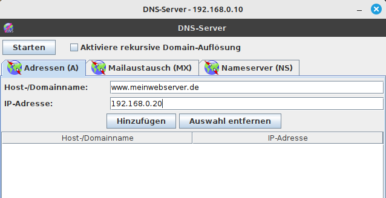

<!--
author:   Günter Dannoritzer
email:    g.dannoritzer@wvs-ffm.de
version:  0.3.0
date:     12.02.2025
language: de
narrator: Deutsch Female

comment:  Domain Name System (DNS) - Zweiter Teil

icon:    https://raw.githubusercontent.com/dsp77/wvs-liascript/0938e2e0ce751e270e3e36b8ecfeb09044a41aa0/wvs-logo.png
logo:     02_img/logo-dns2.jpg

tags:     LiaScript, Domain Name System, DNS, Server

link:     https://cdn.jsdelivr.net/chartist.js/latest/chartist.min.css

script:   https://cdn.jsdelivr.net/chartist.js/latest/chartist.min.js

attribute: Lizenz: [CC BY-SA](https://creativecommons.org/licenses/by-sa/4.0/)
-->
# Domain Name System (DNS) - Zweiter Teil

Diese Information baut auf dem ersten Teil [DNS](https://liascript.github.io/course/?https://raw.githubusercontent.com/dsp77/wvs-liascript/main/LF03/dns.md) im Lernfeld 3 auf.


## DNS-Records

DNS-Records (Domain Name System Records) sind spezifische Einträge in der DNS-Datenbank, die festlegen, wie eine Domain und deren Subdomains aufgelöst werden sollen. Sie enthalten wichtige Informationen darüber, welche IP-Adresse oder Dienste einer bestimmten Domain zugeordnet sind. Diese Einträge ermöglichen es, dass Benutzer Domains (wie beispiel.de) anstelle von IP-Adressen (wie 192.0.2.1) verwenden können.  

### Wichtige DNS-Record-Typen:

1. **A-Record (Address Record)**  
   - Verknüpft eine Domain mit einer IPv4-Adresse.  
   - Beispiel: `example.com -> 93.184.216.34`

2. **AAAA-Record (IPv6 Address Record)**  
   - Verknüpft eine Domain mit einer IPv6-Adresse.  
   - Beispiel: `example.com -> 2606:2800:220:1:248:1893:25c8:1946`

3. **CNAME-Record (Canonical Name Record)**  
   - Leitet eine Domain oder Subdomain auf eine andere Domain weiter.  
   - Beispiel: `www.example.com -> example.com`

4. **MX-Record (Mail Exchange Record)**  
   - Gibt den Mailserver für den Empfang von E-Mails an.  
   - Beispiel: `example.com -> mail.example.com`

5. **TXT-Record (Text Record)**  
   - Speichert frei definierbaren Text, oft für Sicherheits- und Verifizierungszwecke, wie SPF, DKIM oder Google-Site-Verifikation.  
   - Beispiel: `example.com -> "v=spf1 include:example.net -all"`

6. **NS-Record (Name Server Record)**  
   - Gibt an, welche Nameserver für die Domain zuständig sind.  
   - Beispiel: `example.com -> ns1.example.com`

7. **PTR-Record (Pointer Record)**  
   - Verknüpft eine IP-Adresse mit einer Domain, verwendet für Reverse-DNS-Lookups.  
   - Beispiel: `192.0.2.1 -> example.com`

8. **SRV-Record (Service Record)**  
   - Dient zur Angabe von Diensten, Ports und Protokollen für bestimmte Anwendungen.  
   - Beispiel: `_sip._tcp.example.com -> 0 5 5060 sipserver.example.com`

9. **SOA-Record (Start of Authority Record)**  
   - Enthält administrative Informationen über die Domain, wie den primären Nameserver und die Kontaktadresse.  
   - Beispiel: `ns1.example.com -> admin@example.com`

### Wofür werden DNS-Records verwendet?

- **Domainauflösung**: Übersetzung von Domainnamen in IP-Adressen.  
- **E-Mail-Routing**: Weiterleitung von E-Mails an den richtigen Mailserver (über MX-Records).  
- **Subdomain-Verwaltung**: Einrichtung von Subdomains für spezifische Dienste.  
- **Sicherheitskonfiguration**: Implementierung von SPF, DKIM und DMARC für E-Mails.  
- **Service-Routing**: Festlegen von spezifischen Diensten (z. B. VoIP, XMPP).

### DNS-Records in Filius

Die folgende Abbildung wurde bereits im ersten Teil verwendet, um einem Domain-Namen eine IPv4-Adresse zuzuordnen. Neben A-Records unterstützt der DNS-Server von Filius noch MX-Records für E-Mail und NS-Records für die Delegation zu anderen DNS-Server.



## Filius Übung `NS-Record`


### DNS-Konfiguration

Für die Namensauflösung soll der Server `dns.de` die Auflösung für den Webserver `www.domain.de` übernehmen und der Server `sub.dns.de` die Auflösung für den Webserver `www.sub.domain.de` übernehmen.

 * `dns.de`

   * **A-Record**:

     * Domain: `www.domain.de`
    * IP-Adresse: `192.168.0.20`

 * `sub.dns.de`
  
    * **A-Record**:

     * Domain: `www.sub.domain.de`
    * IP-Adresse: `192.168.0.21`


Alle Anfragen werden an den DNS-Server `dns.de` geleitet. Damit der Server die Namensauflösung für die Subdomain an den Server `sub.dns.de` weiterleitet, wird mit einem `NS-Record` eine **Delegation** eingerichtet.

 * `dns.de`

   * **NS-Record**: 
    
     * Domain: `sub.domain.de`
    * Nameserver: `sub.dns.de`

   * **A-Record**:
    
     * Host/Domainname: `sub.dns.de`
    * IP-Adresse: `192.168.0.11`

### Client- und Server-Konfiguration

Auf den beiden Webservern `www.domain.de` und `www.sub.domain.de` wird ein Webserver installiert.

Auf dem Notebook wird ein Webbrowser installiert.

### Aufgabe

Rufen Sie mit dem Notebook folgende Webseiten auf und beobachten Sie, die Signalisierung der Netzwerkverbindung (grünes blinken):

 * `www.domain.de`
 * `www.sub.domain.de`

Von welchem DNS-Server hat NB die IP-Adresse für `www.domain.de` erhalten:

 * [(x)] `dns.de`
 * [( )] `sub.dns.de`

Von welchem DNS-Server hat NB die IP-Adresse für `www.sub.domain.de` erhalten:

 * [( )] `dns.de`
 * [(x)] `sub.dns.de`

## Filius Übung `MX-Record`

Für die Einrichtung eines E-Mail-Servers werden zwei Notebooks an das Netzwerk angeschlossen. Die folgende Abbildung zeigt das erweiterte Netzwerk. Der E-Mail-Server `mail.domain.de` wird über den DNS-Server `dns.de` aufgelöst.


### DNS-Konfiguration

* `dns.de`

   * **MX-Record**: 
    
     * Maildomain: `domain.de`
    * Domainname Mailserver: `mail.domain.de`

   * **A-Record**:
    
     * Host/Domainname: `mail.domain.de`
    * IP-Adresse: `192.168.0.22`


### Client-/Server-Konfiguration

 * `mail.domain.de`

   * E-Mail-Server installieren
   * E-Mail-Konten erstellen

   * Maildomain: `domain.de`

       * Benutzername: `user1`, `user2`

Den Server starten.

  * NB1

    

 * NB2

    * Konfigurieren Sie analog zu NB1 einen `user2` auf NB2

### Aufgabe

Rufen Sie das E-Mail-Konto ab und beobachten Sie dabei die Signalisierung der Netwerkverbindung (grünes blinken). Der `mail.domain.de`-Server sollte erreicht werden.

### Mehrere E-Mail-Server

In dem vorherigen Szenario ist nur ein E-Mail-Server in Verwendung und die Nutzung von `MX-Records` ist in dem Einserver-Szenario nicht richtig erkennbar. In der folgenden Abbildung werden drei E-Mail-Server verwendet und um von einer E-Mail Domain in eine andere E-Mails zu versenden, sind die `MX-Records`notwendig.


Die zugehörige [Filius-Datei mit E-Mail-Servern](./lf10-01-dns-mail-server.fls) kann über den Link heruntergeladen werden.

## DNS-Resolver und Abfrage in der DNS-Hierarchie

Die folgende Abbildung zeigt ein Firmennetzwerk, verbunden über einen Internet-Service-Provider mit dem Internet.

Die DNS-Hierarchie der Server ist reduziert auf einen DNS-Root-Server (a.rootservers.net), einen DENIC-Server für die Top-Level-Domäne .de (`a.nic.de`) und einen `dns.1und1.de`-Server, der für die Domäne `www.domain.de` zuständig ist.


Die zugehörige [Filius-Datei mit DNS-Abfrage in der DNS-Hierarchie](02_img/lf10-01-dns-firma-provider-dns-hierarchie.fls) kann über den Link heruntergeladen werden.

Der Client **NB1** ist konfiguriert, um den lokalen DNS-Server `dns.firma.local` zu verwenden. Dieser löst lokale Domain-Namen innerhalb des Firmennetzwerks auf. Sollte er keine Auflösung durchführen können, leitet er diese an den DNS-Resolver des Internet-Service-Provides `dns.telekom.de` weiter. Dieser führt eine **rekursive Abfrage** in der DNS-Hierarchie durch.

Die DNS-Hierarchie der autoritativen DNS-Server wird über sogenannte **Delegationen** mithilfe von **NS Records** konfiguriert. Abfragende Resolver, wie in dem Beispiel der `dns.telekom.de` starten die Abfrage bei einem der [13 DNS-Root-Server](https://www.iana.org/domains/root/servers). In dem Beispiel ist nur der `a.root-servers.net` dargestellt. Die anderen 12 Server mit den Buchstaben b bis m sind gleich konfiguriert und dienen der Lastverteilung und administrativen Trennung. Die Information über die 13 Root-Server erhält der Resolver über das sogenannte [**Root Hints File**](https://www.iana.org/domains/root/files), das in der Software des DNS-Resolver hinterlegt ist. Wenn Sie z.B. bei einem Windows-Server die DNS-Rolle hinzufügen, werden Sie bei der Ausführung des Konfigurationsassistenten gefragt, wie eine nicht auflösbare Domäne behandelt werden soll. Als Auswahl ist es möglich, einen externen Resolver als sogenannten **Forwarder** einzutragen oder **Root Hints** zu verwenden.

Die Delegation in der Hierarchie sieht wie folgt aus:

````
 a.root.server.net         -> de. NS a.nic.de
   |
   +- a.nic.de             -> domain.de NS dns.1und1.de
         |
         +- dns.1und1.de   -> www.domain.de A 217.160.0.119
````

Parallel zu der Delegation für die Top Level Domain **`de`** haben die Root-Server weitere Delegationen für alle vorhandenen Top Level Domains. Dies kann eingesehen werden in den sogenannten [**Root Zone File**](https://www.iana.org/domains/root/files).

Beachten Sie, dass die Delegation immer über den Namen des autoritativen DNS-Servers erfolgt. Das bedeutet, es muss immer noch ein **A** und für IPv6 ein **AAAA** Record eingetragen werden, damit eine Verbindung zu dem Server hergestellt werden kann.

### Aufgabe

Rufen Sie mit dem Webbrowser des Notebooks **NB1** die Webeseite `www.domain.de` auf.

 - Analysieren Sie den **Paketverkehr am NB1**. Wieviele DNS-Pakete sehen Sie für den Aufruf `www.domain.de`? [[4]]
 - Welches Record enthält das letzte DNS-Paket, dass Notebook 1 empfängt?

    - [(x)] `www.domain.de A 217.160.0.119`
    - [( )] `dns.1und1.de NS 49.13.203.53`
    - [( )] `a.nic.de NS 194.0.0.53`
    - [( )] `a.root-servers.net NS 198.41.0.4`

 -  Analysieren Sie die **DNS-Pakete am DNS-Resolver** `dns.telekom.de`. Wieviele DNS-Pakete sehen Sie hier, für die Auflösung `www.domain.de`? [[8]]

Anmerkung, mit der Software Filius kann kein **Forwarder** für den Resolver eingetragen werden. Daher führt der lokale Resolver `dns.firma.local` eine Delegation an den Resolver `dns.telekom.de` durch. Das führt zu einer Antwort des lokalen Resolvers an das Notbook und eine erneute Anfrage an den Resolver `dns.telekom.de`. Daher sehen Sie hier vier DNS-Pakete. Mit eine Forwarder würden nur zwei Pakete zu sehen sein.

Am Resolver sind acht Pakete zu sehen. Als erstes die Anfrage von NB1 und als letztes die Antwort an NB1. Dann kommen jeweils zwei Pakete pro autoritativen DNS-Server in der Hierarchie dazu. Das sind die Anfrage und die Antwort an den jeweiligen autoritativen Server in der Reihenfolge `a.root-servers.net`, `a.nic.de` und `dns.1und1.de`.