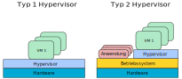
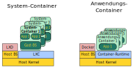
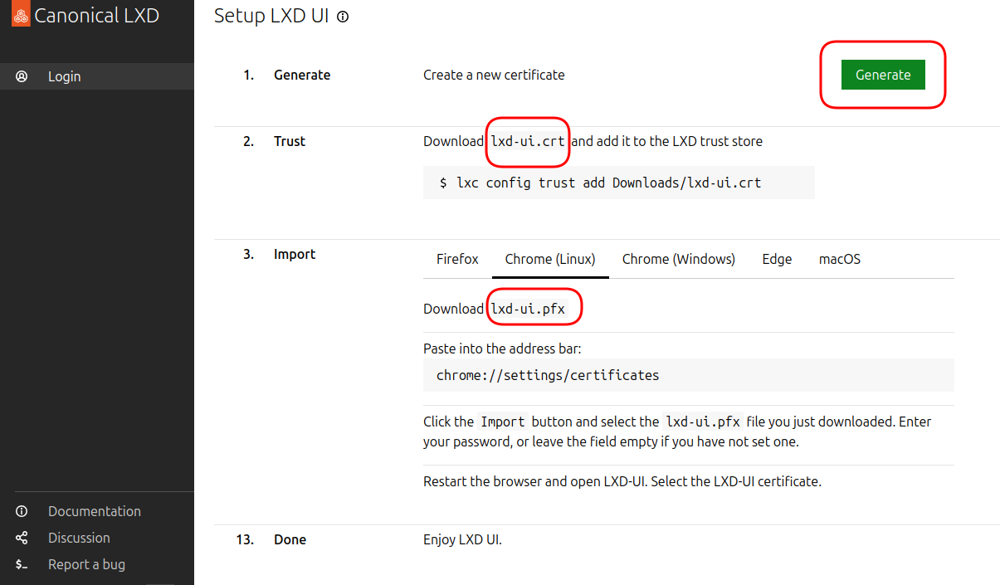

<!--
author:   Günter Dannoritzer
email:    g.dannoritzer@wvs-ffm.de
version:  1.3.0
date:     16.12.2024
language: de
narrator: Deutsch Female

comment:  Virtualisierung und Container

icon:    https://raw.githubusercontent.com/dsp77/wvs-liascript/0938e2e0ce751e270e3e36b8ecfeb09044a41aa0/wvs-logo.png
logo:     02_img/logo-vm-container.jpg

tags:     LiaScript, Virtualisierung, Container, Hypervisor, Typ 1, Typ2, Docker, LXC, LXD

link:     https://cdn.jsdelivr.net/chartist.js/latest/chartist.min.css

script:   https://cdn.jsdelivr.net/chartist.js/latest/chartist.min.js

attribute: Lizenz: [CC BY-SA](https://creativecommons.org/licenses/by-sa/4.0/)
-->
# Virtualisierung

Die Computervirtualisierung ermöglicht das Ausführen mehrerer Betriebssysteme auf einem einzigen physischen Computer. Dabei wird die Hardware des Computers so aufgeteilt, dass jedes Betriebssystem getrennt voneinander zur Ausführung kommt. Dies wird durch eine Software-Schicht namens Hypervisor erreicht.

Vorteile der Computervirtualisierung:

  * Konsolidierung: Mehrere virtuelle Maschinen (VMs) können auf einem einzelnen physischen Server betrieben werden, was zu einer effizienteren Nutzung von Hardware-Ressourcen führt.
 * Flexibilität: Virtuelle Maschinen können schnell erstellt, konfiguriert und skaliert werden.
 * Isolierung: Jede virtuelle Maschine ist von den anderen isoliert, was die Sicherheit erhöht und Ausfälle einzelner VMs weniger kritisch macht.
 * Portabilität: Virtuelle Maschinen können leicht von einem physischen Server auf einen anderen migriert werden.
 * Kostenersparnis: Durch die Konsolidierung von Servern und die effizientere Nutzung von Ressourcen können Betriebskosten gesenkt werden.

Hypervisor Typ 1 vs. Typ 2:

Der Hypervisor ist das Herzstück der Virtualisierung. Er verwaltet die Hardware und teilt sie den virtuellen Maschinen zu. Es gibt die zwei Haupttypen von Hypervisoren: Typ 1 und Typ2.

## Hypervisor Typ 1 (Bare-Metal-Hypervisor)

  * Wird direkt auf der Hardware installiert, ohne ein zugrunde liegendes Betriebssystem.
 * Beispiele: VMware ESXi, Microsoft Hyper-V
 * Vorteile: Hohe Leistung, direkte Hardwarezugriffe, bessere Sicherheit
 * Nachteile: Komplexere Installation, weniger flexibel bei der Auswahl des Host-Betriebssystems

## Hypervisor Typ 2  
  
  * Läuft als Anwendung auf einem bestehenden Betriebssystem (z.B. Windows, Linux).
 * Beispiele: VirtualBox, VMware Workstation
 * Vorteile: Einfachere Installation, kann auf jeder beliebigen Plattform installiert werden
 * Nachteile: Geringere Leistung als Typ 1, da er das zugrunde liegende Betriebssystem durchlaufen muss

# Container-Virtualisierung

Die Container-Virtualisierung hat ihren Ursprung in der Softwareentwicklung. Ziel ist es, mit dem Container eine Umgebung mit bestimmten Softwareversionen der benötigten Abhängigkeiten, wie z.B. Bibliotheken, zur Verfügung zu stellen. Mithilfe einer textbasierten Beschreibungsdatei wird diese Umgebung beschrieben. Die Container-Umgebung, wie z.B. Docker, erstellt dann den Container. Dadurch ist es möglich, für eine Software immer unter gleichen Bedingungen eine Betriebsumgebung zur Verfügung zu stellen.

## System- und Anwendungs-Container

Der Unterschied zwischen System- und Anwendungs-Containern liegt in ihrem Zweck und der Art der enthaltenen Software.

## System-Container

Zweck:

  * Bereitstellung einer kompletten Betriebssystemumgebung.
 * Dienen als Basis für andere Container oder für komplexe Anwendungen, die eine isolierte Umgebung benötigen.

Inhalt:

  * Enthält ein vollständiges Betriebssystem (z.B. Ubuntu, CentOS) mit allen notwendigen Systemdiensten.
 * Kann zusätzlich Software-Pakete enthalten, die für die Basisfunktionalität benötigt werden.

Verwendung:

  * Als Grundlage für die Erstellung anderer Container.
 * Für Anwendungen, die eine hohe Isolation von der Host-Umgebung benötigen (z.B. Sicherheitsanwendungen).

## Anwendungs-Container

Zweck:

  * Bereitstellung einer einzelnen Anwendung oder eines Dienstes.
 * Sind auf eine spezifische Aufgabe optimiert.
    
Inhalt:

  * Enthält nur die für die Anwendung notwendigen Bibliotheken, Abhängigkeiten und Konfigurationsdateien.
 * Basieren in der Regel auf einem System-Container, der die Basis-Umgebung bereitstellt.
    
Verwendung:

  * Für die Bereitstellung von Microservices.
 * Für die schnelle Entwicklung und Bereitstellung von Anwendungen.

# Praktische Übung LXC/LXD-Container

Für die Nutzung der Linux-Container-Virtualisierung ist die Installation durch `sudo apt install lxc` nötig.

Die Ubuntu-Anleitung [How to access the LXD web UI](https://documentation.ubuntu.com/lxd/en/latest/howto/access_ui/) beschreibt die Einrichtung des browserbasierten Zugangs zu LXD.

Um unter Ubuntu nötige Proxy-Konfiguration durchzuführen, kann das BASH-Skript [setup-proxy.sh](setup-proxy.sh) helfen.

## Zertifikatbasierte Authentifizierung

Die Grundlage der digitalen Signatur kann im Lernfeld 4 [Kryptographie](https://liascript.github.io/course/?https://raw.githubusercontent.com/dsp77/wvs-liascript/main/LF04/verschluesselung.md) nachgelesen werden. Die zertifikatbasierte Authentifizierung ist vom Ablauf vergleichbar mit der passwortlosen Anmeldung nach FIDO2 oder deren Erweiterung der Anmeldung mithilfe von Passkeys.

 * LXD-Oberfläche, Einrichtung als Grundlage nehmen
 * privater Schlüssel in den Browser, Zertifikat auf dem Server (Umdrehung von https)
 * Ablauf der Authentifizierung erklären.

### Einrichtung der zertifikatbasierten Authentifizierung

 Ein Schritt der Einrichtung ist die Erstellung eines Zertifikats:

 

 Mit Betätigung des Knopfes **Generate** werden zwei Dateien erzeugt. In der gezeigten Abbildung sind das:

   * `lxd-ui.crt` - Zeritifikat, wird auf dem Server gespeichert, hier die der Server, der die LXD-Oberfläche zur Verfügung stellt.
   * `lxd-ui.pfx` - PFX-Datei enthält den privaten Schlüssel der zu dem Zertifikat gehört. Die PFX-Datei wird im Browser gespeichert, mit dem eine Verbindung zu dem LXD-Server aufgebaut werden soll.

### Ablauf der zertifikatbasierten Authentifizierung

Der Browser möchte sich mit dem Webserver der LXD-Oberfläche verbinden. Um zu überprüfen, ob der Browser dazu authorisiert ist, muss er dem Webserver beweisen, dass er Inhaber des privaten Schlüssels zu dem auf dem Webserver hinterlegten Zertifikates ist. Der Ablauf sieht folgendermaßen aus:

 * Der Webserver erstellt eine zufällige Zahl und sendet diese an den Browser.
 * Der Browser verschlüsselt die Zahl mit dem privaten Schlüssel und sendet sie zu dem Webserver.
 * Der Webserver entschlüsselt die Nachricht von dem Browser mit dem hinterlegten Zertifikat und überprüft, ob die entschlüsselt Zahl die zuvor gesendete Zahl ist.
 * Wenn es die gesendete Zahl ist, weiß der Server, dass der Browser im Besitz des privaten Schlüssels zu dem hinterlegten Zertifikat ist und er autorisiert den Browser für den Zugriff.