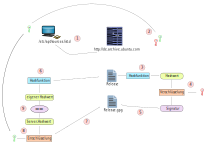
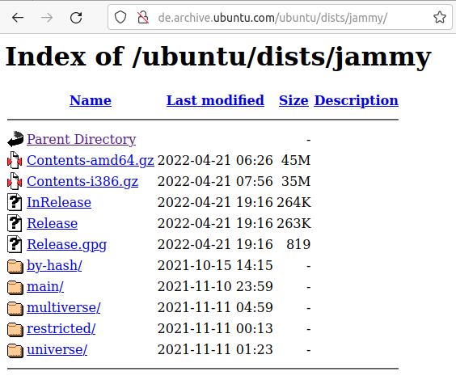

<!--
author:   Günter Dannoritzer
email:    g.dannoritzer@wvs-ffm.de
version:  0.1.0
date:     01.10.2024
language: de
narrator: Deutsch Female

comment:  Virtualisierung und Container

icon:    https://raw.githubusercontent.com/dsp77/wvs-liascript/0938e2e0ce751e270e3e36b8ecfeb09044a41aa0/wvs-logo.png
logo:     02_img/logo-vm-sw-repository.jpg

tags:     LiaScript, Repository, Software, Integrität

link:     https://cdn.jsdelivr.net/chartist.js/latest/chartist.min.css

script:   https://cdn.jsdelivr.net/chartist.js/latest/chartist.min.js

attribute: Lizenz: [CC BY-SA](https://creativecommons.org/licenses/by-sa/4.0/)
-->
# Software Repositories

Ein Schutzziel ist die Integrität von Daten oder Systemen. Softwareinstallation über verknüpfte Repositories wurde der breiten Mehrheit bekannt durch die Nutzung von Smartphones wie z.B. dem Apple **App-Store** oder dem Android **Play-Store**. Bei Linux-Distributionen sind die Repositories schon länger Teil der Systeme. Die ursprünglichen zwei großen Paketformate sind das RPM (RPM Package Manager), das u.a. in Distributionen wie z.B. Red-Hat oder openSuse verwendet wird. Das zweite ursprüngliche Format ist das Debian Package Format (deb), das neben Debian in den darauf basierten Distributionen wie z.B. Ubuntu verwendet wird.



Linux Konfigurationen sind in Konfigurationsdateien  unter `/etc` untergebracht. Zur besseren Strukturierung gibt es manchmal Unterordner mit dem gleichen Namen. Es werden dann alle Dateien in dem Unterordner nacheinander geladen. Die Softwarerepositories unter debianbasierten Systemen wie z.B. Ubuntu sind in der Datei `/etc/apt/sources.list`. Um eine Strukturierung zu erlauben, gibt es den Unterordner `/etc/apt/sources.list.d`.

In der Abbildung unter **1** ist die Verbindung zum Repository gezeigt. Ein Eintrag für ein Repository sieht folgendermaßen aus:

`deb http://de.archive.ubuntu.com/ubuntu/ jammy main`

## Absicherung des Repositories

Das zugehörige Repository sieht auf der oberen Ebene folgendermaßen aus:



Interessant sind die beiden Dateien **Release** und **Release.gpg**. Das Ubuntu-Team erstellt unter **2** ein asymmetrisches Schlüsselpaar. Der öffentliche Schlüssel wird in den installierten Ubuntu-Installationen hinterlegt. In der **Release**-Datei wird der Name jedes Softwarepaketes und dessen Hashwert hinterlegt. Die Absicherung der Datei erfolgt mit den Schritten **3-5**.

 * 3. Von der **Release**-Datei wird ein Hashwert gebildet.
 * 4. Um den Hashwert vor Veränderungen zu schützen, wird er mit dem **Privaten**-Schlüssel verschlüsselt. Das Ergebnis ist die **Signatur**.
 * 5. Die **Signatur** wird in der **Release.gpg**-Datei gespeichert.


## Überprüfung des Repositories durch eine Installation

Ein Rechner mit installierter Software überprüft bei jedem Zugriff auf das Repository in den Schritten **6-9** die Integrität der Softwarepakete.

 * 6. Der Rechner lädt die **Release**-Datei vom Repository und bildete mit der Hashfunktion einen **eigenen Hashwert** der Datei.
 * 7. Im nächsten Schritt wird die Datei **Release.gpg** mit der Signatur heruntergeladen.
 * 8. Mit dem hinterlegten **öffentlichen Schlüssel** wird die **Signatur** entschlüsselt und jetzt liegt der **unveränderte Hashwert** des Ubuntu-Teams auf dem Rechner vor.
 * 9. Im letzten Schritt wird der **eigene Hashwert** mit dem **Server-Hashwert** des Ubuntu-Teams verglichen. Dadurch wird sichergestellt, dass der Inhalt der **Release**-Datei nicht verändert wurde.

## Inhalt der Release-Datei

Der Inhalt der Datei `Release` sieht folgendermaßen aus:

````
Origin: Ubuntu
Label: Ubuntu
Suite: jammy
Version: 22.04
Codename: jammy
Date: Thu, 21 Apr 2022 17:16:08 UTC
Architectures: amd64 arm64 armhf i386 ppc64el riscv64 s390x
Components: main restricted universe multiverse
Description: Ubuntu Jammy 22.04
MD5Sum:
...
4146bfa91ef3494e24f8a4aebe6db5f5          6779186 main/binary-amd64/Packages
...
SHA1
...
3569f72ef54ca6b7a374846358ae77424ee3845b          6779186 main/binary-amd64/Packages
...
SHA256:
...
12ce0797a6ed39a1fee1321985976c6b78872a8fe4c7ef2fb712f2364c9839a3          6779186 main/binary-amd64/Packages
````

Sie enthält für jedes Softwarepaket den Hashwert. Es werden MD5-, SHA1- und SHA256-Hashwerte gespeichert. Dadurch kann nach dem Herunterladen durch den Rechner die Integrität jeden Paketes überprüft werden.

## Inhalt der `Release.gpg`-Datei

Der Inhalt der Datei `Release.gpg`

````
-----BEGIN PGP SIGNATURE-----
Version: GnuPG v1

iQIcBAABCgAGBQJiYZF3AAoJEIcZINGZG8k8C8kP/RxRcvL8bKNTLKFyt3ze0RcY
Rs9LkYgHrcoglglbj7fEMs7Dvcir9jroqdzCuMBqdX3d/fQliNE76SnPH+QPMhnV
T9Y9X48b82bB25+e4TK0G7sXuqg1gWgKIeOmIiBjvWKO8OhC3++vkrZrwVDryXSF
XwZGaxY/6LCBKfIrDZ2D6TkYfwQlgk4UIY1XYosfMF5QNoWwCSJaesJfeTOSTrSy
2ussaoohI+trV0XwBRsxkLgw8zK6Tg9odls7eCktsnYE1d0hxfnWWe6mQJOeIW1I
c/jT82SfxPFndLUFccUPTthNVlqBbFyLCJ5d08sR8ojQWtLX30C03LS7gQqTIxZT
XhXpDo3YR3IBBAyq5g4lUyS0SaqYtEoSq2rs6WyNdf7k3y7Iw/gUqM8d/yI6EX58
LJhvo6ictmATdF2VfQn3sRfK50WBJlRCIFslVcqFMLhAoxWFASz2QO8ia26UTx4f
weCvVVGM2KuEbDXjq6FVz8FCEqq8ticMV9kcQAQyz3BJc5pfuWBQtaIRdqKJo6Bv
ymDtQ7Q6hB5hQCL/9oBqM+Bfspr9JfY4/CxW9KU7i142wh29RxnIsAHFMdY823pV
sV0EnB4gMoZ2Y3NwMUHFf3F+Y8VlASS6nX0c3FiamLW1goeiTUAuQnJIkwkjj7BJ
Xmc6zbBLF6O6xTs8jNdl
=ZrhW
-----END PGP SIGNATURE-----
````

