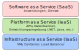

<!--
author:   Günter Dannoritzer
email:    g.dannoritzer@wvs-ffm.de
version:  1.0.2
date:     10.01.2025
language: de
narrator: Deutsch Female

comment:  Cloud Computing

icon:    https://raw.githubusercontent.com/dsp77/wvs-liascript/0938e2e0ce751e270e3e36b8ecfeb09044a41aa0/wvs-logo.png
logo:     02_img/logo-cloud.jpg

tags:     LiaScript, Cloud, Deployment Model, Service Model, NIST, * as a Service, *aaS, Public Cloud, Private Cloud, Hybrid Cloud

link:     https://cdn.jsdelivr.net/chartist.js/latest/chartist.min.css

script:   https://cdn.jsdelivr.net/chartist.js/latest/chartist.min.js

attribute: Lizenz: [CC BY-SA](https://creativecommons.org/licenses/by-sa/4.0/)
-->
# Cloud-Systeme

Das [National Institute of Standards and Technology (NIST)](https://www.nist.gov/) war die erste Standardisierungsorganisation, die eine Definition von Cloud-Systemen erstellt. Mittlerweile hat diese Beschreibung auch in einem ISO-Standard **ISO/IEC 22123-1** Einzug gefunden. Die NIST-Empfehlung [SP 800-145](https://nvlpubs.nist.gov/nistpubs/Legacy/SP/nistspecialpublication800-145.pdf) beschreibt als essenzielle Charakteristik von Cloud-Computing als:

 * On-demand self-service
 * Broad network access
 * Resource pooling
 * Rapid elasticity
 * Measured service

Im Detail bedeuten diese Charakteristiken:

1. On-demand Self-service (Selbstbedienung auf Abruf)
Beschreibung: Nutzer können Cloud-Ressourcen (z. B. Server, Speicherplatz, Netzwerke) nach Bedarf automatisch und ohne menschliche Interaktion mit dem Anbieter anfordern und nutzen.
Vorteile:
Maximale Flexibilität für Nutzer, die sofort Ressourcen bereitstellen oder anpassen können.
Reduziert die Abhängigkeit von IT-Abteilungen oder Service-Mitarbeitern.
Beispiel: Ein Entwickler startet über ein Webportal eine virtuelle Maschine in der Cloud, ohne auf Genehmigungen oder manuelle Bereitstellungen warten zu müssen.

2. Broad Network Access (Breiter Netzwerkzugriff)
Beschreibung: Cloud-Dienste sind über Standardnetzwerke (z. B. das Internet) zugänglich und können von verschiedenen Geräten wie Laptops, Smartphones oder Tablets genutzt werden.
Vorteile:
Ermöglicht Zugriff auf Cloud-Ressourcen von überall und mit fast jedem Gerät.
Fördert die Nutzung moderner Arbeitsmodelle wie Remote Work.
Beispiel: Ein Mitarbeiter kann auf eine SaaS-Anwendung wie Google Workspace zugreifen, egal ob er sich im Büro, zu Hause oder unterwegs befindet.

3. Resource Pooling (Ressourcen-Pooling)
Beschreibung: Die Cloud-Anbieter konsolidieren Ressourcen (z. B. Server, Speicher, Netzwerke) in einem Pool, aus dem mehrere Kunden (Mandanten) bedarfsorientiert versorgt werden. Diese Multi-Tenant-Architektur nutzt Virtualisierungstechnologie, um Ressourcen effizient zu verteilen.
Vorteile:
Kosteneffizienz durch gemeinsame Ressourcennutzung.
Flexibilität, da Ressourcen dynamisch zugewiesen und wieder freigegeben werden können.
Beispiel: Mehrere Unternehmen teilen sich die Rechenressourcen eines Cloud-Anbieters, ohne Zugriff auf die Daten anderer Unternehmen zu haben.

4. Rapid Elasticity (Schnelle Elastizität)
Beschreibung: Ressourcen können je nach Bedarf schnell skaliert werden – sowohl nach oben (mehr Ressourcen) als auch nach unten (weniger Ressourcen). Diese Skalierbarkeit erscheint dem Nutzer oft unbegrenzt und ist automatisiert.
Vorteile:
Ermöglicht es Unternehmen, auf schwankende Anforderungen zu reagieren, z. B. Spitzenlasten in der Nutzung.
Optimiert Kosten, da nur tatsächlich benötigte Ressourcen verwendet werden.
Beispiel: Ein Online-Shop kann während des Weihnachtsgeschäfts die Anzahl der Server erhöhen und nach dem Geschäftsrückgang wieder reduzieren.

5. Measured Service (Messbarer Dienst)
Beschreibung: Cloud-Systeme überwachen und messen automatisch die Ressourcennutzung (z. B. Speicher, Bandbreite, Rechenleistung). Diese Nutzung wird oft transparent und exakt abgerechnet, was unter dem Begriff **pay-per-use** bekannt ist. 
Vorteile:
Bietet eine genaue Kostenkontrolle, da nur genutzte Ressourcen berechnet werden.
Fördert Effizienz durch Transparenz und Verfügbarkeit von Nutzungsdaten.
Beispiel: Ein Unternehmen bezahlt für Cloud-Speicherplatz nur auf Basis der tatsächlich genutzten Gigabytes pro Monat.

Zusammenfassung

Diese fünf Charakteristiken machen ein Cloud-System aus und stellen sicher, dass es skalierbar, effizient und flexibel ist. Sie bilden die Grundlage für die wirtschaftlichen und technischen Vorteile, die Cloud Computing mit sich bringt.

Nach der Charakterisierung beschreibt die NIST-Empfehlung zwei Modelle, nach denen einmal die Umsetzung der Implementierung beschrieben wird, was mithilfe des sogenannten **Deployment-Models** geschieht. In einer anderen Dimension werden die Dienste beschrieben, was in dem sogenannten **Service-Model** geschieht.

## Deployment Model

Das NIST definiert vier Deployment Models für Cloud Computing. Sie beschreiben, wie und für wen Cloud-Infrastrukturen bereitgestellt werden. Hier ist eine Übersicht:

1. Private Cloud
Beschreibung: Die Cloud-Infrastruktur wird ausschließlich für eine einzelne Organisation betrieben. Sie kann entweder von der Organisation selbst verwaltet werden oder von einem Drittanbieter betrieben werden, und sie kann sich vor Ort (on-premises) oder extern befinden.
Vorteile: Höhere Kontrolle, maßgeschneiderte Sicherheitsmaßnahmen, Einhaltung von Compliance-Anforderungen.
Beispiel: Ein Unternehmen betreibt eine Cloud für interne Anwendungen wie HR-Systeme oder CRM.

2. Public Cloud
Beschreibung: Die Cloud-Infrastruktur wird der breiten Öffentlichkeit oder einer großen Gruppe von Nutzern bereitgestellt. Sie wird von einem Cloud-Service-Provider betrieben und befindet sich im Eigentum des Providers.
Vorteile: Kosteneffizienz, Skalierbarkeit, keine Verwaltung durch die Nutzer notwendig.
Beispiel: Dienste wie Amazon Web Services (AWS), Microsoft Azure oder Google Cloud Platform (GCP).

3. Community Cloud
Beschreibung: Die Cloud-Infrastruktur wird von mehreren Organisationen genutzt, die gemeinsame Interessen oder Anforderungen haben (z. B. Compliance, Sicherheit, Branche). Sie kann von einer der Organisationen oder einem Drittanbieter verwaltet werden.
Vorteile: Gemeinsame Kosten, abgestimmte Sicherheitsmaßnahmen, Zusammenarbeit zwischen den Mitgliedern der Community.
Beispiel: Eine Gruppe von Universitäten teilt eine Cloud für Forschungsprojekte.

4. Hybrid Cloud
Beschreibung: Die Cloud-Infrastruktur ist eine Kombination aus zwei oder mehr Cloud-Deployment-Modellen (z. B. Private und Public Cloud), die über standardisierte oder proprietäre Technologie miteinander verbunden sind, um Daten und Anwendungen zu portieren.
Vorteile: Flexibilität, Workload-Optimierung, Anpassung an spezifische Bedürfnisse.
Beispiel: Ein Unternehmen speichert sensible Daten in einer Private Cloud und nutzt eine Public Cloud für weniger kritische Workloads wie Webhosting.

### Unterschied Public und Private Cloud

Bezüglich dem Unterschied zwischen einer Public und Private Cloud soll hier noch mal die Bereitstellung durch einen Drittanbieter beschrieben werden.

Es ist möglich, dass eine Private Cloud von einem Drittanbieter (z. B. Amazon oder Google) betrieben wird. Das unterscheidet sich jedoch wesentlich von einer Public Cloud, auch wenn der Betrieb durch denselben Anbieter erfolgt.

Merkmale einer Private Cloud durch Drittanbieter

Dedizierte Infrastruktur:

Bei einer Private Cloud stellt der Anbieter dedizierte Ressourcen (z. B. Server, Speicher, Netzwerk) für einen einzelnen Kunden bereit. Diese Infrastruktur wird nicht mit anderen Kunden geteilt.
Beispiel: Amazon bietet mit AWS Outposts oder Azure Private Cloud Lösungen an, die vollständig auf den Kunden zugeschnitten und isoliert sind.

Zugriff und Kontrolle:

Der Kunde hat möglicherweise keinen physischen Zugriff auf die Hardware (wie bei einer on-premises Private Cloud), aber die Infrastruktur bleibt logisch und physisch vollständig isoliert.
Zudem kann der Kunde maßgeschneiderte Sicherheitsrichtlinien, Netzwerkkonfigurationen und Compliance-Vorgaben durchsetzen.

Management durch den Drittanbieter:

Ein Drittanbieter kann die Wartung und Verwaltung der Private Cloud übernehmen, z. B. Updates, Sicherheitspatches und Infrastrukturüberwachung. Dies entlastet den Kunden.
Warum ist eine von Amazon oder Google betriebene Private Cloud keine Public Cloud?
Der Schlüssel zur Unterscheidung liegt in der Isolierung:

Private Cloud: Vollständig isolierte Ressourcen, exklusiv für einen Kunden bereitgestellt.
Public Cloud: Ressourcen werden gemeinsam mit anderen Nutzern verwendet (Shared Infrastructure).
Selbst wenn der Betrieb der Private Cloud extern erfolgt, bleibt sie per Definition dediziert und daher eine Private Cloud.

Viele Cloud-Anbieter bieten Private Cloud-Lösungen an:

Amazon AWS: Lösungen wie "AWS Outposts" oder dedizierte Server.
Microsoft Azure: Azure Stack ermöglicht private Cloud-Umgebungen.
Google Cloud: Anthos ermöglicht die Bereitstellung privater Cloud-Lösungen.
Der entscheidende Unterschied zur Public Cloud ist die exklusive Nutzung der Ressourcen und die Kontrolle über Sicherheits- und Managementrichtlinien.

## Service Model

Das Service Model im Cloud Computing beschreibt die verschiedenen Dienstebenen, die Cloud-Anbieter ihren Nutzern bereitstellen. Die NIST-Definition unterscheidet dabei drei Haupt-Service-Modelle:

 * Infrastructure as a Service (IaaS)
 * Platform as a Service (PaaS)
 * Software as a Service (Saas)

Im folgenden werden die drei Modelle beschrieben.

1. Infrastructure as a Service (IaaS)

Beschreibung:
Bei IaaS wird die grundlegende IT-Infrastruktur (z. B. virtuelle Maschinen, Speicher, Netzwerke) bereitgestellt. Nutzer haben die volle Kontrolle über die Infrastruktur und können darauf eigene Software installieren.

Merkmale:
Zugriff auf virtuelle oder physische Hardware.
Skalierbare Ressourcen (z. B. Speicherplatz, Rechenleistung).
Nutzer verwalten Betriebssysteme, Middleware und Anwendungen selbst.

Vorteile:
Hohe Flexibilität und Kontrolle.
Pay-as-you-go-Modell für kosteneffiziente Nutzung.

Beispiele:
Amazon Web Services (AWS EC2, S3).
Microsoft Azure Virtual Machines.
Google Compute Engine.

2. Platform as a Service (PaaS)

Beschreibung:
PaaS stellt eine Plattform bereit, auf der Nutzer Anwendungen entwickeln, testen und betreiben können, ohne sich um die zugrunde liegende Infrastruktur kümmern zu müssen.

Merkmale:
Entwicklungs- und Laufzeitumgebungen inklusive Middleware, Datenbanken und Tools.
Automatische Verwaltung von Infrastruktur und Betriebssystemen durch den Anbieter.
Entwickler können sich auf die Anwendungsentwicklung konzentrieren.

Vorteile:
Beschleunigt die Entwicklung und Bereitstellung von Anwendungen.
Keine Verwaltung von Servern oder Infrastruktur durch den Nutzer.

Beispiele:
Google App Engine.
Microsoft Azure App Service.
Heroku.

3. Software as a Service (SaaS)

Beschreibung:
Bei SaaS stellt der Anbieter vollständig funktionierende Anwendungen bereit, die direkt über das Internet genutzt werden können. Der Nutzer muss weder Infrastruktur noch Plattform verwalten.

Merkmale:
Anwendungen laufen auf den Servern des Anbieters und werden über einen Webbrowser oder eine App genutzt.
Nutzer greifen auf Software zu, ohne Installation oder Verwaltung.
Updates und Wartung erfolgen durch den Anbieter.

Vorteile:
Sofortige Nutzung ohne technischen Aufwand.
Skalierbar, um die Anforderungen verschiedener Nutzergruppen zu erfüllen.

Beispiele:
Google Workspace (Gmail, Docs).
Microsoft 365.
Salesforce.

Vergleich der Service-Modelle

| Merkmal | IaaS | PaaS | SaaS |
|---------|------|------|------|
| Bereitstellung | Infrastruktur (VMs, Speicher) | Entwicklungsplattform | Fertige Anwendungen |
| Nutzerkontrolle | Vollständig über OS und Apps | Nur über Apps und Daten | Minimal (nur Nutzung der App) |
| Flexibilität | Sehr hoch | Mittel | Niedrig |
| Beispiele | AWS EC2, Azure VMs | Google App Engine, Heroku | Gmail, Microsoft Office 365 |

Man kann sich die Modelle als eine Art **Schichtenmodell** vorstellen:

 1. IaaS bildet die Basis (Infrastruktur).
 2. PaaS baut darauf auf (Plattform).
 3. SaaS steht ganz oben (fertige Software).

Anwendungsfälle

 * IaaS: Unternehmen, die volle Kontrolle benötigen, z. B. für eigene IT-Systeme.
 * PaaS: Entwickler, die schnell Anwendungen erstellen möchten, ohne sich um die Infrastruktur zu kümmern.
 * SaaS: Endnutzer, die einfach Anwendungen verwenden möchten (z. B. E-Mail, CRM).

### Abgrenzung anderen *aaS-Modelle

Es gibt weitere Dienste, die nach dem Schema *aaS benannt sind, z. B. Database as a Service (DBaaS), Function as a Service (FaaS), Backend as a Service (BaaS), usw. Diese zusätzlichen Dienste bauen auf den drei Haupt-Service-Modellen des NIST (IaaS, PaaS, SaaS) auf und erweitern oder spezifizieren sie. Schauen wir uns die Unterschiede genauer an:

1. Die NIST-Modelle als Grundlage

Die drei NIST-Modelle IaaS, PaaS und SaaS sind:

Grundlegend: Sie definieren die drei Hauptschichten im Cloud-Computing-Stack:
IaaS: Hardware und Infrastruktur.
PaaS: Entwicklungsplattformen.
SaaS: Anwendungen.
Generisch: Sie decken breite Einsatzbereiche ab und sind nicht auf spezielle Funktionen oder Anwendungsfälle beschränkt.
Alle anderen *aaS-Modelle lassen sich meistens in eine dieser drei Kategorien einordnen oder bauen direkt auf ihnen auf.

2. Wie andere aaS-Modelle sich unterscheiden

Zusätzliche *aaS-Dienste:

Spezialisierung: Sie sind oft auf spezifische Aufgaben, Funktionen oder Branchen ausgelegt.
Granularität: Sie können als Unterkategorien eines der Hauptmodelle betrachtet werden, da sie sich auf spezifische Dienste konzentrieren.
Neue Abstraktionsebenen: Manche *aaS-Modelle bieten Abstraktionen, die sich nicht klar einem der drei Hauptmodelle zuordnen lassen.

3. Beispiele für spezialisierte aaS-Modelle

| Dienstmodell | Beschreibung | Bezug zu NIST-Modellen |
|--------------|--------------|------------------------|
| Database as a Service (DBaaS) | Bietet eine vollständig verwaltete Datenbank über die Cloud an. |Unterkategorie von PaaS, da es eine spezifische Plattform für Datenbanken bereitstellt. |
| Function as a Service (FaaS) | Ermöglicht die Ausführung von Code als kleine, unabhängige Funktionen, ohne sich um die Infrastruktur zu kümmern. | Baut auf PaaS oder IaaS auf, häufig Teil von Serverless Computing. |
| Storage as a Service (STaaS) | Stellt Speicherplatz über die Cloud zur Verfügung. | Unterkategorie von IaaS, da es sich auf die Infrastrukturebene konzentriert. |
| Backend as a Service (BaaS) | Bietet vorgefertigte Back-End-Dienste wie Authentifizierung, Datenbanken, und APIs. | Zwischen PaaS und SaaS, da es Entwicklern eine Plattform für Back-End-Dienste bietet. |
| Desktop as a Service (DaaS) | Stellt virtuelle Desktops bereit, die über die Cloud genutzt werden können.| Meist eine Mischung aus SaaS (für den Endnutzer) und IaaS (für die Infrastruktur). |
| Security as a Service (SECaaS) | Bietet Sicherheitsdienste wie Firewalls, Bedrohungserkennung und Verschlüsselung über die Cloud an. | Kann auf allen Schichten basieren, häufig auf IaaS oder SaaS. |

4. Hauptunterschiede zwischen NIST-Modellen und neuen aaS-Modellen

| Merkmal | NIST-Modelle (IaaS, PaaS, SaaS) | *Zusätzliche aaS-Modelle |
|---------|---------------------------------|---------------------------|
| Abstraktionsebene | Fokus auf breite Schichten des Cloud-Stacks | Spezifische Dienste oder Funktionen innerhalb der Schichten. |
| Flexibilität | Generisch und anpassbar für verschiedene Anwendungen | Stark spezialisiert, weniger flexibel. |
| Zielgruppe | Breites Spektrum von Nutzern (Infrastruktur- bis Endnutzer) | Entwicklern oder Endnutzern mit spezifischen Anforderungen. |
| Innovationsgrad | Standardisiert und etabliert | Oft auf neue Technologien oder Trends ausgerichtet, z. B. Serverless, KI. |

5. Einordnung der spezialisierten Modelle in die NIST-Modelle

Fast alle zusätzlichen Dienste (*aaS) können entweder als Unterkategorien oder Ergänzungen zu den NIST-Modellen betrachtet werden:

Unterkategorie von IaaS:

 * Beispiele: Storage as a Service (STaaS), Network as a Service (NaaS).
 * Fokus auf einzelne Infrastrukturkomponenten.

Unterkategorie von PaaS:

 * Beispiele: Database as a Service (DBaaS), Function as a Service (FaaS).
 * Plattformen für spezifische Entwicklungs- oder Ausführungsaufgaben.

Erweiterung von SaaS:

 * Beispiele: Desktop as a Service (DaaS), Security as a Service (SECaaS).
 * Anwendungen für spezialisierte Endnutzungszwecke.

Zusammenfassung

Die drei NIST-Modelle sind die Basis des Cloud Computing und definieren breite Kategorien. Die neueren *aaS-Modelle sind:

 1. **Erweiterungen oder Spezialisierungen** dieser Modelle, angepasst an spezifische Bedürfnisse.
 2. Oft ein Ergebnis technologischer Weiterentwicklungen wie Serverless Computing oder KI.