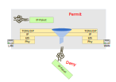
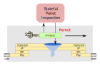
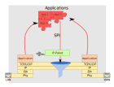
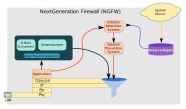
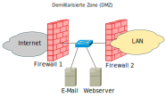
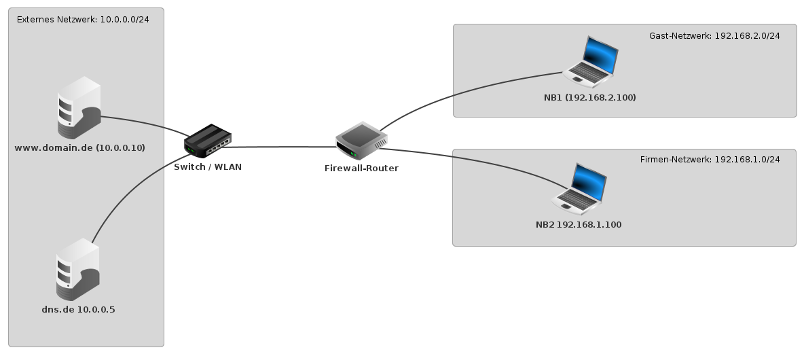

<!--
author:   Günter Dannoritzer
email:    g.dannoritzer@wvs-ffm.de
version:  1.5.0
date:     29.01.2025
language: de
narrator: Deutsch Female

comment:  Firewall

icon:    https://raw.githubusercontent.com/dsp77/wvs-liascript/0938e2e0ce751e270e3e36b8ecfeb09044a41aa0/wvs-logo.png
logo:     02_img/logo-firewall.jpg

tags:     LiaScript, Firewall, Paket Filter, SPI, Deep Paket Inspection, Application Layer Firewall, Next-Generation Firewall, NGFW

link:     https://cdn.jsdelivr.net/chartist.js/latest/chartist.min.css

script:   https://cdn.jsdelivr.net/chartist.js/latest/chartist.min.js

attribute: Lizenz: [CC BY-SA](https://creativecommons.org/licenses/by-sa/4.0/)
-->
# Firewall

Firewalls sind ein essenzieller Bestandteil moderner Netzwerksicherheit. Sie dienen dazu, unberechtigten Zugriff auf ein Netzwerk oder System zu verhindern und so vor Cyberangriffen zu schützen. Es gibt eine Vielzahl von Firewall-Typen, die sich in ihrer Funktionsweise und ihren Einsatzbereichen unterscheiden.

## Funktionsweisen

Nach Funktionsweise unterschieden gibt es die Firwall-Typen:

Paketfilter-Firewall:

   * Die einfachste Art von Firewall.
 * Filtert Datenpakete basierend auf IP-Adressen, Portnummern und Protokollen.
 * Kann beispielsweise eingehende Verbindungen von bestimmten IP-Adressen blockieren oder nur bestimmten Ports erlauben.
    
Stateful Inspection Firewall:

  * Erweiterte Form der Paketfilter-Firewall.
 * Berücksichtigt den Zustand einer Verbindung, um Entscheidungen zu treffen.
 * Kann beispielsweise Verbindungen verfolgen und unerwartete Pakete blockieren.

Application Proxy Firewall:

  * Analysiert den Datenverkehr auf Anwendungsebene.
 * Kann spezifische Anwendungen filtern oder blockieren.
 * Bietet einen höheren Schutz vor Anwendungsschwachstellen.

Next-Generation Firewall (NGFW):

  * Kombiniert verschiedene Technologien wie Deep Packet Inspection, Intrusion Prevention Systeme und Web Application Firewalls.
 * Bietet umfassenden Schutz vor einer Vielzahl von Bedrohungen.


## Einsatzort

Nach Einsatzort unterschieden:

Personal Firewall:

  * Wird auf einzelnen Geräten (PCs, Smartphones) installiert.
 * Schützt das Gerät vor Angriffen aus dem Internet.
 * Kann besonders auf die Anwendungen auf dem Gerät angepasst werden.

Netzwerk-Firewall:

  * Wird in Netzwerken eingesetzt, um den gesamten Netzwerkverkehr zu schützen.
 * Kann sowohl hardware- als auch softwarebasiert sein.
 * Beeinflusst den gesamten Netzwerkverkehr.

## Weitere Unterscheidungskriterien

Hardware- vs. Software-Firewall:

Hardware-Firewalls sind dedizierte Geräte, während Software-Firewalls als Programm auf einem Computer laufen.

Cloud-basierte Firewall:

Läuft in der Cloud und bietet Schutz für Cloud-basierte Anwendungen und Dienste.

Welche Firewall für Sie die richtige ist, hängt von verschiedenen Faktoren ab:

  * Größe und Komplexität des Netzwerks
 * Art der Bedrohungen, gegen die Sie sich schützen möchten
 * Budget
 * technische Kenntnisse:

# Paketfilter

Eine Paketfilter-Firewall ist ein Netzwerkgerät oder eine Software, die den Datenverkehr in einem Netzwerk überwacht und filtert. Sie untersucht jedes einzelne Datenpaket, das das Netzwerk betritt oder verlässt, und entscheidet basierend auf vordefinierten Regeln, ob es weitergeleitet, blockiert oder verworfen wird.

## Funktionsweise

Datenpakete als Informationseinheiten: Datenpakete sind die kleinsten Einheiten, in denen Daten im Netzwerk übertragen werden. Sie enthalten Informationen wie die Absender- und Empfängeradresse, den Port (eine Art Türnummer für bestimmte Dienste) und den eigentlichen Inhalt der Daten.



**Firewall-Regeln**: Eine Paketfilter-Firewall verfügt über eine Sammlung von Regeln. Diese Regeln bestimmen, welche Datenpakete erlaubt und welche blockiert werden. Regeln basieren in der Regel auf Kriterien wie:

  * IP-Adresse: Woher stammt das Paket und wohin soll es?
 * Port: Über welchen Port (z.B. Port 80 für HTTP) wird kommuniziert?
 * Protokoll: Welches Protokoll (z.B. TCP, UDP) wird verwendet?
 * Paketgröße: Wie groß ist das Paket?

**Entscheidungsprozess**: Wenn ein Datenpaket ankommt, wird es von der Firewall mit den konfigurierten Regeln abgeglichen. Entspricht das Paket einer Regel, wird es entsprechend behandelt. Ist keine Übereinstimmung vorhanden, wird das Paket in der Regel blockiert.

Beispiel für eine Firewall-Regel:

"Blockiere alle eingehenden Verbindungen auf Port 21 (FTP) von allen externen IP-Adressen." Diese Regel verhindert, dass sich externe Benutzer über FTP auf dem Netzwerk anmelden.

Vorteile von Paketfilter-Firewalls:

  * Einfachheit: Relativ einfach zu konfigurieren und zu verwalten.
 * Effizienz: Hohe Leistungsfähigkeit und geringer Ressourcenverbrauch.
 * Grundlegendes Schutzniveau: Bietet einen soliden Schutz vor vielen gängigen Angriffen.

Nachteile von Paketfilter-Firewalls:

  * Beschränkte Sicht: Kann nur die äußeren Merkmale eines Pakets überprüfen, nicht den Inhalt.
 * Anfällig für bestimmte Angriffe: Gegen komplexere Angriffe, die den Zustand einer Verbindung ausnutzen, sind sie weniger effektiv.

## Regelwerk

| Nr | Aktion | Protokoll | Quell-IP | Ziel-IP | Quell-Port | Ziel-Port | Interface | Richtung|
|:-:|:------|:---:|:-----------------|:----|:----|:----|:---:|:--:|
| 1 | Permit | IP  | 192.168.1.100/32 | Any |  -  |  -  | LAN | IN |
| 2 | Permit | TCP | 192.168.1.200/32 | Any | Any |  80 | LAN | IN |
| 3 | Permit | TCP | 192.168.1.200/32 | Any | Any | 443 | LAN | IN |
| 4 | Permit | TCP | 192.168.1.0/24   | 10.0.0.10/32 | Any | 25 | LAN | IN |
| 5 | Permit | TCP | 192.168.1.0/24   | 10.0.0.10/32 | Any | 110 | LAN | IN |
| 6 | Deny  | IP  | Any | Any | - | - | Any | IN |

### Ablauf der Filterung

 * Die Regeln werden der Reihenfolge abgearbeitet
 * Die erste passende Regel wird angewendet und die weitere Abarbeitung der Liste wird beendet.
 * Aktionen sind:

   * Permit - das Paket wird weitergeleitet
   * Deny - das Paket wird verworfen

* Protokoll

   * IP - die Regel basiert nur auf IP-Adressen
   * TCP/UDP - die Regel basiert auf IP-Adresse und Quell-/Ziel-Port

* Quell- und Ziel-Adresse der Regel; Any erlaubt alle Adressen
* Quell- und Ziel-Port der Regel; - erlaubt alle Ports
* Interface der Firewall, auf die die Regel angewendet wird
* Richtung der Pakete in Bezug auf das Interface. Pakete kommen von außen rein (IN) oder verlassen die Firewall (OUT).

### Erklärung

#### Regel (1) 

Die IP-Adresse 192.168.1.100 darf jede Adresse im Internet adressieren.

| Nr | Aktion | Protokoll | Quell-IP | Ziel-IP | Quell-Port | Ziel-Port | Interface | Richtung|
|:-:|:------|:---:|:-----------------|:----|:----|:----|:---:|:--:|
| 1 | Permit | IP  | 192.168.1.100/32 | Any |  -  |  -  | LAN | IN |

#### Regel (2)

 Die IP-Adresse 192.168.1.200 darf HTTP-Anfragen (80) ins Internet senden.

| Nr | Aktion | Protokoll | Quell-IP | Ziel-IP | Quell-Port | Ziel-Port | Interface | Richtung|
|:-:|:------|:---:|:-----------------|:----|:----|:----|:---:|:--:|
| 2 | Permit | TCP | 192.168.1.200/32 | Any | Any |  80 | LAN | IN |

#### Regel (3)

Die IP-Adresse 192.168.1.200 darf HTTPS-Anfragen (443) ins Internet senden.

| Nr | Aktion | Protokoll | Quell-IP | Ziel-IP | Quell-Port | Ziel-Port | Interface | Richtung|
|:-:|:------|:---:|:-----------------|:----|:----|:----|:---:|:--:|
| 3 | Permit | TCP | 192.168.1.200/32 | Any | Any | 443 | LAN | IN |

#### Regel (4)

Das Netzwerk 192.168.1.0/24 darf SMTP-Anfragen (25) an die Adresse 10.0.0.10 senden.

| Nr | Aktion | Protokoll | Quell-IP | Ziel-IP | Quell-Port | Ziel-Port | Interface | Richtung|
|:-:|:------|:---:|:-----------------|:----|:----|:----|:---:|:--:|
| 4 | Permit | TCP | 192.168.1.0/24   | 10.0.0.10/32 | Any | 25 | LAN | IN |

#### Regel (5)

Das Netzwerk 192.168.1.0/24 darf IMAP-Anfragen (110) an die Adresse 10.0.0.10 senden.

| Nr | Aktion | Protokoll | Quell-IP | Ziel-IP | Quell-Port | Ziel-Port | Interface | Richtung|
|:-:|:------|:---:|:-----------------|:----|:----|:----|:---:|:--:|
| 5 | Permit | TCP | 192.168.1.0/24   | 10.0.0.10/32 | Any | 110 | LAN | IN |

#### Regel (6)

Alle anderen einkommenden Pakete im LAN-Interface werden verworfen.

| Nr | Aktion | Protokoll | Quell-IP | Ziel-IP | Quell-Port | Ziel-Port | Interface | Richtung|
|:-:|:------|:---:|:-----------------|:----|:----|:----|:---:|:--:|
| 6 | Deny  | IP  | Any | Any | - | - | Any | IN |


## Webzugang mit Paketfilter

Von einem Client im Netzwerk `192.168.1.0/24` soll ein HTTP-GET-Zugriff auf den Webserver `2.19.85.159` stattfinden. Ein erfolgreicher Zugriff wird mit einer HTTP-200-OK-Antwort mit dem Inhalt der Seite beantwortet.

* `HTTP Get 2.19.85.159`
* `HTTP 200 OK`

Die Paketfilter-Firwall ist folgendermaßen konfiguriert:

| Nr | Aktion | Protokoll | Quell-IP | Ziel-IP | Quell-Port | Ziel-Port | Interface | Richtung|
|:-:|:------|:---:|:-----------------|:----|:----|:----|:---:|:--:|
| 1 | Permit | TCP | 192.168.1.0/24 | Any | Any | 80 | LAN | IN |
| 2 | Deny  | IP  | Any | Any | - | - | Any | IN |

Der detaillierte Ablauf sieht folgendermaßen aus:

````
HTTP Get
	Src: 192.168.1.20 Port: 50527
  Dst: 2.19.85.159	Port: 80

HTTP 200 OK
  Src: 2.19.85.159	Port: 80
  Dst: 192.168.1.20 Port: 50527
  <Content>
````

Ist die Firewall richtig konfiguriert, damit der HTTP-Get-Request und die HTTP-200-OK-Antwort durchgelassen wird?

[[ Ja, der Rückkanal für die HTTP-200-OK-Antwort wird automatisch von der Firewall geöffnet.
| (Nein, mit einer Paketfilter-Firwall muss jede zugelassene Verbindung extra konfiguriert werden.)
]]


# Stateful Paket Inspection (SPI)

Stateful Packet Inspection (SPI), auch als zustandsgesteuerte Paketfilterung bezeichnet, ist eine erweiterte Form der traditionellen Paketfilterung in Firewalls. Während einfache Paketfilter lediglich einzelne Datenpakete anhand von Kriterien wie IP-Adresse, Port und Protokoll untersuchen, geht SPI einen Schritt weiter und betrachtet den gesamten Kontext einer Netzwerkverbindung.



Wie funktioniert SPI?

 * Verbindungsaufbau:

   * Wenn eine neue Verbindung aufgebaut wird, speichert die Firewall alle relevanten Informationen wie Quell- und Ziel-IP-Adressen, Ports, Protokoll und die Sequenznummern der Pakete in einer Zustands-Tabelle.

   * Diese Tabelle dient als Gedächtnis für die Firewall und ermöglicht es ihr, den Zustand jeder aktiven Verbindung zu verfolgen.

 * Paketprüfung:

   * Jedes eingehende Paket wird mit den Einträgen in der Zustands-Tabelle abgeglichen.
   * Die Firewall überprüft, ob das Paket zu einer bestehenden Verbindung gehört und ob es den erwarteten Eigenschaften entspricht (z.B. korrekte Sequenznummer, erwarteter Inhalt).
   * Nur Pakete, die diesen Kriterien entsprechen, werden weitergeleitet.

 * Erkennung von Angriffen:

   * SPI kann verschiedene Arten von Angriffen erkennen, indem es nach Abweichungen vom normalen Verbindungsverhalten sucht.
   * Beispiele hierfür sind:
    
     * **Spoofing**: Fälschung der Quell-IP-Adresse
      
     * **Man-in-the-Middle-Angriffe**: Ein Angreifer schaltet sich zwischen zwei Kommunikationspartner
      
     * **DoS-Angriffe**: Denial-of-Service-Angriffe, bei denen ein System durch Überlastung lahmgelegt wird

  * Dynamische Anpassung:

    * Die Zustands-Tabelle wird kontinuierlich aktualisiert, um die neuesten Informationen über aktive Verbindungen zu enthalten.
    * Dadurch kann sich die Firewall an dynamische Veränderungen im Netzwerkverkehr anpassen.

Vorteile von SPI:

  * Höherer Schutz: SPI bietet einen besseren Schutz vor verschiedenen Arten von Angriffen, da es den Kontext von Verbindungen berücksichtigt.
 * Flexibilität: SPI ermöglicht feinere Steuerung des Netzwerkverkehrs, da es komplexere Regeln umsetzen kann.
 * Verbesserte Leistung: Durch die Nutzung der Zustands-Tabelle kann SPI die Überprüfung von Paketen beschleunigen.

Vergleich mit einfacher Paketfilterung:

| Merkmal | Einfache Paketfilterung | Stateful Packet Inspection |
|--------|----------|----------------|----------------------------|
| Betrachtungsweise | Einzelne Pakete | Gesamte Verbindung |
| Zustandsinformationen | Keine | Ja, in einer Zustands-Tabelle |
| Erkennung von Angriffen | Beschränkt | Besser, da Kontext berücksichtigt wird |
| Flexibilität | Weniger flexibel | Flexibelere Regeln möglich |

# Aplication Layer Firewall

Eine Application Layer Firewall (ALF), auch als Anwendungsfirewall bezeichnet, ist eine spezialisierte Firewall, die sich auf die Schutzschicht der Anwendungen konzentriert. Im Gegensatz zu herkömmlichen Firewalls, die den Netzwerkverkehr auf Basis von IP-Adressen, Ports und Protokollen filtern, geht die ALF einen Schritt weiter und analysiert den Inhalt der Datenpakete auf Anwendungsebene.



Was macht eine ALF so besonders?

  * Tiefere Analyse: ALFs können den Inhalt von Datenpaketen, die für bestimmte Anwendungen bestimmt sind, genau untersuchen. Sie können beispielsweise erkennen, ob ein HTTP-Request einen SQL-Injection-Angriff enthält oder ob ein FTP-Upload eine schädliche Datei überträgt. Der Fachbegriff dazu ist **Deep Paket Inspection**.
 * Schutz vor Anwendungsschwachstellen: ALFs sind in der Lage, bekannte Schwachstellen in Anwendungen zu erkennen und zu blockieren. So können sie beispielsweise Angriffe auf Webanwendungen, Datenbanken oder andere Software verhindern.
 * Individuelle Richtlinien: ALFs ermöglichen es, sehr spezifische Regeln für den Datenverkehr auf Anwendungsebene zu definieren. So können beispielsweise bestimmte Arten von Dateien blockiert oder bestimmte Funktionen einer Anwendung eingeschränkt werden.
 * Schutz vor Zero-Day-Angriffen: Obwohl ALFs nicht alle Zero-Day-Angriffe verhindern können, können sie durch die Analyse des Datenverkehrs auf Anomalien hinweisen, die auf neue Angriffstechniken hindeuten.

Typische Einsatzszenarien:

  * Webanwendungen: Schutz vor SQL-Injection, Cross-Site-Scripting (XSS), Cross-Site-Request-Forgery (CSRF) und anderen Webanwendungsangriffen.
 * E-Mail-Server: Schutz vor Spam, Viren und Phishing-Angriffen.
 * VPN-Verbindungen: Überprüfung der Authentifizierung und Autorisierung von VPN-Clients.
 * Datenbank-Server: Schutz vor SQL-Injection und anderen Datenbankangriffen.

Vorteile einer ALF:

  * Höherer Schutz: ALFs bieten einen umfassenderen Schutz vor modernen Cyberangriffen, da sie die Anwendungsschicht berücksichtigen.
 * Flexibilität: ALFs ermöglichen eine sehr feine Granularität bei der Steuerung des Netzwerkverkehrs.
 * Verbesserte Sicherheit: ALFs können dazu beitragen, die Sicherheit von Netzwerken und Anwendungen zu erhöhen.

Nachteile einer ALF:

  * Höhere Komplexität: ALFs sind komplexer zu konfigurieren und zu verwalten als herkömmliche Firewalls.
 * Leistungseinbußen: ALFs können den Netzwerkverkehr verlangsamen, da sie den Datenverkehr auf Anwendungsebene analysieren.
 * Kosten: ALFs sind in der Regel teurer als herkömmliche Firewalls.

# Next-Generation Firewall (NGFW)



Eine Next-Generation-Firewall (NGFW) ist die Weiterentwicklung der traditionellen Firewall und bietet einen umfassenderen Schutz vor modernen Cyberbedrohungen. Während klassische Firewalls hauptsächlich den Netzwerkverkehr nach IP-Adressen, Ports und Protokollen filtern, geht eine NGFW deutlich tiefer und bietet eine Vielzahl zusätzlicher Funktionen.
Kernfunktionen einer NGFW:

  * Tiefe Paketinspektion (Deep Packet Inspection, DPI): NGFWs analysieren nicht nur die äußeren Merkmale eines Datenpakets, sondern auch dessen Inhalt. Dadurch können sie schädliche Inhalte wie Viren, Spyware oder Exploit-Code erkennen und blockieren.
 * Anwendungskontrolle: NGFWs können den Netzwerkverkehr auf Anwendungsebene filtern und steuern. So können bestimmte Anwendungen oder Protokolle blockiert oder eingeschränkt werden.
 * Intrusion Prevention System (IPS): Eine integrierte IPS-Funktion ermöglicht es der NGFW, bekannte und unbekannte Angriffe zu erkennen und abzuwehren.
 * URL-Filtering: Durch das Filtern von Webadressen können unerwünschte Websites blockiert werden, um das Risiko von Malware-Infektionen zu reduzieren.
 * VPN-Funktionen: Viele NGFWs bieten integrierte VPN-Funktionen, um sichere Remote-Zugriffe zu ermöglichen.
 * Cloud-Integration: Moderne NGFWs können in Cloud-Umgebungen integriert werden und bieten so einen umfassenden Schutz für hybride IT-Landschaften.

Vorteile einer NGFW gegenüber traditionellen Firewalls:

  * Umfassender Schutz: NGFWs bieten einen höheren Schutz vor einer Vielzahl von Bedrohungen, einschließlich gezielter Angriffe.
 * Flexibilität: Durch die Vielzahl an Funktionen können NGFWs an individuelle Sicherheitsanforderungen angepasst werden.
 * Zentralisierte Verwaltung: Viele NGFWs bieten eine zentrale Verwaltungsoberfläche, die die Verwaltung mehrerer Geräte erleichtert.
 * Skalierbarkeit: NGFWs können in großen und komplexen Netzwerken eingesetzt werden und sind in der Regel gut skalierbar.

Anwendungsbereiche einer NGFW:

  * Schutz von Unternehmensnetzwerken: NGFWs schützen Unternehmen vor externen und internen Bedrohungen.
 * Sicherung von Cloud-Umgebungen: NGFWs können in Cloud-Umgebungen eingesetzt werden, um den Datenverkehr zwischen verschiedenen Cloud-Diensten und lokalen Netzwerken zu schützen.
 * Schutz von Remote-Arbeitsplätzen: NGFWs können für den sicheren Zugriff auf Unternehmensressourcen aus dem Homeoffice oder unterwegs eingesetzt werden.

## SSL/TLS-Inspection

 * Funktion der TLS-Inspection
 * Sicherheitsrelevante Vorteile
 * Nachteile die gegen den Einsatz sprechen
 * Rechtliche bzw. organisatorische Maßnahmen, die durchgeführt werden müssen, damit die Technik eingesetzt werden darf.

## Unterschied NGFW vs AFL

Next-Generation-Firewall (NGFW) vs. Application Layer Firewall (ALF): Ein Vergleich

Sowohl Next-Generation-Firewalls (NGFWs) als auch Application Layer Firewalls (ALFs) bieten einen höheren Schutz als traditionelle Firewalls, indem sie tiefer in den Netzwerkverkehr eintauchen. Allerdings gibt es einige entscheidende Unterschiede zwischen beiden Technologien:
Next-Generation-Firewall (NGFW)

  * Umfassender Ansatz: NGFWs bieten eine breite Palette von Sicherheitsfunktionen, die über die reine Paketfilterung hinausgehen. Sie kombinieren Elemente aus traditionellen Firewalls, Intrusion Prevention Systems (IPS), Web Application Firewalls (WAFs) und anderen Sicherheitstechnologien.
 * Tiefe Paketinspektion: NGFWs analysieren den Netzwerkverkehr auf verschiedenen Ebenen, einschließlich der Anwendungsschicht, um sowohl bekannte als auch unbekannte Bedrohungen zu erkennen.
 * Zusätzliche Funktionen: Neben der traditionellen Paketfilterung bieten NGFWs oft Funktionen wie:

   * URL-Filtering
   * Antivirus/Anti-Malware
   * Intrusion Detection und Prevention
   * Application Control
   * VPN-Funktionen

Ziele: NGFWs sind darauf ausgerichtet, eine umfassende Sicherheitslösung für das gesamte Netzwerk bereitzustellen. Sie bieten Schutz vor einer Vielzahl von Bedrohungen, einschließlich Malware, Exploits und gezielten Angriffen.

Application Layer Firewall (ALF)

  * Spezialisierung auf Anwendungen: ALFs konzentrieren sich ausschließlich auf den Schutz von Anwendungen. Sie analysieren den Datenverkehr auf Anwendungsebene und erkennen Angriffe, die speziell auf bestimmte Anwendungen abzielen.
 * Tiefe Analyse: ALFs können den Inhalt von Datenpaketen genau untersuchen und so beispielsweise SQL-Injection-Angriffe oder Cross-Site-Scripting (XSS) erkennen.
 * Ziele: ALFs sind darauf spezialisiert, Webanwendungen und andere Anwendungen vor Angriffen zu schützen. Sie bieten einen hohen Grad an Schutz vor Anwendungsschwachstellen.

Vergleichstabelle

| Merkmal | Next-Generation-Firewall (NGFW) | Application Layer Firewall (ALF) |
|---------|---------------------------------|----------------------------------|
| Fokus   | Umfassender Netzwerkschutz | Schutz von Anwendungen |
| Funktionen | Paketfilterung, IPS, WAF, URL-Filtering, Antivirus, etc. | Analyse von Anwendungsprotokollen, Schutz vor Anwendungsschwachstellen |
| Tiefe der Analyse | Mehrere Schichten des OSI-Modells | Hauptsächlich Anwendungsschicht |
| Einsatzszenarien | Allgemeiner Netzwerkschutz | Schutz von Webanwendungen, Datenbanken, etc. |

Wann welche Firewall?

  * NGFW: Ideal für Unternehmen, die einen umfassenden Schutz für ihr gesamtes Netzwerk benötigen.
 * ALF: Optimal für Unternehmen, die einen besonders hohen Schutz für ihre Webanwendungen und andere kritische Anwendungen benötigen.


# Demilitarisierte Zone (DMZ)

Eine DMZ, kurz für Demilitarisierte Zone, ist in der IT ein spezieller Bereich eines Netzwerks, der als Puffer zwischen dem öffentlichen Internet und dem internen Netzwerk dient. Man kann sich das wie eine neutrale Zone vorstellen, in der bestimmte Dienste angeboten werden, ohne dass das gesamte interne Netzwerk gefährdet wird.



Warum braucht man eine DMZ?

  * Schutz des internen Netzwerks: Durch die Isolation der DMZ wird verhindert, dass Angreifer direkt auf das interne Netzwerk zugreifen können.
 * Bereitstellung von Diensten: In der DMZ können Dienste wie Webserver, Mailserver oder FTP-Server untergebracht werden, die nach außen erreichbar sein müssen.
 * Risikominimierung: Sollte ein System in der DMZ kompromittiert werden, ist die Ausbreitung der Gefahr auf das interne Netzwerk eingeschränkt.

Wie funktioniert eine DMZ?

Eine DMZ wird in der Regel durch zwei Firewalls geschützt:

  * Äußere Firewall: Schützt die DMZ vor dem Internet.
 * Innere Firewall: Schützt das interne Netzwerk vor der DMZ.

Welche Dienste werden typischerweise in einer DMZ platziert?

  * Webserver: Damit Benutzer von außen auf Webseiten zugreifen können.
 * Mailserver: Für den Empfang und Versand von E-Mails.
 * FTP-Server: Zum Austausch von Dateien.
 * VPN-Server: Für sichere Remote-Zugriffe.
 * Demenzserver: Server, die für den Zugriff aus dem Internet vorgesehen sind, aber nicht direkt mit dem internen Netzwerk kommunizieren müssen.

Vorteile einer DMZ:

  * Erhöhte Sicherheit: Schützt das interne Netzwerk vor direkten Angriffen.
 * Flexibilität: Ermöglicht die Bereitstellung von Diensten nach außen, ohne das gesamte Netzwerk zu öffnen.
 * Risikominimierung: Begrenzt die Auswirkungen eines Sicherheitsvorfalls.

Nachteile einer DMZ:

  * Komplexität: Die Konfiguration einer DMZ erfordert Fachwissen.
 * Zusätzliche Verwaltung: Die DMZ muss separat verwaltet werden.

<!-- # Zonenkonzept nach BSI -->


# Firewall-Übung mit Filius

Die folgende Abbildung zeigt das Netzwerkdiagramm für die Übung. Im ersten Schritt wird nur ein Client im Gast-Netzwerk über den Firewall-Router (Vermittlungsrechner) mit dem Webserver verbunden. Die anderen Komponenten werden später hinzugefügt.



## Konfiguration

Im ersten Schritt wird nur der Client über einen Firewall-Router (Vermittlungsrechner) mit einem Webserver verbunden.

 * Client:

    * IP: `192.168.2.100`
   * Gateway: `192.168.2.1`
   * Installierte Software:

       * Webbrowser
     * Befehlszeile

 * Vermittlungsrechner (Firewall-Router)

    * Interface zum Client - IP: `192.168.2.1`
   * Interface zum Webserver - IP: `10.0.0.1`

 * `www.domain.de` - Webserver

    * IP: `10.0.0.10`
   * Gateway: `10.0.0.1`
   * Installierte Software:
    
       * Webserver
 
## Aufgabe

Rufen Sie mit dem Webbrowser des Clients die IP-Adresse des Webservers `10.0.0.10` auf und überpüfen die korrekte Verbindung zum Webserver.

## Fehlersuche

Wenn eine Verbindungsaufbau nicht wie gewünscht stattfindet, überprüfen Sie über dem Mitschnitt der Datenpakete entlang des Übertragungsweges, an welcher Stelle der Netzwerkverkehr nicht mehr korrekt stattfindet.

Als Beispiel

1. Client Netzwerkanschluss
2. Vermittlungsrechner Eingang
3. Vermittlungsrechner Ausgang
4. Webserver Eingang

Erwarteter Protokollablauf:

1. ARP nach IP-Adresse des Gateways
2. TCP-Verbindungsaufbau
3. HTTP-Get
4. HTTP-200-OK-Antwort

## Firewall konfigurieren

 * Gast-Netzwerk Zugang auf HTTP (TCP 80) erlauben.
 * Überprüfen Sie, ob vom Client auf den Webserver der Zugriff mögich ist.
 * Analysieren Sie den Mitschnitt des Netzwerk beim Notebook des Gast-Netzwerks


## Konfiguration erweitern

Fügen Sie einen DNS-Server in das externe Netzwerk hinzu.

Konfigurieren Sie den Client um die Namensauflösung mit dem Namensserver durchzuführen.

Im Detail:

 * `dns.de`

    * IP-Adresse: `10.0.0.5`
   * Gateway: `10.0.0.1`
   * Installierte Software:
    
     * DNS-Server
    
        * A-Record: `www.domain.de` - `10.0.0.10`

* Client im Gast-Netzwerk

   * DNS: `10.0.0.5`


## Aufgabe - Webseite mit Domain-Name aufrufen

Rufen Sie die Webseite auf:

 - a) per IP-Adresse
 - b) per Domainname

Bei fehlerhafter Verbindung überprüfen Sie den Fehlergrund mithilfe des Netzwerkmitschnitts.

## Firmen-Netzwerk hinzufügen

  - Fügen Sie das Firmennetzwerk `192.168.1.0/24` mit einem Client hinzu.
  - Konfigurieren Sie den Client und die Firewall, damit er wie das Gast-Netzwerk auf das externe Netzwerk zugreifen kann.
  - Überprüfung Sie den Zugang zum Webserver vom Client **NB2** mit IP-Adresse und mit Domain-Name.
