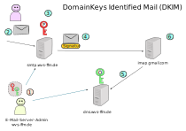
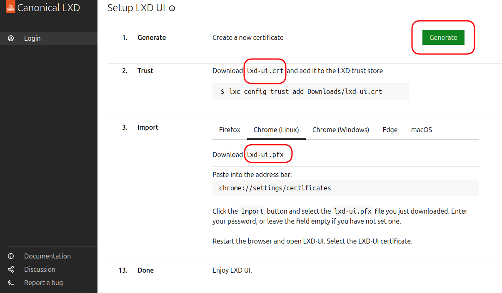

<!--
author:   Günter Dannoritzer
email:    g.dannoritzer@wvs-ffm.de
version:  0.1.0
date:     01.12.2024
language: de
narrator: Deutsch Female

comment:  Anwendung der digitalen Signatur

icon:    https://raw.githubusercontent.com/dsp77/wvs-liascript/0938e2e0ce751e270e3e36b8ecfeb09044a41aa0/wvs-logo.png
logo:    02_img/logo-usage-digital-signature.jpg

tags:    LiaScript, Kryptographie, digitale Signatur

link:    https://cdn.jsdelivr.net/chartist.js/latest/chartist.min.css

script:  https://cdn.jsdelivr.net/chartist.js/latest/chartist.min.js

attribute: Lizenz: [CC BY-SA](https://creativecommons.org/licenses/by-sa/4.0/)

translation: English
-->
# Anwendungen der digitalen Signatur

Aufbauend auf den Information der [Verschlüsselung](https://liascript.github.io/course/?https://raw.githubusercontent.com/dsp77/wvs-liascript/main/LF04/verschluesselung.md) sollen hier verschiedene Anwendungsgebiete der digitalen Signatur erklärt werden. Der Schwerpunkt liegt auf der Anwendung der Signatur und nicht auf einer vollständigen Beschreibung der jeweiligen Technik. Konkret geht es um die Themen:

 * UEFI Secure Boot
 * DomainKeys Identified Mail (DKIM)
 * Signierung von Dokumenten oder E-Mail
 * DNSSEC
 * Passwortlose Anmeldung (FIDO2, Passkeys)
 * Zertifikatbasierte Authentifizierung

## UEFI Secure Boot

Im Lernfeld-2-Dokument zum [PC-Bootprozess](https://liascript.github.io/course/?https://raw.githubusercontent.com/dsp77/wvs-liascript/main/LF02/pc-bootprozess.md) wird der Bootprozess mit UEFI beschrieben. Secure Boot ist eine Funktion, die den Bootprozess absichert. Diese Absicherung wird hier noch mal beschrieben.


 1. Im nichtflüchtigen Speicher (NVRAM) ist eingestellt, dass der **Windows Bootloader.efi** von der **EFI-Systempartition** gestartet werden soll.
 2. Mit eingeschaltetem **Secure-Boot** wird der **signierte Bootloader** von der EFI-Systempartition geladen. Das **Secure-Boot-Modul** hat den **öffentlichen Schlüssel** für den Bootloader hinterlegt und damit kann die Signatur überprüft werden.
 3. Nach der Überprüfung der Signatur und damit, dass der Bootloader nach der Auslieferung von Microsoft nicht verändert wurde, wird er mithilfe der **EFI-Byte-Code-VM** gestartet.
 4. Der **Windows Bootloader** startet dann das Betriebssystem von der Windows-Partition.

## DomainKeys Identified Mail (DKIM)

Mithilfe von DomainKeys Identified Mail (DKIM) kann überprüft werden, ob die E-Mail wirklich von dem Mail-Server der absendenden Domäne kommt oder von einem Spam-Server, der die Absenderadresse fälscht. Dazu wird die versendete E-Mail mithilfe einer digitalen Signatur versehen, die im empfangenen E-Mail-Server überprüft werden kann.

### Konfiguration von DKIM



Für die Nutzung ist die im Schritt **(1)** gezeigte Konfiguration nötig. Der Administrator des sendenden E-Mail-Servers erzeugt ein Schlüsselpaar und hinterlegt den **privaten Schlüssel** auf dem sendenden E-Mail-Server **smtp.wvs-ffm.de**. Der **öffentliche Schlüssel** wird auf den für die sendende Domäne zuständigen DNS-Server **dns.wvs-ffm.de** abgelegt.

### Ablauf eines E-Mail-Versands


 * **(2)** Ein Nutzer sendet eine E-Mail über den zugehörigen sendenden SMTP-Server (Simple Mail Transfer Protocol, Port 25, 465 (SSL/TLS), 587 (STARTTLS)).
 * **(3)** Der SMTP-Server signiert die E-Mail mithilfe des **privaten Schlüssels**.
 * **(4)** Die signierte E-Mail wird vom SMTP-Server zum E-Mail-Server des Empfängers gesendet.
 * **(5)** Der empfangende E-Mail-Server **imap.gmail.com** fragt bei dem zuständigen DNS-Server der Sendeadresse den **öffentlichen Schlüssel** zur Domäne der empfangenen E-Mail-Adresse.
 * **(6)** Mit dem vom DNS-Server empfangenen **öffentlichen Schlüssel** überprüft der E-Mail-Server die digitale Signatur der empfangenen E-Mail. Kann die Signatur überprüft werden, kommt die E-Mail von dem Server smtp.wvs-ffm.de. Ein Spam-Server könnte die E-Mail nicht mit dem zum öffentlichen Schlüssel gehörigen privaten Schlüssel signieren.

## Signierung von E-Mail

## Domain Name System Security Extensions (DNSSEC)

## Passwortlose Anmeldung nach FIDO2, Passkeys

## Zertifikatbasierte Authentifizierung

Für die zertifikatbasierte Authentifizierung soll als Beispiel die Nutzung der LXD-Oberfläche dienen. Die folgende Abbildung zeigt das Setup der zertifikatbasierten Authentifizierung.



 Die LXD-Oberfläche während des Setups erstellt zwei Dateien:

 * `lxd-ui.crt`
 * `lxd-ui.pfx`

 Der Hauptunterschied zwischen einer .crt und einer .pfx-Datei liegt in den enthaltenen Informationen und dem Format:

 * .crt-Datei:

    Inhalt: Enthält in der Regel **nur das öffentliche Zertifikat** einer digitalen Identität. Dieses Zertifikat dient zur Überprüfung der Identität einer Website oder eines Servers.
    Format: Einfacheres Format, das nur die Zertifikatsdaten enthält.
    Verwendung: Wird häufig für den Austausch von Zertifikaten zwischen verschiedenen Systemen verwendet.

 * .pfx-Datei:

    Inhalt: Enthält **neben dem öffentlichen Zertifikat auch den privaten Schlüssel**. Der private Schlüssel ist der Gegenpart zum öffentlichen Schlüssel und wird zur Verschlüsselung von Daten verwendet.
    Format: Komplexeres Format, das das Zertifikat und den privaten Schlüssel in einem einzigen, oft passwortgeschützten Container speichert.
    Verwendung: Wird häufig zur Installation von Zertifikaten auf Servern, da hier sowohl das Zertifikat als auch der private Schlüssel benötigt werden. In Browsern wird die Datei für die zertifikatbasierte Authentifizierung installiert.

Die Datei `lxd-ui.crt` wird im Webserver von LXD hinterlegt. Die Datei `lxd-ui.pfx` wird in dem jeweiligen Browser hinterlegt, über den eine Verbindung zur LXD-Oberfläche aufgebaut werden soll. Anders als für den Aufbau einer https-Verbindung wird der öffentliche Schlüssel im Server und der private Schlüssel im Browser installiert.

Für die Authentifizierung muss der Browser dem Server beweisen, dass er im Besitz des privaten Schlüssels ist. Dieser Beweis läuft analog zur Authentifizierung mit der passwortlosen Anmeldung nach FIDO2 über ein Challenge-Response-Verfahren ab.

``` ascii

 Client (Browser)                           Server
  |             "{1}{_How are you?_}"         |
  +------------------------------------------>|
  |           "{2}{**Need to do math**}"      |
  |<------------------------------------------+
  |          "{3}{How difficult can it be?}"  |
  +------------------------------------------>|
  | "                {{4}}                  " |
  | "$$                                     " |
  | " x = \sqrt[3]{ y                       " |
  | "   + \sqrt {y^2 + \bigg( \dfrac{c}{3a} " |
  | "   - \dfrac{b^2}{9a^2} \bigg)^3}}      " |
  | "$$                                     " |
  +<------------------------------------------+
  |                                           |
```