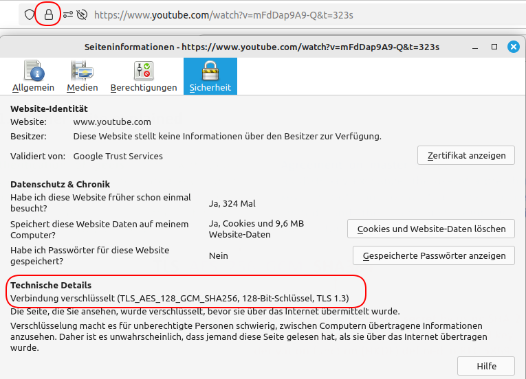

<!--
author:   Günter Dannoritzer
email:    g.dannoritzer@wvs-ffm.de
version:  2.2.1
date:     04.12.2024
language: de
narrator: Deutsch Female

comment:  Transport Layer Security (TLS)

icon:    https://raw.githubusercontent.com/dsp77/wvs-liascript/0938e2e0ce751e270e3e36b8ecfeb09044a41aa0/wvs-logo.png
logo:     02_img/logo-tls.jpg

tags:     LiaScript, TLS, SSL, Cipher Suite, Diffie Hellman, AES, FIPS197, SHA2, SHA256, NIST

link:     https://cdn.jsdelivr.net/chartist.js/latest/chartist.min.css

script:   https://cdn.jsdelivr.net/chartist.js/latest/chartist.min.js

attribute: Lizenz: [CC BY-SA](https://creativecommons.org/licenses/by-sa/4.0/)
-->
# Transport Layer Security

Aufbauend auf die [Einführung in die Verschlüsselung](https://liascript.github.io/course/?https://raw.githubusercontent.com/dsp77/wvs-liascript/main/LF04/verschluesselung.md) wird hier die **Transport Layer Security** beschrieben.

Transport Layer Security (TLS), früher bekannt als Secure Sockets Layer (SSL), ist ein kryptographisches Protokoll, das eine sichere Kommunikation über das Internet gewährleistet. Es bildet eine Art Schutzschicht, die Ihre Daten vor unbefugtem Zugriff schützt, während sie von einem Gerät zum anderen übertragen werden.

## Wofür wird TLS verwendet?

 * Verschlüsselung von Webverkehr: Wenn Sie "https://" in einer URL sehen, bedeutet das, dass die Verbindung zwischen Ihrem Browser und dem Webserver mit TLS verschlüsselt ist. Dadurch werden Ihre persönlichen Daten, wie Passwörter oder Kreditkartennummern, vor neugierigen Blicken geschützt.
 * E-Mail-Verschlüsselung: TLS schützt auch E-Mails vor dem Abfangen und Lesen durch Dritte.
 * VPN-Verbindungen: Viele VPN-Dienste nutzen TLS, um eine sichere Verbindung zwischen Ihrem Gerät und dem VPN-Server herzustellen.

## Wie funktioniert TLS?

 * Handshake: Wenn Sie eine Verbindung zu einer TLS-geschützten Website aufbauen, findet zunächst ein sogenannter Handshake statt. Dabei überprüfen sich Server und Client gegenseitig und einigen sich auf ein gemeinsames Verschlüsselungsverfahren.
 * Verschlüsselung: Alle Daten, die anschließend zwischen Server und Client ausgetauscht werden, werden verschlüsselt. Dies bedeutet, dass selbst wenn jemand die Daten abfangen würde, er sie ohne den passenden Schlüssel nicht entschlüsseln könnte.
 * Authentifizierung: TLS ermöglicht es, die Identität des Servers zu überprüfen. Dies geschieht durch digitale Zertifikate, die von vertrauenswürdigen Zertifizierungsstellen ausgestellt werden.

## TLS-Versionen: Ein Überblick

Transport Layer Security (TLS) hat sich seit seiner Einführung kontinuierlich weiterentwickelt, um die Sicherheit der Online-Kommunikation zu verbessern. Im Laufe der Zeit wurden verschiedene Versionen von TLS veröffentlicht, die jeweils neue Funktionen und Sicherheitsverbesserungen mit sich brachten.
Die wichtigsten TLS-Versionen

 * SSL 3.0: Dies war der Vorgänger von TLS und wies einige schwerwiegende Sicherheitslücken auf. SSL 3.0 wird aufgrund dieser Schwachstellen nicht mehr als sicher angesehen und sollte daher nicht mehr verwendet werden.
 * TLS 1.0: Die erste Version von TLS, die einige der Probleme von SSL 3.0 behob. Allerdings wurden auch in TLS 1.0 später Sicherheitslücken entdeckt.
 * TLS 1.1: Eine Weiterentwicklung von TLS 1.0, die einige zusätzliche Sicherheitsmaßnahmen einführte. Dennoch wurden auch in dieser Version Schwachstellen gefunden.
 * TLS 1.2: Diese Version war lange Zeit der Standard und bot eine deutliche Verbesserung der Sicherheit gegenüber den vorherigen Versionen. TLS 1.2 unterstützt eine Vielzahl von Verschlüsselungsverfahren und ist in der Regel sicher, wenn es richtig konfiguriert wird.
 * TLS 1.3: Die neueste und sicherste Version von TLS. TLS 1.3 wurde entwickelt, um die Geschwindigkeit und Sicherheit der TLS-Verbindungen zu erhöhen. Es bietet eine Reihe von Verbesserungen, darunter:

   * Höhere Geschwindigkeit: TLS 1.3-Handshakes sind schneller und effizienter.
   * Verbesserte Sicherheit: Es werden nur noch sichere Verschlüsselungsverfahren unterstützt und einige veraltete Funktionen wurden entfernt.
   * Einfachere Konfiguration: TLS 1.3 ist einfacher zu konfigurieren und erfordert weniger Handshakes.

## Weitere Informationen

 * **Cipher Suites**: TLS verwendet sogenannte Cipher Suites, die die Kombination aus Verschlüsselungsverfahren, Hash-Funktionen und Schlüsselaustauschmechanismen definieren.
 * **Perfect Forward Secrecy (PFS)**: PFS sorgt dafür, dass die Kompromittierung eines langfristigen Schlüssels nicht die Vertraulichkeit vergangener Kommunikation gefährdet.
 * **Zertifikate**: TLS-Verbindungen basieren auf digitalen Zertifikaten, die die Identität des Servers bestätigen. Mit dem Zertifikat wird der öffentliche Schlüssel des Servers mit dessen Adresse durch eine digitale Signatur der Zertifizierungsstelle verknüpft.

## TLS-Handshake

Die folgende Abbildung zeigt das Message Sequence Chart (MSC) für den TLS-Handshake. Nach dem Aufbau der TCP-Verbindung, in blau dargestellt, findet der anschließende TLS-Handshake in grün statt.


Der TLS-Handshake kann in vier Phasen unterteilt werden:

  1. **Verbindungsaufbau und Parameteraustausch**
  2. **Authentifizierung des Servers**
  3. **Erstellung des Sitzungsschlüssels**
  4. **Wechsel in den verschlüsselten Modus**

Im Detail laufen die vier Phasen wie folgt ab:

 1. Phase: Verbindungsaufbau und Parameteraustausch

   * **ClientHello**: Der Client (z.B. Ihr Browser) sendet eine Nachricht an den Server, in der er die unterstützten TLS-Versionen, Verschlüsselungsverfahren und eine zufällige Zeichenfolge (Client Random) angibt.
   * **ServerHello**: Der Server antwortet mit seiner ausgewählten TLS-Version, dem gewählten Verschlüsselungsverfahren und einer eigenen zufälligen Zeichenfolge (Server Random).

2. Phase: Authentifizierung des Servers

   * Zertifikataustausch: Der Server sendet sein digitales Zertifikat an den Client. Dieses Zertifikat wird von einer vertrauenswürdigen Zertifizierungsstelle signiert und bestätigt die Identität des Servers.
   * Zertifikatsprüfung: Der Client überprüft das Zertifikat anhand der in seinem Betriebssystem oder Browser gespeicherten Zertifikatskette.

3. Phase: Erstellung des Sitzungsschlüssels

   * Premaster Secret: Der Client erzeugt einen zufälligen Wert (Premaster Secret), verschlüsselt ihn mit dem öffentlichen Schlüssel des Servers und sendet ihn an den Server.
   * Berechnung des Master Secrets: Sowohl Client als auch Server verwenden den verschlüsselten Premaster Secret, die beiden Random-Werte und die Informationen aus dem Zertifikat, um einen gemeinsamen geheimen Schlüssel (Master Secret) zu berechnen.
   * Ableitung der Session Keys: Aus dem Master Secret werden die Session Keys abgeleitet, die für die Verschlüsselung der eigentlichen Datenübertragung verwendet werden.

4. Phase: Wechsel in den verschlüsselten Modus

   * Change Cipher Spec: Sowohl Client als auch Server wechseln in den verschlüsselten Modus und bestätigen sich gegenseitig, dass sie bereit sind, mit der verschlüsselten Kommunikation zu beginnen.
   * Finished-Nachrichten: Beide Seiten senden eine "Finished"-Nachricht, die mit dem neuen Session Key verschlüsselt ist. Dies bestätigt, dass der Handshake erfolgreich abgeschlossen wurde und die Kommunikation nun sicher ist.


!?[TLS Essentials 14: TLS 1.3 Wireshark analysis von Cyrill Gössi](https://www.youtube.com/watch?v=jjETd0YlKFs)

## Schlüsselaustausch

Für den Schlüsselaustausch werden folgende beide Systeme genommen:

 * RSA - Rivest-Shamir-Adleman
 * DH - Diffie Hellman

### RSA

RSA ist eine Abkürzung, die für Rivest-Shamir-Adleman steht. Es bezeichnet ein asymmetrisches Kryptosystem, das häufig für den sicheren Austausch von Informationen über unsichere Kanäle verwendet wird. Für den Schlüsselaustausch sendet z.B. der Webserver seinen öffentlichen Schlüssel in einem Zertifikat, der Client verschlüsselt nach Überprüfung des Zertifikats den symmetrischen Sitzungsschlüssel mit dem öffentlichen Schlüssel des Servers. Dieser entschlüsselt dann nach Empfang mit seinem privaten Schlüssel den Sitzungsschlüssel.

Mit TLS 1.3 wird RSA nicht mehr verwendet, da die Diffie-Hellman-Varianten mehr Sicherheit bieten.

### Übersicht Diffie Hellman

Das Diffie-Hellman-Schlüsselaustauschverfahren (DH) ist ein kryptographisches Verfahren, das es zwei Parteien ermöglicht, über einen unsicheren Kommunikationskanal einen gemeinsamen geheimen Schlüssel zu vereinbaren. Dieser Schlüssel kann dann zur symmetrischen Verschlüsselung der eigentlichen Kommunikation genutzt werden. Wichtig bei dem Verfahren ist, dass der Schlüssel niemals über den Kommunikationskanal übertragen wird, sondern durch das Berechnungsverfahren, auf beiden Seiten der gleiche Schlüssel gebildet wird.

Unterschieden werden die drei Varianten:

 * DH - Diffie Hellman
 * DHE - Diffie Hellman Ephemeral (ephemeral - kurzlebig)
 * ECDHE - Eliptic Curve Diffie Hellman Ephemeral

Diese drei Begriffe beschreiben verschiedene Methoden zur sicheren Schlüsselübertragung in der Kryptographie, wobei sie auf dem gleichen Grundprinzip des Diffie-Hellman-Schlüsselaustauschs basieren.

#### Grundprinzip von Diffie-Hellman

Grundprinzip: Zwei Parteien (Alice und Bob) erzeugen jeweils einen privaten Schlüssel und einen öffentlichen Schlüssel. Durch Austausch der öffentlichen Schlüssel können sie einen gemeinsamen geheimen Schlüssel berechnen, der nur ihnen bekannt ist.
 
Charakteristika:
 
 * Statische Schlüssel: Die privaten Schlüssel werden typischerweise über einen längeren Zeitraum verwendet.
 * Anfälligkeit: Bei einem Kompromiss des privaten Schlüssels eines Teilnehmers kann ein Angreifer möglicherweise vergangene Kommunikation entschlüsseln.

#### Diffie-Hellman Ephemeral (DHE)

Das Grundprinzip ist ähnlich wie bei Diffie-Hellman, aber mit dem entscheidenden Unterschied, das ein kurzlebiger (emphemeral) Schlüssel verwendet wird. Das bedeutet, für jede Verbindung wird ein neues Schlüsselpaar erzeugt.

Vorteile:

  * Forward Secrecy: Selbst wenn ein langfristiger privater Schlüssel kompromittiert wird, kann vergangene Kommunikation nicht entschlüsselt werden, da für jede Sitzung ein neuer Schlüssel verwendet wurde.
 * Höhere Sicherheit: Da die Schlüssel nur für eine begrenzte Zeit gültig sind, wird das Risiko eines Kompromisses verringert.

#### Elliptic Curve Diffie-Hellman Ephemeral (ECDHE)

Grundprinzip: Baut auf DHE auf, verwendet jedoch die Mathematik elliptischer Kurven.

Vorteile:

  * Höhere Effizienz: Für ein vergleichbares Sicherheitsniveau können kürzere Schlüssellängen verwendet werden, was zu einer effizienteren Berechnung führt.
 * Breite Anwendung: ECDHE ist in vielen modernen Krypto-Protokollen wie TLS (Transport Layer Security) standardmäßig implementiert.

Bei elliptischen Kurven handelt es sich um Kurven, die durch bestimmte Gleichungen beschrieben werden. Diese Kurven haben in der Kryptographie eine besondere Bedeutung gefunden.

Der größte Vorteil elliptischer Kurven liegt in ihrer Effizienz. Im Vergleich zu anderen kryptografischen Verfahren, wie RSA, ermöglichen elliptische Kurven eine vergleichbare Sicherheitsebene bei wesentlich kürzeren Schlüssellängen. Das hat mehrere Vorteile:

 * Schnellere Berechnungen: Kürzere Schlüssel führen zu weniger Rechenaufwand bei der Verschlüsselung und Entschlüsselung.
 * Geringerer Speicherbedarf: Kürzere Schlüssel benötigen weniger Speicherplatz
 * Höhere Bandbreite: Kleinere Datenpakete können schneller übertragen werden.

### Schlüsselaustausch mit Diffie Hellman

Der Ablauf des Schlüsselaustauschs mithilfe von Diffie Hellman funktioniert nach folgenden Schritten:

1. Vereinbarung öffentlicher Parameter

   * Große Primzahl p: Beide Parteien einigen sich auf eine sehr große Primzahl p. Diese Zahl bildet die Grundlage für alle weiteren Berechnungen.
    
  * Basis g: Eine weitere Zahl g wird gewählt, die kleiner als p ist und als Basis für die Potenzierung dient.

2. Generierung privater Schlüssel

   * Alice: Wählt eine zufällige Zahl a als ihren privaten Schlüssel aus.
   
   * Bob: Wählt ebenfalls eine zufällige Zahl b als seinen privaten Schlüssel aus.

3. Berechnung öffentlicher Schlüssel

   * Alice: Berechnet ihren öffentlichen Schlüssel A nach folgender Formel: $A = g^a \quad mod \quad p$.

   * Bob: Berechnet seinen öffentlichen Schlüssel B analog: $B = g^b \quad mod \quad p$.

4. Austausch öffentlicher Schlüssel

   * Alice sendet ihren öffentlichen Schlüssel A an Bob.

   * Bob sendet seinen öffentlichen Schlüssel B an Alice.

5. Berechnung des gemeinsamen geheimen Schlüssels

    * Alice: Berechnet den gemeinsamen geheimen Schlüssel K mit Hilfe von Bobs öffentlichem Schlüssel und ihrem privaten Schlüssel: $K = B^a \quad mod \quad p$.
    
    * Bob: Berechnet den gemeinsamen geheimen Schlüssel K mit Hilfe von Alices öffentlichem Schlüssel und seinem privaten Schlüssel: $K = A^b \quad mod \quad p$.

Warum funktioniert das?

Mathematische Eigenschaft: Es gilt die Gleichung 

$g^{(ab)} \quad mod \quad p = (g^a \quad mod \quad p)^b \quad mod \quad p = (g^b \quad mod \quad p)^a \quad mod \quad p*$.

Das bedeutet, dass sowohl Alice als auch Bob denselben Wert für K berechnen, obwohl sie nur ihre eigenen privaten Schlüssel und die öffentlich ausgetauschten Werte kennen.

Diskreter Logarithmus: Es ist rechnerisch extrem aufwendig, aus einem gegebenen öffentlichen Schlüssel A und den bekannten Werten g und p den privaten Schlüssel a zu berechnen. Dies macht das Verfahren sicher, da ein Angreifer, der die Kommunikation abhört, selbst mit Kenntnis der öffentlichen Schlüssel den gemeinsamen geheimen Schlüssel nicht leicht berechnen kann.

#### Beispiel zu Diffie Hellman Schlüsselaustausch

Gemeinsam wird festgelegt:

 * g = 2
 * p = 7


| Alice | | Bob   | Erklärung |
|-------|:-:|-------|------------|
| a = 3 | | b = 5 | Alice und Bob legen je eine Zufallszahl für sich fest. |
|||||
| $X_A = 2 ^3 = 8 \quad mod \quad 7 = 1$ || $X_B = 2^5 = 32 \quad mod \quad 7 = 4$ | Mit den zuvor festgelegten Werten g und p berechnen Alice und Bob $X_A$ und $X_B$ |
||||
|| $X_A$ -> | | Alice sendet den berechneten Wert an Bob. |
|| <- $X_B$ | | Bob sendet den berechneten Wert an Alice. |
||||
| $X_S = 4^3 = 64 \quad mod \quad 7 = 1$ || $X_S = 1 ^5 = 1 \quad mod \quad 7 = 1$| Mit den ausgetauschten Werten berechnen beide den geheimen Schlüssel $X_S$ |


      Bemerkenswert ist das im letzten Schritt beide den gleichen geheimen Schlüssel berechnen. Ausgetauscht wurden die Werte $X_A$ und $X_B$ und die vorher festgelegten Werte g und p.


## Cipher Suites

Eine TLS Cipher Suite ist eine Kombination aus kryptographsichen Algorithmen, mit den folgende Funktionen durchgeführt werden:

 * Schlüsselaustausch: Wie die beiden Kommunikationsparteien kryptographische Schlüssel austauschen.
 * Verschlüsselung: Wie der Datenaustausch verschlüsselt wird.
 * Message authentication: Wie die Integrität und Authentizität der Nachrichten überpüft wird.

 Die folgende Abbildung zeigt die Informationen im Firefox-Browser, welche Cipher Suite für eine HTTPS-Verbindung zu einer Webseite verwendet wird.

 

Das Fenster kann über das Schlosssymbol in der Adressleiste des Browsers -> Verbindung sicher -> weitere Informationen erreicht werden.

Die ausgewählte Cipher Suite ist: **`TLS_AES_128_GCM_SHA256`**

Als Zusatzinformation wird explizit noch die 128-Bit Verschlüsselung erwähnt und das die Cipher Suite gemäß TLS 1.3 verwendet wird.

Die Aufschlüsselung im Detail:

 * `TLS`- Es handelt sich um eine TLS Cipher Suite
 * `AES`- **Advanced Encryption Standard** ist Teil des [FIPS197 Standard des National Institute of Standards and Technology (NIST)](https://csrc.nist.gov/pubs/fips/197/final)
 * `128`- es werden AES Schlüssel mit der Länge von 128-Bit verwendet
 * `GCM`- Galois/Counter Modus, der im Zusammenhang mit der AES-Verschlüsselung verwendet wird
 * `SHA256`- als Hashalgorithmus wird `SHA256`verwendet, der einen Hashwert von 256-Bit Länge erzeugt. Der SHA256 ist Teil des [**SHA2-Standards** des **National Institute of Standards and Technologiy (NIST)**](https://csrc.nist.gov/projects/hash-functions).

Der folgende Film von Cyrill Gössi erklärt die Cipher Suites:

 !?[ TLS cipher suites explained von Cyrill Gössi](https://www.youtube.com/watch?v=mFdDap9A9-Q&t=323s)


# Praktische Übung: Webserver NGINX mit Zertifikat einrichten

Benutze Domäne `werner.wvs`

Webserver installieren: `sudo apt install nginx`

Editieren `sudo nano /etc/hosts`

````
...
127.0.0.1  werner.wvs
...
````

## Setup Ordnerstruktur für Zertifikate

````
mkdir ca
mkdir Webserver
````

## CA-Admin: CA Zertifkat erstellen

`openssl req -x509 -sha256 -nodes -days 365 -newkey rsa:4096 -keyout ca/private_ca.key -out ca/certificate_ca.crt`

Parameter:

````
Country Name: DE
State or Province Name: Hessen
Locality Name:Frankfurt
Organization Name: WvS-CA
Organization Unit Name []:
Common Name: ca.wvs
Email Address : ca-admin@wvs-ffm.wvs
````

 
## Web-Admin: CSR erstellen 
 
`openssl req -new -newkey rsa:2048 -nodes -out webserver/csr_customer.csr -keyout webserver/private_customer.key`
 
Parameter:

````
Country Name: DE
State or Province Name: Hessen
Locality Name:Frankfurt
Organization Name: WvS-Webserver
Organization Unit Name []:
Common Name: werner.wvs
Email Address : werner@wvs-ffm.wvs
A challenge password []:
n optional company name []:
````

## CA-Admin: 
 
`openssl x509 -req -in webserver/csr_customer.csr -CA ca/certificate_ca.crt -CAkey ca/private_ca.key -CAcreateserial -out webserver/certificate_customer.crt`


## NGINX mit Zertifikat konfigurieren

````
sudo mkdir /var/www/werner.wvs
echo 'Hallo HTTPS' > /var/www/werner.wvs/index.html
````

`sudo nano /etc/nginx/sites-available/default`

````
server {

   listen 443;
   listen [::]:443;

   ssl_certificate /home/schule/webserver/certificate_customer.crt;
   ssl_certificate_key /home/schule/webserver/private_customer.key;

   server_name werner.wvs;

   root /var/www/werner.wvs;
   index index.html;


}
````

 