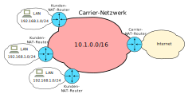

<!--
author:   Günter Dannoritzer
email:    g.dannoritzer@wvs-ffm.de
version:  1.1.2
date:     16.11.2024
language: de
narrator: Deutsch Female

comment:  Network Address Translation (NAT)

icon:    https://raw.githubusercontent.com/dsp77/wvs-liascript/0938e2e0ce751e270e3e36b8ecfeb09044a41aa0/wvs-logo.png
logo:     02_img/logo-nat.jpg

tags:     LiaScript, NAT, Network Address Tranlation, SNAT, DNAT, CGNAT, Dual Stack Lite

link:     https://cdn.jsdelivr.net/chartist.js/latest/chartist.min.css

script:   https://cdn.jsdelivr.net/chartist.js/latest/chartist.min.js

attribute: Lizenz: [CC BY-SA](https://creativecommons.org/licenses/by-sa/4.0/)
-->
# Network Address Translation

Network Address Translation (NAT) ist ein Netzwerkverfahren, das die Übersetzung von privaten IP-Adressen in öffentliche IP-Adressen ermöglicht und umgekehrt. Vereinfacht gesagt, dient NAT dazu, mehrere Geräte in einem privaten Netzwerk (z.B. Ihr Heimnetzwerk) über eine einzige öffentliche IP-Adresse erreichbar zu machen.

Warum ist NAT notwendig?

  * Begrenzte öffentliche IP-Adressen: Die Anzahl der öffentlich verfügbaren IP-Adressen ist begrenzt.
 * Private Netzwerke: In privaten Netzwerken (wie Heimnetzwerken oder Firmennetzwerken) werden private IP-Adressen verwendet, um eine sichere und isolierte Umgebung zu schaffen.
 * Sicherheit: NAT fungiert als eine Art Firewall und schützt private Netzwerke vor direkten Angriffen aus dem Internet.

Wie funktioniert NAT?

  * Ein Gerät im privaten Netzwerk (z.B. Ihr Computer) sendet eine Anfrage an das Internet.
 * Der Router (mit NAT-Funktion) übersetzt die private IP-Adresse des Geräts in seine eigene öffentliche IP-Adresse und fügt zusätzliche Informationen hinzu (z.B. Portnummer), um die einzelnen Geräte im privaten Netzwerk unterscheiden zu können.
 * Das Paket wird an das Internet gesendet.
 * Das Zielsystem antwortet.
 * Der Router empfängt die Antwort und übersetzt die öffentliche IP-Adresse wieder in die private IP-Adresse des ursprünglichen Geräts.

Arten von NAT:

  * Statisches NAT: Hier wird einer privaten IP-Adresse eine feste öffentliche IP-Adresse zugeordnet.
 * Dynamisches NAT: Der Router weist den Geräten im privaten Netzwerk dynamisch eine verfügbare öffentliche IP-Adresse zu.
 * Port-Forwarding: Damit können bestimmte Dienste (z.B. ein Webserver) in einem privaten Netzwerk direkt von außen erreichbar gemacht werden.

Vorteile von NAT:

  * Effiziente Nutzung von IP-Adressen
 * Erhöhte Sicherheit
 * Vereinfachte Netzwerkverwaltung

Nachteile von NAT:

  * Komplizierte Netzwerkdiagnose
 * Einschränkungen bei bestimmten Anwendungen (z.B. VoIP, Peer-to-Peer-Anwendungen)
 * Probleme bei der Netzwerkadressübersetzung (NAPT), wenn mehrere Geräte gleichzeitig dieselbe Anwendung nutzen möchten

Innerhalb von NAT gibt es zwei Haupttypen: Source NAT (SNAT) und Destination NAT (DNAT).

## Source NAT (SNAT)

Zweck: Übersetzt die Quell-IP-Adresse eines Pakets, das von einem privaten Netzwerk ins Internet gesendet wird.

Funktionsweise:

  * Ein Gerät in einem privaten Netzwerk möchte eine Verbindung zum Internet aufbauen.
 * Der Router mit NAT-Funktion ersetzt die private Quell-IP-Adresse des Geräts durch seine eigene öffentliche IP-Adresse.
 * Das Paket wird mit der neuen Quell-IP-Adresse ins Internet gesendet.
 * Die Antwort vom Internet wird vom Router empfangen und die öffentliche Quell-IP-Adresse wieder in die private Quell-IP-Adresse des Geräts übersetzt.
 * Beispiel: Ein Computer in Ihrem Heimnetzwerk möchte eine Webseite besuchen. Der Router übersetzt die private IP-Adresse des Computers in seine öffentliche IP-Adresse, bevor das Paket an den Webserver gesendet wird.

### Ablauf einer Source-NAT-Verbindung

Die folgende Abbildung zeigt den Ablauf einer NAT-Verbindung.

 1. Der Client mit der IP-Adresse `192.168.1.10` sendet eine Anfrage an den Server mit der IP-Adresse `222.1.2.3`. Dazu öffnet er den Port `32123`für die Rückantwort.
 2. Der NAT-Router schreibt in die NAT-Tabelle den geöffneten LAN-Port `32123`, die IP-Adresse des LAN-Clients `192.168.1.10` und öffnet für die Rückantwort einen WAN-Port, hier `41444`.
 3. Der Router leitet das Paket weiter, tauscht dabei aber die Quelladresse aus. Die IP-Adresse des Clients wird durch die WAN-IP-Adresse des Routers und den vom Router geöffneten Port `41444` ersetzt.
 4. Die Rückantwort des Servers wird an die Routeradresse mit dem Port `41444` adressiert.
 5. Mit Ankunft des Pakets beim Router am Port `41444` schaut der Router in der NAT-Tabelle nach und findet darin die LAN-IP und LAN-Port, an den das Paket weitergeleitet wird.
 6. Der Router ersetzt als Zieladresse die LAN-IP und den LAN-Port.

## Destination NAT (DNAT)

Zweck: Übersetzt die Ziel-IP-Adresse eines Pakets, das von außen in ein privates Netzwerk gesendet wird.

Funktionsweise:

  * Ein Paket wird von außen an die öffentliche IP-Adresse eines Routers gesendet.
 * Der Router prüft, an welches Gerät im privaten Netzwerk das Paket weitergeleitet werden soll (basierend auf Portnummern oder anderen Kriterien).
 * Der Router ersetzt die öffentliche Ziel-IP-Adresse durch die private IP-Adresse des Zielgeräts im privaten Netzwerk.
 * Das Paket wird an das Zielgerät im privaten Netzwerk weitergeleitet.
 * Beispiel: Sie möchten einen Webserver in Ihrem Heimnetzwerk betreiben und von außen erreichbar machen. Der Router leitet alle eingehenden Verbindungen an den Port 80 (HTTP) an den Webserver im privaten Netzwerk weiter.

 1. In der NAT-Tabelle des Routers wird die IP-Adresse und der Port eines Servers im LAN eingetragen, der vom Internet aus erreichbar sein soll. Hier wird von dem Server mit der IP-Adresse `192.168.1.10` der Port `443` auf den WAN-Port geöffnet.
 2. Ein Client aus dem Internet will auf die IP-Adresse `93.1.2.3` Port `443` zugreifen.
 3. Das auf Port `443` des WAN-Ports ankommende Paket führt dazu, dass der Router in der NAT-Tabelle nachschaut, wohin das Paket ins LAN weitergeleitet werden soll. Aus dem Eintrag entnimmt er die Adresse und den Port und ersetzt damit die Zieladresse und Zielport des Pakets.
 4. Mit der neuen Zieladresse und dem Zielport wird das Paket an den Sever im LAN weitergeleitet.
 5. Die Rückantwort des Servers wird an den NAT-Router gesendet. Dieser ersetzt basierend auf dem Eintrag in der NAT-Tabelle die Quelladresse und den Quellport mit der IP-Adresse des WAN-Interfaces und dem Port.
 6. Mit den Quellparametern des WAN-Ports wird das IP-Paket zurück an den Server gesendet.

# Carrier-NAT (CG-NAT)

Carrier-Grade NAT (CGNAT), auch bekannt als Large-Scale NAT (LSN) oder NAT auf Betreiber-Ebene, ist eine spezielle Form der Network Address Translation (NAT), die von Internet Service Providern (ISPs) eingesetzt wird, um die begrenzte Anzahl an öffentlichen IPv4-Adressen effizienter zu nutzen.

Während normales NAT eine private IP-Adresse in eine öffentliche IP-Adresse übersetzt, führt CGNAT eine zusätzliche Übersetzungsschicht ein.

  * Erste Übersetzung: Die privaten IP-Adressen der Endkunden werden zunächst in eine interne private IP-Adresse des Providers übersetzt.
 * Zweite Übersetzung: Diese internen privaten IP-Adressen werden dann in eine öffentliche IP-Adresse übersetzt, die von mehreren Kunden gemeinsam genutzt wird.

Damit ist es möglich, mehrere Kunden über eine öffentliche IP-Adresse ins Internet anzubinden.

Da die IPv4-Pakete der Kunden per NAT in das IPv4-Netzwerk des Carriers und dann weiter in das IPv4-basierte Internet übersetzt werden, bezeichnet man diese Netzwerkkonstellation auch als **NAT444**.

## CG-NAT mit IPv6-Tunnel

Eine Variante des CGNAT ist, für den Anbieter nur noch ein IPv6-Netzwerk zu betreiben und für Kunden durch den NAT-Prozess im Zusammenhang mit der Tunnelung von IPv4-Paketen darüber einen IPv4-Zugang für Kunden zur Verfügung zu stellen.

Das Tunneling von IPv4-Pakete über ein nur IPv6-basiertes Carrier-Netzwerk wird auch als **NAT464** genannt, da das IPv4-Netzwerk des Kunden per NAT über einen IPv6-Tunnel durch das Carrier-Netzwerk per NAT in das IPv4-Netzwerk des Internets transportiert wird.

## Dual Stack Lite

Dual Stack Lite (DS-Lite), im [RFC6333](https://datatracker.ietf.org/doc/rfc6333/) beschrieben, ist eine Übergangstechnologie, die es Internet Service Providern (ISPs) ermöglicht, ihren Kunden sowohl IPv4- als auch IPv6-Dienste anzubieten, ohne dass sie ihre gesamte Infrastruktur auf IPv6 umstellen müssen. Es ist eine Art Brücke zwischen den beiden Internetprotokollversionen.

Wie funktioniert DS-Lite?

  * Globale IPv6-Adresse: Jeder Kunde erhält eine globale IPv6-Adresse, die ihn im Internet eindeutig identifiziert.
 * Private IPv4-Adresse: Zusätzlich erhält jeder Kunde eine private IPv4-Adresse innerhalb seines Heimnetzwerks.
 * IPv4-in-IPv6-Tunneling: Wenn ein Gerät im Kundennetzwerk eine Verbindung zu einem IPv4-Dienst im Internet aufbauen möchte, wird das IPv4-Paket in ein IPv6-Paket eingekapselt (getunnellet). Die Tunnelung wird im [RFC2473](https://datatracker.ietf.org/doc/rfc2473/) beschrieben.
 * NAT464: Am Rand des Netzwerks des ISPs befindet sich ein NAT464-Gerät. Es übersetzt die in einem IPv6-Paket getunnelte IPv4-Paket des Kunden in die öffentliche IPv4-Adresse.
 * Rückweg: Antworten vom Internet werden auf dem gleichen Weg zurück zum Kunden geleitet.

<!--  STUN und TURN - Problemlöser für NAT -->