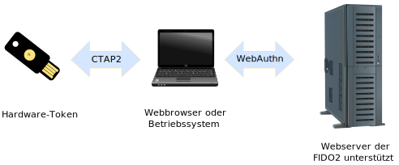
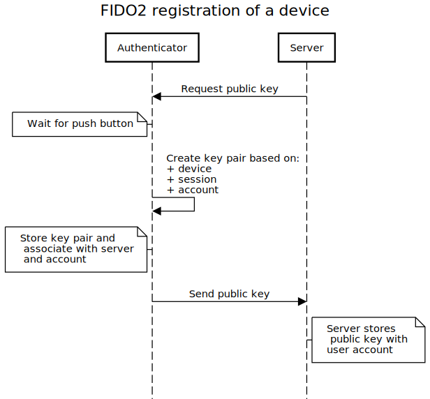
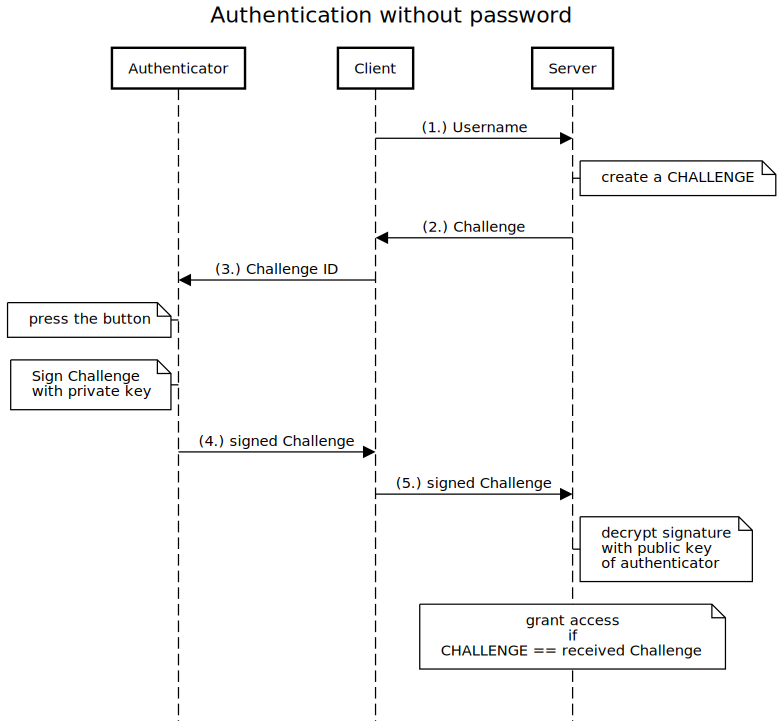

<!--
author:   Günter Dannoritzer
email:    g.dannoritzer@wvs-ffm.de
version:  0.1.0
date:     11.01.2024
language: de
narrator: Deutsch Female

comment:  Passwort, Mehrfaktorauthentifizierung, passwortlose Anmeldung, Passkeys

icon:    https://raw.githubusercontent.com/dsp77/wvs-liascript/0938e2e0ce751e270e3e36b8ecfeb09044a41aa0/wvs-logo.png
logo:     02_img/logo-passkeys.jpg

tags:     LiaScript, FIDO2, 2FA, MFA, passwordlose Anmeldung, Passkeys

link:     https://cdn.jsdelivr.net/chartist.js/latest/chartist.min.css

script:   https://cdn.jsdelivr.net/chartist.js/latest/chartist.min.js

attribute: Lizenz: [CC BY-SA](https://creativecommons.org/licenses/by-sa/4.0/)
-->
# Benutzerkonten Anmeldung

Benutzerkonten sind im Wesentlichen die digitalen Identitäten, die wir auf Computern oder Diensten verwenden. Sie dienen dazu, verschiedene Benutzer zu trennen und jedem eine personalisierte Umgebung zu bieten.

Wichtigsten Funktionen von Benutzerkonten sind:

**Individuelle Einstellungen**: Jeder Benutzer kann seine eigenen Desktop-Hintergründe, Fenstergrößen Programmkonfigurationen und andere Einstellungen speichern. Dies bedeutet, dass jeder Benutzer seine Arbeitsumgebung ganz nach seinen Bedürfnissen anpassen kann.
    
**Datenabgrenzung:** Jedes Konto hat seinen eigenen Ordner für Dokumente, Bilder, Musik und andere Dateien.Dadurch werden die Daten der einzelnen Benutzer voneinander getrennt und geschützt.
        
**Zugriffsberechtigungen:** Administratoren können festlegen, welche Programme und Systemfunktionen von den einzelnen Benutzern genutzt werden dürfen. Dies ist besonders wichtig, wenn Kinder oder andere unerfahrene Benutzer den Computer nutzen.

**Sicherheit:** Jedes Konto hat ein eigenes Passwort. Dadurch wird verhindert, dass unbefugte Personen auf die Daten anderer Benutzer zugreifen.

**Verantwortlichkeit:** Durch die Verwendung von Benutzerkonten kann jeder Benutzer für seine eigenen Handlungen zur Verantwortung gezogen werden.

## Authentifizierung

**Authentifizierung** ist der Prozess, bei dem die Identität einer Person oder eines Geräts überprüft wird. Im digitalen Kontext bedeutet das, dass ein System sicherstellt, dass die zugreifende Person wirklich die Person ist, für die sie sich ausgibt, bevor der Zugriff auf bestimmte Daten oder Funktionen gewährt wird.

Im Zusammenhang mit IT-Systemen findet die Authentifizierung am meisten noch mithilfe von Benutzernamen und Passwort statt.

# Mehrfaktor Authentifizierung

**Mehrfaktor-Authentifizierung (MFA)** ist ein Sicherheitsverfahren, das über die einfache Kombination aus Benutzername und Passwort hinausgeht. Bei der MFA müssen Benutzer zur Bestätigung ihrer Identität mehrere unabhängige Faktoren vorlegen. Das Ziel ist es, die Sicherheit deutlich zu erhöhen und den Schutz vor unbefugtem Zugriff auf sensible Daten zu verstärken.

Wie funktioniert MFA?

Es gibt verschiedene Arten von Faktoren, die bei der MFA eingesetzt werden können:

  * Wissen: Das, was nur der Benutzer weiß, wie z.B. ein Passwort.

 * Besitz: Ein Gegenstand, der nur dem Benutzer gehört, wie z.B. ein Smartphone oder ein Sicherheitsschlüssel.

 * Inhärenz: Ein körperliches Merkmal des Benutzers, wie z.B. ein Fingerabdruck, eine Gesichtserkennung oder eine Iris-Scan.

Ein Beispiel:

Ein Benutzer möchte sich in einem Online-Banking einloggen. Neben dem Benutzernamen und Passwort musst zusätzlich ein einmaliger Code eingeben, der per SMS gesendet wird oder auf dem Smartphone durch eine App erstellt wird. Hier findet die Kombination won "Wissen" (Passwort) und "Besitz" (Smartphone) statt.

Techniken für weitere Faktoren sind zum Beispiel:

**ToTP** steht für **Time-based One-Time Password**. Es ist eine Methode zur Generierung von einmaligen Passwörtern, die nur für einen begrenzten Zeitraum gültig sind. Diese Passwörter werden häufig in Kombination mit einem statischen Passwort verwendet, um die Sicherheit von Online-Konten zu erhöhen.

**SMS** oder **E-Mail** Nach Einwahl bei einem Dienst sendet dieser an eine hinterlegte Telefonnummer oder E-Mail ein Einamlpasswort, dass für eine begrenzte Zeit gültig ist und bei dem Dienst eingegeben werden muss.

Zur Abgrenzung ist zu sagen, dass die Sicherheit durch die mehrere Faktoren nur gegenüber dem Dienst eine Erhöhung der Sicherheit mit sich bringt. Eine Absicherung des Passworts auf dem Smartphone mithilfe eines Fingerabdrucks ergibt keine Sicherheit gegenüber dem Onlinedienst, bei dem die Einwahl mit dem Benutzer und Passwort erfolgt. Erst wenn der Dienst einen zweiten Faktor, wie z.B. nach Eingabe des Benutzernamens und Passworts auch noch ein Timed One Time Passwort verlangt, ist die Sicherheit zu dem Dienst erhöht.

# Passwortlose Anmeldung (FIDO2)

Passwortbasierte Anmeldeverfahren haben die Schwäche, dass mit bekanntem Passwort, von jeder erreichbaren Stelle ein Zugriff auf ein System möglich ist.

Aber ist es nicht gerade ein Vorteil, von jeder erreichbaren Stelle einen Zugriff auf ein System zu haben? Ja, aber nicht von jedem Menschen, der das Passwort kennt. Es ist nur erwünscht von dem Menschen, dem das Konto gehört.

Ein herkömmliches Passwort ist an keinen Ort gebunden, wie es z.B. ein physikalischer Schlüssel für eine Tür ist. Daher sind Passwörter ein lohnendes Ziel, um unerlaubten Zugriff auf Benutzerkonten zu erhalten.

Seit 2019 existiert der FIDO2-Standard, der eine passwortlose Anmeldung an Systemen ermöglicht. Analog zu einem physikalischen Schlüssel für eine Tür, basiert das System auf einem Authentikator, der z.B. in einem USB-Stick implementiert ist.

Kernkomponeneten neben dem **Authenticator** sind:

 * CTAP2
 * WebAuthn

> **CTAP2**
>
> Client-To-Authenticator-Protocol 2 stellt die Verbindung zwischen dem Authenticator und dem benutzten Client, wie z.B. einem Computer, Smartphone oder Tablet her.

>**WebAuthn**
>
> Mithilfe von WebAuthn wird die Verbindung zwischen dem Client und dem Server hergestellt, der einen Dienst zur Verfügung stellt und auf dem sich der Benutzer anmelden will.

>**FIDO-Allianz**
>
> Die nichtkommerzielle FIDO-Allianz wurde 2012 von Lenovo, PayPal, Infineon, Nok Nok Labs, Validity Sensors und Agnitio gegründet.Google, NXP und Yubico stießen ein Jahr später hinzu. Ihr Ziel ist es, offene und lizenzfreie Industriestandards für die Authentifizierung im Internet zu entwickeln.

<!-- style="display:none" -->

https://sequencediagram.org/ 

  ~~~
  title FIDO2 registration of a device

  participant Authenticator
  participant Server
  Authenticator<-Server:Request public key
  note left of Authenticator:Wait for push button
  Authenticator->Authenticator:Create key pair based on: \n+ device\n+ session\n+ account
  note left of Authenticator:Store key pair and\n associate with server\n and account
  Authenticator->Server:Send public key
  note right of Server: Server stores \n public key with \nuser account
  ~~~

## Registrierung eines Gerätes

Im ersten Schritt muss der Authenticator ein Schlüsselpaar für den Dienst erzeugen, gegenüber den er sich authentifizieren soll. Dies geschieht basierend auf dem Konto bei dem Server. Der öffentliche Schlüssel wird dann zum Server gesendet und dort hinterlegt. Der private Schlüssel wird im Authenticator gespeichert. Die Sicherheit des Systems beruht darauf, dass der private Schlüssel niemals den Authenticator verlässt.

Das nebenstehende Sequenzdiagramm beschreibt die Registrierung des Authenticators mit einem Server.

## Anmeldung ohne Passwort

<!-- style="display:none" -->

https://sequencediagram.org/ 

  ~~~
  title Authentication without password

  participant Authenticator
  participant Client
  participant Server

  Client->Server: (1.) Username
  note right of Server: create a CHALLENGE
  Server->Client: (2.) Challenge
  Client->Authenticator: (3.) Challenge ID
  note left of Authenticator: press the button
  note left of Authenticator: Sign Challenge\nwith private key
  Authenticator->Client: (4.) signed Challenge
  Client->Server: (5.) signed Challenge
  note right of Server: decrypt signature\nwith public key\nof authenticator
  note over Server: <align:center>grant access\nif\nCHALLENGE == received Challenge</align>
  ~~~

Der Anmeldeprozess ist ein **Challenge-Response-Verfahren** und wird im nebenstehenden Sequenzdiagramm beschrieben.  Die Benutzerin möchte sich auf einem Server anmelden und gibt dazu den Kontonamen im Client ein, der daraufhin zum Server gesendet wird.

Der Server erstellt einen **Challenge**, eine zufällige Zahl, die er zum Client sendet. Dieser leitet sie zusammen mit einer Zugangs-ID weiter zum Authenticator.

Der Authenticator **verschlüsselt** die Herausforderung mit seinem **privaten Schlüssel**. Die entstandene Chiffre wird zum Server gesendet.

Der Server **entschlüsselt** die Chiffre mit dem **öffentlichen Schlüssel** des Authenticators und vergleicht das Ergebnis mit der erzeugten Herausforderung. Wenn beide gleich sind, ist der Client mit dem
Authenticator verbunden, von dem der Server den öffentlichen Schlüssel bekommen hat.

Die Sicherheit des Verfahrens beruht auf dem Konzept, dass der **private Schlüssel** nie den Authenticator verlässt. Dadurch reduziert sich ein Angriff auf den physischen Zugriff auf den Authenticator.

# Passkeys

Passkeys ist die Weiterentwicklung der passwortlosen Anmeldung mittels FIDO2, basierend auf Passwortmanagern wie z.B. der Passwort-Software [KeePass](https://keepassxc.org/) oder den von Google oder Apple genutzten Passwortmanagern. Dadurch kann eine passwortlose Anmeldung jetzt mit dem Smartphone, Tablet oder Computer durchgeführt werden und es ist kein extra hardwarebasierter Authenticator nötig.

