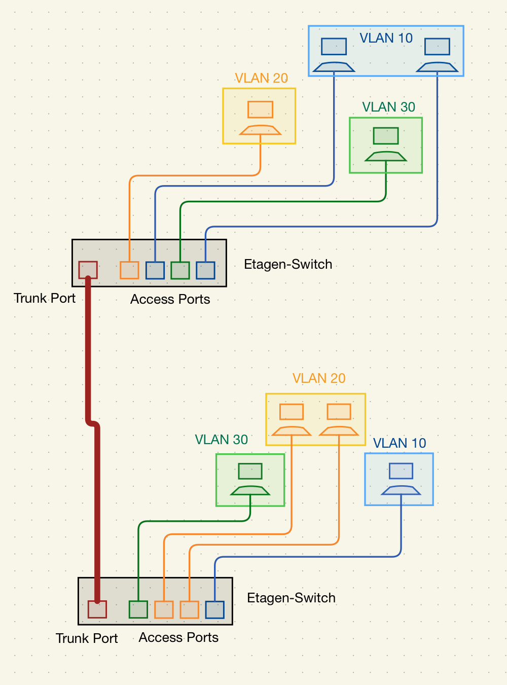
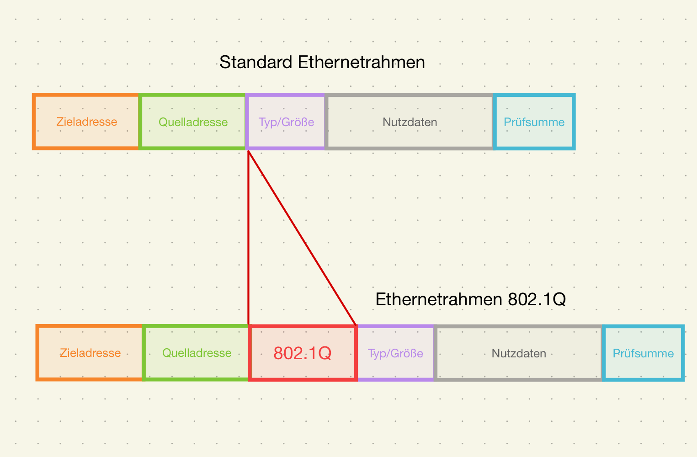
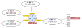

<!--
author:   Günter Dannoritzer
email:    g.dannoritzer@wvs-ffm.de
version:  0.1
date:     09.11.2025
language: de
narrator: Deutsch Female

comment:  VLAN und Layer-3-Switch

icon:    https://raw.githubusercontent.com/dsp77/wvs-liascript/0938e2e0ce751e270e3e36b8ecfeb09044a41aa0/wvs-logo.png
logo:     02_img/logo-availability.jpg

tags:     LiaScript, VLAN, 802.1q, Tagging, Trunkport

link:     https://cdn.jsdelivr.net/chartist.js/latest/chartist.min.css

script:   https://cdn.jsdelivr.net/chartist.js/latest/chartist.min.js

attribute: Lizenz: [CC BY-SA](https://creativecommons.org/licenses/by-sa/4.0/)
-->
# Virtual LAN (VLAN)

 * Portbasiertes vs. Tagging
 * IP-Vergabe mit VLANs

VLAN steht für Virtual Local Area Network. Es handelt sich dabei um eine Methode, physisch zusammenhängende Netzwerke logisch zu trennen. Mit einer hardwaremäßigen Netzwerkinstallation können logische Einheiten wie Abteilungen einer Firma oder Server- und Client-Netzwerke voneinander getrennt werden. Die so logisch gruppierten Geräte in einem VLAN können miteinander kommunizieren, auch wenn sie an unterschiedlichen physischen Switches angeschlossen sind. Voraussetzung dafür ist eine entsprechende Konfiguration der Switche.

Jedes VLAN bildet eine eigene Broadcast-Domain, wodurch der Broadcast-Verkehr auf das jeweilige VLAN begrenzt wird.

Geräte aus verschiedenen VLANs können nicht direkt miteinander kommunizieren, außer über ein Routing wie zum Beispiel durch einen Layer-3-Switch oder Router.

Ein weiterer Vorteil ist die Flexibilität. Benutzer oder Geräte können unabhängig vom physischen Standort einem bestimmten VLAN zugewiesen werden.

## Grundlegende VLAN-Arten

VLANs werden durch Nummern unterschieden, die sogenannte **VLAN-ID**, und die Zuordnung geschieht auf zwei verschiedenen Arten: **portbasiertes VLAN** und **getaggtes VLAN**.

Beim **portbasierten VLAN** wird im Switch ein bestimmter Port einem VLAN zugeordnet. Nur Ethernetrahmen, die zu dem entsprechenden VLAN gehören, werden über den Port gesendet. Das gilt besonders für Broadcasts oder das Flooding, wenn der Switch das Ziel einer MAC-Adresse nicht kennt. Beim portbasierten VLAN wird der Standard-Ethernetrahmen verwendet. Ein entsprechender Port am Switch wird **Access-Port** genannt.



Das **getaggte VLAN** wird eingesetzt, wenn über einen Port mehrere VLANs übertragen werden müssen. Ein Einsatzszenario ist etwa die Verbindung von Etagenswitchen gemäß der strukturierten Verkabelung. Auf jeder Etage werden die einzelnen Endgeräte gemäß der Zuordnung per portbasiertem VLAN an den Etagenswitch angeschlossen. Hier kann es sein, dass auf einer Etage mehrere Abteilungen untergebracht sind, die alle verschiedenen VLANs zugeordnet sind. Die Etagenswitche werden dann mit dem Gebäudeswitch, in der Regel über eine Glasfaserverbindung, angeschlossen. Hier müssen die verschiedenen VLANs über einen Port übertragen werden. Im Zusammenhang mit VLANs wird so eine Verbindung als **Trunk** bezeichnet und der Port als **Trunk-Port**.



Das Tagging findet mit einem modifizierten Ethernetrahmen statt, der im **IEEE-802.1Q-Standard** beschrieben wird. Der Rahmen wird um das VLAN-ID-Feld erweitert, in dem die VLAN-ID gespeichert wird. Dadurch können über den gleichen Port Rahmen verschiedener VLANs übertragen werden.

Schließlich gibt es noch den **Hybrid-Port** an dem sowohl getaggte, als auch ein ungetaggter Ethernetrahmen gesendet werden kann.

<!-- ## Erweiterte VLAN-Typen 

Es gibt mehrere grundlegende Arten von VLANs, die je nach Einsatzzweck und Netzwerkarchitektur eingesetzt werden. Hier sind die wichtigsten VLAN-Typen:

🔹 1. Port-basiertes VLAN (Static VLAN)

Definition: VLAN-Zuweisung erfolgt anhand des Switch-Ports, an dem ein Gerät angeschlossen ist.

Ein bestimmter Port gehört fest zu einem bestimmten VLAN.

Wird häufig in Unternehmen eingesetzt.

Einfach zu konfigurieren, aber unflexibel bei Standortwechseln von Geräten.

Beispiel:

Port 1–10 → VLAN 10 (z. B. „Marketing“)

Port 11–20 → VLAN 20 (z. B. „IT“)

🔹 2. MAC-basiertes VLAN

Definition: VLAN-Zuweisung erfolgt anhand der MAC-Adresse des Endgeräts.

Wird verwendet, wenn Geräte flexibel angeschlossen werden und unabhängig vom Port in ihr VLAN einsortiert werden sollen.

Vorteilhaft bei häufigem Standortwechsel (z. B. Laptops).

🔹 3. Protokoll-basiertes VLAN

Definition: VLAN-Zuweisung erfolgt anhand des verwendeten Protokolls auf Layer 3 (z. B. IPv4 vs. IPv6, AppleTalk, IPX).

Kommt selten vor.

Nutzt z. B. verschiedene VLANs für verschiedene Netzprotokolle.

🔹 4. IP-subnetz-basiertes VLAN

Definition: Zuweisung erfolgt basierend auf dem IP-Subnetz des Geräts.

Häufig in Verbindung mit Layer-3-Switches.

Geräte in einem bestimmten IP-Subnetz werden einem VLAN zugeordnet.

Benötigt Routing zwischen den VLANs.

🔹 5. Voice VLAN (auch „Auxiliary VLAN“)

Definition: Spezielles VLAN für IP-Telefone.

Ermöglicht die Trennung von Sprach- und Datenverkehr auf demselben Port (z. B. PC und IP-Telefon an einem Port).

QoS (Quality of Service) kann gezielt auf Sprachverkehr angewendet werden.

Wird oft mit portbasiertem VLAN kombiniert.

🔹 6. Management VLAN

Definition: VLAN, das ausschließlich für den Zugriff auf die Verwaltungsschnittstellen von Netzwerkgeräten genutzt wird.

Erhöht die Sicherheit.

Sollte vom normalen Benutzer-Datenverkehr getrennt sein.

🔹 7. Default VLAN

Definition: Das VLAN, dem alle Ports standardmäßig zugewiesen sind, wenn nichts anderes konfiguriert ist.

Bei vielen Switches ist das VLAN 1 das Default VLAN.

Sollte im Produktivbetrieb nicht verwendet werden (Sicherheitsrisiko).

🔹 8. Private VLAN (PVLAN)

Definition: Erweiterung eines VLANs, um innerhalb eines VLANs Isolation zwischen Ports zu ermöglichen.

Wird häufig in Rechenzentren eingesetzt.

Unterteilt in „Primary VLAN“ und „Secondary VLANs“ (Isolated, Community).


-->


## IP-Vergabe mit VLANs

Mit der Einführung verschiedener VLANs stellt sich die Frage nach der IP-Vergabe in den VLANs. 

Eine Lösung für kleinere oder virtuelle Netzwerke ist, den DHCP-Server per Trunk-Port an den Switch anzuschließen. Der Linux- oder Windows-Server erhält mehrere virtuelle Interfaces und in dem DHCP-Server wird für jedes VLAN ein entsprechender IP-Bereich konfiguriert, der dann über das virtuelle Interface die Anfragen und Vergaben durchführt.

Konfiguration mit Netplan sieht folgendermaßen aus:

`/etc/netplan/01-vlan-config.yaml`

````
network:
  version: 2
  renderer: networkd
  ethernets:
    eth0:
      dhcp4: no

  vlans:
    vlan10:
      id: 10
      link: eth0
      addresses: [10.0.10.1/24]

    vlan20:
      id: 20
      link: eth0
      addresses: [10.0.20.1/24]

    vlan30:
      id: 30
      link: eth0
      addresses: [10.0.30.1/24]

    vlan99:
      id: 99
      link: eth0
      addresses: [10.0.99.1/24]

````

Konfiguration des ISC-DHCP-Servers:

`/etc/dhcp/dhcpd.conf`

````
# DHCP-Server-Konfiguration

default-lease-time 600;
max-lease-time 7200;
authoritative;

# VLAN 10 - Vertrieb
subnet 10.0.10.0 netmask 255.255.255.0 {
  range 10.0.10.100 10.0.10.200;
  option routers 10.0.10.1;
  option domain-name-servers 8.8.8.8;
}

# VLAN 20 - Entwicklung
subnet 10.0.20.0 netmask 255.255.255.0 {
  range 10.0.20.100 10.0.20.150;
  option routers 10.0.20.1;
  option domain-name-servers 8.8.8.8;
}

# VLAN 30 - Produktion
subnet 10.0.30.0 netmask 255.255.255.0 {
  range 10.0.30.50 10.0.30.100;
  option routers 10.0.30.1;
  option domain-name-servers 8.8.8.8;
}

# VLAN 99 - Server
subnet 10.0.99.0 netmask 255.255.255.0 {
  range 10.0.99.50 10.0.99.100;
  option routers 10.0.99.1;
  option domain-name-servers 8.8.8.8;
}
````


# Layer-3-Switch

 * Switch-Funktion mit Switch-Matrix
 * Routing-Funktion mit Routingtabelle
 * Layer-3-Switch mit Routing-Tabelle und Switch-Matrix
 * Logische Sicht auf Netzwerke mit Layer-3-Switch
 * Problem der IP-Vergabe
 * DHCP-Relay für IP-Vergabe - Abgrenzung zur IP-Vergabe wie oben beim VLAN beschrieben


## Layer-2-Switch

````
        ┌------------------------------┐
        │          Layer 2 Switch      │
        │    (Switching Matrix + SAT)  │
        ├---------------+--------------┤
        │               │              │
     Port 1          Port 2         Port 3
        │               │              │
        │               │              │
   ┌----+-----┐   ┌-----+----┐    ┌----+-----┐
   │  PC A    │   │  PC B    │    │  PC C    │
   │ MAC A    │   │ MAC B    │    │ MAC C    │
   └----------┘   └----------┘    └----------┘

         ┌----------------------------┐
         │ Source Address Table (SAT) │
         ├--------------+-------------┤
         │ MAC Address  │ Port        │
         ├--------------+-------------┤
         │ MAC A        │ 1           │
         │ MAC B        │ 2           │
         │ MAC C        │ 3           │
         └--------------+-------------┘
````

➡ Ein eingehender Ethernet-Frame wird anhand der **Destination-MAC** 
   in der SAT nachgeschlagen und an den passenden Port weitergeleitet.

## Layer-3-Switch


``` text
                ┌--------------------------------------------┐
                │               Layer 3 Switch               │
                │        (Switching Matrix + Routing)        │
                ├--------------+--------------+--------------┤
                │  VLAN 10     │  VLAN 20     │ VLAN 30      │ VLAN 99
                │ IP 10.0.10.1 │ IP 10.0.20.1 │ IP 10.0.30.1 │ IP 10.0.99.1
           ┌----+-----┐   ┌----+-----┐  ┌-----+----┐    ┌----+------┐
           │ PC A     │   │ PC B     │  │ PC C     │    │ Server    │
           │10.0.10.10│   │10.0.20.10│  │10.0.30.10│    │ 10.0.99.10│
           └----------┘   └----------┘  └----------┘    └-----------┘

Routing Table (im Layer-3-Switch)
┌---------------------+------------┐
│ Destination Network │ Interface  │
├---------------------+------------┤
│ 10.0.10.0/24        │ VLAN 10    │
│ 10.0.20.0/24        │ VLAN 20    │
│ 10.0.30.0/24        │ VLAN 30    │
│ 10.0.99.0/24        │ VLAN 99    │
└---------------------+------------┘
```

➡ Wenn PC A (10.0.10.10) mit PC B (10.0.20.10) kommunizieren will,
   erkennt der Switch an der Ziel-IP, dass sich das Ziel in einem
   anderen Subnetz befindet.  
   ⇒ Er routet das Paket auf Layer 3, ändert die MAC-Adressen,
      und leitet es über das passende VLAN-Interface weiter.


## Logische Sicht des Netzwerks mit einem Layer-3-Switch



## IP-Vergabe mit DHCP

Oben wurde die IP-Vergabe durch die Anschaltung eines DHCP-Servers über einen Trunk-Port an den Switch beschrieben. In größeren Netzwerken ist diese Funktion umfangreicher zu konfigurieren und der DHCP-Server wird typischerweise in ein separates VLAN oder Subnetz (z. B. VLAN 99: „Servernetz“) gelegt. Die einzelnen VLANs (z. B. VLAN 10, VLAN 20) bekommen ihre IPs über DHCP-Relay.

Der Layer-3-Switch oder Router übernimmt das Routing zwischen den VLANs und leitet DHCP-Anfragen weiter

Technik: DHCP Relay (IP Helper Address)

 * Der Switch (bzw. das VLAN Interface auf dem L3-Switch) erkennt eine DHCP-Anfrage (Broadcast)
 * Er leitet sie gezielt als Unicast an den DHCP-Server weiter (per ip helper-address)
 * Der DHCP-Server weiß (z. B. durch den VLAN-Tag oder die Relay-Informationen), aus welchem VLAN die Anfrage kam und weist eine passende Adresse aus dem entsprechenden IP-Pool zu


