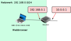
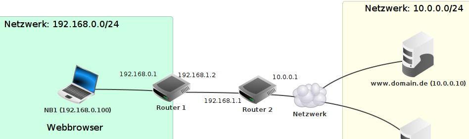
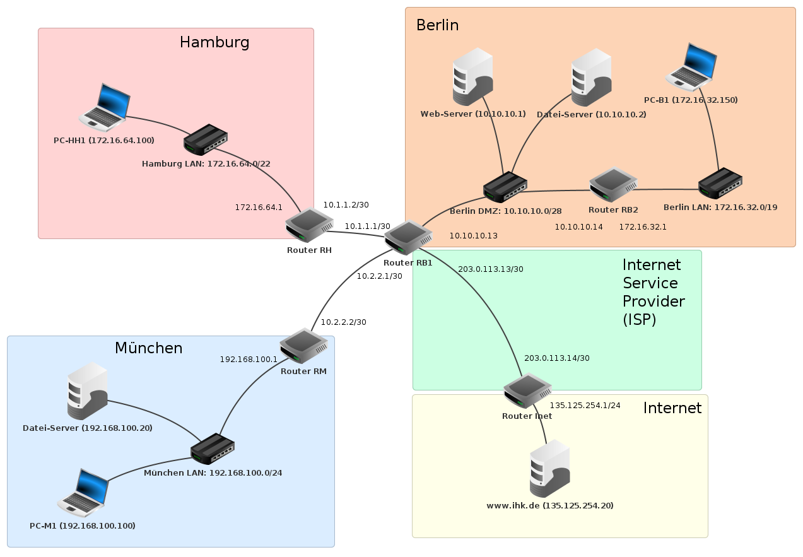

<!--
author:   Günter Dannoritzer
email:    g.dannoritzer@wvs-ffm.de
version:  0.8.0
date:     21.05.2025
language: de
narrator: Deutsch Female

comment:  Fehlersuche im Netzwerk

icon:    https://raw.githubusercontent.com/dsp77/wvs-liascript/0938e2e0ce751e270e3e36b8ecfeb09044a41aa0/wvs-logo.png
logo:     02_img/logo-net-ts.jpg

tags:     LiaScript, Netzwerk, Fehlersuche, Filius, Routing, Firewall, DMZ, DNS, NAT

link:     https://cdn.jsdelivr.net/chartist.js/latest/chartist.min.css

script:   https://cdn.jsdelivr.net/chartist.js/latest/chartist.min.js

attribute: Lizenz: [CC BY-SA](https://creativecommons.org/licenses/by-sa/4.0/)
-->
# Fehlersuche im Netzwerk

Mit dieser Einheit soll die Fehlersuche im Netzwerk mithilfe der Simulationssoftware [Filius](https://www.lernsoftware-filius.de/) geübt werden. Ziel soll es sein, systematische Fehlersuche im Netzwerk zu üben und dabei mithilfe der Paketanalysefunktion der Software den Netzwerkverkehr sichtbar zu machen. Die Aufgaben starten mit einem einfachen Client-Server-Szenario, bei dem ein Webbrowser auf einen Webserver mithilfe eines Fully Qualified Domain Names zugreift und wird erweitert bis zu einem für die IHK-Prüfung im Schwerpunkt Systemintegration typischen Netzwerkszenario mit einem über Routern verbundene Dreistandorte Netzwerk.

Die folgende Abbildung zeigt ein einfaches Netzwerkszenario. Ein Notebook (NB1), im Netzwerk `192.168.0.0/24`, ist über einen Router mit dem Netzwerk `10.0.0.0/24` verbunden. In dem Netzwerk ist ein Webserver mit der IP `10.0.0.10` und ein DNS-Server mit der IP `10.0.0.5`.

Auf dem Computer und den Servern wurde in Filius im Simulationsmodus die entsprechende Software installiert. Der Computer ist konfiguriert, um den DNS-Server für die Namensauflösung zu verwenden. Im DNS-Server ist die Namensauflösung für den Webserver konfiguriert. Die zugehörige [Filius-Datei](01-www-dns-client-server.fls) enthält diese Ausgangssituation.

Die Fehlersuche sollte immer von dem Rechner ausgehen, der in der Fehlerbeschreibung als Ursprung genannt wird.

Beispiel: Im NB1 wird im Webbrowser die IP des Webservers eingegeben. Die Webseite kann nicht aufgerufen werden.

In der folgenden Abbildung ist der Weg der Testpunkte gezeigt, für die eine Paketanalyse in der gezeigten Reihenfolge stattfinden sollte. Für die Eingabe der IP-Adresse wird eine HTTP-Anfrage an Port 80 des Webservers gesendet. Bei diesem Test wird die Namensauflösung herausgelassen, die eine extra Fehlerquelle sein kann.

Für die Namensauflösung ist der Port 53 zuständig und die Testpunkte sind entsprechend gezeigt.

Wenn die Verbindung zum entsprechenden Server funktioniert, überprüfen Sie, ob die Antwort den Ausgangsrechner erreicht.

Wenn für alle Testpunkte die Datenanalyse geöffnet ist, sieht das Fenster wie folgt aus:

Die in der Abbildung nummerierten Inhalte werden folgend erklärt.

{{1}}

In der obersten Leiste sind die Tabs zum Umschalten auf den entsprechenden Mitschnitt von dem Interface (Testpunkt).

{{2}}

Die Uhrzeit hilft, die Pakete zu den entsprechenden Aktionen zuzuordnen. Der Paketmitschnitt wird für jede weitere Aktion fortlaufend durchgeführt, und um richtige Schlussfolgerungen zu ziehen, ist es nötig, die Pakete zu identifizieren, die durch eine bestimmte Aktion erzeugt wurden.

{{3}}

Ein ausgewähltes Paket wird schwarz hinterlegt, und im unteren Fenster erscheinen die Details des Inhalts.

{{4}}

Hier erscheinen die Details des ausgewählten Pakets. Die Informationen sind gegliedert in umgekehrter Reihenfolge nach dem vereinfachten TCP/IP-Schichtenmodell:

 * Netzzugang
 * Vermittlungsschicht
 * Transportschicht
 * Anwendungsschicht

> Nutzen Sie die Informationen der **Vermittlungs-** und der **Transportschicht**, um daraus auf dem Weg zum Ziel alle nötigen Konfigurationen zu überprüfen.

Beispiel Informationen aus einer Anfrage einer Webseite:

 * Vermittlung (IP):

    * Quelle: `192.168.0.100`
   * Ziel: `10.0.0.10`

 * Transportschicht (TCP/UDP):

    * Quellport: `54863`
   * Zielport: `80`
   * Protokoll: `TCP`

 * Anwendungsschicht:

    * Protokoll: `HTTP`
   * GET / HTTP/1.1
   * Host: `10.0.0.10`

## Routing

> Routing
>
>> Mit statischem Routing müssen alle Router auf dem Weg zum Zieladresse `10.0.0.10` einen Routing-Eintrag für die **IP**, das **Netzwerk** oder eine **Default-Route** (`0.0.0.0`) haben.

### Einzelner Router

Mit einem einzelnen Router sind die beiden Netze direkt verbunden und es sind keine extra Routingeinträge nötig. Im Router werden Einträge für die über die beiden Schnittstellen erreichbaren Netzwerke eingetragen.

**Routing-Tabelle**

| Nr    | Ziel | Netzmaske | Nächstes Gateway (Hop) | Über Schnittstelle |
|:-:|------|-----------|------------------|--------------------|
| 1 | `10.0.0.1` | `255.255.255.255` | `127.0.0.1` | `127.0.0.1` |
| 2 | `192.168.0.1` | `255.255.255.255` | `127.0.0.1` | `127.0.0.1` |
| 3 | `10.0.0.0` | `255.255.255.0` | `10.0.0.1` | `10.0.0.1` |
| 4 | `192.168.0.0` | `255.255.255.0` | `192.168.0.1` | `192.168.0.1` |

{{1}} + {{2}} Einträge beschreiben die IP-Adressen der beiden Schnittstellen, die lokal (`127.0.0.1`--> Local Host) verfügbar sind.

{{3}} Das Netzwerk `10.0.0.0` ist über die Schnittstelle `10.0.0.1` erreichbar.

{{4}} Das Netzwerk `192.168.0.0` ist über die Schnittstelle `192.168.0.1` erreichbar.

### Mehrere Router

Bei mehreren Routern sind extra Einträge für die nicht direkt angeschlossenen Netzwerk nötig. Am Beispiel von zwei Routern soll das erläutert werden.

Die folgende Routing-Tabelle von Router 1 hat in **Zeile 5** einen extra Eintrag für das entfernte Netzwerk `10.0.0.0/24`.

**Routing-Tabelle des Router 1**

| Nr. | Ziel | Netzmaske | Nächstes Gateway (Hop) | Über Schnittstelle |
|:-:|-------------|-----------------|-----------|----------------|
| 1 | `192.168.1.2` | `255.255.255.255` | `127.0.0.1` | `127.0.0.1` |
| 2 | `192.168.0.1` | `255.255.255.255` | `127.0.0.1` | `127.0.0.1` |
| 3 | `192.168.1.0` | `255.255.255.0` | `192.168.1.2` | `192.168.1.2` |
| 4 | `192.168.0.0` | `255.255.255.0` | `192.168.0.1` | `192.168.0.1` |
| **5** | **`10.0.0.0`** | **`255.255.255.0`** | **`192.168.1.1`** | **`192.168.1.2`** |

{{5}} Ein zusätzlicher Eintrag für das nicht direkt angeschlossene Netzwerk `10.0.0.0/24`.

Die folgende Abbildung erläutert den Eintrag detaillierter.

{{1}} Das Netzwerk `10.0.0.0/24` ist nicht direkt an Router 1 angeschlossen, sondern über Router 2 erreichbar.

{{2}} Von Router 1 ist das Netzwerk `10.0.0.0/24` über das Gateway `192.168.1.1`, der IP-Adresse von Router 2, erreichbar.

{{3}} Der Router 2 ist über die Schnittstelle `192.168.1.2` des Routers 1 erreichbar.

Für das Netzwerk `192.168.0.0/24` ist im Router 2 ein entsprechender Eintrag nötig.

## Firewall

> Firewall
>
>> Bei einer Firewall auf dem Weg zum Ziel muss eine Regel für den entsprechenden Verkehr vorhanden sein, damit die Pakete nicht verworfen werden.
>> Mit **Stateful Packet Inspection (SPI)** muss nur eine Regel für den Verkehr zum Ziel vorhanden sein, durch das SPI wird der Rückweg automatisch geöffnet.

Aus dem zuvor erstellten Paket-Mitschnitt eines Clients soll für das gesamte Netzwerk eine Regel erstellt werden, die aus dem Netzwerk den Zugriff auf Webserver in anderen Netzwerken erlaubt.

| Nr | | Paket-Mitschnitt | Firewall-Regel |
|:--:|-------|------------|----------------|
| 1 | Quell-IP | `192.168.0.100` | `192.168.0.0/24` |
| 2 | Ziel-IP | `10.0.0.10` | `0.0.0.0` |
| 3 | Quell-Port | `54863` | -- |
| 4 | Ziel-Port | `80` | `80` |
| 5 | Protokoll | `TCP` | `TCP` |

{{1}} Aus der Quell-IP wird die Regel auf das gesamte Netzwerk erweitert.

{{2}} Rechner aus dem Quellnetzwerk sollen nicht nur auf das eine Netzwerk aus dem Mitschnitt, sondern auch auf andere Zielnetze zugreifen, daher wird die Pseudoadresse `0.0.0.0` verwendet, die ein Synonym für »jede andere Adresse« ist.

{{3}} Der Rechner öffnet für die Antwort einen **zufälligen Port** aus dem sogenannten **Ephemeral Port-Bereich** (meist zwischen 49152 und 65535, je nach Betriebssystem). Dieser Port ist nur für die Dauer der Verbindung aktiv. In der Firewall-Regel kann der Portbereich auf diesen Bereich begrenzt werden. Dann besteht die Gefahr, dass ein Betriebssystem, dass einen Port unterhalb 49152 öffnet, gesperrt wird. Daher ist ein unbestimmter Port sinnvoll.

{{4}} Für HTTP-Anfragen soll nur Port 80 freigegeben werden.

{{5}} Eine HTTP-Verbindung wird über TCP aufgebaut.

### Einfaches Firewall-Szenario

Die folgende Abbildung zeigt ein einfaches Netzwerkszenario für eine Firewall-Konfiguration. Ein externes Netzwerk `10.0.0.0/24` enthält einen Webserver, einen DNS-Server und einen Echo-Server. Ein Firmennetzwerk `192.168.1.0/24` und ein Gästenetzwerk `192.168.3.0/24` greifen über einen Router mit Firewall auf das externe Netzwerk zu.

Die [Filius-Datei](lf12-10-firewall-einfach.fls) kann über den Link heruntergeladen werden.

Die Clients in den beiden Netzwerken sind mit einem Webbrowser und einem einfachen Client verbunden. Der einfache Client erlaubt eine Verbindung mit dem Echo-Server `echo.server.de`, der die gesendeten Nachrichten wieder zurücksendet. Der Echo-Server soll als Verbindungstest für alle anderen Verbindungen gelten.

Folgende Firewall-Regeln sollen für das Gast- und Firmen-Netzwerk auf das externe Netzwerk gelten:

1. Aus dem Firmen-Netzwerk heraus ist ein voller Zugang auf das externe Netzwerk möglich.
2. Aus dem Gast-Netzwerk ist nur ein Zugriff auf das WWW möglich, eine Namensauflösung der Servernamen soll möglich sein.

#### Erstellen der Firewall-Regeln

Die Firewall-Regeln werden anhand des gewünschten Verkehrs erstellt. Die Default-Policy der Firewall ist `verwerfen`, es werden also nur Regeln für den zugelassenen Verkehr erstellt. Wie zuvor beschrieben, werden die Regeln für das Gastnetzwerk wie folgt erstellt:

| Quell-IP | Netzmaske | Ziel-IP | Netzmaske | Protokoll | Port | Aktion |
|----------|--------------|--------|--------------|-----------|------|---------|
| `192.168.3.0` | `255.255.255.0` | `0.0.0.0` | | `TCP` | `80` | `akzeptieren` |
| `192.168.3.0` | `255.255.255.0` | `0.0.0.0` | | `UDP` | `53` | `akzeptieren` |

Mit den Regeln ist aus dem Gast-Netzwerk ein Zugang auf DNS- (`53`) und WWW-Server (`80`) im externen Netzwerk möglich.

Jedoch ist mit den beiden Regeln auch das Firmen-Netzwerk `192.168.0.0/24` für die beiden Ports erreichbar. Daher ist eine extra Regel zum Sperren dieses Zugriffs nötig. Die Regel wird erweitert und bezieht **als Ziel** das ganze Netzwerk `192.168.0.0/16` mit ein. Dadurch ist zwar auch das Gast-Netzwerk eingeschlossen, aber über den Router wird kein Paket mit gleichem Quell- und Ziel-Netzwerk gesendet. Die Reihenfolge der Regeln ist wichtig, daher werden Verwerfen-Regeln vor den Zulassenregeln gesetzt.

| Quell-IP | Netzmaske | Ziel-IP | Netzmaske | Protokoll | Port | Aktion |
|----------|--------------|--------|--------------|-----------|------|---------|
| `192.168.3.0` | `255.255.255.0` | `192.168.0.0` | `255.255.0.0` | `*` |  | `verwerfen`  |
| `192.168.3.0` | `255.255.255.0` | `0.0.0.0` | | `TCP` | `80` | `akzeptieren` |
| `192.168.3.0` | `255.255.255.0` | `0.0.0.0` | | `UDP` | `53` | `akzeptieren` |

Jetzt wird noch dem Firmen-Netzwerk `192.168.1.0/24` voller Zugriff auf alle Adressen gegeben.

Die fertigen Regeln sehen folgendermaßen aus:

|----------|--------------|--------|--------------|-----------|------|---------|
| `192.168.3.0` | `255.255.255.0` | `192.168.0.0` | `255.255.0.0` | `*` |  | `verwerfen`  |
| `192.168.3.0` | `255.255.255.0` | `0.0.0.0` | | `TCP` | `80` | `akzeptieren` |
| `192.168.3.0` | `255.255.255.0` | `0.0.0.0` | | `UDP` | `53` | `akzeptieren` |
| `192.168.1.0` | `255.255.255.0` | `0.0.0.0` | | `*` | | `akzeptieren` |

#### Aufgabe

 * Deaktivieren Sie die Firewall und überprüfen Sie die Verbindungen:

   * Der Client **NB1** hat Zugriff auf:
      
       * `www.domain.de` per Webbrowser mit Eingabe des Domainnamens
       * Client **NB2** per Webbrowser mit Eingabe der IP-Adresse
       * `echo.server.de` mithilfe des **einfachen Clients**

   *  Der Client **NB2** hat Zugriff auf:
      
       * `www.domain.de` per Webbrowser mit Eingabe des Domainnamens
       * `echo.server.de` mithilfe des **einfachen Clients**

 * Aktivieren Sie die Firewall und überprüfen Sie die Verbindungen:

   * Der Client **NB1** hat:
   
       * Zugriff auf `www.domain.de` per Webbrowser mit Eingabe des Domainnamens
       * keinen Zugriff auf Client **NB2** per Webbrowser mit Eingabe der IP-Adresse
       * keinen Zugriff auf den `echo.server.de` mithilfe des **einfachen Clients**

   *  Der Client **NB2** hat Zugriff auf:
      
       * `www.domain.de` per Webbrowser mit Eingabe des Domainnamens
       * `echo.server.de` mithilfe des **einfachen Clients**

### Demilitarisierte Zone (DMZ)

Die folgende Abbildung zeigt ein Netzwerk, in dem das vorherige einfache Firewall-Szenario zu einer DMZ erweitert wurde.

Die [Filus-Datei](./lf12-10-firewall-dmz.fls) kann über den Link heruntergeladen werden.

Der Server `wwww.firmenserver.de` soll aus dem externen Netzwerk und den internen Netzwerken erreichbar sein.

#### Aufgabe

 Erstellen Sie die Firewallregeln, damit nur die gewünschten Zugriffe möglich sind.

## Domain Name System (DNS)

Die folgende Abbildung zeigt ein Netzwerkszenario aus den Informationen [Domain Name System - Teil 2](https://liascript.github.io/course/?https://raw.githubusercontent.com/dsp77/wvs-liascript/main/LF10/lf10-01-dns2.md), die aufbauend auf [Domain Name System - Teil 1](https://liascript.github.io/course/?https://raw.githubusercontent.com/dsp77/wvs-liascript/main/LF03/dns.md) aus dem Lernfeld 3 sind.

In dem Szenario ist ein Firmennetzwerk mit eigenem DNS-Server, der die Namensauflösung für lokale Ressourcen übernimmt. Anfragen die der lokale DNS-Server nicht beantworten kann, werden an den DNS-Resolver des Internet-Service-Providers `dns.telekom.de` weitergeleitet, der dann die Abfrage in der DNS-Hierarchie übernimmt.

Die zugehörige [Filius-Datei mit DNS-Abfrage in der DNS-Hierarchie](dns-firma-provider-dns-hierarchie.fls) kann über den Link heruntergeladen werden.

Nutzen Sie die Aufgaben im [Domain Name System - Teil 2](https://liascript.github.io/course/?https://raw.githubusercontent.com/dsp77/wvs-liascript/main/LF10/lf10-01-dns2.md) um das oben gezeigte Sezenario zu verstehen.

## Network Address Translation (NAT)

Aufbauend auf den Informationen [Network Address Translation (NAT)](https://liascript.github.io/course/?https://raw.githubusercontent.com/dsp77/wvs-liascript/main/LF11/lf11-40-nat.md) kann mithilfe des **Heim Routers** in Filius ein einfaches Netzwerkszenario erstellt werden, in dem Network Address Translation simuliert werden kann.

Die folgende Abbildung zeigt ein einfaches Netzwerkszenario in dem Network Address Translation (NAT) umgesetzt wird.

Die entsprechende [Filius-Datei zu NAT](./02-nat.fls) kann über den Link heruntergeladen werden.

### Aufgabe

Rufen Sie mit dem Webbrowser von NB1 die Adresse `www.domain.de` auf und Analysieren Sie den Datenverkehr am Internet-Router.

 * Vergleichen Sie das **erste DNS-Paket** am LAN- und am WAN-Port des Internet-Routers füllen Sie folgende Lücken aus:

|             |      LAN-Seite    |   WAN-Seite   |
|:------------|:-----------------:|:-------------:|
| Quell-IP    | [[192.168.0.100]] | [[42.0.0.10]] |
| Ziel-IP     | [[42.0.0.53]]     | [[42.0.0.53]] |
| Quell-Port  | `49152`           | `50100`       |
| Ziel-Port   | [[53]]            | [[53]]        |
| TTL         | [[64]]            | [[63]]        |

 * Der Quell-Port mag nicht mit Ihrem Quell-Port übereinstimmen, da er zufällig gebildet wird. Diskutieren Sie, warum auf der LAN- und der WAN-Seite hier unterschiedliche Werte zu finden sind.
 * Diskutieren Sie, warum der TTL-Wert zwischen LAN- und WAN-Seite unterschiedlich ist.
 * Vergleichen Sie entsprechend das erste HTTP-Paket zwischen der LAN- und WAN-Seite.

### Destination NAT (DNAT)

Ein Firmennetzwerk ist über einen NAT-Router mit dem Internet verbunden. In dem privaten Netzwerk soll ein Webserver betrieben werden, der aus dem Internet erreichbar ist. Der NAT-Router hat eine feste IP-Adresse im Internet.

Die folgende Abbildung zeigt das Netzwerk[^1]. Die [Filiusdatei](./02-dnat.fls) kann heruntergeladen werden.

[^1]: Erfordert Filius ab Version 2.9

Vervollständigen Sie die NAT-Tabelle, damit der Webserer `www.firma.de` aus dem Internet erreichbar ist.

| Protokoll | Port (WAN) | LAN-Adresse | Port (LAN) |
|:----------|:----------:|:-----------:|:----------:|
| [[TCP]]   | [[80]]   | [[192.168.0.10]] | [[80]]  |

Für die Namensauflösung soll im DNS-Server `dns.de` ein Eintrag für `www.firma.de` eingetragen werden. Vervollständigen Sie das `A-Record`:

 * `www.firma.de` A [[42.0.0.10]]

## Router-Szenario mit drei Standorten

Die folgende Abbildung zeigt ein Netzwerkszenario aus der IHK-Prüfung der Fachinformatiker im Winter 2023. Die zugehörige [Filius-Datei kann über den Link heruntergeladen werden](./lf12-10-ihk-w-2023-si-2-ohne-routing-config-ohne-firewall.fls).

Der Hauptstandort Berlin ist über einen Internet Service Provider (ISP) ans Internet angeschlossen. Der Router **RB1** ist sowohl für den Internetzugang, als auch für die Anbindung der Standorte Hamburg und München zuständig. Als Änderung zur Originalaufgabe ist im Router RB1 kein NAT konfiguriert.

### Statisches Routing 

Für das statische Routing ist es sinnvoll, das Netzwerk auf das Wesentliche zu reduzieren. Die folgende Abbildung zeigt nur noch die Router mit den Netzwerken. Der Router **RB1** wird als zentraler Router das **Gateway**.

Im Abschnitt Routerkonfiguration mit zwei Routern wurde gezeigt, dass in einem Router jedes Netzwerk, das jenseits eines anderen Routers erreichbar sein soll, in dem entsprechenden Router konfiguriert werden muss. Das würde z.B. bedeuten, dass im **Router RM** in München die Netzwerke für Hamburg, Berlin-DMZ und Berlin-LAN konfiguriert werden müssten. Um das zu vereinfachen, wird in den Routern **RM**, **RH** und **RB2** jeweils der Router **RB1** als Gateway konfiguriert. Damit lässt sich die Konfiguration der Netzwerke auf den Router **RB1** reduzieren.

Die folgende Tabelle zeigt die Routingeinträge für den Router **RB1**. Vervollständigen Sie die fehlenden Next-Hop-Einträge:

|     Netz-ID     | Subnetzmaske (CIDR)     | Next-Hop | Interface |
|:----------------|-------------------------|----------------|---------|
| `10.10.10.0`    | `255.255.255.240` (/28) | `10.10.10.13`  | `Eth 0` |
| `10.1.1.0`      | `255.255.255.252` (/30) | `10.1.1.1`     | `Eth 1` |
| `10.2.2.0`      | `255.255.255.252` (/30) | `10.2.2.1`     | `Eth 2` |
| `172.16.32.0`   | `255.255.224.0` (/19)   | [[10.10.10.14]] | `Eth 0` |
| `172.16.64.0`   | `255.255.252.0` (/22)   | [[10.1.1.2]]   | `Eth 1` |
| `192.168.100.0` | `255.255.255.0` (/24)   | [[10.2.2.2]]   | `Eth 2` |
| `203.0.113.12`  | `255.255.255.252` (/30) | `203.0.113.13` | `Eth 3` |
| `0.0.0.0`       | `0.0.0.0` (/0)  | [[203.0.113.14]] | `Eth 3` |

**Aufgabe 1**

In der zur Verfügung gestellten Filius-Datei fehlen einige Routingeinträge beim Router **RB1**.

 * Vervollständigen Sie die Routingkonfiguration für **RB1**
 * Fügen Sie in den Routern **RM**, **RH** und **RB2** die jeweilige IP-Adresse des Routers **RB1** als Gateway hinzu.
 * Überprüfen Sie mithilfe der Kommandozeile, dass aus den Netzwerken **Hamburg**, **München** und **Berlin LAN** folgende Ziele erreichbar sind:

  * Berlin-DMZ
  * die jeweiligen anderen Standorte
  * der IHK-Server

**Aufgabe 2**

Beim Router **RB1** wird am Interface `Eth 3` Network Address Translation (NAT) eingeschaltet. Welche zusätzliche Konfiguration ist nötig, damit der Webserver mit Port `80` und der Dateiserver mit Port `22` vom Internet erreichbar sind?

Anmerkung: Um die privaten IP-Adressen der drei Standorte im Internet zu nutzen, muss die private Adresse mithilfe von Network Address Translation (NAT) umgesetzt werden. Um das Beispiel mit Filius umzusetzen und das Routing zu üben, war der Kunstgriff ohne NAT möglich.

### Firewall-Konfiguration

Die Router **RB1** und **RB2** sollen als Demilitarisierte Zone (DMZ) konfiguriert werden.

Folgende Erreichbarkeit soll möglich sein:

 * Berlin-DMZ erreichbar von: München, Hamburg, Berlin-LAN ohne Beschränkung
 * Berlin-DMZ erreichbar vom Internet mit Port `80` auf den Webserver und Port `22` für SFTP auf den Dateiserver.
 * München, Hamburg, Berlin-LAN erreichen sich untereinander; sind aber nicht aus dem Internet erreichbar
 * München, Hamburg, Berlin-LAN und Berlin-DMZ erreichen das Internet

**Aufgabe**

 * Konfigurieren Sie die Firewalls in den Routern **RB1** und **RB2**, um das oben beschriebene Zugriffsszenario zu ermöglichen.
 

