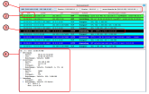

<!--
author:   Günter Dannoritzer
email:    g.dannoritzer@wvs-ffm.de
version:  0.1.0
date:     02.02.2025
language: de
narrator: Deutsch Female

comment:  Fehlersuche im Netzwerk

icon:    https://raw.githubusercontent.com/dsp77/wvs-liascript/0938e2e0ce751e270e3e36b8ecfeb09044a41aa0/wvs-logo.png
logo:     02_img/logo-net-ts.jpg

tags:     LiaScript, Netzwerk, Fehlersuche, Filius

link:     https://cdn.jsdelivr.net/chartist.js/latest/chartist.min.css

script:   https://cdn.jsdelivr.net/chartist.js/latest/chartist.min.js

attribute: Lizenz: [CC BY-SA](https://creativecommons.org/licenses/by-sa/4.0/)
-->
# Fehlersuche im Netzwerk

Mit dieser Einheit soll die Fehlersuche im Netzwerk mithilfe der Simulationssoftware [Filius](https://www.lernsoftware-filius.de/) geübt werden. Ziel soll es sein, systematische Fehlersuche im Netzwerk zu üben und dabei mithilfe der Paketanalysefunktion der Software den Netzwerkverkehr sichtbar zu machen. Die Aufgaben starten mit einem einfachen Client-Server-Szenario, bei dem ein Webbrowser auf einen Webserver mithilfe eines Fully Qualified Domain Names zugreift und wird erweitert bis zu einem für die IHK-Prüfung im Schwerpunkt Systemintegration typischen Netzwerkszenario mit einem über Routern verbundene Dreistandorte Netzwerk.

Die folgende Abbildung zeigt ein einfaches Netzwerkszenario. Ein Notebook (NB1), im Netzwerk `192.168.0.0/24`, ist über einen Router mit dem Netzwerk `10.0.0.0/24` verbunden. In dem Netzwerk ist ein Webserver mit der IP `10.0.0.10` und ein DNS-Server mit der IP `10.0.0.5`.

Auf dem Computer und den Servern wurde in Filius im Simulationsmodus die entsprechende Software installiert. Der Computer ist konfiguriert, um den DNS-Server für die Namensauflösung zu verwenden. Im DNS-Server ist die Namensauflösung für den Webserver konfiguriert.

Die Fehlersuche sollte immer von dem Rechner ausgehen, der in der Fehlerbeschreibung als Ursprung genannt wird.

Beispiel: Im NB1 wird im Webbrowser die IP des Webservers eingegeben. Die Webseite kann nicht aufgerufen werden.

In der folgenden Abbildung ist der Weg der Testpunkte gezeigt, für die eine Paketanalyse in der gezeigten Reihenfolge stattfinden sollte. Für die Eingabe der IP-Adresse wird eine HTTP-Anfrage an Port 80 des Webservers gesendet. Bei diesem Test wird die Namensauflösung herausgelassen, die eine extra Fehlerquelle sein kann.

Für die Namensauflösung ist der Port 53 zuständig und die Testpunkte sind entsprechend gezeigt.

Wenn für alle Testpunkte die Datenanalyse geöffnet ist, sieht das Fenster wie folgt aus:

Die in der Abbildung nummerierten Inhalte werden folgend erklärt.

{{1}}

In der obersten Leiste sind die Tabs zum Umschalten auf den entsprechenden Mitschnitt von dem Interface (Testpunkt).

{{2}}

Die Uhrzeit hilft, die Pakete zu den entsprechenden Aktionen zuzuordnen. Der Paketmitschnitt wird für jede weitere Aktion fortlaufend durchgeführt, und um richtige Schlussfolgerungen zu ziehen, ist es nötig, die Pakete zu identifizieren, die durch eine bestimmte Aktion erzeugt wurden.

{{3}}

Ein ausgewähltes Paket wird schwarz hinterlegt, und im unteren Fenster erscheinen die Details des Inhalts.

{{4}}

Hier erscheinen die Details des ausgewählten Pakets. Die Informationen sind gegliedert in umgekehrter Reihenfolge nach dem vereinfachten TCP/IP-Schichtenmodell:

 * Netzzugang
 * Vermittlungsschicht
 * Transportschicht
 * Anwendungsschicht

