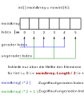
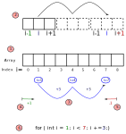

<!--
author:   Günter Dannoritzer
email:    g.dannoritzer@wvs-ffm.de
version:  0.7.0
date:     06.04.2026
language: de
narrator: Deutsch Female

comment:  Administrative Programmierung

icon:    https://raw.githubusercontent.com/dsp77/wvs-liascript/0938e2e0ce751e270e3e36b8ecfeb09044a41aa0/wvs-logo.png
logo:     02_img/logo-admin-programing.jpg

tags:     LiaScript, Scripting, Programmierung, C#

link:     https://cdn.jsdelivr.net/chartist.js/latest/chartist.min.css

script:   https://cdn.jsdelivr.net/chartist.js/latest/chartist.min.js

attribute: Lizenz: [CC BY-SA](https://creativecommons.org/licenses/by-sa/4.0/)
-->
# Administrative Programmierung

Bei der administrativen Programmierung mit C# geht es darum, den Fachinformatikerinnen und Fachinformatikern in der Fachrichtung Systemintegration Informationen und Übungen zu geben, damit sie typische Aufgaben aus der Abschlussprüfung Teil 2 lösen können, bei denen es darum geht, C#-Programme mit Arrays zu bearbeiten.

Um Programmierübungen selbst durchzuführen, gibt es Webseiten, die eine C#-Programmierung erlauben.

 * [https://dotnetfiddle.net/](https://dotnetfiddle.net/)
 * [https://www.programiz.com/csharp-programming/online-compiler/](https://www.programiz.com/csharp-programming/online-compiler/)

# Wiederholung von einfachen Programmschritten

## Beispiel for-Schleife

```csharp
Console.WriteLine("for-Schleife");

for (int i=0; i<5; i++) {

    Console.WriteLine($"i = {i}");
}
```

## Beispiel für ein Array-Datentyp

```csharp
Console.WriteLine("Hello, Array!");

int[] zahlen = {10, 20, 30, 40, 50};

// Zugriff auf einzelne Elemente
Console.WriteLine("Erstes Element: " + zahlen[0]);
Console.WriteLine("Drittes Element: " + zahlen[2]);

// Länge des Arrays
Console.WriteLine($"Das Array 'zahlen' ist {zahlen.Length} Elemente groß.");
```

## Beispiel für ein Array-Datentyp ohne Setzung von Daten

```csharp
// Ein Array mit 6 Elementen, alle Standardwert = 0
int[] zahlen = new int[6];

// Ausgabe der Werte
for (int i = 0; i < zahlen.Length; i++){

    Console.WriteLine($"Index {i}: {zahlen[i]}");
    
}
```

### Aufgabe: Werte zuweisen

Weisen Sie dem Array Zahlen in umgekehrter Reihenfolge mit aufsteigendem Index, wie in der folgenden Tabelle gezeigt, zu:

| Index | 0 | 1 | 2 | 3 | 4 | 5 |
|-------|---|---|---|---|---|---|
| Wert  | 5 | 4 | 3 | 2 | 1 | 0 |

### Lösung: Werte zuweisen

``` csharp
// Ein Array mit 6 Elementen, alle Standardwert = 0
int[] zahlen = new int[6];

// Werte zuweisen und ausgeben
for (int i = 0; i < zahlen.Length; i++){

    zahlen[i] = zahlen.Length - i - 1;
    Console.WriteLine($"Index {i}: {zahlen[i]}");
    
}
```


## Beispiel: Verschiedene Array-Typen


``` csharp
// Ganzzahlen
int[] intArray = new int[5];          // {0,0,0,0,0}
long[] longArray = new long[3];       // {0,0,0}
short[] shortArray = new short[2];    // {0,0}

// Gleitkommazahlen
float[] floatArray = new float[4];    // {0.0,0.0,0.0,0.0}
double[] doubleArray = new double[3]; // {0.0,0.0,0.0}
decimal[] decimalArray = new decimal[2]; // {0.0,0.0}

// Zeichen
char[] charArray = new char[3];       // {'\0','\0','\0'}

// Wahrheitswerte
bool[] boolArray = new bool[2];       // {false,false}

// Byte-Typen
byte[] byteArray = new byte[4];       // {0,0,0,0}
sbyte[] sbyteArray = new sbyte[4];    // {0,0,0,0}
ushort[] ushortArray = new ushort[2]; // {0,0}
uint[] uintArray = new uint[2];       // {0,0}
ulong[] ulongArray = new ulong[2];    // {0,0}
```

## Arten von Arrays

### Eindimensionale Arrays

- Klassisches Array mit einer einzigen Dimension.
- Beispiel:

``` csharp
int[] zahlen = new int[5]; // {0,0,0,0,0}
```
- Zugriff über einen Index: `zahlen[0]`.

### Mehrdimensionale Arrays (rechteckig)

- Arrays mit mehreren Dimensionen, die wie Tabellen oder Matrizen aufgebaut sind.
- Beispiel (2D-Array):

``` csharp
int[,] matrix = new int[3, 3];
matrix[0, 0] = 1;
matrix[2, 1] = 5;
```
- Zugriff über zwei Indizes: `matrix[zeile, spalte]`.

### Gezackte Arrays (Jagged Arrays)
- Arrays von Arrays, bei denen jede „Zeile“ unterschiedlich lang sein kann.
- Beispiel:

``` csharp
int[][] jagged = new int[3][];
jagged[0] = new int[2];   // Länge 2
jagged[1] = new int[5];   // Länge 5
jagged[2] = new int[3];   // Länge 3
```
- Zugriff: `jagged[1][4]`.

# Geradzahlige oder ungeradzahlige Elemente

Es gibt Fälle, da sollen nur alle geradzahligen oder ungeradzahligen Elemente eines Arrays adressiert werden. Hierbei ist zu beachten, dass die Null auch als geradzahliges Element zählt.

Die folgende Abbildung zeigt den Zugriff auf geradzahlige bzw. ungeradzahlige Elemente.



Zu erkennen ist, dass von den sechs Elementen nur jeweils auf die Hälfte zugegriffen werden muss. Daher wird für die Adressierung eine for-Schleife nur über die Hälfte der Array-Länge gezählt.

Dabei ist zu beachten, dass das Array eine geradzahlige Anzahl an Elemente haben muss. Bei ungeradzahligen gibt es mehr geradzahlige als ungeradzahlige Elemente und die for-Schleife muss entsprechend angepasst werden.

> Mit der for-Schleife über nur die Hälfte der Elemente wird der Zugriffsindex jetzt berechnet mit 
>
>> - `i * 2` für geradzahlige Elemente
>> - `i * 2 + 1` für ungeradzahlige Elemente

 Als Beispiel für das Array mit sechs Elemente sieht vereinfacht der Zugriff wie folgt aus:

``` csharp
int[] meinArray = new int[6];

for (int i=0; i < meinArray.Length/2; i++){    // i = 0, 1, 2

    meinArray[i*2] = ...;   // Index: 0, 2, 4
    meinArray[i*2+1] = ...; // Index: 1, 3, 5
}
```

> Es ist sinnvoll den Array-Zugriff mit dem Schema `i*2` und `i*2+1` als Adressierung der geradzahligen und ungeradzahligen Elemente zu merken.

## Aufgabe: Nur geradezahlige oder ungeradzahlige Elemente adressieren

Den Elementen mit einem geraden Index soll der Wert **99** zugewiesen werden. Elementen mit einem ungeraden Index soll der Wert Array.Length - 1 - Index zugewiesen werden.

| Index | **0** | 1 | **2** | 3 | **4** | 5 |
|-------|-------|---|-------|---|-------|---|
| Wert  | **99** | 4 | **99** | 2 | **99** | 0 |

## Lösung: Nur geradzahlige Elemente adressieren


``` csharp
// Ein Array mit 6 Elementen, alle Standardwert = 0
int[] zahlen = new int[6];

// Die for-Schleife geht nur über die Hälfte des Arrays
for (int i = 0; i < zahlen.Length / 2; i++){

    zahlen[i * 2] = 99;                             // geradzahlige Zuweisung
    zahlen[i * 2 + 1] = zahlen.Length - i*2 - 2 ;   // ungeradzahlige Zuweisung
    
    Console.WriteLine($"Geradzahliger Index   {i * 2}: {zahlen[i * 2]}");
    Console.WriteLine($"Ungeradzahliger Index {i * 2 + 1}: {zahlen[i * 2 + 1]}");
```

> Die Variable i der for-Schleife ist in dem Fall nicht der Index für das Array. Der Index wird berechnet basierend auf der Variablen i.
>
>> Geradzahliger Index: $i \cdot 2$
>>
>> Ungeradzahliger Index: $i \cdot 2 + 1$


# Gleitendes Fenster; Berechnung mit Arrays

Unter einem gleitenden Fenster versteht man die Adressierung von bestimmten Werten eines Arrays, um unter anderem einen Mittelwert über die adressierten Werte zu berechnen. Ein typisches Beispiel ist, dass die Auslastung einer CPU in zeitlichen Abständen gespeichert wird. Um eine längere CPU-Last zu berechnen, wird der Mittelwert über drei Werte gebildet und entschieden, ob eine Dauerauslastung der CPU vorhanden ist. Die Berechnung wird dann fortschreitend über das ganze Array durchgeführt.

Die folgende Abbildung zeigt grafisch, wie die drei Werte entnommen werden und das Fenster fortschreitet.


Der Zugriff auf die drei Werte erfolgt mit dem Schema:

 - `summe = meinArray[i-1] + meinArray[i] + meinArray[i+1];`

Wird die for-Schleife wie bisher über alle Index-Werte des Arrays gebildet, kommt es im linken und rechten Randbereich zu Problemen. Wie in der Abbildung dargestellt, wird durch die Berechnung der Index-Werte es zu unerlaubten Array-Zugriffen kommen.

Beispiel: `i=0` - linker Bereich

Mit `i=0` erfolgt der Zugriff auf die drei Array-Werte:

 - `i-1 = -1`
 - `i = 0`
 - `i+1 = 1`

Der Zugriff `meinArray[-1]` ist nicht gültig und führt zu einem Programmabbruch.

Beispiel: `i=4` - rechter Bereich

Mit `i=4` erfolgt der Zugriff auf die drei Array-Werte:

 - `i-1 = 3`
 - `i = 4`
 - `i+1 = 5`

Der Zugriff `meinArray[5]` ist nicht gültig und führt zu einem Programmabbruch.

## Richtige for-Schleife für gleitende Fenster

Die for-Schleife für ein gleitendes Fenster muss um die Größe des Fensters angepasst werden. Maßgeblich dabei ist die Anzahl der Werte, die ober und unterhalb des zentralen Wertes dem Array entnommen werden. Entsprechend muss der Startwert und der Endwert angepasst werden.

Beispiele für Fenstergrößen und die entsprechende Anpassung der for-Schleife:

| Größe | Adressierung | for-Schleife |
|:-----:|--------------|--------------|
| 3     | `i-1, i, i+1`| `for(i=1; i < array.Length - 1; i++)` |
| 5     | `i-2, i-1, i, i+1, i+2`| `for(i=2; i < array.Length - 2; i++)` |


``` csharp
int[] meinArray = {2, 4, 6, 8, 10};

int durchschnitt, summe;

for(int i=1; i < meinArray.Length -1; i++){

    summe = meinArray[i-1] + meinArray[i] + meinArray[i+1];

    durchschnitt = summe / 3;

    Console.WriteLine("Durchschnitt um i=" + i + " ist: " + durchschnitt); 
}
```

> Es ist sinnvoll den Array-Zugriff mit dem Schema `i-1`, `i` und `i+1` als gleitendes Fenster zu merken.
> Entsprechende Erweiterungen wie `i-2`, `i+2`, etc. deuten auf ein größeres Fenster hin.

# Springendes Fenster

Neben dem gleitenden Fenster, das über jeden Index des Arrays geht und Werte ausliest, gibt es auch das springende Fenster, das immer genauso viele Werte des Arrays bearbeitet, wie das Fenster groß ist, und dann entsprechend um die Fenstergröße weiterspringt. Die folgende Abbildung verdeutlicht das.



1. Ein Array mit 9 Datenelementen soll bearbeitet werden.
2. Ein Fenster mit jeweils drei Datenelementen wird bearbeitet und das Fenster springt dann um drei Datenelemente weiter. In der Indizierung der Fensterelemente sind die Werte i – 1 im ersten Fenster und i+1 im letzten Fenster farbig hervorgehoben. Diese Hervorhebung wird unter 4. und 5. noch mal erklärt.
3. Das Dreierfenster springt also in Schritten der Größe (+3) über das Array. Von den möglichen Indizes 0–8 sind also nur die Werte i=1, I=4 und i=7 nötig.
4. Der Startwert i=1 ergibt sich aus der ersten Platzierung des Fensters. Da das Fenster mit i – 1 adressiert wird, darf i nicht bei 0 beginnen, sondern muss bei i+1 → i=1 beginnen.
5. Der Endwert ergibt sich aus der letzten Platzierung des Fensters. Da das Fenster mit i+1 adressiert wird, darf i nicht über 8 hinausgehen. Damit muss in der for-Schleife der letzte Index i = 7 → 8 – 1 sein.
6. Daraus ergibt sich eine for-Schleife in der Form: `for ( int i = 1; i < 7; i+=3)`. Die farbliche Hervorhebung der Zahlen zeigt, woher die Werte stammen.

# Berechnung über Teilsegmente eines Arrays

Berechnungen mithilfe von Fenstern sind nur hilfreich für eine begrenzte Anzahl von Werten. Werden zum Beispiel für eine Mittelwertbildung eine größere Anzahl von Werten benötigt, ist das über eine for-Schleife effizienter. Sollen hierzu nur Bereiche verwendet werden, kann das mit if-Anweisungen durchgeführt werden.

In einem Array werden die Nutzung des Arbeitsspeichers pro Stunde eines Rechners gespeichert. Für die 24 Stunden des Tages gibt es entsprechende Werte:

| Tageszeit | 0-1 | 1-2 | 2-3 | 3-4 | ... | 22-23 | 23-24 |
|-----------|:---:|:---:|:---:|:---:|:---:|:---:|:---:|
| Index     |  0  | 1   |  2  |  3  |     |  22 |  23 |

Der folgende Codeausschnitt zeigt die Daten:

``` csharp
//Array mit Testdaten
int[] maxRAM = new int[24] {52, 33, 60, 44, 40, 56, 33, 52, 44, 60, 40, 33, 56, 44, 60, 52, 40, 56, 33, 40, 44, 56, 60, 52};
```

Es soll ein Mittelwert über die erste und zweite Tageshälfte berechnet werden. Hier bietet sich kein springendes Fenster mehr an, da die erste Tageshälfte 12 Werte beinhaltet und der Ausdruck für die Berechnung entsprechend lang wird.

Daher werden die Berechnungen über for-Schleifen durchgeführt. Das folgende Beispiel zeigt die Berechnung über zwei for-Schleifen, je eine für die erste und eine für die zweite Tageshälfte.


``` csharp
//Berechnung Mittelwert erste Tageshälfte
int sumLast = 0;
for (int i = 0; i < 12; i++)
{
	sumLast = sumLast + maxRAM[i];
}

mwVormittag = sumLast / 12;

//Berechnung Mittelwert zweite Tageshälfte
sumLast = 0;
for (int i = 12; i < 24; i++)
{
	sumLast = sumLast + maxRAM[i];
}
mwNachmittag = sumLast / 12;

Console.WriteLine("Mittelwert vormittags: " + mwVormittag);
Console.WriteLine("Mittelwert nachmittags: " + mwNachmittag);	
```

Alternativ kann die Berechung mit einer for-Schleife und einer entsprechenden if-Anweisung durchgeführt werden.

```csharp
		int sumLastVorm = 0;
		int sumLastNachm = 0;
		
		for (int i = 0; i < 24; i++)
		{
		
			if( i < 12){
				
				//Berechnung Mittelwert erste Tageshälfte
				sumLastVorm = sumLastVorm + maxRAM[i];
				
			} else {
				
				//Berechnung Mittelwert zweite Tageshälfte
				sumLastNachm = sumLastNachm + maxRAM[i];
				
			}
		}

		mwVormittag = sumLastVorm / 12;
		mwNachmittag = sumLastNachm / 12;

		Console.WriteLine("Mittelwert vormittags: " + mwVormittag);
		Console.WriteLine("Mittelwert nachmittags: " + mwNachmittag);
```


# Ganzzzahldivision und Modulo-Operation (Divisionsrest)

Bei der **Ganzzahldivision** werden zwei ganzahlige Werte dividiert. Wenn die Division nicht aufgeht, wie z.B. bei $\frac{4}{3}$ ist das Ergebnis $1$. Bei einer Gleitkommadivision würde $\frac{4}{3} = 1,5$ ergeben. Es findet also bei der Ganzzahldivision keine Rundung statt.

Mit einer ganzzahldivision durch 10, 100, 1000, etc. können entsprechende Stellen einer Zahl abgeschnitten werden. Das folgende Beispiel zeigt einige Ganzzahldivisionen.

``` csharp
using System;
					
public class Program
{
	public static void Main()
	{
		Console.WriteLine("4 / 2 = "+ 4/2);
		Console.WriteLine("4 / 3 = "+ 4/3);
		Console.WriteLine("123456 / 10 = "+ 123456/10);
		Console.WriteLine("123456 / 100 = "+ 123456/100);
		Console.WriteLine("123456 / 1000 = "+ 123456/1000);
	}
}
```

Ausgabe:

```
4 / 2 = 2
4 / 3 = 1
123456 / 10 = 12345
123456 / 100 = 1234
123456 / 1000 = 123
```

Die **Modulo-Operation** liefert den Divisionsrest:

```
4 % 2 = 0               -> kein Divisionsrest, da 4 / 2 aufgeht.
4 % 3 = 1               -> Divisionsrest 1, da 4 / 3 nicht aufgeht.
123456 % 10 = 6         -> die weggefallenen Ziffern ergeben den Divisionsrest
123456 % 100 = 56
123456 % 1000 = 456
```

Interessanterweise können bei Ganzzahldivisionen mit Zehnerpotenzen (10, 100, 1000, etc.) mithilfe des Divisionsrests die weggefallenen Stellen bestimmt werden:

 * `123456 % 10 = 6`
 * `123456 % 100 = 56`
 * `123456 % 1000 = 456`

Das zugehörige Codebeispiel:

``` csharp
using System;
					
public class Program
{
	public static void Main()
	{
		Console.WriteLine("4 % 2 = "+ 4 % 2);
		Console.WriteLine("4 % 3 = "+ 4 % 3);
		Console.WriteLine("123456 % 10 = "+ 123456 % 10);
		Console.WriteLine("123456 % 100 = "+ 123456 % 100);
		Console.WriteLine("123456 % 1000 = "+ 123456 % 1000);
	}
}
```


## Geradzahligkeit einer Zahl bestimmen

Mithilfe der Modulo-Operation kann bestimmt werden, ob eine Zahl geradzahlig oder ungeradzahlig ist. Jede geradezahlige Zahl hat bei der Modulo-Operation mit `2` einen Divisionsrest von `0`.

``` csharp
using System;
					
public class Program
{
	public static void Main()
	{
		for(int i=0; i < 10; i++){
			if( i % 2 == 0){
				Console.WriteLine("Geradzahliges i: " + i);
			} else {
				Console.WriteLine("Ungeradzahliges i: " + i);
			}
		}
	}
}
```

Die Ausgabe des vorherigen Codes:

```
Geradzahliges i: 0
Ungeradzahliges i: 1
Geradzahliges i: 2
Ungeradzahliges i: 3
Geradzahliges i: 4
Ungeradzahliges i: 5
Geradzahliges i: 6
Ungeradzahliges i: 7
Geradzahliges i: 8
Ungeradzahliges i: 9
```


## Bestimmte Stelle einer Zahl bestimmen

Mithilfe der Ganzzahldivision und der Modul-Operation können jetzt einzelne Ziffern isoliert werden. Als Beispiel ist eine siebenstellige Service-ID gegeben, deren Aufbau in der folgenden Tabelle beschrieben wird:

| Fehlerquelle | Priorität | Fehlercode |
|--------------|-----------|---------|
| Selle 1 und 2 | Stelle 3 | Stelle 4 bis 7|
| 91 | 2 | 3456 |

Die fünfte Ziffer von rechts enthält die Priorität und es soll ein Programm entwickelt werden, das die Priorität der Service-ID bestimmt.

Nach dem zuvor gezeigten Schema mit der Ganzzahldivision und der Modulo-Operation können erst die Stellen 4 bis 7 durch eine Ganzzahldivision abgetrennt und mit einer Modulo-Operation kann die Priorität bestimmt werden.

``` csharp
using System;
					
public class Program
{
	public static void Main()
	{
        int service_id = 9123456;
        Console.WriteLine("Service-ID: " + service_id);
        Console.WriteLine("Priorität nach rechts verschoben (service_id / 10000): " + service_id / 10000);
        Console.WriteLine("Priorität extrahiert ((service_id / 10000) % 10): " + ((service_id / 10000) % 10));
	}
}
```

Ausgabe:

```
Service-ID: 9123456
Priorität (hier 2) nach rechts verschoben (service_id / 10000): 912
Priorität extrahiert ((service_id / 10000) % 10): 2
```

# Aufgabe zu Arrays

Aufgabe

- Erstellen Sie ein Array mit 20 ganzzahligen Werten im Bereich von 0 bis 100.
Recherchieren Sie, ob C# eine Funktion bietet, diese Werte zu erzeugen.
- Berechnen Sie den Mittelwert der 20 Werte. Anmerkung: C# stellt hier eine Funktion zur Verfügung. Zur Vorbereitung auf die Abschlussprüfung sollen Sie den Wert aber selbst berechnen.
    - Der Mittelwert berechnet sich aus dem Verhältnis: Summe aller Werte geteilt durch die Anzahl der Werte.
- Die Werte in dem Array sollen die prozentuale Auslastung einer CPU darstellen. Alle 10 Sekunden wird ein Wert ermittelt und im Array abgelegt.
    - Berechnen Sie alle 10 Sekunden mit einem gleitenden Fenster von 30 Sekunden um den aktuellen Wert die durchschnittliche CPU-Last für 30 Sekunden.


# Grundlegende Variablentypen, ihr Bereich und Speicherbereich


| Datentyp | Beschreibung | Berechnung des Wertebereichs |
|----------|--------------|--------------|
| `sbyte`  | 8-Bit-Ganzzahl mit Vorzeichen | $2^7 = 128 \rightarrow -128 bis 127$ |
| `byte`   | 8-Bit-Ganzzahl ohne Vorzeichen | $2^8 = 256 \rightarrow 0 bis 255$ |
| `short`  | 16-Bit-Ganzzahl mit Vorzeichen | $2^{15} = 32768 \rightarrow -32768 bis 32767$ |
| `ushort` | 16-Bit-Ganzzahl ohne Vorzeichen | $2^{16} = 65536 \rightarrow 0 bis 65535$ |
| `int`    | 32-Bit-Ganzzahl mit Vorzeichen | $2^{31} = 2.147.483.648 \rightarrow -2.147.483.648 bis 2.147.483.647$ |
| `uint`   | 32-Bit-Ganzzahl ohne Vorzeichen | $2^{32} = 4.294.967.296 \rightarrow 0 bis 4.294.967.295$ |
| `long`   | 64-Bit Ganzzahl mit Vorzeichen | \-9.223.372.036.854.775.808 bis 9.223.372.036.854.775.807 |
| `ulong`  | 64-Bit Ganzzahl ohne Vorzeichen | 0 bis 18.446.744.073.709.551.615                         |
| `char`   | 16-Bit (Unicode) | Ein einzelnes Zeichen (U+0000 bis U+FFFF)                |

> Der Wertebereich für vorzeichenlose Ganzzahlen ist:
>> $0 \quad bis \quad 2^{Bitanzahl} -1$
>
> Der Wertebereich für vorzeichenbehaftete Datentypen zu berechnen geht folgendermaßen:
>> negativste Zahl: $- (2^{Bitanzahl -1})$ hier: $- (2^{4-1}) = -8$
>>
>> postivste Zahl: $- (negativste Zahl + 1)$ hier: $- (-8+1) = 7$


## Zahlenbereich verstehen

Für das Verständnis von Datentypen (wie byte, int usw.) ist es hilfreich, zuerst mit einem kleinen fiktiven Datentyp zu arbeiten. Ein 4-Bit-Datentyp eignet sich gut, weil er nur 16 mögliche Bitkombinationen besitzt und sich vollständig darstellen lässt.

Ein 4-Bit-Wert kann also $2^4 = 16$ verschiedene Werte annehmen.
Je nachdem, wie die Bits interpretiert werden, ergeben sich unterschiedliche Zahlenbereiche:

Ohne Vorzeichen (unsigned) → alle Bits beschreiben eine positive Zahl.

Einerkomplement → höchstes Bit ist das Vorzeichen, negative Zahlen entstehen durch Bitinvertierung.

Zweierkomplement → Standarddarstellung für vorzeichenbehaftete Ganzzahlen in modernen Programmiersprachen (auch in C#).

| Bits | Dezimal (unsigned) | Einerkomplement (signed) | Zweierkomplement (signed) |
| ---- | ------------------ | ------------------------ | ------------------------- |
| 0000 | 0                  | 0                        | 0                         |
| 0001 | 1                  | 1                        | 1                         |
| 0010 | 2                  | 2                        | 2                         |
| 0011 | 3                  | 3                        | 3                         |
| 0100 | 4                  | 4                        | 4                         |
| 0101 | 5                  | 5                        | 5                         |
| 0110 | 6                  | 6                        | 6                         |
| 0111 | 7                  | 7                        | 7                         |
| 1000 | 8                  | -7                       | -8                        |
| 1001 | 9                  | -6                       | -7                        |
| 1010 | 10                 | -5                       | -6                        |
| 1011 | 11                 | -4                       | -5                        |
| 1100 | 12                 | -3                       | -4                        |
| 1101 | 13                 | -2                       | -3                        |
| 1110 | 14                 | -1                       | -2                        |
| 1111 | 15                 | 0                        | -1                        |

### Erklärung der drei Darstellungen

#### 1. Zahlen ohne Vorzeichen (Unsigned)

Hier werden alle Bits als Wertbits interpretiert.

Beispiel: `1010`

Berechnung:

$1 \cdot 8 + 0 \cdot 4 + 1 \cdot 2 + 0 \cdot 1 = 10$

Der Wertebereich eines 4-Bit unsigned Typs ist daher: **0 bis 15**

Das entspricht dem Prinzip von Datentypen wie:

 * `byte`
 * `ushort`
 * `uint`

#### 2. Einerkomplement (signed)

Beim Einerkomplement gilt:

erstes Bit = Vorzeichen

 * `0` → positiv
 * `1` → negativ

negative Zahlen entstehen durch Invertieren aller Bits

Beispiel:

 * +5  = `0101`
 * -5  = `1010`

Besonderheit:
Es existieren zwei Nullen

 * `0000` = +0
 * `1111` = -0

Deshalb wurde dieses Verfahren in modernen CPUs weitgehend aufgegeben.

#### 3. Zweierkomplement (signed)

Das Zweierkomplement ist heute Standard für Ganzzahlen in Computern und Programmiersprachen wie C#.

Negative Zahlen entstehen durch:

 * Bits invertieren
 * 1 addieren

Beispiel für −5:

 * +5 = `0101`
 * Invertieren → `1010`
 * +1 → `1011`

Also: `1011` = -5

Der Wertebereich eines 4-Bit Zweierkomplement-Typs ist: **-8 bis +7**

## Über- und Unterlauf von Variablen

Der Über- oder Unterlauf von Variablen muss bei der Programmierung mit streng typisierten Sprachen beachtet werden. Der folgende Programmcode zeigt den Überlauf einer Variablen vom Typ `byte` und `sbyte` sowie den Unterlauf von `sbyte`. Für beide Datentypen werden 8-Bit-Speicher verwendet. Für das vorzeichenlose `byte` ergibt sich damit ein Zahlenbereich von 0 bis 255. Für `sbyte` ist der Bereich von -128 bis +127.


``` csharp
// Beispiel mit byte (0 bis 255)  
byte b = 255;  
Console.WriteLine("Byte vor Überlauf: " + b);  
b++; // Überlauf tritt auf  
Console.WriteLine("Byte nach Überlauf: " + b);

Console.WriteLine();  
  
// Beispiel mit sbyte (-128 bis 127)  
sbyte sb = 127;  
Console.WriteLine("SByte vor Überlauf: " + sb);  
sb++; // Überlauf tritt auf  
Console.WriteLine("SByte nach Überlauf: " + sb);  
  
Console.WriteLine();  
  
// Beispiel mit negativem Überlauf bei sbyte  
sbyte sb2 = -128;  
Console.WriteLine("SByte vor negativem Überlauf: " + sb2);  
sb2--; // Überlauf tritt auf  
Console.WriteLine("SByte nach negativem Überlauf: " + sb2);
```


## Asymmetrischer Zahlenbereich für vorzeichenbehaftete Festkommazahlen

``` csharp
using System;

class Program
{  
    static void Main()
    {  
         Console.WriteLine("4-Bit Zahlenbereich (0 bis 15):\n");

         for (int i = 0; i < 16; i++)  
         {  
             // Zahl immer zweistellig  
             string number = i.ToString("D2");  
  
             // Binärdarstellung mit 4 Stellen  
             string binary = Convert.ToString(i, 2).PadLeft(4, '0');  
  
             // Ausgabe: Zahl und Binärdarstellung  
             Console.Write($"{number} -> ");  
  
             // Erstes Bit (MSB) Vorzeichen  
             Console.Write("[" +  binary[0] + "]");  
  
             // Restliche Bits  
             Console.WriteLine(binary.Substring(1));  
         }  
    }  
}
```

